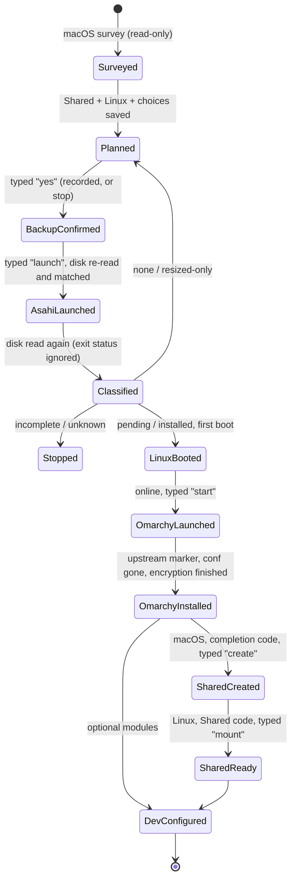
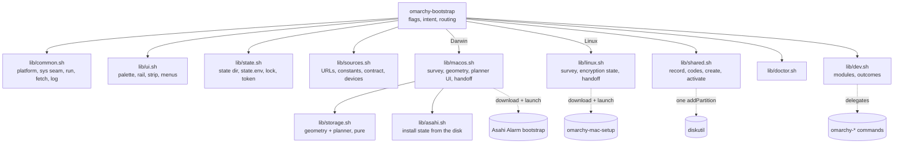

# Omarchy Mac Bootstrap — Specification

## Goal

One entrypoint, `./omarchy-bootstrap`, that carries a supported Apple Silicon Mac
from stock macOS to a dual-boot macOS + Omarchy 4 machine, with an optional
Shared exFAT partition both systems read and write:

```text
macOS → storage plan (Shared, Linux) → Asahi Alarm installer → reboot → Arch (Asahi Alarm)
      → Omarchy Mac (quattro) → Omarchy 4 → [reboot → macOS: create Shared → reboot → Linux: mount Shared]
      → optional developer environment
```

The tool is a **planner and orchestrator**. It detects, calculates, explains,
downloads with provenance, launches the authoritative upstream installers in the
foreground, reads the machine again afterwards, and records non-secret progress
so it can resume after reboots and interruptions.

**The product it becomes** (designed for M14–M16, not implemented): a
**Mac → Omarchy migration and bootstrap assistant** for a Mac that stays
dual-boot. The Mac's own macOS — restored from the everyday Mac's Time
Machine backup — is scanned before Linux exists; the person chooses what
comes to Linux; a deterministic resolver decides how each thing exists on
Omarchy, aarch64; after the install, the choices are restored on Omarchy,
verified, and the two systems check Shared together. The interface is a
required, compiled Ratatui frontend; the Bash core in this document stays
the authority for the machine and every change to it. The target shell
stays Bash.

```text
macOS: survey → profile → resolve → plan → Asahi → Linux: rescue (optional) → Omarchy
     → macOS: Shared, export → Linux: Shared, restore → verify on both → done
```

**How to read this document.** Sections without a milestone describe the
accepted installer and storage baseline (MILESTONES.md → *Accepted
baseline*), implemented and reviewed. Sections and rows marked **(M14)**,
**(M15)** or **(M16)** are designed and not implemented; their detail is in
the documents they name, and docs/DECISIONS.md records why.

**Disk authority.** Asahi exclusively owns APFS resizing and creation of the
Linux/boot layout. Omarchy Mac exclusively owns its boot migration and
encryption. This bootstrap has only one additional disk-mutation authority:
after positive topology validation and explicit user confirmation, it may
create the one planned Shared cross-OS partition inside the previously reserved
free region. It never deletes, resizes, reformats, or generically edits
arbitrary partitions.

## Non-goals

- Resizing, erasing or deleting partitions, and creating any partition other
  than the one planned Shared partition.
- Reimplementing any step Omarchy Mac already performs (user creation, sudo,
  hostname, keymap, boot-layout move, encryption, snapshots, Omarchy install,
  resume across reboots).
- Feeding answers to an upstream installer through its terminal (no `expect`,
  no screen scraping). Answers are passed only through documented flags.
- Writable APFS access from Linux; experimental cross-platform filesystem drivers.
- Repairing filesystems or partition tables.
- Intel Macs, virtual machines, Windows, uninstall automation, GUIs, accounts,
  telemetry, cloud services.
- (M14–M16) Changing the target shell from Bash to Zsh, or reproducing the
  macOS Zsh setup; migrating secrets (sign-ins are redone; the one
  exception is a passphrase-encrypted SSH key); agent sessions,
  transcripts, prompt and shell histories (not in v1); migrating
  application data from `~/Library`; cloning the home folder or promising a
  faithful filesystem copy; Linuxbrew as a package manager; the AUR
  automatically; compiling software as a fallback, or without being asked;
  any language model deciding an installation; an auto-updater for the
  frontend; a Rust reimplementation of the core; a sandbox for rescue
  agents; network or cloud transfer between the two systems; Linux reading
  APFS.

## Runtime constraints

- Starts on stock macOS (`/bin/bash` 3.2, BSD userland) and on the Asahi Alarm
  Minimal image (bash 5, no git; Phase 2 runs as root, so it needs no
  `sudo`) with no extra dependencies.
- Bash 3.2 compatible everywhere: no associative arrays, `mapfile`, `${x,,}`,
  `declare -n`, or `printf '%(…)T'`.
- Bash, not POSIX sh. The launcher is `./omarchy-bootstrap` (`#!/usr/bin/env
  bash`) or `bash ./omarchy-bootstrap`. Its first lines are plain sh: without
  `BASH_VERSION`, or with `posix` in `SHELLOPTS` (macOS's `sh` is bash in
  POSIX mode; also `POSIXLY_CORRECT`), it runs `exec bash` on itself before
  any library is read, and stops rather than loop if the restarted shell is
  still in POSIX mode. A library that does not load stops the run before any
  command answers, `--version` and `--help` included.
- Structured output is parsed where a structured mode exists: `plutil -extract`
  over `system_profiler -xml` and `diskutil … -plist`; `lsblk -P` on Linux.
- Colour and Unicode are progressive: 256-colour → 16-colour → none; Unicode →
  ASCII (the Linux VT console, `TERM=linux`, always gets ASCII).
- (M14) **The frontend.** Interactive commands on a terminal run in
  `omb-tui`, a Rust/Ratatui binary for `aarch64-apple-darwin` and
  `aarch64-unknown-linux-gnu`. It is not needed to start: the launcher stays
  stock Bash 3.2, acquires the binary pinned by `release/frontend.lock`
  (version, size, SHA-256) with provenance in act sessions only, checks its
  digest on every launch, and falls back to the text interface when it
  cannot verify or start it. No Rust toolchain is ever needed on the Mac.
  The frontend spawns only the core, one short-lived `omarchy-bootstrap
  core <op>` per request, speaking the record-format protocol, whose bytes
  are admitted before anything parses them (docs/FRONTEND.md,
  docs/PROTOCOL.md).
- (M14) New Bash modules stay Bash 3.2-compatible, Linux-only ones
  included, and load only for the commands that need them; the installer's
  act paths load none of the migration modules (docs/ARCHITECTURE.md).

## Commands

Intent is decided from the command before anything reads the machine:
read-only commands and plan never reach an action, whatever state the install
is in.

| Command | Intent | macOS | Linux (Asahi) |
| --- | --- | --- | --- |
| *(none)* | act | Route to the next step: survey → plan → backup gate → Asahi handoff; after an install, the state found and Shared's next step | Route: network → Omarchy Mac handoff; upstream status if in progress; once installed, Shared's next step and the developer menu |
| `plan` | plan | Survey + Shared + Linux + choices; saves them and the Shared plan record; runs nothing | Survey + Omarchy choices; saves them; runs nothing. Once setup has started or finished, says so and changes nothing |
| `install` | act | Full Phase 1 | Full Phase 2 |
| `resume [TOKEN]` | act | The state found, the boot guide, the resume token, Shared's state | Continue Phase 2, seeded by a Phase 1 token (whose Shared fields are saved) |
| `status` | read | Rail, the Asahi and Shared state found, recorded history, next action | Same, plus upstream `--status` when root |
| `doctor` | read | Health checks | Health checks |
| `shared [status]` | read | Shared's state and next step | Same |
| `shared create [CODE]` | act | The guarded creation | — |
| `shared activate [CODE]` | act | — | The persistent mount |
| `shared test` | act | Write, read back and remove one file on Shared | Same |
| `dev` | act | Explains it runs on Linux | Optional developer modules |
| `sources [--check]` | read | Targeted upstream URLs/branches/versions; `--check` compares with upstream | Same |
| `logs` | read | Log location and recent entries | Same |
| `scan` (M14) | read | The environment inventory (docs/MIGRATION.md); runs no tool, writes nothing | — |
| `profile` (M14) | act, scoped | Scan, select, resolve, seal the Migration Profile; only the profile and resolve actions are reachable, and only the availability check downloads | — |
| `profile show`, `profile show --select`, `profile show --unresolved` (M14) | read | The profile's review view; its choices as a record file; the unresolved items | The imported profile's |
| `export [DIR]` (M14) | act | The bundle, to verified Shared or `DIR`, then its approval code | — |
| `export status` (M14) | read | The last exports and their approval codes, from the export records | — |
| `restore [DIR]` (M15) | act | — | As the everyday user: admit, typed approval code, check, review, typed `restore`, apply, verify (docs/RESTORE.md) |
| `restore status`, `restore why NAME`, `restore --plan-out` (M15) | read | — | Per-item state from the machine; an item's provenance; the review's conflicts as a record file |
| `restore verify`, `restore undo`, `restore accept NAME` (M15) | act | — | Live checks with consent; typed `undo`; yes/no |
| `rescue`, `rescue remove` (M15) | act | — | As root: rescue agents, closing or hardening SSH, remote rescue; removal (docs/RESCUE.md) |
| `debug`, `debug context` (M15) | read | The field-allowlisted report; the agent brief | Same |
| `debug raw` (M15) | read | Raw diagnostics, headed potentially sensitive | Same |
| `debug save [--raw]` (M15) | act | The safe report and the brief into the state directory; with `--raw`, the raw diagnostics too, after a yes/no | Same |
| `qualify`, `qualify clean` (M16) | act | The step due on this system; typed `test`, `clean` | Same (docs/QUALIFICATION.md) |
| `qualify status`, `report` (M16) | read | The check's state; the hardware report | Same |
| `core OP` (M14) | per operation | The frontend's protocol entry (docs/PROTOCOL.md); not for people | Same |

Global flags: `--dry-run`, `--no-color`, `--ascii`, `-h/--help`, `--version`;
(M14) `--no-tui`: the text interface for any command, for scripts, CI,
screen readers and recovery; it skips no gate. Without the frontend,
`profile --select FILE` and `restore --plan FILE` take the person's choices
as record files, validated like the frontend's requests.

(M14) The launcher runs interactive commands (none, `plan`, `install`,
`resume`, `profile`, `export`, `restore`, `rescue`, `qualify`, `shared create`,
`shared activate`) in the frontend when it can — each from the milestone
that exposes every action its flow needs (docs/FRONTEND.md → *When the
frontend runs*) — and every one-shot command as text on stdout. A frontend
session carries the command's intent as its ceiling and the command's
scopes (docs/PROTOCOL.md → *Scopes*): the default run, `install` and
`resume`, every scope; `plan`, `journey`, `disk`, `plan`; `profile`,
`journey`, `profile`, `resolve`; `export`, `journey`, `export`; `restore`,
`journey`, `restore`; `rescue`, `journey`, `rescue`, `debug`, `network`;
`qualify`, `journey`, `qualify`; `shared create` and `shared activate`,
`journey`, `shared`. Both are set by the launcher, and the core refuses any
action above the ceiling or outside the scopes, and any request when either
is missing.

- **read** commands create no state directory, write no state or log, and keep
  no download.
- **plan** writes only the choices, the survey stamp, the Shared plan record
  and its log.
- **`--dry-run`** walks any command's flow, prints each command as `would run`,
  and keeps nothing: no state, no log, no download (a download is fingerprinted
  in a per-run scratch directory removed on exit).
- **`--help` / `--version`** touch nothing.

## User journey

1. **Survey (read-only).** Machine, SoC, memory, the internal disk's exact
   partition layout and free regions, macOS container, free space, macOS
   version, FileVault, boot disk, admin rights, Asahi support tier, internet,
   and where any earlier install stands.
2. **Plan.** Shared storage first (none, 50, 100, 150, 250 GB or custom), then
   the Linux size (presets computed from this disk beside that Shared size,
   custom GB/TB/% of the disk, or max), then Linux choices (encryption,
   username, hostname, keymap, timezone, locale, SSH, GitHub key user,
   developer setup). The review shows macOS, Linux, Shared, system and
   unallocated space exactly, and the installer answers with their bytes.
3. **Backup gate.** Typed confirmation (`yes`) that a recent macOS backup
   exists. Time Machine information is shown, never used as proof.
4. **Asahi handoff.** Download the Asahi Alarm bootstrap to a file; show URL,
   timestamp, size, SHA-256; check the storage contract; optional inspection;
   the answer card (exact MiB values) and the boot guide; copy the first answer
   to the clipboard; require typing `launch`; read the disk again and hold the
   answers to it; record the layout before; run the installer in the foreground.
5. **After the installer.** Read the disk again, classify what it did (the exit
   status is ignored), and show the next step: the boot guide, the recovery
   path, or a stop.
6. **Reboot guide.** The installer's own post-install boot procedure, first
   login, networking, how to fetch this repository, and a resume token.
7. **Linux survey.** aarch64, Apple device tree, distro, root filesystem,
   `/boot`, encryption state, network, user, Omarchy state.
8. **Network.** Launch `nmtui` in the foreground if no default route.
9. **Omarchy Mac handoff.** Verify the target branch carries Omarchy 4 and that
   the setup script still declares the flags used; download; provenance;
   optional inspection; typed `start`; run `bash omarchy-mac-setup
   --encrypt|--no-encrypt --user U --hostname H --keymap K`. Upstream reboots
   and resumes itself on tty1.
10. **Shared (when planned).** Once Omarchy Mac has completely finished, Linux
    shows a completion code; on macOS the code is typed in and Shared is
    created (§ Shared storage); back on Linux, the Shared code is typed in and
    Shared is mounted at `/mnt/shared` on every boot.
11. **Developer environment (optional, rerunnable).** Core tools, languages via
    `omarchy-install-dev-env`, containers, editor, git identity, GitHub auth,
    SSH access, AI coding CLIs, timezone/locale reconciliation. Each module
    reports its outcome from the machine afterwards.

## macOS phase

### Detection sources

| Fact | Source |
| --- | --- |
| Model identifier | `sysctl -n hw.model` |
| Machine name, chip, memory | `system_profiler -xml SPHardwareDataType` → `plutil` |
| Architecture | `uname -m`, `sysctl -n hw.optional.arm64` |
| macOS version | `sw_vers -productVersion` |
| Boot volume → container → physical store → whole disk | `diskutil info -plist /`, `diskutil info -plist <store>` |
| Container size / free | `APFSContainerSize`, `APFSContainerFree` |
| Disk size, logical block size | `diskutil info -plist <disk>` (`Size`, `DeviceBlockSize`) |
| Partitions in disk order | `diskutil list -plist <disk>` (`Content`, `DeviceIdentifier`, `DiskUUID`, `Size`) |
| Each partition's offset and GPT GUID | `diskutil info -plist <partition>` (`PartitionMapPartitionOffset`, `DiskUUID`), cross-checked with the list |
| Stub container volumes | `diskutil apfs list -plist` |
| Installer's resize floor | `diskutil apfs resizeContainer <container> limits -plist` (read-only) |
| Power | `pmset -g batt` (Shared creation only) |
| FileVault | `fdesetup isactive` |
| Admin | `id -Gn` contains `admin` |
| Timezone / locale / keyboard | `/etc/localtime` link, `AppleLocale`, HIToolbox input source |
| Backup information (display only) | `tmutil destinationinfo`, `tmutil latestbackup` |
| Internet / installer reachability | HTTPS HEAD to the Asahi Alarm host |

The internal disk is derived by following `/` to its physical store, never
assumed to be `disk0`, and must report `Internal = true`. A missing offset or
GUID, a disagreement between the list and info views, a misaligned or
overlapping partition, bytes that do not add up to the disk, a second APFS
container, or a multi-store container blocks planning.

### Support tiers

From the Asahi device list and the installer's device table (`lib/sources.sh`):

- **supported** — M1 and M2 families. Omarchy Mac documents M1/M2.
- **experimental** — M3 family: the installer accepts them, Asahi lists
  display/USB as work in progress, Omarchy Mac does not document them. The tool
  proceeds only after a typed acknowledgement.
- **unsupported** — M4, M3 Ultra, anything not in the table, Intel. The tool
  stops before planning.

macOS must be ≥ 13.5 (Asahi Alarm requirement).

### Where an install stands

Read from the disk on every run, using the installer's order of work (stub
created and filled first, then EFI, then the Linux root, then `boot.bin`) and
its repair check (`step2.sh`, `boot.bin`, the install-media marker and
`SystemVersion` on the stub's system volume, read only when macOS has it
mounted):

| State | Evidence | Route |
| --- | --- | --- |
| `none` | no Asahi partitions | plan |
| `resized-only` | macOS smaller than recorded before a launch, the freed space free after it, no stub | plan into the freed space (`f`), no second resize |
| `early-partial` | a stub, nothing after it | stop: repair refuses; manual removal (docs/RECOVERY.md) |
| `partitioned-incomplete` | stub and EFI, no Linux root | stop: as above |
| `first-stage-incomplete` | all three; stub unprepared or missing first-stage files | stop: as above |
| `pending-first-boot` | first stage complete, step 2 not run | boot guide |
| `installed` | step 2 has run | Phase 1 complete; Shared's next step |
| `installed-unverified` | all three in order; stub not readable | boot guide, and what `p` requires |
| `unknown` | anything else | stop and explain |

## Storage planning

All sizes are bytes; display uses SI GB (10⁹).

### Geometry

The disk is a list of partitions (offset, size, GPT GUID, content, role) in
disk order and the gaps between them, walked over the GPT's usable range
(first usable byte `2·block + 16 KiB`, last `size − block − 16 KiB`, for 512-
and 4096-byte blocks). Every byte is accounted for: partitions + gaps + GPT
structures = disk size. Gaps of 16 MiB or less are not free regions (the
installer's `FREE_THRESHOLD`).

### Installer behaviour modelled (asahi-installer v0.9.2)

`MIN_FREE_OS` 38 GB, `STUB_SIZE` 2 499 805 184 B (2.5 GB aligned down), EFI
524 288 000 B, `MIN_INSTALL_FREE` 10 GB, `PART_ALIGN` 1 MiB. The resize answer
is aligned **up** to 1 MiB; the New OS size is aligned **down**; stub, EFI and
root are created in that order, each right after the partition before it. A
bare number is bytes; `MiB` is exact. The tool types every size as a whole
number of MiB, which neither alignment changes.

### Derived values

```text
U         = container size − container free
M_inst    = max(align_up(U + 38 GB, 1 MiB), MinimumSizePreferred)
floor     = align_up(M_inst + 5 GB, 1 MiB)               drift margin
overhead  = M_inst − align_up(U + 38 GB, 1 MiB)           warn above 16 GB
Linux_min = ceil_GB(50 GB root + stub + EFI) = 54 GB      the root itself keeps Omarchy's 50 GB
```

No resize is planned when `MinimumSizePreferred` is unknown.

### One region per allocation

For a Linux request `L` and a Shared request `S`:

1. **An existing gap** that holds `L` (and `S` with 16 MiB spare) — no
   resize. The gap right after the macOS container is preferred, then the
   largest.
2. Otherwise **the region a resize frees**: from the container's new end to
   the partition after it (which may include a gap already there). The new
   macOS size is the largest whole-MiB value that leaves `L`, then `S` plus
   spare, assuming each new partition may start on the next MiB boundary.

Separate gaps are never added together. `Linux_max` is the largest `L` any
single option allows, in whole GB.

Answers: resize → `<V>MiB` then New OS size `max` when `S = 0`, `<L>MiB`
otherwise; free space → `<L>MiB`. With Shared on, Linux is never given `max`.

### Invariants

Every accepted plan is checked on the resulting layout:

1. partitions + gaps + GPT structures = disk size;
2. no overlap;
3. retained macOS ≥ floor (resize) or macOS untouched (free space);
4. Linux allocation ≥ `L`;
5. Linux root ≥ 50 GB after stub and EFI;
6. the Shared interval ≥ `S`;
7. Shared on → no `max`;
8. one region: Linux and Shared lie in one free interval.

A layout that cannot be read exactly is never planned on.

### Presets and input

Presets (Minimal 100 GB or the minimum; Balanced 25 % and Linux-heavy 50 % of
the disk, rounded; Maximum safe) are kept only between `Linux_min` and 90 % of
`Linux_max`. Custom input takes `N`, `N GB`, `N.NNN GB`, `N TB`, `N %` of the
disk, or `max`: bounded digits and decimals, no leading zeros, signs,
exponents or extra dots, and nothing not smaller than the disk. Fractional GB
is rounded down to whole GB, visibly.

### Storage contract

Checked at the handoff (`storage_contract_ok`); any difference refuses the
launch and fails `sources --check`:

- the installer version is the one whose sizing code was read (the stub's
  size, the alignment and the resize rules are in its source, not in the
  manifest);
- `installer_data.json`, read as JSON by Apple's `plutil`, names the chosen
  template exactly once, and that template holds exactly two partitions:
  first EFI (type `EFI`, exactly 524 288 000 B, no `expand` key), then the
  Linux root (type `Linux`, `expand` true, a size in bytes whose installer
  minimum — the stub plus twice the template — fits `Linux_min`). The
  installer gives every partition marked `expand` the whole remainder, and
  every fixed one comes out of it, so any other shape changes what the
  answers produce.

A manifest that cannot be read or parsed refuses the launch. Where `plutil`
is absent (Linux), `sources --check` reports the template as not checked,
never as passed. Right before the launch the disk is read again; a changed
layout, or answers that no longer hold, stop it.

## Shared storage

Detailed in `docs/SHARED.md`. Summary:

- **Planned first**, in the same planner, so Linux's maximum already leaves it
  room. Its interval lies in the install region after the Linux root.
- **Plan record** `shared-intent.env`: schema, storage contract, the disk's
  size and block size, every partition's GUID/offset/size, the answers, the
  region; sealed by a digest whose first 8 hex digits name the plan in the
  resume token.
- **Codes** `ombdone-<plan>-<root>-<check>` (Linux → macOS, shown only once
  Omarchy Mac has finished: marker, no conf or unit, nothing running, no
  migration staged, encryption positively finished — § Linux phase) and `ombshare-<plan>-<shared>-<check>`
  (macOS → Linux). A GUID prefix, the plan, check digits. Input, never
  permission.
- **Creation (macOS)** from `awaiting-macos-creation` only: the plan's disk,
  positively this Mac's internal disk (the whole disk and macOS's physical
  store both report `Internal`, one physical store, macOS running from the
  planned container, the disk's own name as recorded — an external copy with
  the same GUIDs and extents is refused, on every read including the one
  after the typed gates), Apple's and every earlier partition unchanged, the container at the planned
  size, Asahi's three partitions in order, one free region after the root at
  least the planned size, nothing else new, Linux's code accepted, power (AC,
  or a battery at 50 % or more; an empty `pmset` report is shown as
  unverified, never as a checked power state).
  Typed `yes` and `create`; `sudo -v` (sudo authenticates before the last
  read, so no password prompt separates that read from the change; a
  failure stops); the disk read again and matched; the creation
  record `shared-create.env` written (or nothing runs): the disk, every
  partition on it byte for byte, the free region the creation may use, the
  Linux root before it, the partition after it, the interval and the minimum
  size, sealed by a digest; `sudo -n diskutil addPartition <Linux root> ExFAT
  Shared <bytes>`, the planned size in whole MiB at the region's start (the
  rest stays free), non-interactive so nothing waits for input after the
  last read: if sudo's authorization has lapsed, sudo refuses without
  running diskutil, nothing is created, and a retry starts over from the
  gates; then, judged by that record, every earlier partition
  byte-identical and exactly one new exFAT Basic Data partition inside the
  region, or a recorded stop. Every later run is held to the same record
  until its result is recorded — the disk is never read afresh around it: a
  stop clears only when the record's own check passes, or when the record is
  removed by hand after checking the disk. Without a record, an existing
  partition is taken for Shared only after the root Linux's code names.
  Reruns reconcile, never recreate. The run lock is not a disk lock: another
  program could still change the partition table between the last read and
  `addPartition`; the window is kept short and the creation record judges
  the result.
- **Activation (Linux)** as the everyday user: found by the code's GUID (or the
  managed fstab entry), on root's disk right after root, exFAT, Basic Data, at
  least the planned size; conflicts refused; typed `mount`; one managed
  `/etc/fstab` entry `PARTUUID=<guid> /mnt/shared exfat
  rw,nofail,x-systemd.automount,x-systemd.device-timeout=10s,uid,gid,fmask=0177,dmask=0077,nodev,nosuid,noexec`
  written by rename, the old file kept; `/mnt/shared` root-owned 0755.
- **Checks** `doctor` and `shared test` identify what is mounted at
  `/mnt/shared` by the kernel's device number for it (major:minor in
  `/proc/self/mountinfo`), traced through `lsblk` to exactly one partition,
  which must be the chosen Shared partition (its name, PARTUUID and device
  number) on root's disk, formatted exFAT, before vouching for it or writing
  to it. The mount's source text is never identity. A device that cannot be
  traced to exactly one partition is unresolved and blocks writing; an
  armed automount is reported as armed, not mounted. The write test writes
  only to that verified filesystem, and succeeds only when its file is also
  removed.
- **States** `off`, `reserved`, `awaiting-linux-completion`,
  `awaiting-macos-creation`, `created`, `awaiting-linux-activation`, `ready`,
  `blocked`, derived from the machine on every run.

## Linux phase

Detection (all read-only): `uname -m`, `/proc/device-tree/compatible` and
`model`, `/etc/os-release`, `findmnt` for `/` and `/boot`, `lsblk` for a
`crypt` root and its backing partition, `lsblk -P` for root's disk, `ip route`,
HTTPS reachability of GitHub, `EUID`, and Omarchy Mac's own signals:

| Signal | Meaning |
| --- | --- |
| `/var/lib/omarchy-mac-setup/installed` | install finished (written after encryption finished) |
| `/usr/share/omarchy/version` + `display-manager.service` as a symlink | installed (pre-marker installs) |
| `/etc/omarchy-mac-setup.conf` | guided setup in progress; with the marker: finishing |
| `omarchy-mac-setup.service` `activating` | running on tty1 now |
| `/etc/omarchy-btrfs-migrate.conf` | encryption staged |
| `/var/lib/omarchy/btrfs-migrate-done` | encryption finished |
| `cryptsetup luksDump` of root's one partition (root only) | a LUKS2 header without `online-reencrypt`: finished; with it: pending |

Encryption state: `none`, `migrating`, `complete`, `unverified` (a LUKS root
read as a user, without the finish marker), `probe-failed` (read as root,
the header could not be read as a LUKS2 header: no single partition under
root, `cryptsetup` missing or failing, no output, or output that is not the
header). `complete` needs positive evidence: as root, the header read and
without the requirement; as a user, who cannot read it, the finish marker.
A read that failed never counts as finished, and as root the marker does not
stand in for the header. Routing: not aarch64/Apple → stop. `plan` → choices only.
Installed → Shared's next step, developer menu. In progress → upstream status
(as root); `--resume` offered only when the unit is not active. Otherwise →
Phase 2.

Phase 2 runs as root on the minimal image (upstream requires root). Answers
come from the resume token, then saved state, then questions. Keymap defaults
to the current console keymap because it is the layout the disk passphrase is
typed with.

## Product expansion (M14–M16)

Designed, not implemented. Each summary below is detailed in the document
it names; the decisions are in docs/DECISIONS.md, the threat model in
docs/SECURITY.md, the tests in docs/TESTING.md.

### The frontend and the protocol (M14)

A Ratatui frontend presents the journey and collects choices; the Bash core
reads the machine, lists the actions that are legal now, admits every
request's bytes before parsing them, validates it (session ceiling and
scopes, availability, the canonical basis of what the person reviewed,
rebuilt from a fresh read, parameters, the typed word) and runs the
baseline's own flows with all their checks. Programs that need the terminal
— the installers, `nmtui`, `sudo`, sign-ins, rescue agents — get it through
a handoff: the frontend restores the terminal and stops reading it while
still following the request's event spool, the core runs the program in the
foreground, and the frontend returns to a fresh read. No protocol
descriptor reaches a child; a mutating child's output goes nowhere that can
fill or block, and a read child's is kept within fixed bounds; a core that
ends without its result leaves the outcome unknown until the machine is
read again; a mutation whose supervising core is gone stays a barrier for
its scope until a new boot. Typed-word gates stay typed words.
docs/FRONTEND.md, docs/PROTOCOL.md, docs/UX.md.

### Migration (M14, M15)

- **Scan** (macOS, read-only): package managers' own records read through
  versioned adapters (never run), applications, the Zsh setup (two literal
  forms imported, everything else reviewed), terminals, editors, the AI
  tools, Git, SSH, and dotfolders the person picks; every item carries its
  evidence. docs/MIGRATION.md.
- **Migration Profile**: a sealed record of what was found, chosen and
  resolved, and how sensitive it is; bound to this Mac; never file contents;
  its id rides in the resume token for journey matching only.
- **Sensitivity**: supported adapters carry allowlisted fields and drop
  credential fields; a credential-shape scan only rejects; custom paths no
  adapter understands are opaque, carried only with typed `opaque`, outside
  the secret guarantee; no sessions or histories in v1.
- **Resolution**: deterministic, from a versioned registry, the person's
  local registry and decisions; planned on macOS (with an advisory aarch64
  availability check), checked again on the target; ordered by a bounded
  DAG of needs, capabilities and versioned instances; paths rewritten only
  inside fields an adapter parses. docs/RESOLVER.md.
- **Bundle and transport**: a content-addressed folder of plain objects on
  Shared, or on removable media, placed only through a validated
  destination graph; macOS shows an approval code after export, which Linux
  requires before restoring anything; before Shared, nothing but the token,
  the repository and the frontend needs to cross to Linux.
- **Restore** (Linux, the everyday user): through the owners' interfaces
  where they exist, file placement otherwise; conflicts default to Keep;
  journaled, resumable and conditionally reversible, not a transaction;
  nothing is "migrated" until verified. docs/RESTORE.md, docs/AI-TOOLS.md.

### Rescue and debugging (M15)

Optional agents as root on the fresh system (Claude Code preferred; Codex;
OpenCode when a verified release is pinned), each signed in separately,
starting in a workspace with the agent brief and guidance rules (not a
sandbox); remote rescue runs its own key-only `sshd`, whose whole
configuration is checked before it listens, never beside an exposed system
server, and opens after a real key login; cleanup stops it and ends in a
verified safe state; nothing crosses from root to the everyday user;
`rescue remove` removes exactly what rescue owns and names what it released. `debug` prints a field-allowlisted
report; `debug context` a vendor-neutral brief; `debug raw` the raw
diagnostics, marked potentially sensitive. docs/RESCUE.md.

### Journey and qualification (M16)

Ten stages (`survey`, `profile`, `resolve`, `plan`, `asahi`, `omarchy`,
`shared`, `restore`, `verify`, `done`) derived from the machine on each
system, the other system's progress shown as recorded; nothing starts by
itself after a reboot. Once Shared exists, a deterministic AES-256-CTR
stream of 4 296 015 889 bytes and a set of test names travel macOS → Linux
→ macOS through Shared, each side checking Shared's identity, the plan and
its own active round before reading anything; stage records carry the
executed source's digest and feed the hardware report of M17, and evidence
is invalidated by behaviour. docs/QUALIFICATION.md.

### Trust boundaries

1. The home folder is read as text, never run.
2. Profiles and bundles are data: integrity by seals and digests, approval
   by the code the person carries across, meaning by the registry and
   adapters, and the target is checked.
3. The frontend is input to the core, however it was built.
4. Only the core changes the machine, through `run` and the gates.
5. Everything from the network is checked against a pinned digest (the
   frontend, pinned rescue releases), or fingerprinted and shown before use
   (upstream scripts, SSH public keys, plugin marketplaces), or used only as
   advice (the aarch64 package databases).
6. Nothing crosses from root's home to the everyday user's.

### States

| Subsystem | States |
| --- | --- |
| profile | `not-scanned`, `scanned`, `selected`, `sealed`, `stale`, `invalid` |
| resolution (per item) | `unresolved`, `needs-decision`, `resolved`, `unsupported`, then on Linux `ready` or `unavailable` |
| restore | `not-started`, `partial`, `blocked`, `complete`; per item `planned`, `ready`, `applied`, `verified`, `kept`, `skipped`, `unsupported`, `failed`, `blocked`, `degraded`, `needs-sign-in`, `needs-secret`, `accepted` |
| AI tool (observed) | `wrapper_present`, `artifact_installed`, `selected_version`, `tool_runnable`, `configured`, `authenticated`, each on its own |
| rescue (per option) | `unavailable`, `available`, `installed`, `signed-in`, `open` (remote rescue), `failed`, `skipped`; the system's SSH `stopped`, `key-only`, `exposed`, `unproven` |
| operation (per scope) | none; running (its supervising core alive); `unsupervised` (a barrier until a new boot and reconciliation) |
| qualification round (macOS, local) | `created`, `finished`, `cleaned`, each one immutable file |
| qualification | `not-started`, `waiting-for-linux`, `waiting-for-macos`, `in-progress`, `passed`, `failed`, `blocked` |
| journey (per stage) | `done`, `current`, `todo`, `skipped`, `blocked`; each `machine` or `recorded` |
| frontend (launcher) | `verified`, `missing`, `mismatch`, `unrunnable`, `fallback` |

All are re-derived from the machine where the machine can show them;
records are input.

## Source-of-truth boundaries

| Concern | Owner |
| --- | --- |
| APFS resize, stub/EFI/root partitions, boot policy (step 2 in recoveryOS) | Asahi installer (via Asahi Alarm bootstrap) |
| OS image contents, first login (`root`/`root`) | Asahi Alarm |
| User, sudo, hostname, keymap, `/boot` move, LUKS, snapper, Omarchy, resume on boot | Omarchy Mac `omarchy-mac-setup` |
| Languages, editor, SSH, sudoless Docker helpers | Omarchy's `omarchy-*` commands |
| The one Shared partition, its mount entry | this repository (§ Shared storage) |
| Plan, provenance, progress record, routing, health checks | this repository |
| (M14) Presentation, layout, input | the frontend, under the core's authority |
| (M14) What software becomes on Omarchy aarch64 | this repository's registry, checked on the target |
| (M15) Packages, runtimes, Omarchy's configuration, its agent wrappers and default agent | Omarchy (`omarchy-pkg-add`, its helpers, mise, the wrappers; the default agent is the person's choice through Omarchy's picker) |
| (M15) The AI tools' configuration formats, sign-ins and MCP management | each tool (its own commands and files) |

All upstream URLs, branches, verified versions, constants, the storage
contract and the device table live in `lib/sources.sh` and nowhere else.

## State machine



Every state is **re-derived from the machine**; recorded state is history and
context, never the authority for whether a step is done.

## Persistent state

Location: `$XDG_STATE_HOME/omarchy-mac-bootstrap` (default
`~/.local/state/omarchy-mac-bootstrap`); root on Linux uses
`/var/lib/omarchy-mac-bootstrap` so the later user run can read it. Override:
`OMB_STATE_DIR` (absolute, no `.`/`..`).

- The directory is made on the first write (0700; the root record 0755), and
  used only when it is a real directory owned by this user and writable by no
  one else. Files in it are read only when plain, owned by this user or root,
  and not writable by others.
- `state.env` — `key=value`, parsed (never sourced), written by one checked
  writer (a unique temporary file renamed into place; a failure leaves the old
  file). Keys matching `pass|secret|token|credential|recovery|key_material`
  are refused.
- `shared-intent.env` — the Shared plan record.
- `shared-create.env` — the Shared creation record, from just before the
  one `addPartition` until its result is recorded.
- `lock/` — one recording run at a time; a lock whose owner is gone is cleared.
- `logs/omarchy-bootstrap-YYYYMMDD.log` — timestamp, phase, environment,
  commands, exit codes, upstream URLs/checksums/versions, non-secret choices.
  Upstream installers' output is never captured.
- `downloads/` — fetched upstream scripts, kept for provenance.
- (M14) `ops/<scope>.omb` — an act action's operation record, with the
  boot session, written before its effect and removed by its supervising
  core after its result is recorded; one whose core is gone is
  unsupervised, a barrier for that scope until a new boot and
  reconciliation (docs/PROTOCOL.md → *Operations and exclusion*).
- (M14) `profile-draft.omb` and `profile.omb` — the Migration Profile being
  made, and finished (macOS); `availability/` — the advisory aarch64
  check's downloads and their provenance; `exports/<name>.omb` — each
  export's folder, manifest digest and approval code (macOS).
- (M15) `rescue.omb` in root's state directory — what rescue installed and
  changed, readable by the everyday user.
- (M15) `restore/runs/<run>/` (`run.omb` and one sealed record per step and
  phase) and `restore/backups/<run>/` — the restore's journal and the files
  it replaced (Linux, the everyday user); `debug/` — saved debug reports.
- (M16) `qualify/active.omb`, `qualify/rounds/<round>/{created,finished,cleaned}.omb`
  (macOS, one immutable file per state), `qualify/stages/<stage>.omb` — the
  active round, the rounds this Mac created, and the stage records for the
  hardware report.
- (M14) The per-session scratch folder `omb-session.*` in `$TMPDIR` — the
  session's owners, the request spools and bounded diagnostics; temporary,
  removed only when quiescent, never read by a later session except to
  decide that.
- (M14) The frontend cache is outside the state directory:
  `$XDG_CACHE_HOME/omarchy-mac-bootstrap/frontend/<sha256>/`, root's under
  `/var/cache/omarchy-mac-bootstrap/`, checked like the state directory. The
  person's own registry is `~/.config/omarchy-mac-bootstrap/registry.local.omb`.
- (M15) Written only in the everyday user's home, by `restore`:
  `~/.config/omarchy-mac-bootstrap/shell.bash` and one marked line in
  `~/.bashrc`.

### Resume token

Non-secret Phase 1 choices, readable and hand-typeable because no clipboard
crosses the reboot:

```text
omb2:enc=1,user=alex,host=m1pro,kmap=us,tz=America/New_York,loc=en_US.UTF-8,ssh=0,gh=octocat,linux=250,shared=150,dev=1,plan=1a2b3c4d
```

Fields are whitelisted and validated on decode (`omb1:` tokens are still read);
unknown fields are ignored with a warning; decoded values are shown before use.
(M14) A new field, `prof=<8 hex>`, names the finished Migration Profile, so
Linux recognises this journey's bundle (journey matching, never approval);
the prefix stays `omb2:` because an older reader ignores the field with a
warning, and a token without it simply has no profile.

## Failure and recovery paths

| Failure | Behaviour |
| --- | --- |
| Unsupported model / Intel / macOS < 13.5 / external or multi-store boot volume | Stop before planning; explain |
| Layout not readable exactly, second APFS container | Stop before planning; explain |
| Not enough space in one region | Planner blocked; show how much to free |
| Download fails / non-script response / storage contract drift | Stop; nothing launched |
| Disk changed between plan and launch | Stop; nothing launched |
| Asahi installer returns (any status) | Read the disk, classify (§ Where an install stands), route |
| Upstream drift (Omarchy 3, missing flags) | Refuse the Omarchy handoff |
| Linux entry missing after a macOS 27 upgrade | Doctor points to installer option **7** |
| No network on Linux | Launch `nmtui`; recheck |
| Omarchy Mac interrupted | Upstream resumes on boot; `status` shows it; `resume` runs `--resume` when idle |
| Shared: anything unexpected | `blocked` with the reason; nothing repaired, formatted or deleted |
| A developer module fails | Reported per module; not timestamped; exit non-zero — also when the rest of the module was then stopped with `q`: a failure is never turned into a cancellation |
| A record cannot be written before an irreversible step | That step does not run |
| Ctrl-C at a prompt | Exit; nothing destructive ran |
| Ctrl-C while a launched command runs | Report that it may have made changes; `status` re-derives where the machine is |
| (M14) Frontend missing, unverifiable, unrunnable, or a version mismatch | Never run unverified; explain; continue in the text interface |
| (M14) Frontend crash | Its hook and the launcher restore the terminal; report, with the log and `debug` |
| (M14) The machine changed between review and action | The core refuses the stale basis; the frontend shows the fresh state |
| (M14) The core ends without its result (crash, kill) | Outcome unknown, never "failed"; the machine is read again; the scope's operation record is reconciled before any new act in it, and refused as busy while its processes live |
| (M14) Records from another Mac (a Time Machine restore) | Shown as history; a new scan and plan are made here |
| (M15) A bundle that fails admission, its seal, digests, destination graph or approval code | Not used; a foreign bundle also needs typed `import` |
| (M15) A restore interrupted | The next run judges every begun step from its records and the filesystem, then continues |
| (M15) Undo after the person changed a restored file | Refused for that item, with what is there now |
| (M15) Remote rescue fails a check, or cleanup cannot verify its final state | Rescue's changes undone and not open; cleanup reports "not clean", never success |
| (M15) A package the helper skipped or a tool that will not start | That item `failed` with the reason; what needs it `blocked`; the rest goes on |
| (M15) A rescue agent will not install or start | That option `failed`; the next is offered; the install is never blocked by rescue |
| (M16) Qualification on the wrong or a tampered partition | Nothing read or written; `blocked` with the reason |

## Security boundaries

- Never: `diskutil erase*`, `diskutil partition*`, `diskutil apfs
  resizeContainer` with a size, `diskutil apfs deleteContainer`, raw `dd`,
  `gpt`, `fdisk`, `parted`, `mkfs`, `wipefs`, `bless`, `nvram`, `shutdown`,
  `reboot`, `csrutil`, writable APFS mounts. The only `resizeContainer` use is
  the literal `limits -plist` query; the only `addPartition` is the Shared
  creation, with ExFAT and the name Shared as constants and the device a
  fresh read's Linux root, run as `sudo -n` after `sudo -v` and never
  through an interactive `sudo`.
- Privileged changes on Linux are exactly the Shared mount point, the managed
  fstab entry (by rename, with a backup), `daemon-reload` and starting its
  automount, plus packages, timezone and locale in the developer modules.
- Nothing that changes a disk runs unless the user typed its word (`launch`,
  `start`, `resume`, `create`, `mount`) after seeing what it does; Enter alone
  never proceeds.
- No secret is read by this tool. Passwords, passphrases and tokens are typed
  into upstream programs directly on the terminal. (M14–M16) The migration
  reads configuration files, some of which may hold credentials. Supported
  adapters carry only allowlisted fields and never their credential fields;
  every carried object passes a credential-shape scan, which rejects and
  never approves; opaque custom paths travel only with typed `opaque` and
  are outside that guarantee; no value found by a scan is stored, logged or
  shown (docs/SECURITY.md).
- Upstream scripts are downloaded to a private (0700) directory, fingerprinted,
  optionally inspected (control characters shown, not interpreted), re-hashed
  immediately before execution, then executed; never piped into a shell.
- Unknown flags and malformed `OMB_DRY_RUN` values stop the run. Test seams
  (`OMB_FIXTURE`, `OMB_TEST_RECORD`, `OMB_TEST_AFTER`, `OMB_TEST_RC`) are
  refused as root, and fixture mode never executes. (M14–M16) So are the
  new seams `OMB_TEST_QUAL_BYTES`, `OMB_TEST_HANDOFF_CHILD`,
  `OMB_TEST_STOP_AT`, `OMB_TEST_FAIL_AT`, `OMB_TEST_PAUSE_AT` and
  `OMB_FRONTEND_DEV`, which also work only in fixture mode.
- (M14–M16) **The product expansion adds no disk authority.** Nothing new
  partitions, formats, mounts APFS or touches the boot chain. The new
  privileged changes are exactly: in `restore`, packages and system setup
  through Omarchy's own commands (`omarchy-pkg-add`, `omarchy-install-terminal`,
  `omarchy-install-dev-env` — the developer modules' existing category),
  each as a handoff; and, for rescue only, as root: the rescue tools in
  `/root`; a rescue-owned `sshd` with its own configuration, host key and
  authorized keys under `/root/omarchy-rescue/ssh`, run as a transient
  systemd unit (never enabled); stopping the system's `sshd` for this boot
  (never disabling it); and, on the person's typed `harden`, one key-only
  drop-in in `/etc/ssh/sshd_config.d`, checked before the service reads it
  and released to the person. Each is recorded in rescue's record;
  `rescue remove` stops and removes what rescue owns and verifies the safe
  final state. `restore` never runs as root, and its own writes
  are only in the everyday user's home. Managed actions use only `sudo -n`.
  The baseline's Shared sequence is unchanged: the typed gates, `sudo -v`,
  the final topology read, the creation record, `sudo -n diskutil
  addPartition`, the postcondition, with nothing added between the final
  read and `addPartition`. The frontend holds no authority: it runs nothing
  but the core, and the core admits and checks every request as input.
  Every new probe, command and `sudo` joins the allowlists in
  `tests/test-safety.sh` with its reason (docs/SECURITY.md).

## Upstream dependency strategy

- Follow upstream's documented entrypoints and flags only.
- Pin *expectations*, not code: verified versions, constants and the storage
  contract are recorded in `lib/sources.sh` and checked by `sources --check`.
- Never switch branches or repositories silently; drift is reported for a human
  decision, and a storage-contract drift blocks the handoff.

## Architecture



`lib/common.sh` provides the only seam to the system: `sys_cmd NAME CMD…` and
`sys_path PATH`. With `OMB_FIXTURE` set they read `fixtures/<name>/cmd/NAME` and
`fixtures/<name>/root/PATH`, which is how every detector is tested on any host.
`run` is the only path to mutating commands; with `OMB_TEST_RECORD` set they
record argv and execute nothing.

(M14–M16) The frontend, the protocol entry and the new modules, with their
prefixes and loading rule, are in docs/ARCHITECTURE.md → *The product
expansion*.

## Acceptance criteria

1. `./omarchy-bootstrap --help` works on stock macOS bash 3.2 and on bash 5, and
   touches nothing; started with `sh` it restarts under bash in bash's own
   mode, and prints nothing on stderr.
2. On an unsupported Mac, or a disk whose layout cannot be read exactly, the
   tool stops before planning with a clear reason.
3. Every accepted plan satisfies the eight invariants on the resulting layout,
   replayed through an independent model of the installer.
4. Custom input accepts GB, decimals, TB, %, `max`; rejects leading zeros,
   overflow, and anything not smaller than the disk, with the reason.
5. The handoff shows URL, timestamp, size, SHA-256, offers inspection, refuses
   on storage-contract drift, and runs only after typed `launch`; dry-run
   never runs it.
6. After the installer, the state is read from the disk; incomplete and
   unknown states stop; `p` is mentioned only where the installer offers it.
7. Phase 1 ends with the installer's boot procedure and a valid resume token.
8. On Linux, `resume TOKEN` decodes, validates, and pre-fills Phase 2.
9. The Omarchy handoff refuses a branch whose `version` is 3.x or whose setup
   script lacks the flags used.
10. Installed / in-progress / finishing / encrypting states are detected; no
    reinstall is offered; `plan` never resumes, launches or configures.
11. `doctor` produces PASS/WARN/FAIL/INFO lines on both OSes and exits non-zero
    only on FAIL.
12. Shared is created at most once, only inside the verified reserved region,
    only after both typed gates and a matching re-read; reruns reconcile; no
    existing partition is ever formatted or deleted.
13. Shared is mounted by PARTUUID for the everyday user's ids; conflicting
    fstab entries and files under the mount point are refused.
14. Developer modules report their real outcome; failures exit non-zero.
15. Read-only commands and `--dry-run` leave the filesystem unchanged.
16. No test invokes a forbidden command; no secret appears in state or logs.
17. Output degrades to no-colour and ASCII cleanly.

Designed, for the milestones named (MILESTONES.md holds each gate's full
acceptance; the test ids are in docs/TESTING.md):

18. (M14) The launcher starts only a frontend whose digest matches the
    reviewed lock; the lock is not a build input; read, plan, dry-run and
    `--no-tui` sessions change no persistent frontend state; the text
    interface takes over for every failure in docs/FRONTEND.md; the
    terminal is restored after exit, error, panic, SIGTERM and every
    handoff.
19. (M14) Every protocol document is admitted byte by byte before it is
    parsed, identically in Bash and Rust, and matches the golden examples;
    no protocol descriptor reaches a child; a mutating child has no pipe;
    read children's diagnostics stay within their bounds; a missing result
    is an unknown outcome; an operation whose supervisor is gone stays a
    barrier until a new boot, whatever its process group shows; a session's
    scratch is removed only when quiescent; nothing is added inside Shared's
    critical interval.
20. (M14) The core refuses every request the execute rules refuse, including
    a stale basis; for every baseline action the protocol exposes, the
    recorded commands and records equal the accepted baseline's (`2edb76a`).
21. (M14) Every screen renders at 80×24 and 60 columns, in 16 colours, no
    colour and ASCII, with a truthful too-small state below 60×20; the O1
    benchmark meets its budgets or its finding is recorded.
22. (M14) The scanner runs no inventoried tool and executes no
    configuration; each versioned adapter's output over its fixtures,
    adversarial ones included, is exact, with its uncertainty kept; only
    the two literal Zsh forms are imported.
23. (M14) A profile is finished only with every included item resolved or
    unsupported, is stale on another Mac, and resolution and the graph's
    order are byte-identical under Bash 3.2 and 5 and in any locale.
24. (M14, M15) Secrets, by kind of content:
    - **parsed configuration** of a supported adapter: only allowlisted
      fields leave macOS, known credential fields never do, and the
      credential-shape scan rejects on top; no planted credential in such a
      field reaches a profile, bundle, debug report, log or state;
    - **files a supported adapter carries whole**: the hard refusals and the
      whole-length scan apply, planted credentials of known shapes are
      caught, and the file is marked "carried whole"; the tool does not
      certify it secret-free;
    - **opaque custom paths**: excluded by default, carried only after typed
      `opaque` with the warning that Shared is not encrypted, known
      credential files still refused, and outside the secret guarantee;
    - an encrypted SSH key travels only as docs/MIGRATION.md → *The one
      secret exception: an encrypted SSH key* says, after typed `carry`;
      no session or history travels.
25. (M15) Import refuses a bundle whose admission, seals, digests,
    destination graph or approval code fail; a bundle recomputed after
    export is refused for its approval code; no manifest entry can place a
    file outside its item's root.
26. (M15) Restore never runs as root, defaults every conflict to Keep,
    re-checks each item just before placing it, recovers from a stop at
    every journal boundary, changes nothing on rerun, and undoes only what
    is still exactly as it wrote it.
27. (M15) Nothing is reported migrated until verified on the machine; no
    static check runs an agent, its wrapper, a mise shim or mise; live
    checks run only with consent.
28. (M15) Rescue never blocks the install, never copies anything from root
    to the everyday user; remote rescue runs only its own `sshd`, whose
    configuration has no `Include` and no `Match` and is checked offline
    before it listens, never while an exposed or unproven system server
    listens, and opens only after a real key login; `rescue remove` removes
    everything rescue owns — what it released to the person (a harden
    drop-in) stays and is named — and ends in the verified safe state of
    docs/RESCUE.md → *Ending remote rescue*; `debug` and `debug context`
    hold only allowlisted fields.
29. (M16) Every stage is derived from the machine on each system; nothing
    runs after a reboot until its word is typed.
30. (M16) Qualification reads and writes only on the partition the baseline
    identifies as Shared, bound to the plan, the Shared GUID and the active
    round; only macOS's own active round can pass, and a round Linux
    accepted without that is provisional; its stream matches the reference
    vectors on both systems; it
    removes its data automatically only after a pass, and otherwise only
    after typed `clean`, and only what its records own.
31. (M16) The journey simulation passes on both CI systems.
