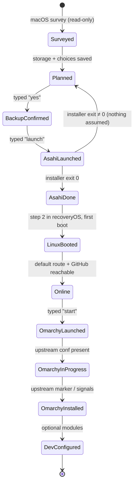
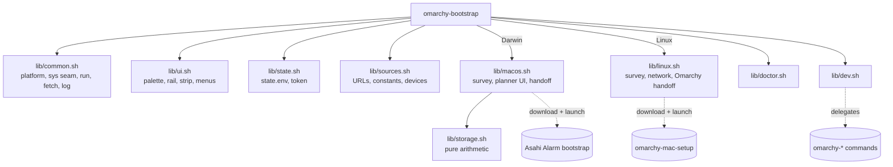

# Omarchy Mac Bootstrap — Specification

## Goal

One entrypoint, `./omarchy-bootstrap`, that carries a supported Apple Silicon Mac
from stock macOS to a dual-boot macOS + Omarchy 4 machine:

```text
macOS → storage plan → Asahi Alarm installer → reboot → Arch (Asahi Alarm)
      → Omarchy Mac (quattro) → Omarchy 4 → optional developer environment
```

The tool is a **planner and orchestrator**. It detects, calculates, explains,
downloads with provenance, launches the authoritative upstream installers in the
foreground, and records non-secret progress so it can resume after reboots and
interruptions. It never performs a partition operation itself.

## Non-goals

- Resizing, erasing, creating, or deleting partitions. The Asahi installer owns
  the APFS resize and every partition it creates.
- Reimplementing any step Omarchy Mac already performs (user creation, sudo,
  hostname, keymap, boot-layout move, encryption, snapshots, Omarchy install,
  resume across reboots).
- Feeding answers to an upstream installer through its terminal (no `expect`,
  no screen scraping). Answers are passed only through documented flags.
- Writable APFS access from Linux.
- Intel Macs, virtual machines, Windows, uninstall automation, GUIs, accounts,
  telemetry, cloud services.

## Runtime constraints

- Starts on stock macOS (`/bin/bash` 3.2, BSD userland) and on the Asahi Alarm
  Minimal image (bash 5, no git, no sudo) with no extra dependencies.
- Bash 3.2 compatible everywhere: no associative arrays, `mapfile`, `${x,,}`,
  `declare -n`, or `printf '%(…)T'`.
- Structured output is parsed where a structured mode exists: `plutil -extract`
  over `system_profiler -xml` and `diskutil … -plist`.
- Colour and Unicode are progressive: 256-colour → 16-colour → none; Unicode →
  ASCII (the Linux VT console, `TERM=linux`, always gets ASCII).

## Commands

| Command | macOS | Linux (Asahi) |
| --- | --- | --- |
| *(none)* | Route to the next phase: survey → plan → backup gate → Asahi handoff, or the reboot guide if Phase 1 is done | Route: network → Omarchy Mac handoff, upstream status if in progress, developer menu if installed |
| `plan` | Survey + storage planner + choices; saves the plan, launches nothing | Survey + Omarchy choices; launches nothing |
| `install` | Full Phase 1 | Full Phase 2 |
| `resume [TOKEN]` | Reprint the reboot guide and resume token | Continue Phase 2, optionally seeded by a Phase 1 token |
| `status` | Journey rail, recorded state, next action | Same, plus `omarchy-mac-setup --status` when present |
| `doctor` | Read-only health checks | Read-only health checks |
| `dev` | Explains it runs on Linux | Optional developer modules |
| `sources [--check]` | Targeted upstream URLs/branches/versions; `--check` queries upstream for drift | Same |
| `logs` | Log location and recent entries | Same |

Global flags: `--dry-run`, `--no-color`, `--ascii`, `-h/--help`, `--version`.

## User journey

1. **Survey (read-only).** Machine, SoC, memory, disk, macOS allocation, free
   space, macOS version, FileVault, boot disk, admin rights, Asahi support tier,
   internet, backup confirmation.
2. **Plan.** Storage presets computed from this machine; custom sizes in GB or
   % of the internal disk; optional shared-data plan (default off); Linux
   choices (encryption, username, hostname, keymap, timezone, locale, SSH,
   GitHub key user).
3. **Backup gate.** Typed confirmation (`yes`) that a recent macOS backup
   exists. Time Machine information is shown, never used as proof.
4. **Asahi handoff.** Download the Asahi Alarm bootstrap to a file; show URL,
   timestamp, size, SHA-256; optional inspection; explain the exact answers
   to give; copy the first answer to the clipboard; require typing `launch`;
   run it in the foreground.
5. **Reboot guide.** The installer's own post-install boot procedure, first
   login, networking, how to fetch this repository, and a resume token.
6. **Linux survey.** aarch64, Apple device tree, distro, root filesystem,
   `/boot`, encryption, network, user, Omarchy state, upstream setup state.
7. **Network.** Launch `nmtui` in the foreground if no default route.
8. **Omarchy Mac handoff.** Verify the target branch carries Omarchy 4
   (`version` file starts with `4`) and that the setup script still declares
   the flags used; download; provenance; optional inspection; typed `start`;
   run `bash omarchy-mac-setup --encrypt|--no-encrypt --user U --hostname H
   --keymap K`. Upstream then reboots and resumes itself on tty1.
9. **Developer environment (optional, rerunnable).** Core tools, languages via
   Omarchy's `omarchy-install-dev-env`, containers (Docker already present /
   Podman), editor, git identity, GitHub auth, SSH, AI coding CLIs,
   timezone/locale reconciliation.

## macOS phase

### Detection sources

| Fact | Source |
| --- | --- |
| Model identifier | `sysctl -n hw.model` |
| Machine name, chip, memory | `system_profiler -xml SPHardwareDataType` → `plutil` |
| Architecture | `uname -m`, `sysctl -n hw.optional.arm64` |
| macOS version | `sw_vers -productVersion` |
| Boot volume → container → physical store → whole disk | `diskutil info -plist /`, `diskutil info -plist <store>` |
| Container size / free | `APFSContainerSize`, `APFSContainerFree` from `diskutil info -plist /` |
| Internal disk size and partitions | `diskutil list -plist <disk>` |
| Installer's resize floor | `diskutil apfs resizeContainer <container> limits -plist` (read-only: "limits" takes no action) |
| FileVault | `fdesetup isactive` |
| Admin | `id -Gn` contains `admin` |
| Timezone / locale / keyboard | `/etc/localtime` link, `AppleLocale`, HIToolbox input source |
| Backup information (display only) | `tmutil destinationinfo`, `tmutil latestbackup` |
| Internet / installer reachability | HTTPS HEAD to the Asahi Alarm host |

The internal disk is derived by following `/` to its physical store, never
assumed to be `disk0`, and must report `Internal = true`.

### Support tiers

From the Asahi device list and the installer's device table
(`lib/sources.sh`):

- **supported** — M1 and M2 families. Omarchy Mac documents M1/M2.
- **experimental** — M3 family: the installer accepts them, Asahi lists
  display/USB as work in progress, Omarchy Mac does not document them. The tool
  proceeds only after a typed acknowledgement.
- **unsupported** — M4, M3 Ultra, anything not in the table, Intel. The tool
  stops before planning.

macOS must be ≥ 13.5 (Asahi Alarm bootstrap requirement).

### Existing installs

If the internal disk carries partitions beyond the stock three
(`Apple_APFS_ISC`, the macOS container, `Apple_APFS_Recovery`) — an EFI
partition, a Linux partition, or a small extra APFS container (the 2.5 GB Asahi
stub) — the tool reports an existing install, does not offer another, and
routes to the reboot guide and the upstream installer's own repair options.

## Storage-planning algorithm

All sizes are bytes; display uses SI GB (10⁹), matching the installer's
`psize`/`ssize`.

Inputs:

| Symbol | Meaning |
| --- | --- |
| `D` | internal disk size |
| `C` | macOS APFS container size (`APFSContainerSize`) |
| `F` | container free (`APFSContainerFree`) |
| `U = C − F` | macOS used, including snapshots |
| `P` | `MinimumSizePreferred` from the limits query (absent → `0`) |
| `E` | pre-existing unpartitioned space: `D − Σ partitions`, counted only above 1 GB |
| `S` | optional shared-data reservation (default `0`) |

Upstream constants (asahi-installer v0.9.2, `src/main.py`):
`MIN_FREE_OS = 38 GB`, `STUB_SIZE = 2.5 GB`, EFI `524288000 B`,
`MIN_INSTALL_FREE = 10 GB`, `PART_ALIGN = 1 MiB`, overhead warning `> 16 GB`.
Omarchy Mac: Linux ≥ 50 GB, 100 GB recommended.

Derived:

```text
M_raw   = align_up(U + 38 GB, 1 MiB)          # installer's own floor
M_inst  = max(M_raw, P)                        # installer's minimum new macOS size
O       = M_inst − M_raw                       # snapshot / pending-update overhead
M_floor = M_inst + 5 GB                        # drift margin between planning and running
Linux_max = floor_GB(C − M_floor + E − S)
```

- `Linux_max < 50 GB` → blocked; report how much must be freed in macOS.
- `O > 16 GB` → warn (Time Machine local snapshots or a pending macOS update),
  linking the installer's own cleanup guidance.

Presets, computed per machine, each kept only if `50 GB ≤ value ≤ Linux_max`
and below 90 % of `Linux_max`:

| Preset | Value |
| --- | --- |
| Minimal | 100 GB (50 GB when 100 does not fit) |
| Balanced *(recommended)* | 25 % of `D`, rounded to 25 GB |
| Linux-heavy | 50 % of `D`, rounded to 25 GB |
| Maximum safe | `Linux_max` (always offered) |
| Custom | `N`, `N GB`, `N.N GB`, `N TB`, `N %` of `D`, or `max` |

Validation: below 50 GB → rejected (Omarchy Mac minimum); above `Linux_max` →
rejected with the arithmetic shown (used + 38 GB update room + overhead + 5 GB
margin); below 100 GB → accepted with a warning.

Handoff values for a Linux allocation `A` (the installer's "New OS size", which
includes the 2.5 GB stub and 0.5 GB EFI):

- `E ≥ A + S` → no resize. Choose **f** and enter `A` at *New OS size*.
- otherwise → choose **r**, enter `macOS_new = ceil_GB(C − (A + S − E))` at
  *New size*; then **f** and `max` (or `A` when `S > 0`, leaving `S` free).

Displayed layout separates three things: the **request** (`A`), the
**estimate** (macOS ≈ `macOS_new`, Btrfs root ≈ `A − 3 GB`, stub 2.5 GB,
EFI 0.5 GB, Apple system partitions as measured), and the **exact values the
installer will create**, which it computes and aligns itself — the tool only
names the values to type.

### Optional shared storage

Default off. Asahi documents no installer workflow for a shared partition, so
the tool never creates one. When enabled, the planner reserves `S` GB as free
space (installer "New OS size" = `A`, not `max`) and writes a post-install plan
to the state directory: exFAT trade-offs, how to identify the free region, and
the GPT-ordering warning from the Asahi partitioning cheatsheet.

## Linux phase

Detection (all read-only): `uname -m`, `/proc/device-tree/compatible` and
`model`, `/etc/os-release`, `findmnt` for `/` and `/boot`, `lsblk` for a
`crypt` root, `ip route` for a default route, HTTPS reachability of GitHub,
`EUID`, and Omarchy Mac's own signals:

| Signal | Meaning |
| --- | --- |
| `/var/lib/omarchy-mac-setup/installed` | upstream marker: install finished |
| `/usr/share/omarchy/version` + enabled display manager | Omarchy installed (pre-marker installs) |
| `/etc/omarchy-mac-setup.conf` | guided setup in progress |
| `omarchy-mac-setup.service` active | upstream is running on tty1 now |

Routing: not aarch64/Apple → stop. Installed → developer menu. In progress →
show `omarchy-mac-setup --status`; offer `--resume` only when the unit is not
active. Otherwise → Phase 2.

Phase 2 runs as root on the minimal image (upstream requires root). Answers
come from the resume token, then saved state, then questions. Keymap defaults
to the current console keymap because it is the layout the disk passphrase is
typed with.

## Source-of-truth boundaries

| Concern | Owner |
| --- | --- |
| APFS resize, stub/EFI/root partitions, boot policy (step 2 in recoveryOS) | Asahi installer (via Asahi Alarm bootstrap) |
| OS image contents, first login (`root`/`root`) | Asahi Alarm |
| User, sudo, hostname, keymap, `/boot` move, LUKS, snapper, Omarchy, resume on boot | Omarchy Mac `omarchy-mac-setup` |
| Languages, editor, SSH, sudoless Docker helpers | Omarchy's `omarchy-*` commands |
| Plan, provenance, progress record, routing, health checks | this repository |

All upstream URLs, branches, verified versions, constants, and the device table
live in `lib/sources.sh` and nowhere else.

## State machine



Linux-side states are always **re-derived from the machine**; recorded state is
history and context, never the authority for whether a step is done.

## Persistent state

Location: `$XDG_STATE_HOME/omarchy-mac-bootstrap` (default
`~/.local/state/omarchy-mac-bootstrap`); root on Linux uses
`/var/lib/omarchy-mac-bootstrap` so the later non-root run can read it.
Override: `OMB_STATE_DIR`.

- `state.env` — `key=value`, parsed (never sourced), written atomically.
  Keys matching `pass|secret|token|credential|recovery|passphrase` are refused
  by the writer.
- `logs/omarchy-bootstrap-YYYYMMDD.log` — timestamp, phase, environment,
  commands, exit codes, upstream URLs/checksums/versions, non-secret choices.
  Upstream installers' output is never captured.
- `downloads/` — fetched upstream scripts, kept for provenance.
- `shared-storage-plan.txt` — only when the shared plan is enabled.

### Resume token

Non-secret Phase 1 choices, readable and hand-typeable because no clipboard
crosses the reboot:

```text
omb1:enc=1,user=alex,host=m1pro,kmap=us,tz=America/New_York,loc=en_US.UTF-8,ssh=0,gh=octocat,linux=250
```

Fields are whitelisted and validated on decode; unknown fields are ignored with
a warning; the decoded values are shown for confirmation before use.

## Failure and recovery paths

| Failure | Behaviour |
| --- | --- |
| Unsupported model / Intel / macOS < 13.5 | Stop before planning; explain |
| Not enough space | Planner blocked; show how much to free and the snapshot overhead |
| Download fails / non-script response | Stop; nothing launched |
| Upstream drift (installer version, OS name, branch, flags, Omarchy 3) | Warn in `sources --check`; refuse the handoff for Omarchy 3 or missing flags |
| Asahi installer exits non-zero | Record the exit code; stay at "planned"; rerunning is safe (installer offers **p** to repair) |
| Linux entry missing after a macOS 27 upgrade | Doctor points to installer option **7** |
| No network on Linux | Launch `nmtui`; recheck |
| Omarchy Mac interrupted | Upstream resumes on boot; `status` shows upstream status; `resume` runs `--resume` when the unit is idle |
| Ctrl-C at a prompt | Exit; nothing destructive ran |
| Ctrl-C while a launched command runs | Report that it was interrupted and may have made changes; `status` re-derives where the machine is |

## Security boundaries

- Never: `diskutil erase*`, `diskutil partition*`, `diskutil apfs resizeContainer`
  with a size, `diskutil apfs deleteContainer`, raw `dd`, `gpt`, `fdisk`,
  `parted`, `bless`, `nvram`, `shutdown`, `reboot`, `csrutil`, writable APFS
  mounts. The only `resizeContainer` invocation is the literal
  `limits -plist` query.
- No partition-changing program runs unless the user typed `launch` (macOS) or
  `start` (Linux) after seeing provenance; Enter alone never proceeds.
- `--dry-run` executes no mutating command; each is printed as `would run`.
- No secret is read by this tool. Passwords, passphrases and tokens are typed
  into upstream programs (`sudo`, the Asahi installer, `omarchy-mac-setup`,
  `gh`, `ssh-keygen`) directly on the terminal.
- Upstream scripts are downloaded to a file, fingerprinted, optionally
  inspected, then executed; never piped into a shell.

## Upstream dependency strategy

- Follow upstream's documented entrypoints and flags only.
- Pin *expectations*, not code: verified versions and constants are recorded in
  `lib/sources.sh` and checked by `sources --check`.
- Never switch branches or repositories silently; drift is reported for a human
  decision.

## Architecture



`lib/common.sh` provides the only seam to the system: `sys_cmd NAME CMD…` and
`sys_path PATH`. With `OMB_FIXTURE` set they read `fixtures/<name>/cmd/NAME` and
`fixtures/<name>/root/PATH`, which is how every detector is tested on any host.
`run`/`run_interactive` are the only paths to mutating commands; with
`OMB_TEST_RECORD` set they record argv and execute nothing.

## Acceptance criteria

1. `./omarchy-bootstrap --help` works on stock macOS bash 3.2 and on bash 5.
2. On an unsupported Mac the tool stops before planning with a clear reason.
3. Planner presets and limits match the algorithm above for every fixture.
4. Custom input accepts GB, decimals, TB, %, `max`; rejects unsafe values with
   the reason.
5. The handoff shows URL, timestamp, size, SHA-256, offers inspection, and runs
   only after typed `launch`; dry-run never runs it.
6. An existing Asahi install is detected and not offered a second install.
7. Phase 1 ends with the installer's boot procedure and a valid resume token.
8. On Linux, `resume TOKEN` decodes, validates, and pre-fills Phase 2.
9. The Omarchy handoff refuses a branch whose `version` is 3.x or whose setup
   script lacks the flags used.
10. Installed / in-progress Omarchy is detected; no reinstall is offered.
11. `doctor` produces PASS/WARN/FAIL/INFO lines on both OSes and exits non-zero
    only on FAIL.
12. No test invokes a forbidden command; no secret appears in state or logs.
13. Output degrades to no-colour and ASCII cleanly.
