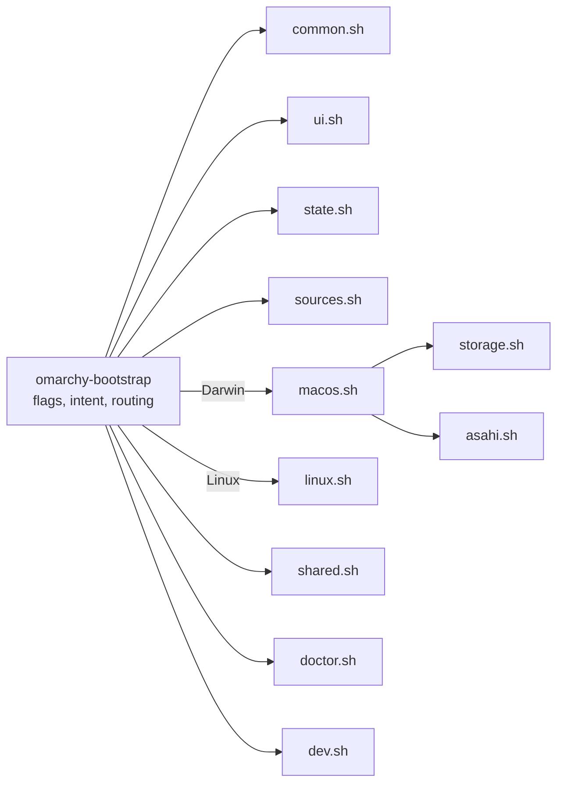

# Architecture

Bash only, bash 3.2 compatible, no dependencies beyond what stock macOS and the
minimal Asahi Alarm image ship. One entrypoint sources eleven small modules.

| Module | Holds |
| --- | --- |
| `common.sh` | the system seam, `run`, logging, downloads, the per-run scratch directory, version compare |
| `ui.sh` | palette, glyph sets, header, journey rail, disk strip, answer card, menus, typed gates |
| `state.sh` | the state directory's checks, `state.env` (one checked writer), whole-file records, the run lock, choices (`CFG_*`), validators, the resume token |
| `sources.sh` | upstream URLs, branches, verified versions, installer constants, the storage contract, device table, `sources` |
| `storage.sh` | pure geometry (extents, gaps, the byte-for-byte walk) and the planner (regions, answers, invariants), checked size input |
| `macos.sh` | Phase 1: detection, geometry from diskutil, survey, planner UI, choices, backup gate, handoff, re-read after the installer |
| `asahi.sh` | where an Asahi install stands, from the disk; recovery guidance |
| `linux.sh` | Phase 2: detection, encryption state, network, choices, Omarchy Mac handoff, routing |
| `shared.sh` | Shared storage: the plan record, the codes, state from the machine, creation (macOS), activation (Linux), the write test, status and doctor |
| `doctor.sh` | `doctor` and `status` for both systems |
| `dev.sh` | developer modules and their outcomes |

## Intent before state

The entrypoint decides what a run may do from the command alone, before any
module reads the machine:

- `OMB_INTENT` — `act`, `plan` or `read`. `run` and downloads refuse unless it
  is `act`, so a read-only or planning command routed by mistake fails closed
  instead of acting.
- `OMB_PERSIST` — 0 for read-only commands and `--dry-run`: the state
  directory is never created, and state writes, logs and kept downloads are
  skipped. A dry run's downloads go to a scratch directory removed on exit.

Recording runs take the lock in the state directory for their whole life.

## The two seams

Everything that touches the machine goes through one of two functions, which
is what makes the tool testable on any host and safe to dry-run.

**Reading** — `sys_cmd NAME CMD…`, `sys_path PATH`, `sys_has CMD`,
`sys_net KEY URL`, `sys_reachable KEY URL`. With `OMB_FIXTURE` set they read
`fixture/cmd/NAME` (exit code in `NAME.rc`), `fixture/root/PATH`,
`fixture/commands`, and `fixture/net/KEY`. Every probe is read-only; the test
suite holds each one to an allowlist.

**Changing** — `run CMD…`. In `--dry-run` it prints `would run` and returns;
with `OMB_TEST_RECORD` set it appends the argv to that file and returns (with
`OMB_TEST_AFTER`, the machine then reads as that fixture; with `OMB_TEST_RC`,
the command "exits" with that status; `sudo -v`, which changes nothing, is
recorded and succeeds, leaving both to the command after it); otherwise it runs the command in the
foreground on your terminal and logs the command and its exit code, never
its output. `state_set` follows the same rules for state.

## Flow control

Each phase is a small step machine (`mac_main`, `lx_main`). Menus return
`0` chosen, `2` back, `3` quit; the step machine turns those into moving
between screens. Typed gates guard every irreversible moment: `yes` for the
backup, `launch` / `start` / `resume` for the installers, `create` for the
Shared partition, `mount` for its fstab entry, `test` for the write test.

Where the machine is — the Asahi install, Omarchy Mac's setup and
encryption, Shared storage — is re-derived from the machine on every run;
recorded state is history, context, and input to those checks, never the
authority.

## Presentation

A surveyor's plate: one mark (◒, a rising sun), a six-stage journey rail that
spans both systems (`survey · plan · asahi · reboot · omarchy · dev`), section
bars, and the disk strip as the planning centrepiece. Colour carries meaning —
steel for macOS, coral for Linux, violet for boot/system, green for Shared,
mint/amber/rose for pass/warn/fail — and degrades 256 → 16 → none, Unicode →
ASCII. The Linux VT console always gets ASCII: glyphs come from the ASCII
glyph set, and all user-visible text is printed with `_p`, which maps message
punctuation (dashes, arrows, ≥, ≈, …) to ASCII there. Menus take arrows,
digits, `b`, `q` on a terminal and fall back to line input when piped.

## Bash 3.2 conventions

- No associative arrays, `mapfile`, `${x,,}`, namerefs; `${arr[@]+"${arr[@]}"}`
  for possibly-empty arrays under `set -u`.
- No `pipefail`: probes are `producer | grep -q`, and an early match can SIGPIPE
  the producer.
- Functions that assign a caller's variable via `eval` use `__`-prefixed locals
  so bash's dynamic scoping cannot shadow the caller's name.
- Every number from outside passes `_uint` (digits, no leading zero, bounded)
  before `$(( ))`, where a leading zero means octal and text is evaluated.
- `shellcheck -x omarchy-bootstrap` sees the whole program for cross-file
  variables but reports only the entrypoint's own findings; lint each file too
  (`tests/run.sh` does both).

## Tests

`tests/run.sh` runs syntax checks, ShellCheck, and every test file:

| File | Covers |
| --- | --- |
| `test-storage.sh` | geometry walk, planner, every plan replayed through an independent installer model, size input |
| `test-detection.sh` | detectors over fixtures, including every unreadable-layout refusal |
| `test-lifecycle.sh` | Asahi interruption states, the re-read after the installer, Omarchy setup and encryption states |
| `test-shared.sh` | the codes, the token, the plan record, every creation gate and failure, activation |
| `test-dev.sh` | developer outcomes under forced failures |
| `test-routing.sh` | read-only commands, previews and plan over every lifecycle fixture, with filesystem snapshots |
| `test-state.sh` | state directory checks, checked writes, the lock, the token, log hygiene |
| `test-safety.sh` | static scans of every probe, `run` and `sudo` line, the single `addPartition`, sealed dry runs, recorded argv, typed gates |
| `test-cli.sh` | the command surface, output degradation, whole flows |

`tests/fixtures/generate.sh` regenerates every fixture with synthetic values
shaped on a real 1 TB M1 Pro disk. CI (`.github/workflows/ci.yml`) runs the
suite on Linux (bash 5, ShellCheck required) and macOS (`/bin/bash` 3.2), and
fails on any skip it does not expect.
