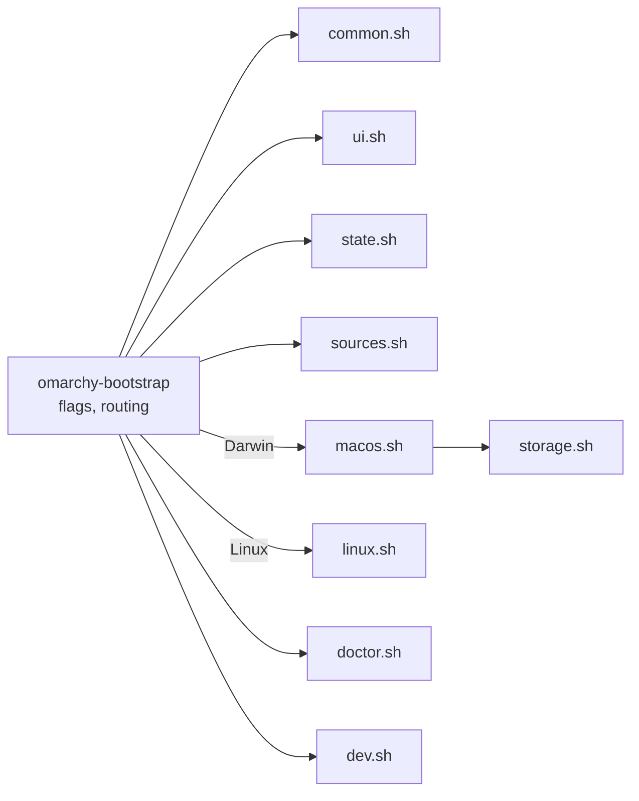

# Architecture

Bash only, bash 3.2 compatible, no dependencies beyond what stock macOS and the
minimal Asahi Alarm image ship. One entrypoint sources nine small modules.

| Module | Holds |
| --- | --- |
| `common.sh` | the system seam, `run`, logging, `fetch_upstream`, version compare |
| `ui.sh` | palette, glyph sets, header, journey rail, disk strip, answer card, menus, gates |
| `state.sh` | `state.env`, choices (`CFG_*`), validators, resume token |
| `sources.sh` | upstream URLs, branches, verified versions, installer constants, device table, `sources` |
| `storage.sh` | pure planner arithmetic |
| `macos.sh` | Phase 1: detection, survey, planner UI, choices, backup gate, handoff, reboot guide |
| `linux.sh` | Phase 2: detection, network, choices, Omarchy Mac handoff, in-progress/installed routing |
| `doctor.sh` | `doctor` and `status` for both systems |
| `dev.sh` | developer modules |

## The two seams

Everything that touches the machine goes through one of two functions, which
is what makes the tool testable on any host and safe to dry-run.

**Reading** — `sys_cmd NAME CMD…`, `sys_path PATH`, `sys_has CMD`,
`sys_net KEY URL`, `sys_reachable KEY URL`. With `OMB_FIXTURE` set they read
`fixture/cmd/NAME` (exit code in `NAME.rc`), `fixture/root/PATH`,
`fixture/commands`, and `fixture/net/KEY`. Every probe is read-only; the test
suite holds each one to an allowlist.

**Changing** — `run CMD…`. In `--dry-run` it prints `would run` and returns; with
`OMB_TEST_RECORD` set it appends the argv to that file and returns; otherwise it
runs the command in the foreground on your terminal and logs the command and
its exit code, never its output. `state_set` follows the same rule for state.

## Flow control

Each phase is a small step machine (`mac_main`, `lx_main`). Menus return
`0` chosen, `2` back, `3` quit; the step machine turns those into moving
between screens. Two typed gates guard the only irreversible moments:
`yes` for the backup and `launch` / `start` for the installers.

Linux progress is always re-derived from the machine using Omarchy Mac's own
signals; recorded state is history for `status`, never the authority.

## Presentation

A surveyor's plate: one mark (◒, a rising sun), a six-stage journey rail that
spans both systems (`survey · plan · asahi · reboot · omarchy · dev`), section
bars, and the disk strip as the planning centrepiece. Colour carries meaning —
steel for macOS, coral for Linux, violet for boot/system, mint/amber/rose for
pass/warn/fail — and degrades 256 → 16 → none, Unicode → ASCII. The Linux VT
console always gets ASCII: glyphs come from the ASCII glyph set, and all
user-visible text is printed with `_p`, which maps message punctuation (dashes,
arrows, ≥, ≈, …) to ASCII there. Menus take arrows, digits, `b`, `q` on a
terminal and fall back to line input when piped.

## Bash 3.2 conventions

- No associative arrays, `mapfile`, `${x,,}`, namerefs; `${arr[@]+"${arr[@]}"}`
  for possibly-empty arrays under `set -u`.
- No `pipefail`: probes are `producer | grep -q`, and an early match can SIGPIPE
  the producer.
- Functions that assign a caller's variable via `eval` use `__`-prefixed locals
  so bash's dynamic scoping cannot shadow the caller's name.
- `shellcheck -x omarchy-bootstrap` sees the whole program for cross-file
  variables but reports only the entrypoint's own findings; lint each file too
  (`tests/run.sh` does both).

## Tests

`tests/run.sh` runs syntax checks, shellcheck when available, and five files:
storage arithmetic, detection over fixtures, state and token, safety (static
scans of every probe and `run` call, sealed dry-runs, recorded argv, typed
gates), and the CLI surface. `tests/fixtures/generate.sh` regenerates every
fixture with synthetic values.
