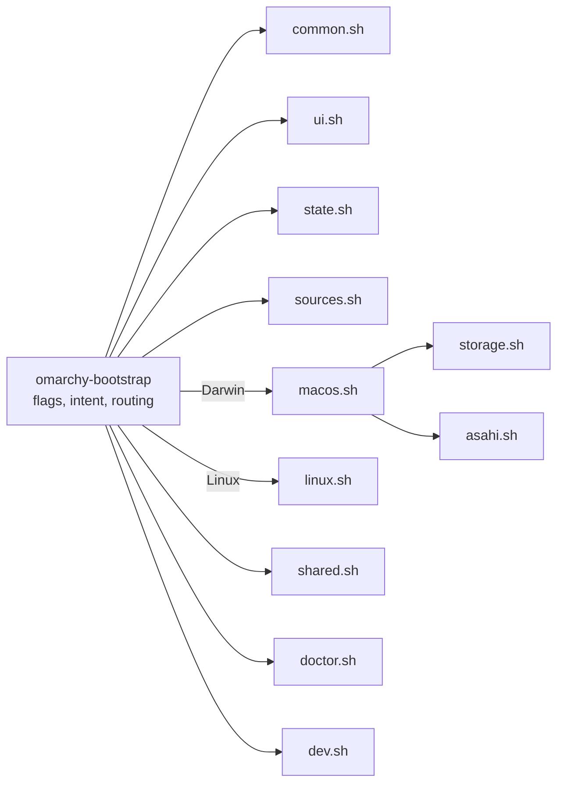
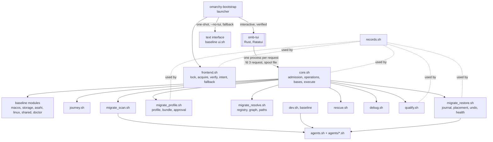

# Architecture

Bash only, bash 3.2 compatible, no dependencies beyond what stock macOS and the
minimal Asahi Alarm image ship. One entrypoint sources eleven small modules.

| Module | Holds |
| --- | --- |
| `common.sh` | the system seam, `run`, logging, downloads, the per-run scratch directory, version compare |
| `ui.sh` | palette, glyph sets, header, journey rail, disk strip, answer card, menus, typed gates |
| `state.sh` | the state directory's checks, `state.env` (one checked writer), whole-file records, the run lock, choices (`CFG_*`), validators, the resume token |
| `sources.sh` | upstream URLs, branches, verified versions, installer constants, the storage contract, device table, `sources` |
| `storage.sh` | pure geometry (extents, gaps, the byte-for-byte walk) and the planner (regions, answers, invariants), checked size input |
| `macos.sh` | Phase 1: detection, geometry from diskutil, survey, planner UI, choices, backup gate, handoff, re-read after the installer |
| `asahi.sh` | where an Asahi install stands, from the disk; recovery guidance |
| `linux.sh` | Phase 2: detection, encryption state, network, choices, Omarchy Mac handoff, routing |
| `shared.sh` | Shared storage: the plan record, the codes, state from the machine, creation (macOS), activation (Linux), the write test, status and doctor |
| `doctor.sh` | `doctor` and `status` for both systems |
| `dev.sh` | developer modules and their outcomes |

## Starting

The entrypoint is bash and its libraries are bash; only its first lines are
plain sh, so any shell can read them. They start bash again (`exec bash "$0"`)
when the shell is not bash, or is bash in POSIX mode (`posix` in
`SHELLOPTS`): macOS's `sh` is bash 3.2 in POSIX mode, which keeps
`BASH_VERSION` but rejects bash syntax such as process substitution. A
restarted shell still in POSIX mode stops the run instead of looping. Each
library is sourced with `|| _omb_unloaded NAME`, so one that does not load
stops everything before a command, `--version` included, can answer.

## Intent before state

The entrypoint decides what a run may do from the command alone, before any
module reads the machine:

- `OMB_INTENT` — `act`, `plan` or `read`. `run` and downloads refuse unless it
  is `act`, so a read-only or planning command routed by mistake fails closed
  instead of acting.
- `OMB_PERSIST` — 0 for read-only commands and `--dry-run`: the state
  directory is never created, and state writes, logs and kept downloads are
  skipped. A dry run's downloads go to a scratch directory removed on exit.

Recording runs take the lock in the state directory for their whole life.

## The two seams

Everything that touches the machine goes through one of two functions, which
is what makes the tool testable on any host and safe to dry-run.

**Reading** — `sys_cmd NAME CMD…`, `sys_path PATH`, `sys_has CMD`,
`sys_net KEY URL`, `sys_reachable KEY URL`. With `OMB_FIXTURE` set they read
`fixture/cmd/NAME` (exit code in `NAME.rc`), `fixture/root/PATH`,
`fixture/commands`, and `fixture/net/KEY`. Every probe is read-only; the test
suite holds each one to an allowlist.

**Changing** — `run CMD…`. In `--dry-run` it prints `would run` and returns;
with `OMB_TEST_RECORD` set it appends the argv to that file and returns (with
`OMB_TEST_AFTER`, the machine then reads as that fixture; with `OMB_TEST_RC`,
the command "exits" with that status; `sudo -v`, which changes nothing, is
recorded and succeeds, leaving both to the command after it, so a status
there models `sudo -n` refusing); otherwise it runs the command in the
foreground on your terminal and logs the command and its exit code, never
its output. `state_set` follows the same rules for state.

## Flow control

Each phase is a small step machine (`mac_main`, `lx_main`). Menus return
`0` chosen, `2` back, `3` quit; the step machine turns those into moving
between screens. Typed gates guard every irreversible moment: `yes` for the
backup, `launch` / `start` / `resume` for the installers, `create` for the
Shared partition, `mount` for its fstab entry, `test` for the write test.

Where the machine is — the Asahi install, Omarchy Mac's setup and
encryption, Shared storage — is re-derived from the machine on every run;
recorded state is history, context, and input to those checks, never the
authority.

## Presentation

A surveyor's plate: one mark (◒, a rising sun), a six-stage journey rail that
spans both systems (`survey · plan · asahi · reboot · omarchy · dev`), section
bars, and the disk strip as the planning centrepiece. Colour carries meaning —
steel for macOS, coral for Linux, violet for boot/system, green for Shared,
mint/amber/rose for pass/warn/fail — and degrades 256 → 16 → none, Unicode →
ASCII. The Linux VT console always gets ASCII: glyphs come from the ASCII
glyph set, and all user-visible text is printed with `_p`, which maps message
punctuation (dashes, arrows, ≥, ≈, …) to ASCII there. Menus take arrows,
digits, `b`, `q` on a terminal and fall back to line input when piped.

## Bash 3.2 conventions

- No associative arrays, `mapfile`, `${x,,}`, namerefs; `${arr[@]+"${arr[@]}"}`
  for possibly-empty arrays under `set -u`.
- No `pipefail`: probes are `producer | grep -q`, and an early match can SIGPIPE
  the producer.
- Functions that assign a caller's variable via `eval` use `__`-prefixed locals
  so bash's dynamic scoping cannot shadow the caller's name.
- Every number from outside passes `_uint` (digits, no leading zero, bounded)
  before `$(( ))`, where a leading zero means octal and text is evaluated.
- `shellcheck -x omarchy-bootstrap` sees the whole program for cross-file
  variables but reports only the entrypoint's own findings; lint each file too
  (`tests/run.sh` does both).

## Tests

`tests/run.sh` runs syntax checks, ShellCheck, and every test file:

| File | Covers |
| --- | --- |
| `test-storage.sh` | geometry walk, planner, every plan replayed through an independent installer model, size input, the storage contract's template matrix |
| `test-detection.sh` | detectors over fixtures, including every unreadable-layout refusal |
| `test-lifecycle.sh` | Asahi interruption states, the re-read after the installer, Omarchy setup and encryption states, every LUKS header probe outcome |
| `test-shared.sh` | the codes, the token, the plan record, every creation gate and failure, the physical target, the creation record across runs, activation, the mounted source and the write test |
| `test-dev.sh` | developer outcomes under forced failures, failures followed by a stop |
| `test-routing.sh` | read-only commands, previews and plan over every lifecycle fixture, with filesystem snapshots |
| `test-state.sh` | state directory checks, checked writes, the lock, the token, log hygiene |
| `test-safety.sh` | static scans of every probe, `run` and `sudo` line, the single `addPartition`, sealed dry runs, recorded argv, typed gates |
| `test-cli.sh` | the command surface, the launcher under sh and bash in POSIX mode, output degradation, whole flows |

`tests/fixtures/generate.sh` regenerates every fixture with synthetic values
shaped on a real 1 TB M1 Pro disk. CI (`.github/workflows/ci.yml`) runs the
suite on Linux (bash 5, ShellCheck required) and macOS (`/bin/bash` 3.2), and
fails on any skip it does not expect.

## The product expansion

Designed for M14–M16, not implemented. The product gains a compiled
frontend and a migration path. The Bash core
above stays the authority; the new Bash modules extend it under the same
seams, conventions and tests.

| Module | Holds | Prefix |
| --- | --- | --- |
| `records.sh` | the record format and admission: bounds, byte class, framing and canonical form, schemas, seals, the strict TOML subset reader (docs/PROTOCOL.md → §1, §2; docs/AI-TOOLS.md → *Codex's configuration*) | `rec_` |
| `core.sh` | the protocol: requests, responses, the spool, session ownership, children by class and their diagnostics, operation records and the boot-session barrier, bases, the execute order, handoff and managed modes (docs/PROTOCOL.md → §3–§5) | `core_` |
| `frontend.sh` | the launcher's side: the lock, acquisition, the cache, verification, the intent rules, start, fallback, the session scratch (docs/FRONTEND.md) | `fe_` |
| `journey.sh` | the ten stages on both systems, journey notes | `jr_` |
| `migrate_scan.sh` | the versioned scan adapters, the Zsh tracker (docs/MIGRATION.md) | `scan_` |
| `migrate_profile.sh` | selection, the profile, bundle export, the approval code, import | `prof_`, `bndl_` |
| `migrate_resolve.sh` | the registry, resolution, availability, the graph, path rules (docs/RESOLVER.md) | `res_` |
| `migrate_restore.sh` | the journal, placement, conflicts, graph execution, conditional undo, health (docs/RESTORE.md) | `rst_` |
| `agents.sh`, `agents/<id>.sh` | the AI tool providers, used by `restore` and by the baseline's `dev` (docs/AI-TOOLS.md) | `agent_`, `agent_<id>_` |
| `rescue.sh` | rescue tools, the workspace, the system's SSH classification, closing and hardening it, the rescue-owned SSH server, removal (docs/RESCUE.md) | `rsq_` |
| `debug.sh` | the field-allowlisted report, the agent brief, raw diagnostics | `dbg_` |
| `qualify.sh` | the cross-system check, the stream, stage records, the executed-source digest, the report (docs/QUALIFICATION.md) | `qual_` |
| `data/registry.omb`, `data/agent-brief.md` | the registry; the brief's fixed text | — |
| `frontend/` | the Rust crate; every Git-tracked file in it, tests included, is a build input (docs/FRONTEND.md → *Four identities*) | — |
| `release/frontend.lock` | the release lock, outside the build inputs | — |

- **Loading.** The baseline's eleven modules load at start as today. The
  new ones load only for the commands and core operations that need them,
  each with `|| _omb_unloaded NAME`, so a module that does not load stops
  that command. The installer's act paths load none of the migration
  modules. The one baseline module that gains a dependency is `dev.sh`,
  whose AI module calls the providers (MILESTONES.md → *M15-B — Packages and AI providers*).
- **Bash 3.2 everywhere**, the new Linux-only modules included: the macOS
  CI job runs every Linux path under `/bin/bash` 3.2.
- **The text interface** keeps its six-station rail on the installer's own
  text screens; `status` and `doctor` print the ten journey stages as a
  list, one per line, which fits any width.
- **The same seams.** New reads go through `sys_cmd`, `sys_path` and
  `sys_walk`; every change goes through `run`; every new probe, command and
  `sudo` joins the allowlists in `tests/test-safety.sh`.
- **Baseline files change only as reviewed deltas**, each compared with the
  accepted baseline (docs/TESTING.md → *Equivalence with the accepted
  baseline*).
- Tests for all of this: docs/TESTING.md.
