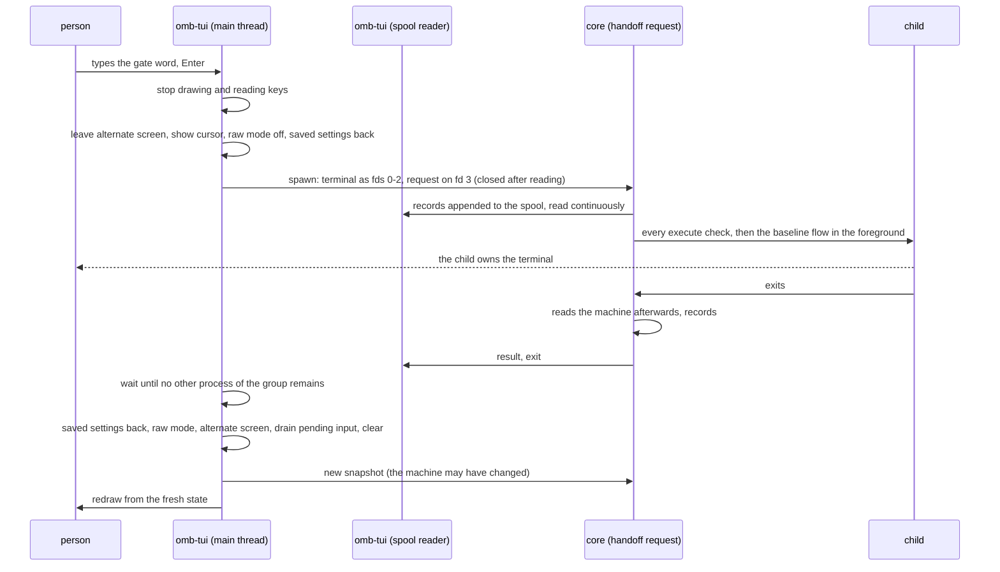

# The frontend

**Status: the implementation contract for M14 gate 1 (distribution,
lifecycle, fallback) and the screens of M14–M16 (MILESTONES.md); not
implemented.** Library and platform facts: docs/UPSTREAM.md → *Ratatui and
distribution*.

The product's interface is a compiled Rust program built with Ratatui,
`omb-tui`. It is the product's interface on both systems. The Bash core
stays the authority for everything the machine is and everything done to
it; the frontend presents, asks and shows.

| The frontend | The core (the accepted baseline and its extensions) |
| --- | --- |
| layout, rendering, focus, keys, scrolling; filtering and searching loaded data | reading the machine: detection, geometry, the plan, Asahi and Linux states, Shared identity |
| collecting choices and typed words | validating every parameter and word; deciding what is available |
| showing provenance, diffs, codes, the session's diagnostics | downloads, digests, records, operations |
| stepping aside while a program needs the terminal | running every command that changes anything, and `sudo` |
| — | the debug report, the journey's stages, every judgement of success |

It never computes a storage plan, never decides that anything is safe,
never reads a user file or a record in the state directory, never runs a
program other than the core, and never interprets human-formatted text.
What it reads and writes is limited to its own requests and their spool and
diagnostics files in the session scratch, the process table, and an
optional trace file (*Intent and persistence*). The process model, the
descriptors and supervision are defined once, in docs/PROTOCOL.md → §3.

## When the frontend runs

| Situation | Interface |
| --- | --- |
| an interactive command whose flow is exposed through the protocol, on a terminal | the frontend |
| a one-shot command (`status`, `doctor`, `shared`, `logs`, `sources`, `scan`, `profile show`, `restore status`, `restore why`, `qualify status`, `debug`, `debug context`, `debug raw`, `report`, `--help`, `--version`) | text on stdout: a contract for scripts and agents |
| `--no-tui`, stdin or stdout not a terminal, `TERM=dumb` | text |
| the frontend cannot be verified, cannot start, or refuses the handshake | the text recovery surface, saying why |

A command moves to the frontend only when every action its flow needs is
exposed (MILESTONES.md): `profile` and `export` with M14's gates 4 and 5;
`restore` and `rescue` with M15; the installer's commands one family at a
time in M16. Until then a command stays in text, so no command opens a
frontend that cannot finish it.

## Starting

### On macOS

```text
./omarchy-bootstrap
  → launcher: stock Bash 3.2 startup, libraries load (baseline)
  → platform and architecture: macOS, arm64
  → release/frontend.lock: version and SHA-256 for aarch64-apple-darwin
  → a cached binary with that digest?  yes → start it
                                       no  → acquire (act sessions only), then start it
  → omb-tui: hello → snapshot → the dashboard
```

### On the fresh Asahi system

The earliest the frontend can draw is the first run of this tool, which
needs the repository, which needs the network:

```text
boot → log in as root → nmtui (upstream's own interface)
     → the Phase 1 guide's fetch command, pinned to a full commit
     → ./omarchy-bootstrap resume <token>
     → launcher (text): network present, frontend not cached
     → acquire: URL, version, expected SHA-256 from the lock, size; [Y/n]
     → verified → omb-tui on the console (TERM=linux: ASCII, 16 colours)
```

| Option | For | Against | Chosen |
| --- | --- | --- | --- |
| **A. download once the network is up** | one download of a few megabytes; checked against the lock of the checkout the person fetched | the moments before it are text | **yes** |
| B. carry it before Linux | available before the network | only removable media could carry it, to save seconds; the network is needed anyway | no |
| C. fetch a release bundle instead of the repository | one download | a release asset is not bound to the commit the person typed and can be replaced | no |

If the Phase 1 commit was not on GitHub, the guide falls back to the
branch's tip and says so; the checkout is then whatever GitHub served, and
M17 requires the pinned form. Losing the network after the repository
arrived leaves the baseline's text flow, which runs `nmtui` itself.

### The everyday user on Omarchy

Root's download is in root's cache. The user's first act session finds that
digest there (root-owned, not writable by the user, checked like any cache)
or acquires its own copy into the user's cache.

## Distribution and provenance

### Three identities

| Identity | What it is | Who establishes it |
| --- | --- | --- |
| **Git commit** | the commit a release was built from, `source_commit` (40 hex) | the release workflow's checkout |
| **Source input** | `inputs_digest`: the SHA-256 of a canonical listing of every build input (below) | computed by the release workflow, and by CI on every commit |
| **Release artifact** | each binary's SHA-256 and size | computed by the release workflow; pinned in the lock |

**Build inputs** are every regular file under `frontend/` except
`frontend/tests/`: the Rust sources, `Cargo.toml`, `Cargo.lock`,
`rust-toolchain.toml`, `.cargo/config.toml` (which carries the link
arguments), any `build.rs` and any checked-in generated source. A symbolic
link under `frontend/` is an error. The canonical listing is
`omb-frontend-inputs 1` followed by one line per file, `<path> TAB <sha256>`,
in byte order of the path (`LC_ALL=C`); `inputs_digest` is the SHA-256 of
that listing.

**The lock is not a build input.** It is `release/frontend.lock`, outside
`frontend/`, so changing it cannot change the digest it records:

```text
omb-frontend-lock 1
frontend	version=0.1.0	proto=1	source_commit=<40 hex>	inputs_digest=<64 hex>	rust=1.88.0
artifact	target=aarch64-apple-darwin	url=https://github.com/scalinity/omarchy-mac-bootstrap/releases/download/frontend-v0.1.0/omb-tui-0.1.0-aarch64-apple-darwin	size=3145728	sha256=<64 hex>	minos=13.5	glibc_max=	interp=	align_min=
artifact	target=aarch64-unknown-linux-gnu	url=…/omb-tui-0.1.0-aarch64-unknown-linux-gnu	size=3407872	sha256=<64 hex>	minos=	glibc_max=2.39	interp=/lib/ld-linux-aarch64.so.1	needed=libc.so.6	needed=libgcc_s.so.1	needed=libm.so.6	align_min=65536
seal	sha256=<64 hex>
```

Schema (docs/PROTOCOL.md → §1): `frontend` 1 — `version:id proto:uint
source_commit:hex40 inputs_digest:hex64 rust:id`; `artifact` + — `target:id
url:bytes size:uint sha256:hex64 minos:id? glibc_max:id? interp:bytes?
needed:bytes* align_min:uint?`; `seal` 1.

How they relate:

- **At run time, only the artifact digest counts.** The launcher starts a
  binary only if its SHA-256 is the one the reviewed lock pins. That digest
  says which bytes are accepted; it does not by itself say how they were
  built.
- **CI connects the checkout to the release.** On every commit CI computes
  `inputs_digest` from the working tree and fails if it differs from the
  lock's, which means the frontend's inputs changed since the release and a
  new release is needed. A commit that changes only the lock leaves
  `inputs_digest` unchanged.
- **The attestation connects the release to its commit.** The release
  workflow publishes a GitHub artifact attestation for each binary, naming
  the repository, the workflow and `source_commit`. It is evidence anyone can
  check with `gh attestation verify`; nothing at run time depends on it, and
  no signing infrastructure is added.

### Building

On a tag `frontend-v<version>`, the release workflow builds natively on
GitHub's arm64 macOS runner and on `ubuntu-24.04-arm`, with the toolchain in
`frontend/rust-toolchain.toml` (at least 1.88, Ratatui's minimum),
`cargo build --release --locked`, and `--remap-path-prefix` for build paths.
It computes `inputs_digest`, checks every artifact against *Compatibility*,
publishes the binaries, `SHA256SUMS` and the attestations, and prints the
lock lines. A reviewed commit then updates `release/frontend.lock`.

### Compatibility, checked from the artifact

| Target | Supported environment | Checked in CI from the binary | Proven at run time |
| --- | --- | --- | --- |
| `aarch64-unknown-linux-gnu` | Arch Linux ARM as the Asahi Alarm image and Omarchy Mac install it: aarch64, glibc (2.43 when read on 2026-09-26), the Asahi kernel's 16 KiB pages | 64-bit AArch64 ELF; interpreter exactly `/lib/ld-linux-aarch64.so.1`; `DT_NEEDED` within {`libc.so.6`, `libm.so.6`, `libgcc_s.so.1`, `ld-linux-aarch64.so.1`}; the highest `GLIBC_` symbol version required no higher than the build host's 2.39 (read with `objdump -T`); every `LOAD` segment aligned to at least 0x4000 (linked with `-z max-page-size=0x10000`); no allocator crate (jemalloc, mimalloc) in the dependency tree | the PTY tests on the aarch64 runner (4 KiB pages); on 16 KiB pages, first on the target Mac in M17 — alignment is necessary evidence, not proof |
| `aarch64-apple-darwin` | macOS 13.5 or later on Apple Silicon (the baseline's floor) | arm64 only; `LC_BUILD_VERSION` minimum 13.5 (`MACOSX_DEPLOYMENT_TARGET=13.5`); a valid ad hoc signature after stripping (`codesign -v`) | the PTY tests on the oldest arm64 runner GitHub offers, and the target Mac in M17 |

The frontend has no network code, TLS, DNS or terminfo (Crossterm writes
escape codes itself), so a static musl build would buy nothing; it remains
the fallback if a glibc floor ever becomes a problem. It is downloaded with
`curl`, which sets no quarantine attribute, so Gatekeeper does not stop it;
a copy downloaded through a browser would be stopped, and the
troubleshooting guide says so.

### Intent and persistence

The frontend's own effects follow the command's intent like everything
else:

| Session | Download and cache the frontend | Move aside a cached binary that fails its digest | Trace file | Start the frontend |
| --- | --- | --- | --- | --- |
| interactive act | yes, after `[Y/n]` (default yes: a pinned file, checked by digest) | yes, after a yes | only when `OMB_TUI_LOG` names a path; written 0600 | yes |
| interactive plan | no: continues in text and says the default run sets up the interface | no: reports it | no: ignored, with a one-line notice | yes, when a verified binary is cached |
| one-shot read | never | never: `doctor` and `status` report a bad cache | never | never (one-shots are text) |
| `--dry-run` | into the per-run scratch directory, run from there, kept nowhere | never | never | yes, from the scratch copy |
| `--no-tui` | never | never | never | never |

Every launch hashes the cached binary before starting it. The per-run and
session scratch directories are temporary and removed on exit; they are
not persistent state.

### Upgrades and downgrades

There is no updater. The checkout's lock decides the version: a `git pull`
that brings a new lock means the next act session acquires that version
with its provenance shown; an older checkout uses the older version, which
may still be cached. Nothing is fetched to look for newer versions.

### When things go wrong

| Failure | What happens |
| --- | --- |
| no network, nothing cached | text; it says the interface needs a one-time download, and which |
| download fails, is partial, or has the wrong size | nothing is cached; text; the error and URL shown |
| digest mismatch (a replaced release asset, a corrupted cache) | never run; named; in an act session, moving it aside and acquiring again is offered |
| the binary exists but will not execute (exit 126 or 127, a missing loader) | reported with its digest and target; text |
| a version or protocol mismatch | the core refuses the handshake; the frontend exits with status 10; text, with the reason |
| the frontend crashes | its hook restores the terminal; the launcher restores the settings it saved (after any running request ends, docs/PROTOCOL.md → *When something dies*) and reports |

The launcher reports the frontend as `verified` (its digest matches and it
started), `missing` (not cached), `mismatch` (a digest that is not the
lock's), `unrunnable` (it would not execute) or `fallback` (it refused the
handshake or exited with status 10). The text interface is always a
complete way to finish the install; it is the recovery path, not the
intended experience.

### Development

`OMB_FRONTEND_DEV=<path>` runs an unreleased build only in fixture mode
(`OMB_FIXTURE` set: the core reads recorded machines and runs nothing),
never as root. An unreleased frontend never drives a real machine.

## The terminal

Library facts: Ratatui 0.30.2 with Crossterm 0.29.0.

| Moment | Handling |
| --- | --- |
| start | the frontend's own panic hook first; the terminal settings saved once (`tcgetattr`); then Ratatui's `try_init()` (raw mode, alternate screen, its restoring hook chained); mouse capture, bracketed paste and keyboard-enhancement modes stay off |
| normal exit | `try_restore()`; the cursor shown explicitly (restore does not); the saved settings put back; on the Linux console the screen also cleared, because a kernel older than August 2025 has no alternate screen there |
| error, panic | the same restore, then the report on the normal screen |
| signals, Ctrl-C, Ctrl-Z | docs/PROTOCOL.md → *Signals* |
| resize | Crossterm's resize event; layout recomputed from the new size; below the minimum, the too-small state (docs/UX.md) |
| output | nothing is ever printed onto the screen the frontend owns |

## Handing the terminal to a child

The Asahi installer, Omarchy Mac's setup, `nmtui`, `sudo`, `pacman`, a
sign-in, a rescue agent: each needs the real terminal. The core runs them;
the frontend **stops reading terminal input and drawing**, and keeps
following the request's event spool.



- **One thread reads the terminal**, and it reads nothing while a child
  runs, so the child receives every key and every reply the terminal sends
  it. The spool reader never touches the terminal.
- **The saved settings go back before and after the child**, because
  Crossterm saves whatever settings it finds when raw mode is enabled, and a
  child that left the terminal odd would otherwise become the new baseline.
- **The exit status is not the result**; the fresh read is.
- **The frontend asks for a handoff only when the core declared one**.

## Event loop and state

- **Synchronous.** No async runtime. The main thread drains the spool
  reader's bounded channel, draws if anything changed, then polls Crossterm
  with a short timeout; it draws on input, data and resize only.
- **Model, messages, update, view.** `update` is a pure function of state
  and message; rendering reads state only; this is what the tests drive.
- **Snapshots are views, not truth.** The frontend keeps the last snapshot to
  draw from and asks again after every action, on `r`, and after a handoff or
  a suspend; an action is always submitted with the basis it was shown.
- **Local work stays local.** Navigation, focus, scrolling, searching and
  filtering loaded data never call the core (docs/DECISIONS.md → O1).

## The security boundary

The frontend ships with the core and is still treated, by the core, as
input:

- **It gains no authority by being the interface.** Every execute passes
  docs/PROTOCOL.md → §5; the session's ceiling, scopes and dry run are set
  by the launcher and pass through unchanged, and the core refuses to work
  when any is missing; no schema carries a state, a plan or a verdict.
- **Typed words are intent, validated by the core.** A gate the frontend
  collects is checked by the core exactly as the text flow's is.
  Authentication is separate: upstream programs and `sudo` ask for their own
  credentials on the real terminal during a handoff, where the frontend is
  not reading, when their policy requires it. The baseline's Shared sequence
  is unchanged: the typed gates, `sudo -v`, the final read, the creation
  record, `sudo -n diskutil addPartition`, the postcondition.
- **Its bytes are pinned.** A binary whose digest is not the lock's is never
  started. The protection against a broken frontend is the core's checks and
  the frontend's tests (only the gate field produces a confirmation); against
  a malicious program running as the person there is no protocol defence,
  because such a program could do what the person can.
- **Its reach is small by construction**, checked statically: it spawns only
  the core, never sets the session variables, never enables mouse capture,
  and touches only the files listed at the top of this document.

## Without the frontend

- **`--no-tui`** gives the text interface for every command. It skips no
  gate: the typed word must still be given on stdin, as the baseline's text
  flow reads it.
- **The installer's flows in text** are the baseline's own screens.
- **Migration in text**: `profile --select FILE` (docs/MIGRATION.md →
  *Choices in a file*) and `restore --plan FILE` (docs/RESTORE.md →
  *Decisions in a file*), validated like the frontend's requests, then the
  gate words and the bundle approval code asked for as in any text flow.

## The crate

```text
release/
  frontend.lock    the release lock (not a build input)
frontend/
  Cargo.toml  Cargo.lock  rust-toolchain.toml  .cargo/config.toml
  src/
    main.rs        start, exit, the launcher contract
    terminal.rs    init, restore, saved settings, suspend, handoff
    record.rs      admission and the record format (docs/PROTOCOL.md)
    core.rs        the only process spawn: the core, its descriptors, the spool reader
    app.rs         model, messages, update
    theme.rs       tokens, capability detection, glyph sets (docs/UX.md)
    keys.rs        the keymap, from which hints and help are generated
    screens/       one module per screen family
    widgets/       disk strip, traverse rail, gate field, diff, table helpers
  tests/           state, frame, PTY and contract tests (docs/TESTING.md)
```

Dependencies: `ratatui` 0.30.2 with default features (Crossterm through its
re-export, so exactly one Crossterm), `signal-hook` 0.3 (Crossterm's), and
`rustix` for terminal settings, descriptors and the process table; for tests
`insta`, `portable-pty` and `vt100`. Nothing else without a decision in
docs/DECISIONS.md.

**Exit statuses**: 0 finished; 10 fall back to text (handshake refused,
version mismatch, terminal unsupported), with the reason on stderr after
the terminal is restored; anything else is a failure the launcher reports.
