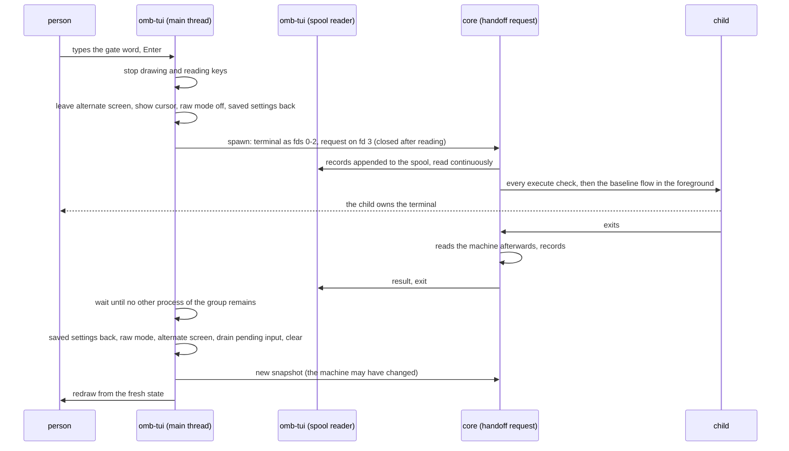

# The frontend

**Status: the implementation contract for M14 gate 1 (distribution,
lifecycle, fallback, the startup check) and the screens of M14–M16
(MILESTONES.md); not implemented.** Library and platform facts: docs/UPSTREAM.md → *Ratatui and
distribution*.

The product's interface is a compiled Rust program built with Ratatui,
`omb-tui`. It is the product's interface on both systems. The Bash core
stays the authority for everything the machine is and everything done to
it; the frontend presents, asks and shows.

| The frontend | The core (the accepted baseline and its extensions) |
| --- | --- |
| layout, rendering, focus, keys, scrolling; filtering and searching loaded data | reading the machine: detection, geometry, the plan, Asahi and Linux states, Shared identity |
| collecting choices and typed words | validating every parameter and word; deciding what is available |
| showing provenance, diffs, codes, the session's diagnostics | downloads, digests, records, operations |
| stepping aside while a program needs the terminal | running every command that changes anything, and `sudo` |
| — | the debug report, the journey's stages, every judgement of success |

It never computes a storage plan, never decides that anything is safe,
never reads a user file or a record in the state directory, never runs a
program other than the core, and never interprets human-formatted text.
What it reads and writes is limited to its own requests and their spools in
the session scratch, the bounded diagnostics the core keeps there (which it
only reads), the process table, and an optional trace file (*Intent and
persistence*). The process model, the
descriptors and supervision are defined once, in docs/PROTOCOL.md → §3.

## When the frontend runs

| Situation | Interface |
| --- | --- |
| an interactive command whose flow is exposed through the protocol, on a terminal | the frontend |
| `frontend-check` on a terminal (M14 gate 1) | the frontend: its whole flow is the startup check (*The startup check*) |
| a one-shot command (`status`, `doctor`, `shared`, `logs`, `sources`, `scan`, `profile show`, `restore status`, `restore why`, `qualify status`, `debug`, `debug context`, `debug raw`, `report`, `--help`, `--version`) | text on stdout: a contract for scripts and agents |
| `--no-tui`, stdin or stdout not a terminal, `TERM` unset or `dumb` | text; for `frontend-check`, a report that the check was not performed |
| the frontend cannot be verified, cannot start, or refuses the handshake | the text recovery surface, saying why; for `frontend-check`, the check's own report that it was not completed, never another command's flow |

A command moves to the frontend only when every action its flow needs is
exposed (MILESTONES.md): `profile` and `export` with M14's gates 4 and 5;
`restore` and `rescue` with M15; the installer's commands one family at a
time in M16. Until then a command stays in text, so no command opens a
frontend that cannot finish it.

`frontend-check` meets the same rule rather than bending it: its whole flow
is starting the interface — acquire or verify it, reach the core, show the
foundation dashboard, leave — so a dashboard with no actions finishes it.
It is an additional, explicit command and never becomes a default: the
default run, `install`, `plan`, `resume`, `profile`, `export`, `restore`,
`rescue`, `qualify`, `shared create` and `shared activate` keep their routing
until the milestone above moves each of them.

## Starting

In M14 gate 1 the one production route to the frontend is `frontend-check`
(the first diagram). The diagrams after it are the normal commands' routes:
each becomes active only in the milestone that moves its command to the
frontend (*When the frontend runs*); until then that command runs in text.

### The startup check (M14 gate 1)

On macOS arm64 and on Linux aarch64 alike (*The startup check*):

```text
./omarchy-bootstrap frontend-check
  → launcher: stock Bash startup, libraries load (baseline)
  → a test or development seam set?  yes → refused (status 2), nothing read or started
  → platform and target: aarch64-apple-darwin or aarch64-unknown-linux-gnu
  → an interactive terminal?  no → not performed (status 1)
  → this checkout's committed release/frontend.lock: version, size, SHA-256 for the target
  → a cached binary with that digest?  yes → start it
                                       no  → provenance, [Y/n] → download, size and SHA-256 → cache
  → the verified, published omb-tui (read ceiling, journey scope, purpose frontend-check)
  → hello → the check's journey snapshot → the foundation dashboard, no actions
  → the person leaves (q) → the session quiescent → terminal restored → scratch removed
  → frontend-check: completed (status 0)
```

### On macOS

From M16, once the default run's family moves to the frontend
(MILESTONES.md → *M16 — The full journey through the frontend, and
qualification*); until then `./omarchy-bootstrap` is the text installer:

```text
./omarchy-bootstrap
  → launcher: stock Bash 3.2 startup, libraries load (baseline)
  → platform and architecture: macOS, arm64
  → release/frontend.lock: version and SHA-256 for aarch64-apple-darwin
  → a cached binary with that digest?  yes → start it
                                       no  → acquire (act sessions only), then start it
  → omb-tui: hello → snapshot → the dashboard
```

### On the fresh Asahi system

From M16, once `resume`'s family (network and the Omarchy handoff) moves to
the frontend; until then `resume` is the text flow, and `frontend-check` is
the only command that opens the frontend here.

The earliest the frontend can draw is the first run of this tool, which
needs the repository, which needs the network:

```text
boot → log in as root → nmtui (upstream's own interface)
     → the Phase 1 guide's fetch command, pinned to a full commit
     → ./omarchy-bootstrap resume <token>
     → launcher (text): network present, frontend not cached
     → acquire: URL, version, expected SHA-256 from the lock, size; [Y/n]
     → verified → omb-tui on the console (TERM=linux: ASCII, 16 colours)
```

| Option | For | Against | Chosen |
| --- | --- | --- | --- |
| **A. download once the network is up** | one download of a few megabytes; checked against the lock of the checkout the person fetched | the moments before it are text | **yes** |
| B. carry it before Linux | available before the network | only removable media could carry it, to save seconds; the network is needed anyway | no |
| C. fetch a release bundle instead of the repository | one download | a release asset is not bound to the commit the person typed and can be replaced | no |

If the Phase 1 commit was not on GitHub, the guide falls back to the
branch's tip and says so; the checkout is then whatever GitHub served, and
M17 requires the pinned form. Losing the network after the repository
arrived leaves the baseline's text flow, which runs `nmtui` itself.

### The everyday user on Omarchy

Root's download is in root's cache. The user's first act session, or
`frontend-check`, finds that digest there (root-owned, not writable by the
user, checked like any cache) or acquires its own copy into the user's
cache.

## The startup check

`./omarchy-bootstrap frontend-check` opens the real production frontend to
check that this checkout's published interface can be acquired, started,
reach its core, show its foundation dashboard, and exit. It does not
install Linux, change any disk, run a Shared operation, install packages or
run setup, qualify hardware, or migrate anything. Its whole flow is that
start, so it needs no action to finish, and it is M14 gate 1's only
production route to the frontend. It is one command on both frontend
platforms: macOS arm64 (13.5 or later) and Asahi/Omarchy Linux aarch64;
anywhere else it is not performed.

### Two authorities

For every other command one intent answers two questions at once: may the
launcher acquire its own interface, and what may the core do. The startup
check answers them separately:

| Authority | Where it comes from | Permits | Never |
| --- | --- | --- | --- |
| **launcher cache authority** | the command word `frontend-check`, in the launcher; never exported, never seen by a core | inspecting the frontend cache; after a yes, moving aside a user-cache binary that fails its digest; after `[Y/n]`, downloading the artifact the committed lock pins for this target, holding it to size and SHA-256, and placing it in the cache by rename | any other persistent write: no state directory, state, log, run lock, trace file |
| **core session authority** | the session values: `OMB_SESSION_INTENT=read`, `OMB_SESSION_SCOPES=journey`, `OMB_DRY_RUN=0`, `OMB_SESSION_PURPOSE=frontend-check` | `hello`; the `journey` snapshot, repeated on refresh | `detail`, `validate`, every `execute`, any other scope (docs/PROTOCOL.md → *The startup-check session*) |

The launcher's baseline side runs as a read command (`OMB_INTENT=read`,
`OMB_PERSIST=0`): no state directory, state, log or run lock, and `run`
refuses everything. The cache write is the object under check, not
authority over the machine being orchestrated, so it gives the core
nothing: the core's ceiling is read whatever the launcher was allowed to
cache (docs/DECISIONS.md, D43 and D48).

### The flow

In this order, each step ending the check as its outcome says (*Outcomes*):

1. **Arguments and seams.** `frontend-check` takes no argument; the global
   `--dry-run`, `--no-tui`, `--no-color` and `--ascii` apply, and `--help`
   and `--version` answer as for every command. Any other argument, or any
   of `OMB_FIXTURE`, `OMB_FRONTEND_DEV`, `OMB_TEST_ARTIFACT`,
   `OMB_TEST_HOOK`, `OMB_TEST_HANDOFF_CHILD`, `OMB_TEST_RECORD`,
   `OMB_TEST_AFTER`, `OMB_TEST_RC`, `OMB_TEST_QUAL_BYTES`,
   `OMB_TEST_STOP_AT`, `OMB_TEST_FAIL_AT` or `OMB_TEST_PAUSE_AT` non-empty
   (an empty value is off, as for every command), is a usage error before
   anything is read, fetched or started. The seams keep their meaning for
   every other command and for the tests that own them; this command
   refuses them so that a production check can never turn into a fixture
   or development run.
2. **Its own route.** The command is dispatched on its own, after the flags
   and before the run lock, the log's start line and every other command's
   routing, and it returns from there with its own status. No outcome
   continues into the installer's routing (`mac_main`, `lx_main`), `resume`
   or any other command.
3. **Target.** macOS on arm64 is `aarch64-apple-darwin`, Linux on aarch64
   is `aarch64-unknown-linux-gnu`; any other system: not performed.
4. **Dry run.** With `--dry-run`, *Dry run* below, and nothing else.
5. **Terminal.** stdin and stdout are terminals, `TERM` is set and not
   `dumb`, and `--no-tui` is absent; otherwise not performed, with nothing
   acquired and nothing started.
6. **Lock.** This checkout's committed `release/frontend.lock`, admitted;
   its protocol the core's; an artifact for the target. No other lock,
   binary, CI artifact or local build is ever used.
7. **Cache.** As for an act session: this user's cache, then root's; the
   file hashed on every launch; a verified one is started. A user-cache
   file under the digest's name whose bytes differ is named and never run,
   and is moved aside only after a yes.
8. **Acquisition**, when nothing verified is cached: the URL, version,
   target, size and SHA-256 shown as for an act session, then `[Y/n]`.
   After a yes, the lock's HTTPS URL is fetched with `curl` on the normal
   path (never a fixture's copy) and held to its size and SHA-256 before it
   is placed in the cache by rename or run; a failure keeps no file.
9. **Session.** The session scratch of docs/PROTOCOL.md → *The session
   scratch*; the session values above exported; `OMB_TUI_LOG` ignored,
   with a one-line notice; `omb-tui --session <dir>` started.
10. **The interface.** `hello`, then the check's `journey` snapshot, then
    the dashboard: the check's facts, and "Nothing is available now." under
    its actions. `r` asks for the same snapshot again; help, focus,
    scrolling, resize and Ctrl-Z behave as in any session; `q` or Ctrl-C
    leaves.
11. **After it.** The launcher waits for the session to be quiescent,
    restores the terminal and removes its scratch, as after every session
    (*The terminal*).
12. **Result.** *Outcomes*.

### Outcomes

| Outcome | When | Status |
| --- | --- | --- |
| `completed` | all of: the frontend exited 0; the session was quiescent; its spools, admitted before the scratch was removed, hold a `hello` answered `done` and at least one `snapshot` answered `done` with a `generation` record and no `action` record; the saved terminal settings were put back; the scratch was removed | 0 |
| `not-completed` | any failure of steps 6 to 11, a declined `[Y/n]`, or the person leaving before the dashboard's data arrived | 1 |
| `not-performed` | step 3 or 5 stopped it, or `--dry-run` | 1 |

A usage error (step 1) exits 2, as for every command. Ctrl-C at a prompt
before the frontend starts ends the check as at any prompt (status 130),
with nothing cached and no partial download left.

The frontend exits 0 also when the person leaves before any snapshot has
answered (`q` on its connecting screen), so its exit status alone is never
the result; the spools are what show that it reached its core and received
its dashboard. That the dashboard was drawn is shown by
`frontend-check-terminal` in CI and seen by the person at gate 1's
production start (MILESTONES.md → *Gate 1 — Frontend and transport
foundation*).

Every outcome prints one bounded report. `completed` names the version, the
target and the SHA-256 it started. `not-completed` begins `frontend-check:
not completed —` with the launcher's state (`missing`, `mismatch`,
`unrunnable`, `fallback`, `crashed`, `unsettled`) and its reason, as
*When things go wrong* lists them; `not-performed` says which condition
stopped it and that the interactive check was not performed. None of them
says it continues in text: there is nothing to continue, and no outcome
enters another command's flow. A session not known to be over leaves the
terminal and the scratch as they are and says so, as every launcher does.

### Dry run

`frontend-check --dry-run` reads the lock and the cache and says what the
check would do: the artifact (URL, version, target, size, SHA-256), whether
a verified copy is cached and where, whether a download would be asked
for, and what would start, each as `would run`. Then it reports the check
not performed. It downloads nothing, not even into the per-run scratch,
moves nothing, starts neither frontend nor core, and writes no trace. This
is narrower than another command's dry run, which may start the frontend
from a scratch copy: an interface started by a check's dry run would look
like the check itself, and a dry run never counts as it.

### Effects

- **Persistent: only the frontend cache**, and only after consent:
  `$XDG_CACHE_HOME/omarchy-mac-bootstrap/frontend/<sha256>/omb-tui` (root's
  under `/var/cache/omarchy-mac-bootstrap/` on Linux), the directories made
  for it (0700), and a mismatching copy renamed `omb-tui.mismatch-<stamp>`
  after a yes. A download that fails, has the wrong size or digest, or is
  interrupted leaves no file there — at most the directories made for it,
  empty.
- **Never**: the state directory, state, logs, the run lock, a saved plan,
  an operation record (none is written, read by the check's snapshot,
  reconciled or cleared), a migration profile, export or restore state,
  `downloads/`, a trace file, and any disk, package or boot change.
- **Temporary**: the per-run scratch, the session scratch (identities,
  spools, the diagnostics summary), and the terminal's modes while the
  frontend owns it, all removed under docs/PROTOCOL.md → *The session
  scratch*. As every launcher does, its owner cleanup and stale reclaim
  read the state directory's operation records only to decide whether a
  scratch may be removed; they write nothing there.

### Help

`--help` lists `frontend-check` among the commands with one line, "check
that the interface starts: downloads it once, changes nothing else". It is
written with the command, not before.

### Identities

The check starts the artifact the committed lock pins. Its `source_commit`
and `inputs_digest` name what it was built from and stay as released; the
core that answers is the checkout that runs, named by its `hello`'s
`commit`, which may be a later commit that changes nothing under
`frontend/`. Those are two components' identities, and a difference between
them is expected, never a mismatch (docs/DECISIONS.md, D10).

## Distribution and provenance

### Four identities

| Identity | What it is | Who establishes it |
| --- | --- | --- |
| **Git commit** | the commit a release was built from, `source_commit` (40 hex) | the release workflow's checkout |
| **Source input** | `inputs_digest`: the SHA-256 of a canonical listing of every Git-tracked file under `frontend/` at that commit (below) | computed from the commit by the release workflow, and by CI on every commit |
| **Release artifact** | each binary's SHA-256 and size | computed by the release workflow; pinned in the lock |
| **Attestation** | a GitHub artifact attestation naming the repository, the workflow run and `source_commit` for each binary | published by the release workflow; checked by anyone with `gh attestation verify` |

**Source input** is defined by Git, never by what happens to be on disk:
every file Git tracks under `frontend/` at the commit — the Rust sources,
`Cargo.toml`, `Cargo.lock`, `rust-toolchain.toml` (an exact version, never a
channel name), `frontend/.cargo/config.toml` (the only Cargo configuration
the build reads: link arguments, and `MACOSX_DEPLOYMENT_TARGET` in its
`[env]`), checked-in generated source and assets, and `frontend/tests/`
too, so that nothing production code could include is outside it. The
listing is `omb-frontend-inputs 1` followed by one line per tracked path,
`<path> TAB <mode> TAB <sha256 of the file's bytes at the commit>`, in byte
order of the path (`LC_ALL=C`), read with `git ls-tree -r` and `git
cat-file` from the commit, never from the working tree; `inputs_digest` is
the SHA-256 of that listing. A tracked symbolic link under `frontend/` is an
error. Build output (`target/`), untracked and ignored files can never enter
it, because Git does not list them.

**The build may read nothing else.** Everything the compiler and Cargo
consume must be a tracked file under `frontend/`, a crates.io package
pinned by `Cargo.lock`, or the pinned toolchain. CI enforces it on every
build (docs/TESTING.md → `frontend-input-*`):

| Rule | How CI checks it |
| --- | --- |
| built from the commit, with nothing generated beside it | the checkout has no untracked or ignored file under `frontend/` before the build (`git status --porcelain --ignored -- frontend`), and `CARGO_TARGET_DIR` is outside the repository |
| no file outside the closure reaches the compiler (`include_bytes!`, `include_str!`, `#[path]`, a module) | the release build's own messages (`--message-format=json`, from the same `cargo build --release --locked --offline`) name every target it compiled; each target of the frontend's own packages — each package `cargo metadata` shows under `frontend/` — is bound to its own dependency file (`*.d`, which rustc writes for every file it read): the one for the output the build reported for that target, starting at the target's root file. A library and a binary whose crate names are spelled alike each need their own; a target with none fails, and a file no target is bound to is not read. Every path in each must be a tracked file under `frontend/`, a file under `$CARGO_HOME/registry/src`, or under the toolchain's sysroot; any other path fails |
| no build environment reaches the compiler | the same dependency files' `env-dep` notes (every `env!()` and `option_env!()` a crate read) name only the fourteen values Cargo 1.88.0 sets from the tracked `Cargo.toml` — `CARGO_PKG_VERSION`, `_VERSION_MAJOR`, `_VERSION_MINOR`, `_VERSION_PATCH`, `_VERSION_PRE`, `_NAME`, `_AUTHORS`, `_DESCRIPTION`, `_HOMEPAGE`, `_REPOSITORY`, `_LICENSE`, `_LICENSE_FILE`, `_RUST_VERSION`, `_README` (Cargo's `fill_env` and `metadata_envs!`); any other variable, set or unset, fails, another spelled `CARGO_PKG_*` included |
| no build script of its own | `cargo metadata` shows no `build` target in the frontend's own packages; a dependency's build script comes with its `Cargo.lock`-pinned source |
| no local or Git dependency outside the closure | `cargo metadata --locked` shows every package either under `frontend/` or from crates.io; no `git` source, no `path` outside `frontend/`, no `[patch]` or `[replace]` |
| no Cargo configuration from elsewhere | no `.cargo/` directory elsewhere in the repository; the release job starts with an empty `CARGO_HOME`; the release workflow sets none of `RUSTFLAGS`, `CARGO_ENCODED_RUSTFLAGS`, `CARGO_BUILD_*` or `CARGO_PROFILE_*` (a static check of the workflow file) |

**The lock is not a build input.** It is `release/frontend.lock`, outside
`frontend/`, so changing it cannot change the digest it records:

```text
omb-frontend-lock 1
frontend	version=0.1.0	proto=1	source_commit=<40 hex>	inputs_digest=<64 hex>	rust=1.88.0
artifact	target=aarch64-apple-darwin	url=https://github.com/scalinity/omarchy-mac-bootstrap/releases/download/frontend-v0.1.0/omb-tui-0.1.0-aarch64-apple-darwin	size=3145728	sha256=<64 hex>	minos=13.5	glibc_max=	interp=	align_min=
artifact	target=aarch64-unknown-linux-gnu	url=…/omb-tui-0.1.0-aarch64-unknown-linux-gnu	size=3407872	sha256=<64 hex>	minos=	glibc_max=2.39	interp=/lib/ld-linux-aarch64.so.1	needed=libc.so.6	needed=libgcc_s.so.1	needed=libm.so.6	align_min=65536
seal	sha256=<64 hex>
```

Schema (docs/PROTOCOL.md → §1): `frontend` 1 — `version:id proto:uint
source_commit:hex40 inputs_digest:hex64 rust:id`; `artifact` + — `target:id
url:bytes size:uint sha256:hex64 minos:id? glibc_max:id? interp:bytes?
needed:bytes* align_min:uint?`; `seal` 1.

How they relate:

- **At run time, only the artifact digest counts.** The launcher starts a
  binary only if its SHA-256 is the one the reviewed lock pins. That digest
  says which bytes are accepted; it does not by itself say how they were
  built.
- **CI connects the checkout to the release.** On every commit CI computes
  `inputs_digest` from the commit and fails if it differs from the lock's,
  which means the frontend's inputs changed since the release and a new
  release is needed. A commit that changes only the lock leaves
  `inputs_digest` unchanged.
- **The attestation connects the release to its commit.** It is evidence
  anyone can check; nothing at run time depends on it, and no signing
  infrastructure is added.

### Building

On a tag `frontend-v<version>`, the release workflow checks out the tagged
commit, confirms the clean-tree rule, computes `inputs_digest`, fetches the
crates with `cargo fetch --locked`, and builds natively on GitHub's arm64
macOS runner and on `ubuntu-24.04-arm` with `cargo build --release --locked
--offline`, keeping its messages, and the toolchain
`frontend/rust-toolchain.toml` names (at least 1.88, Ratatui's minimum). It
then applies the closure checks above and
*Compatibility* below to every artifact, publishes the binaries,
`SHA256SUMS` and the attestations, and prints the lock lines. A reviewed
commit then updates `release/frontend.lock`.

### Compatibility, checked from the artifact

| Target | Supported environment | Checked in CI from the binary | Proven at run time |
| --- | --- | --- | --- |
| `aarch64-unknown-linux-gnu` | Arch Linux ARM as the Asahi Alarm image and Omarchy Mac install it: aarch64, glibc (2.43 when read on 2026-09-26), the Asahi kernel's 16 KiB pages | 64-bit AArch64 ELF; interpreter exactly `/lib/ld-linux-aarch64.so.1`; `DT_NEEDED` within {`libc.so.6`, `libm.so.6`, `libgcc_s.so.1`, `ld-linux-aarch64.so.1`}; the highest `GLIBC_` symbol version required no higher than the build host's 2.39 (read with `objdump -T`); every `LOAD` segment aligned to at least 0x4000 (linked with `-z max-page-size=0x10000`); no allocator crate (jemalloc, mimalloc) in the dependency tree | the PTY tests on the aarch64 runner (4 KiB pages); on 16 KiB pages, first on the target Mac in M17 — alignment is necessary evidence, not proof |
| `aarch64-apple-darwin` | macOS 13.5 or later on Apple Silicon (the baseline's floor) | arm64 only; `LC_BUILD_VERSION` minimum 13.5 (`MACOSX_DEPLOYMENT_TARGET=13.5`); a valid ad hoc signature after stripping (`codesign -v`) | the PTY tests on the oldest arm64 runner GitHub offers, and the target Mac in M17 |

The frontend has no network code, TLS, DNS or terminfo (Crossterm writes
escape codes itself), so a static musl build would buy nothing; it remains
the fallback if a glibc floor ever becomes a problem. It is downloaded with
`curl`, which sets no quarantine attribute, so Gatekeeper does not stop it;
a copy downloaded through a browser would be stopped, and the
troubleshooting guide says so.

### Intent and persistence

The frontend's own effects follow the command's intent like everything
else:

| Session | Download and cache the frontend | Move aside a cached binary that fails its digest | Trace file | Start the frontend |
| --- | --- | --- | --- | --- |
| interactive act | yes, after `[Y/n]` (default yes: a pinned file, checked by digest) | yes, after a yes | only when `OMB_TUI_LOG` names a path; written 0600 | yes |
| interactive plan | no: continues in text and says the default run sets up the interface | no: reports it | no: ignored, with a one-line notice | yes, when a verified binary is cached |
| one-shot read | never | never: `doctor` and `status` report a bad cache | never | never (one-shots are text) |
| `--dry-run` | into the per-run scratch directory, run from there, kept nowhere | never | never | yes, from the scratch copy |
| `--no-tui` | never | never | never | never |
| `frontend-check` (its launcher; its cores are read) | yes, after `[Y/n]` | yes, after a yes | never: `OMB_TUI_LOG` ignored, with a one-line notice | yes, with a read ceiling and the `journey` scope |
| `frontend-check --dry-run` | never | never | never | never |

Every launch hashes the cached binary before starting it. The per-run and
session scratch directories are temporary and removed on exit; they are
not persistent state.

`frontend-check` is the one row not named by an intent: its launcher holds
the cache authority of *The startup check*, and its cores a read ceiling.
No other command gains that row by having a read session: `status`,
`doctor`, `scan` and every other read command never download or cache the
frontend, and act sessions keep their row as it is.

### Upgrades and downgrades

There is no updater. The checkout's lock decides the version: a `git pull`
that brings a new lock means the next act session, or `frontend-check`,
acquires that version with its provenance shown; an older checkout uses the older version, which
may still be cached. Nothing is fetched to look for newer versions.

### When things go wrong

| Failure | What happens |
| --- | --- |
| no network, nothing cached | text; it says the interface needs a one-time download, and which |
| download fails, is partial, or has the wrong size | nothing is cached; text; the error and URL shown |
| digest mismatch (a replaced release asset, a corrupted cache) | never run; named; in an act session, moving it aside and acquiring again is offered |
| the binary exists but will not execute (exit 126 or 127, a missing loader) | reported with its digest and target; text |
| a version or protocol mismatch | the core refuses the handshake; the frontend exits with status 10; text, with the reason |
| the frontend crashes | its hook restores the terminal; the launcher restores the settings it saved (after any running request ends, docs/PROTOCOL.md → *When something dies*) and reports |

The launcher reports the frontend as `verified` (its digest matches and it
started), `missing` (not cached), `mismatch` (a digest that is not the
lock's), `unrunnable` (it would not execute) or `fallback` (it refused the
handshake or exited with status 10). The text interface is always a
complete way to finish the install; it is the recovery path, not the
intended experience.

In `frontend-check`, every row above ends the check as `not-completed`,
with that state and reason in its report (*The startup check*); "text"
there means the check's report, never the installer's text flow or any
other command.

### Development

`OMB_FRONTEND_DEV=<path>` runs an unreleased build only in fixture mode
(`OMB_FIXTURE` set: the core reads recorded machines and runs nothing),
never as root. An unreleased frontend never drives a real machine.
`frontend-check` refuses both variables.

## The terminal

Library facts: Ratatui 0.30.2 with Crossterm 0.29.0.

| Moment | Handling |
| --- | --- |
| start | the frontend's own panic hook first; the terminal settings saved once (`tcgetattr`); then Ratatui's `try_init()` (raw mode, alternate screen, its restoring hook chained); then, before any other thread exists, a gate around that whole chain keyed to the main thread's `ThreadId`; mouse capture, bracketed paste and keyboard-enhancement modes stay off |
| normal exit | `try_restore()`; the cursor shown explicitly (restore does not); the saved settings put back; on the Linux console the screen also cleared, because a kernel older than August 2025 has no alternate screen there |
| error, panic | on the main thread, the terminal's owner: the same restore, then the report on the normal screen. On any other thread: the restoring chain does not run (Ratatui 0.30.2's `try_init` restores from whichever thread panics, and its hook is private, hence the gate); the panic is kept, the thread's own boundary turns it into its verdict (the spool reader's: unknown), and the main thread reports it after its own restore |
| signals, Ctrl-C, Ctrl-Z | docs/PROTOCOL.md → *Signals* |
| the terminal goes away (a closed window, a dropped SSH link) | the launcher passes SIGHUP and SIGTERM to the frontend (a launcher that leads its session is the only process a hangup signals), only while it is still the frontend the launcher started — its PID with its start time; Crossterm 0.29 retries a read of a terminal that has gone without ever returning, so a watcher thread ends the frontend once one read is still running at four checks a quarter of a second apart; nothing is left to restore; the launcher then waits and cleans up as after any exit |
| the frontend has exited | the launcher takes the terminal back — settings restored, a report, or the text interface — only once its wait finds the session quiescent: no recorded core or worker alive (waited for starting no process while any recorded PID answers; then each identity judged in full, PID, start and boot) and nothing that joined the group since `launcher.omb` left. Still running after an hour, an identity that cannot be read, or a table that cannot be read: the terminal and the scratch are left as they are, the launcher says so and exits 1. Without the pause it waits on, no frontend is started at all |
| the core's state cannot be read (`waitpid` fails) | the request is lost: the frontend starts no further request; during a handoff it leaves the terminal as the child has it and exits, and the launcher decides |
| resize | Crossterm's resize event; layout recomputed from the new size; below the minimum, the too-small state (docs/UX.md) |
| output | nothing is ever printed onto the screen the frontend owns |

## Handing the terminal to a child

The Asahi installer, Omarchy Mac's setup, `nmtui`, `sudo`, `pacman`, a
sign-in, a rescue agent: each needs the real terminal. The core runs them;
the frontend **stops reading terminal input and drawing**, and keeps
following the request's event spool.


```mermaid
sequenceDiagram
    participant P as person
    participant F as omb-tui (main thread)
    participant R as omb-tui (spool reader)
    participant C as core (handoff request)
    participant X as child
    P->>F: types the gate word, Enter
    F->>F: stop drawing and reading keys
    F->>F: leave alternate screen, show cursor, raw mode off, saved settings back
    F->>C: spawn: terminal as fds 0-2, request on fd 3 (closed after reading)
    C->>R: records appended to the spool, read continuously
    C->>X: every execute check, then the baseline flow in the foreground
    X-->>P: the child owns the terminal
    X->>C: exits
    C->>C: reads the machine afterwards, records
    C->>R: result, exit
    F->>F: wait until no other process of the group remains
    F->>F: saved settings back, raw mode, alternate screen, drain pending input, clear
    F->>C: new snapshot (the machine may have changed)
    F->>P: redraw from the fresh state
```

- **One thread reads the terminal**, and it reads nothing while a child
  runs, so the child receives every key and every reply the terminal sends
  it. The spool reader never touches the terminal.
- **The saved settings go back before and after the child**, because
  Crossterm saves whatever settings it finds when raw mode is enabled, and a
  child that left the terminal odd would otherwise become the new baseline.
- **The exit status is not the result**; the fresh read is.
- **The frontend asks for a handoff only when the core declared one**.

## Event loop and state

- **Synchronous.** No async runtime. The main thread drains the spool
  reader's bounded channel, draws if anything changed, then polls Crossterm
  with a short timeout; it draws on input, data and resize only.
- **Model, messages, update, view.** `update` is a pure function of state
  and message; rendering reads state only; this is what the tests drive.
- **Snapshots are views, not truth.** The frontend keeps the last snapshot to
  draw from and asks again after every action, on `r`, and after a handoff or
  a suspend; an action is always submitted with the basis it was shown.
- **Local work stays local.** Navigation, focus, scrolling, searching and
  filtering loaded data never call the core (docs/DECISIONS.md → *Resolved review questions*, O1).

## The security boundary

The frontend ships with the core and is still treated, by the core, as
input:

- **It gains no authority by being the interface.** Every execute passes
  docs/PROTOCOL.md → §5; the session's ceiling, scopes and dry run — and,
  for the startup check, its purpose — are set by the launcher and pass
  through unchanged, and the core refuses to work when any is missing or
  inconsistent; no schema carries a state, a plan or a verdict.
- **Typed words are intent, validated by the core.** A gate the frontend
  collects is checked by the core exactly as the text flow's is.
  Authentication is separate: upstream programs and `sudo` ask for their own
  credentials on the real terminal during a handoff, where the frontend is
  not reading, when their policy requires it. The baseline's Shared sequence
  is unchanged: the typed gates, `sudo -v`, the final read, the creation
  record, `sudo -n diskutil addPartition`, the postcondition.
- **Its bytes are pinned.** A binary whose digest is not the lock's is never
  started. The protection against a broken frontend is the core's checks and
  the frontend's tests (only the gate field produces a confirmation); against
  a malicious program running as the person there is no protocol defence,
  because such a program could do what the person can.
- **Its reach is small by construction**, checked statically: it spawns only
  the core, never sets the session variables, never enables mouse capture,
  and touches only the files listed at the top of this document.

## Without the frontend

- **`--no-tui`** gives the text interface for every command. It skips no
  gate: the typed word must still be given on stdin, as the baseline's text
  flow reads it. `frontend-check`, whose whole flow is the interface, has
  no text flow: with `--no-tui` it reports the check not performed.
- **The installer's flows in text** are the baseline's own screens.
- **Migration in text**: `profile --select FILE` (docs/MIGRATION.md →
  *Choices in a file*) and `restore --plan FILE` (docs/RESTORE.md →
  *Decisions in a file*), validated like the frontend's requests, then the
  gate words and the bundle approval code asked for as in any text flow.

## The crate

```text
release/
  frontend.lock    the release lock (not a build input)
frontend/
  Cargo.toml  Cargo.lock  rust-toolchain.toml  .cargo/config.toml
  src/
    main.rs        calls lib.rs's entry and exits with its status
    lib.rs         start, exit, the launcher contract; the modules, shared with the tests
    terminal.rs    init, restore, saved settings, suspend, handoff
    record.rs      admission and the record format (docs/PROTOCOL.md)
    core.rs        the only process spawn: the core, its descriptors, the spool reader
    app.rs         model, messages, update
    theme.rs       tokens, capability detection, glyph sets (docs/UX.md)
    keys.rs        the keymap, from which hints and help are generated
    screens/       one module per screen family
    widgets/       disk strip, traverse rail, gate field, diff, table helpers
  tests/           state, frame, PTY and contract tests (docs/TESTING.md)
```

Dependencies: `ratatui` 0.30.2 with default features (Crossterm through its
re-export, so exactly one Crossterm), `signal-hook` 0.3 (Crossterm's), and
`rustix` for terminal settings, descriptors and the process table; for tests
`insta`, `portable-pty` and `vt100`. Nothing else without a decision in
docs/DECISIONS.md.

**Exit statuses**: 0 finished; 10 fall back to text (handshake refused,
version mismatch, terminal unsupported), with the reason on stderr after
the terminal is restored; anything else is a failure the launcher reports.
