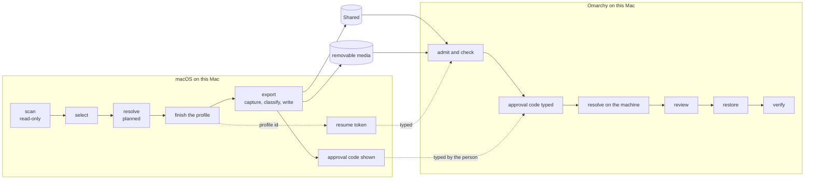

# Migration

**Status: the implementation contract for M14 gate 4 (scanner, profile),
gate 5 (bundle export and approval) and M15 (import); not implemented.**
Resolution is in docs/RESOLVER.md, restoring in docs/RESTORE.md, the AI tools
in docs/AI-TOOLS.md, the screens in docs/UX.md, the record format and
admission in docs/PROTOCOL.md.

The source is **this Mac's own macOS**: the M1 after a Time Machine restore
from the everyday Mac, brought up to date, before Linux is installed. The
tool reads it, the person chooses what should come to Linux, and the choices
travel as a Migration Profile and a bundle to Omarchy on the same Mac.



## Words

| Word | Meaning |
| --- | --- |
| **item** | one thing the scan found: a package, an app, a runtime, an editor extension, a configuration file or folder, a piece of an AI tool, a shell alias |
| **software id** | the registry's display name for one piece of software however it was installed (`sw:node`); versions are separate instances (docs/RESOLVER.md) |
| **adapter** | the code that knows one source and format; nothing else knows a format |
| **Migration Profile** | the record of what was found, chosen and resolved, and how sensitive each item is; never file contents |
| **bundle** | the finished profile, a manifest, and the captured file contents as content-addressed objects |
| **approval code** | the code macOS shows after an export and Linux requires before restoring: the person's word that this exact bundle is the one they exported |
| **opaque** | content no supported adapter understands: carried only with per-path consent, and outside the product's secret guarantee |

## The scanner

`scan` (read-only) prints what it found; `profile` scans, then leads
through selection, resolution and finishing in the frontend. `profile`'s
session reaches only the profile and resolve actions; the one that
downloads, the availability check, is an act action (docs/RESOLVER.md).

### Rules

- **Through the seam, over fixtures.** Every read is `sys_cmd`, `sys_path` or
  `sys_walk DIR` (a `find -P` listing of type, size, mode and link text that
  never follows a link). Each new probe joins the allowlist in
  `tests/test-safety.sh` with its reason.
- **Only fixed read-only system utilities run.** The scanner runs `find`,
  `plutil`, `wc`, `od`, `awk` and the like on files; it never runs a package
  manager or any tool it is inventorying (`brew`, `npm`, `cargo`, `uv`,
  `go`, `mise`, an AI tool), because their listing commands update, write,
  fetch or execute configuration (docs/UPSTREAM.md → *Package inventories on
  macOS*). `brew bundle dump` is not used.
- **Never executes configuration**: no MCP server started, no hook run, no
  shell file sourced, no plugin loaded.
- **Stays out of protected places**: Desktop, Documents, Downloads, iCloud
  Drive, Mail, Messages, Safari, other apps' containers. On macOS 27 a
  container read is denied without a prompt, so an empty result there is
  never taken to mean "nothing". A folder the person names is read; a denial
  is reported as denied.
- **No network, no writes**: `scan` writes nothing; `profile` writes only
  its own records (and the availability check's downloads, if run).
- **Bounded**: each adapter has a time and entry budget; running out is
  reported as `partial`, never as a short but complete list.
- **Uncertainty is kept.** Every item carries its **evidence**: `observed`
  (read from a file the source writes), `inferred` (derived by a stated
  rule), or `unknown`. A missing field never becomes a confident value.

### Adapter contracts

Each adapter has a versioned contract. A source outside it is `unknown`
(reported, never guessed); fixtures are named after the source version they
reproduce.

| Adapter | Contract covers | Required observation | Optional fields | Contradictions | Fixture sources |
| --- | --- | --- | --- | --- | --- |
| `brew` v1 | Homebrew 4.3.11 to 7.x prefixes `/opt/homebrew` and `/usr/local` (a Mac whose data came from an Intel Mac can have both) | `Cellar/<name>/<version>/` | the formula receipt and its `installed_on_request`, `runtime_dependencies`, `source.tap`; the cask receipt and its `uninstall_artifacts`; the `opt/<name>` link naming the linked version | a receipt naming a tap that is not installed; two linked versions; a cask whose app is gone: reported per item, the item kept with `evidence=unknown` for the disputed field | receipts shaped on 6.0.19 and 7.0.6, receipts without `installed_on_request`, casks without receipts |
| `npm`, `pnpm`, `bun` v1 | global `package.json` files under every Node prefix found | the package folder | `version` | two prefixes with different versions: two instances | Homebrew, nvm, fnm, Volta, mise prefixes |
| `cargo`, `uv`, `pipx` v1 | `.crates.toml` / `.crates2.json`, cargo-binstall's record; `uv-receipt.toml` with the `dist-info` version; `pipx_metadata.json` | the record file | versions, binaries | a record naming a missing binary | current formats read on 2026-09-26 |
| `go` v1 | binaries in `GOBIN`, `GOPATH/bin`, `~/go/bin` | a Mach-O file there | the module path and version from the build information Go embeds in the binary (found by a byte search of the file) | no build information: `unknown` | a Go 1.2x binary |
| `mise`, `asdf` v1 | `~/.config/mise/config.toml` `[tools]`, read with the strict TOML subset reader (docs/AI-TOOLS.md → *Codex's configuration*), values a version string or an array of them; `~/.tool-versions` | the file | — | a file the reader refuses: every tool in it `unknown`; a value of another shape: that tool `unknown` | both files |
| `apps` v1 | `/Applications/*.app`, `~/Applications/*.app` | `Info.plist` with `CFBundleIdentifier` | version, `_MASReceipt` | — | a cask-installed and a Store app |
| `services` v1 | `~/Library/LaunchAgents/homebrew.mxcl.*.plist` | the plist | — | — | — |
| `editors`, `shell`, `terminal`, `ai`, `git`, `ssh`, `dotfolders`, `projects` v1 | as in the adapter table below | as listed | as listed | as listed | the `mac-home-*` families (docs/TESTING.md) |

- **Requested or dependency.** A receipt's `installed_on_request: true` is
  `requested=yes`, `false` is `no`; a missing field or a missing receipt is
  `requested=unknown`, shown for the person to decide, never assumed.
- **Services are configured, not running.** A LaunchAgent plist says a
  service is *configured*; whether it runs is `unknown`, because the scanner
  runs no `launchctl`.
- **Enrichment is not in v1.** A later, separate enrichment command could
  ask supported tools with the person's consent, as an act action with its
  own effect tests; the read-only `scan` never will.

### What each adapter reads

| Adapter | Reads | Emits |
| --- | --- | --- |
| `brew` | the prefixes' `Cellar`, `Caskroom`, `opt`, `Library/Taps/*/*` (and each tap's `.git/config` remote) | formulae, casks, taps |
| `npm`, `pnpm`, `bun` | `lib/node_modules/[@scope/]*/package.json` under each prefix; pnpm's and bun's global `package.json` | global packages |
| `cargo`, `uv`, `pipx`, `go`, `mise`, `asdf` | as in the contracts | tools and runtimes |
| `apps` | `Info.plist` of each bundle | applications |
| `services` | LaunchAgent plists | configured services |
| `editors` | VS Code, VSCodium and Cursor `extensions/extensions.json`, `User/settings.json`, `keybindings.json`, snippets; `~/.config/nvim` | extensions, editor settings |
| `shell` | the login shell (`dscl` read of `UserShell`), `~/.zshrc`, `~/.zprofile`, `~/.zshenv`, `~/.bashrc`, `~/.bash_profile`, lexically (docs/RESOLVER.md → *From Zsh to Bash*) | aliases, exports, review-only constructs |
| `terminal` | Ghostty, Kitty, WezTerm, Alacritty, iTerm2 presence and configuration; tmux; Starship; fzf, zoxide, atuin, eza, bat and direnv configuration | terminal and prompt configuration |
| `ai` | docs/AI-TOOLS.md | the AI tools' components |
| `git`, `ssh` | Git configuration and global ignore file; GitHub CLI `config.yml` and the presence of `hosts.yml`; `~/.ssh/config`, `known_hosts`, public keys, each private key's envelope header | Git and SSH configuration, keys |
| `dotfolders` | names, sizes and types under `~` and `~/.config` until the person opens one | candidates for the picker |
| `projects` | only folders the person names: Git checkouts (remote, branch, unpushed work) | projects to clone on Linux, never to copy |

### One piece of software, several sources

Each adapter maps what it finds to a software id through the registry.
Homebrew's `node` 24 and nvm's node 20 are one software id, `sw:node`, and
**two instances**, because they are different versions (docs/RESOLVER.md →
*The graph*). A cask and the app it installed are one item. Something the
registry does not know is keyed by its adapter and name, never merged by a
guess; two unknown items with one name are shown side by side for the
person to say whether they are the same.

### Records from another Mac

A Time Machine restore brings this tool's state directory from the everyday
Mac. The baseline already refuses that Mac's Shared plan record (it
describes another disk). A profile carries a host id — the first 16 hex
digits of SHA-256 over a fixed label and the hardware UUID `system_profiler`
reports, never the UUID itself — and a profile whose host id is not this
Mac's is **stale**: history, never used. The host id is a pseudonymous
identifier, kept out of debug reports; a matching host does not make an
inventory current, which is why export captures content afresh.

## Sensitivity: what may travel

### Classes

| Class | Means | Travels |
| --- | --- | --- |
| `PUBLIC_CONFIG` | settings a supported adapter understands and carries field by field, with nothing personal | when selected |
| `PRIVATE_CONFIG` | the same, but personal (a name and e-mail, internal host names) | when selected; marked personal; kept out of debug reports |
| `SENSITIVE` | private but not a credential (`known_hosts`) | only when opted in, item by item |
| `OPAQUE` | content no supported adapter understands (a custom dotfolder, an unknown file) | only with typed `opaque` for that path; **outside the secret guarantee** |
| `SECRET` | grants access | never (one exception, below) |
| `MACHINE_SPECIFIC` | only means something on this Mac | never |

A class only moves towards more sensitive through evidence; the person can
lower `PRIVATE_CONFIG` to `PUBLIC_CONFIG` and nothing else.

### Allowlist first

- **Supported adapters carry fields, not files, wherever the format allows.**
  An adapter parses its format, keeps only the fields on its allowlist, drops
  every field on its credential list, and **regenerates** the target
  configuration from the kept fields (Git settings through `git config`, MCP
  servers through the tools' own definitions, Ghostty and Starship settings
  line by line). What an adapter does not understand, it does not carry.
- **Whole files** are carried where a format has no fields to allowlist
  (instructions, a skill's Markdown, a Neovim Lua tree, a tmux
  configuration). They are scanned, marked "carried whole" in the review,
  and outside the field guarantee below.
- **Heuristics reject; they never approve.** Every captured text object is
  scanned for credential shapes — private-key headers, token forms (`sk-ant-`,
  `sk-`, `ghp_`, `gho_`, `github_pat_`, `xox?-`, `AKIA` and sixteen
  capitals, `AIza`, JWT shapes) and `password`/`token`/`secret`/`key`
  assignments with long values — over its **whole length**. A hit excludes
  the file and names it with the kind of match, never the value. A miss
  proves nothing.
- **Classification and export see the same bytes.** Export captures each file
  once into its object, then classifies the object: the bytes scanned are the
  bytes carried. A file whose captured bytes now fail a rule it passed at
  selection is left behind and reported.

### Custom paths: opaque, by consent

The dotfolder picker can select any path. What a supported adapter does not
understand is `OPAQUE`:

- excluded by default;
- included only after the person types `opaque` for that path, on a screen
  that says: its contents are not checked field by field, the product makes
  no promise that they hold no secret, and Shared is not encrypted;
- known credential files are still refused inside it by path
  (`id_*` private keys, `.env*`, `credentials`, `*.pem`, `*.key`, `*.p12`,
  `hosts.yml`, `auth.json`, `.netrc`, `.npmrc` with `_authToken`, the tools'
  sign-in files), and the heuristic scan still runs;
- recorded in the profile as an opt-in, and shown as opaque again at
  restore.

### Hard refusals

Never carried, whatever is selected: SSH private keys (except below), the
tools' sign-in and token files, `.env` files, cloud and container
credentials (`~/.aws`, `~/.docker/config.json`, `~/.kube/config`), `.netrc`,
GnuPG private keys, anything in the Keychain (never read), browser profiles,
`~/Library` as a whole.

### Secret channels

| Channel | Handling |
| --- | --- |
| configuration values | supported adapters keep allowlisted fields only |
| environment values (shell exports, MCP `env`) | a value never travels unless the adapter's allowlist names that variable and its value passes the value grammar; MCP `env` values never travel — they become the tool's own variable reference and the item is `needs-secret` |
| URLs | a URL with user information (`user:pass@`) or a query parameter named like a credential (`token`, `key`, `secret`, `sig`, `auth`, `password`) is dropped, and the field flagged |
| Git remotes | the same URL rule; a remote that fails it is shown for the person to re-enter |
| command arguments (MCP `args`, hooks) | an argument after a credential-named flag (`--token`, `--api-key`, `--password`, `--secret`), or matching a credential shape, is dropped and the item is `needs-secret` |
| logs, provenance, journals | hold names, ids, digests and sanitised URLs only |
| MCP configuration | re-created from neutral records with the rules above (docs/AI-TOOLS.md) |
| SSH | `config` is `PRIVATE_CONFIG`; `known_hosts` `SENSITIVE`; private keys refused except below |
| `.env` files | refused |
| Keychain references (`credential.helper osxkeychain`, a `security` command in `apiKeyHelper`) | dropped as macOS-only and flagged |

### The one secret exception: an encrypted SSH key

An OpenSSH private key may travel only if its envelope is parsed and shows
encryption with a supported policy, and the person types `carry` for that
key:

- the file is at most 16 KiB, in the `openssh-key-v1` format; its cipher is
  `aes256-ctr`, `aes256-gcm@openssh.com` or `chacha20-poly1305@openssh.com`;
  its KDF is `bcrypt` with at least 16 rounds; anything else — an older PEM
  format, an unencrypted key, an unknown cipher, a malformed envelope — is
  refused;
- the passphrase is never asked for, and its strength is not checked: the
  screen says that an encrypted key is still valuable to anyone who copies
  it, because a weak passphrase can be guessed offline, and that making a new
  key on Linux is the better choice;
- the key is placed 0600, never previewed, never logged, never in a report;
- removing it from Shared later is not secure erasure, and the screen says
  so.

### The guarantee, exactly

Three kinds of content, three different promises:

| Kind | Promise | Not promised |
| --- | --- | --- |
| **parsed configuration** of a supported adapter (Git settings, MCP definitions, the AI tools' settings, Codex's configuration, Ghostty and Starship settings) | only its allowlisted fields leave macOS; its known credential fields never do; the credential-shape scan rejects on top | that an allowlisted field never holds a credential in a form nobody recognises |
| **files a supported adapter carries whole** (instructions, skills, a Neovim tree, a tmux configuration) | the hard refusals and the whole-length scan apply; a credential of a shape the scan knows excludes the file; the review marks each as "carried whole" | that the file is secret-free: a scan that finds nothing proves nothing |
| **opaque custom paths** | excluded by default; carried only after typed `opaque` for that path, with the warning that Shared is not encrypted; known credential files inside are still refused; the scan still runs | anything about their contents: they are outside the secret guarantee |

The one exception, an encrypted SSH key, is above. The product never claims
that a file carried whole, or an opaque one, contains no secret.

## Selection

Selection happens in the frontend (docs/UX.md). Defaults:

- requested software (`requested=yes`) whose planned resolution is exact,
  provided by Omarchy, a native equivalent, a runtime or an ecosystem tool:
  included; `requested=unknown`: shown for a decision; dependencies: not
  offered;
- macOS-only and unsupported: shown, excluded, with the reason;
  alternatives and unresolved: held for a decision;
- known portable configuration (each adapter's list): included;
- the dotfolder picker's paths: excluded until picked, and opaque ones until
  `opaque` is typed;
- `SENSITIVE`: excluded until opted in; `SECRET`, `MACHINE_SPECIFIC`: never,
  apart from the one exception.

**Not in v1**: agent sessions, transcripts and prompt histories, agent
memory, shell history, application data from `~/Library`. History
*settings* (such as `HISTSIZE`) carry with the shell adapter.

## The dotfolder picker

- **Discovery** lists names, sizes and types under `~` and `~/.config`
  without reading inside; known entries carry their adapter's name.
- **Opening** a folder walks it (`sys_walk`) and classifies each file; the
  folder shows its most sensitive class as its badge. Entries an adapter owns
  (`~/.claude`, `~/.codex`, `~/.config/nvim`) go to that adapter.
- **Badges**: portable, personal, sensitive, opaque, secret (refused),
  Mac-only (refused), links out, too large.
- **Preview** shows a file's first lines through the safe display function,
  source-specific paths marked, credential-shaped values masked.
- **Never**: the home folder itself, or `~/Library` as a whole.

## The Migration Profile

A Migration Profile is an `omb-profile 1` document in the macOS state
directory. While it is being made it is `profile-draft.omb`; when every
choice is settled it is written as `profile.omb`, the **finished profile**.
Both are sealed on every write; only the finished profile has an id, travels,
or is named by the token. The profile is data about choices, never file
contents, and **input, never authority**: every resolution is checked again
on Linux, and nothing in it is a command.

| Record | Cardinality | Schema |
| --- | --- | --- |
| `source` | 1 | `os:enum(macos) os_version:id model:id chip:text host:hex16 user:bytes home:bytes shell:bytes scanned:utc tool:id commit:hex40? source_digest:hex64` |
| `journey` | ? | `plan:hex8?` — the plan id if one existed when finished; display only |
| `target` | 1 | `os:enum(omarchy) arch:enum(aarch64) shell:enum(bash) user:bytes home:bytes` |
| `registry` | + | `layer:enum(builtin\|local) version:uint digest:hex64` |
| `scan` | * | `adapter:id contract:uint state:enum(done\|partial\|unknown\|denied\|skipped) items:uint note:text?` |
| `item` | * | `id:bytes kind:enum(package\|app\|runtime\|extension\|service\|config\|agent\|shell\|project) adapter:id name:bytes version:bytes? requested:enum(yes\|no\|unknown) evidence:enum(observed\|inferred\|unknown) sw:id? class:enum(PUBLIC_CONFIG\|PRIVATE_CONFIG\|SENSITIVE\|OPAQUE\|SECRET\|MACHINE_SPECIFIC)? path:bytes? size:uint? detail:bytes?` |
| `select` | * | `id:bytes choice:enum(include\|exclude) by:enum(default\|person)` |
| `optin` | * | `id:bytes kind:enum(sensitive\|opaque\|carry) at:utc` |
| `node`, `edge`, `decision`, `rewrite` | * | docs/RESOLVER.md |
| `seal` | 1 | — |

The finished profile's id is the first 16 hex digits of its seal; the first
8 travel in the resume token as `prof=` for **journey matching** only.

### Profile states

| State | Means |
| --- | --- |
| `not-scanned` | neither file |
| `scanned` | a draft with an inventory, no choices yet |
| `selected` | a draft with choices, not finished |
| `sealed` | a finished profile whose seal verifies, made on this Mac |
| `stale` | a finished profile made on another Mac, or by a tool whose profile schema this version reads only for display |
| `invalid` | either file fails admission or its seal |

Finishing needs every included item `resolved` or `unsupported`; a held
decision blocks it and says which.

### Choices in a file

Without the frontend, `profile --select FILE` reads an `omb-select 1`
document — `select id:bytes choice:enum(include|exclude)`, `decision
id:bytes answer:id`, `optin id:bytes kind:enum(sensitive|opaque|carry)` —
admitted like any document and checked against the draft's items; an unknown
id refuses the file. `profile show --select` prints the current choices in
that format. The typed words the choices need (`opaque`, `carry`) are then
asked for as in any text flow.

## The bundle

`export [DIR]` (act, macOS) writes a bundle to Shared, once the baseline has
verified it (the mount point diskutil reports for Shared's GUID), or to a
folder the person names. Each export is a new bundle.

```text
omarchy-mac-bootstrap/bundles/<profile-id>-<utc>/
  README.txt       plain words: what this is; the approval code is on the Mac that made it
  profile.omb      the finished profile
  manifest.omb     one record per file, folder and link; sealed
  objects/<sha256> file contents, one per distinct content
```

| Record | Cardinality | Schema |
| --- | --- | --- |
| `bundle` | 1 | `profile:hex16 profile_digest:hex64 created:utc tool:id commit:hex40? source_digest:hex64 host:hex16 plan:hex8? objects:uint bytes:uint` |
| `entry` | * | `item:bytes dest:bytes type:enum(file\|dir\|link) mode:enum(0600\|0644\|0700\|0755)? size:uint? sha256:hex64? link:bytes?` |
| `skipped` | * | `item:bytes path:bytes reason:enum(link-outside-item\|link-absolute\|link-chain\|special-file\|unreadable\|credential-path\|credential-shape\|macos-binary\|too-large\|excluded\|git-checkout\|opaque-not-consented)` |
| `seal` | 1 | — |

```text
omb-manifest 1
bundle	profile=3f09c2a1b7d45e60	profile_digest=…	created=2026-10-09T18:20:00Z	tool=0.3.0	commit=…	source_digest=…	host=8c41d7e2a95b0f36	plan=1a2b3c4d	objects=412	bytes=18203311
entry	item=path:config:nvim	dest=.config/nvim	type=dir	mode=0755	size=	sha256=	link=
entry	item=path:config:nvim	dest=.config/nvim/init.lua	type=file	mode=0644	size=2211	sha256=…	link=
entry	item=path:config:nvim	dest=.config/nvim/lua/current	type=link	mode=	size=	sha256=	link=../lua/v2
skipped	item=path:config:nvim	path=.config/nvim/shared	reason=link-outside-item
seal	sha256=…
```

### Objects

- **Plain regular files only**, named by the lowercase hex SHA-256 of their
  bytes, at most 64 MiB each (a larger source file is skipped as
  `too-large`), a bundle at most 2 GiB unless the person raises it. There is
  no symbolic-link, hard-link, FIFO, socket or device object, and no object
  name other than 64 lowercase hex digits. Hash names are case-insensitive-
  and Unicode-safe on exFAT.
- **There is no archive.** Where a file goes on Linux is only ever the
  manifest's `dest`; no member name can place a file anywhere.

### What is carried from each kind of source

| Source | Carried as | Not carried |
| --- | --- | --- |
| regular file | an object; its `dest`; mode normalised to 0644, or 0755 if any execute bit was set, or 0600 for private classes | ownership, timestamps, flags, ACLs |
| directory | a `dir` entry (0755, or 0700 for private classes); empty directories kept | ownership, timestamps |
| symbolic link | a `link` entry only if its target, resolved lexically from the link's directory, stays inside the item's own root, and does not pass through another link; stored as relative text | absolute targets, targets outside the item, chains: `skipped` with the reason |
| hard link | each name as an independent file (the object is stored once) | the link relationship |
| extended attributes, resource forks, quarantine flags | — | never read, never carried |
| socket, FIFO, device | — | `skipped: special-file` |

This is not a filesystem clone and the screens never call it one.

### Destinations

- **`dest` grammar**: relative to the target home; components separated by
  `/`; none empty, `.` or `..`; no control byte; at most 255 bytes each,
  1 024 in all, 32 deep; inside the item's own root.
- **One destination graph for the whole bundle.** Import checks every
  entry of every item together: no two entries with the same `dest`; no
  `file` or `link` where another entry needs a directory; no `dest` beneath a
  `link` entry. Names that differ only in Unicode normalisation are allowed
  (Linux keeps them distinct) and shown as a warning.
- **The target filesystem decides collisions**, not exFAT: object names are
  hashes, so only the destinations are compared, byte for byte, as Linux does.

### Written whole, removed only by its owner

- Export writes into `<name>.partial-<random>`, where the random part is
  recorded in the macOS state directory (`exports/<name>.omb`) **before** the
  folder is created, and renames the folder into place when everything is
  written and sealed.
- **Removal needs a record, not a marker.** A partial or finished bundle
  folder is removed only when an export record in this Mac's state directory
  names it and its manifest digest (for a finished one) still matches. A
  README, a folder name or a similar-looking folder is never authority for a
  recursive delete. On Linux, nothing in a bundle is ever deleted by the tool.
- macOS writes `._name` files and `.DS_Store` on exFAT; import reads only
  names the manifest lists, and counts everything else.

## Integrity, approval, journey

Three different questions, three different mechanisms:

| Question | Mechanism | What it establishes |
| --- | --- | --- |
| **Corruption** — did the bytes survive the copy? | the manifest's seal; each object's SHA-256 | the bundle is internally consistent. Anyone who can write the bundle can recompute all of it, so this proves nothing about who made it |
| **Approval** — is this the bundle the person exported? | the **approval code**, shown on macOS after export and typed on Linux | the manifest (and so every object, `dest` and mode) is the one the macOS screen committed to |
| **Journey** — is this the profile this install planned? | the token's `prof=` | which bundle to look for; never approval |

### The approval code

```text
ombbundle-<16 hex>-<4 check>
```

- The 16 hex digits are the first 64 bits of SHA-256 over the bytes
  `omb-bundle-approval-v1`, NUL, the manifest file's full SHA-256 (64 hex),
  NUL, the profile id (16 hex), NUL, the manifest's plan id (8 hex, or
  `none`), NUL, the host id (16 hex). macOS computes it from the manifest
  bytes it wrote, never from a copy read back from the destination.
- The 4 check digits are computed as the baseline's codes compute theirs;
  they catch a mistyped character and add no security.
- **Strength.** Anyone who can alter Shared can also read the real manifest,
  so forging a different bundle that matches the code needs a second preimage
  of 64 bits of SHA-256 — about 2⁶⁴ hash evaluations. For one person's Mac,
  that is out of reach; the code stays short enough to type.
- **Shown** at the end of every export, on screen with a copy key, and kept
  in `exports/<name>.omb` so `export status` (read-only) can show it again.
- **Required** on Linux before any restore action: import admits the
  bundle, recomputes the manifest's SHA-256 and the code from it, and
  compares with what the person types. Only an equal code approves; the
  approval is recorded in the restore journal with the manifest digest it
  covered.
- **An approval covers one manifest.** Every restore run recomputes the
  manifest's SHA-256 before using anything; if it is not the digest an
  approval recorded, the code is asked for again. Each object is checked
  against that manifest immediately before it is used.
- **Scope.** Approval says the bundle is the one exported from the Mac the
  person was at. It does not say that the Mac's own files were benign: the
  source is the person's own configuration.

## Moving between the systems

The two systems never run at the same time, and Linux never reads APFS.

| What | Before Shared exists | After Shared exists |
| --- | --- | --- |
| install answers, plan id, profile id | the resume token, typed (`prof=`) | — |
| this tool and its frontend | fetched on Linux at the commit the Phase 1 guide pinned; the frontend by the release lock | the same |
| rescue context | generated on Linux (docs/RESCUE.md) | the same |
| profile and files | not needed yet; a bundle on removable media if the person chooses | a bundle on Shared |
| bundle approval | — | the approval code, typed |
| qualification | — | Shared (docs/QUALIFICATION.md) |

- Before Shared, nothing from macOS is needed on Linux; after it, macOS
  exports in the same boot that creates Shared.
- Without Shared, a USB drive or SD card (the 16-inch MacBook Pro has an
  SDXC slot), formatted exFAT or FAT32 on macOS, carries the bundle; the same
  approval code applies.
- Not the network, not a Git remote: the systems are never up together, and
  personal configuration pushed to a remote stays in its history.

## Import on Linux

`restore` (docs/RESTORE.md) finds bundles on verified Shared or in the
folder given, and for each:

1. admits `profile.omb` and `manifest.omb` (docs/PROTOCOL.md → §2) and checks
   their seals; refuses either if not;
2. checks that the manifest's `profile` and `profile_digest` match the
   profile;
3. compares the profile id with the token's `prof=`: a match is **this
   journey's bundle**; otherwise it is shown with its source (model, host,
   time) and used only after typed `import`;
4. **asks for the approval code** and compares it as above;
5. validates the destination graph;
6. checks each object against its digest immediately before it is used.

A bundle from another Mac is always foreign: `import` is typed, and its own
approval code, shown by that Mac, is still required.
