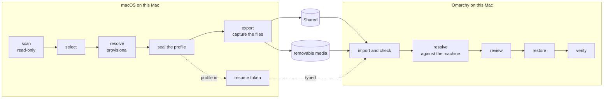

# Migration

**Status: designed for M14 (scanner, profile, bundle) and M15 (import); not
implemented.** Resolution is in docs/RESOLVER.md, restoring on Linux in
docs/RESTORE.md, the AI tools in docs/AI-TOOLS.md, the screens in docs/UX.md.

The source of a migration is **this Mac's own macOS**: the M1 after a Time
Machine restore from the everyday Mac, brought up to date, before Linux is
installed. The tool reads it, the person chooses what should come to Linux,
and the choices travel as a Migration Profile and a bundle to Omarchy on the
same Mac.



## Words

| Word | Meaning |
| --- | --- |
| **item** | one thing the scan found: a package, an app, a runtime, an editor extension, a configuration file or folder, a piece of an AI tool, a shell alias |
| **software id** | the registry's name for one piece of software however it was installed (`sw:node` for Homebrew's `node` and nvm's node alike) |
| **Migration Profile** | the sealed record of what was found, what was chosen, how each choice resolves, what depends on what, which paths change, and how sensitive each item is. It never holds file contents or secrets |
| **bundle** | the profile plus the captured files, content-addressed, on Shared or removable media |
| **adapter** | the code that knows one source: Homebrew, npm, a terminal, an AI tool. Adapters scan, classify, transform and restore; nothing else knows a format |

## The scanner

`scan` (read-only) prints what it found; `profile` scans, then leads
through selection, resolution and sealing in the frontend. Its session
reaches only the profile and resolve actions; the one among them that
downloads, the availability check, is an act action (docs/RESOLVER.md).

### What the scanner is allowed to do

- **Read, through the seam.** Every read is `sys_cmd`, `sys_path` or the new
  `sys_walk DIR` (a `find -P` listing of type, size, mode and link text,
  never following a link), so every adapter runs over fixtures. New probes
  join the allowlist in `tests/test-safety.sh`, each with its reason.
- **Read files, not run tools.** Package managers are read from their own
  records on disk. The tools themselves are not run, because their listing
  commands have side effects: `brew bundle dump` is one of Homebrew's
  auto-update commands and runs eight other programs, every Ruby `brew`
  command may fetch and write its API cache, `cargo install --list` creates
  `.crates.toml` and `.crates2.json` when they are missing, `uv tool list`
  writes a lock and a cache, and `npm ls -g` checks the registry for updates
  (docs/UPSTREAM.md → *Package inventories on macOS*).
- **Never execute configuration.** It does not start an MCP server, run a
  hook, source a shell file, load a plugin, or call a tool whose listing
  starts servers (`claude mcp list` starts every stdio server it lists).
- **Stay out of protected places.** It does not walk Desktop, Documents,
  Downloads, iCloud Drive, Mail, Messages, Safari, or other apps'
  containers. On macOS 27 a container read is denied without a prompt, so an
  empty result there would look like "nothing"; the scanner never draws that
  conclusion. A folder the person names explicitly is read, and macOS may ask
  Terminal for permission; a denial is reported as denied.
- **No network, no writes.** The scan fetches nothing and caches nothing;
  `scan` writes nothing at all, and `profile` writes only its own records
  and, if the person runs the availability check, that check's downloads.
- **Bounded.** Each adapter has a time and entry budget; one that runs out
  reports `partial` with what it saw, never a silently short list.

### Adapters

| Adapter | Reads | Emits |
| --- | --- | --- |
| `brew` | the prefixes `/opt/homebrew` and `/usr/local` (a Mac whose data came from an Intel Mac can have both), recognised by their `Cellar` and `Caskroom` folders, never by running `brew`: `Cellar/*/*/INSTALL_RECEIPT.json` (`installed_on_request`, `runtime_dependencies`, `source.tap`), `Caskroom/*/.metadata/INSTALL_RECEIPT.json` (`uninstall_artifacts` app names), `Library/Taps/*/*` and each tap's `.git/config` remote, service plists under `~/Library/LaunchAgents/homebrew.mxcl.*` | formulae, casks, taps, services |
| `npm` | `lib/node_modules/[@scope/]*/package.json` under every Node prefix found: Homebrew, nvm, fnm, Volta (`~/.volta/tools/user/packages`), mise installs | global packages |
| `pnpm`, `bun` | pnpm's global `package.json`, `~/.bun/install/global/package.json` | global packages |
| `cargo` | `$CARGO_HOME/.crates.toml` or `.crates2.json`, and cargo-binstall's `binstall/crates-v1.json` | crates and their binaries |
| `uv`, `pipx` | each tool's `uv-receipt.toml` (version from its `dist-info`), `pipx_metadata.json` | Python tools |
| `go` | binaries in `GOBIN`, `GOPATH/bin` or `~/go/bin`; the module path and version from the build information Go embeds in every binary (its `path` and `mod` lines, found by a byte search of the file), never by running Go | Go tools |
| `mise`, `asdf` | `~/.config/mise/config.toml` `[tools]` (a strict subset of TOML: `name = "v"`, `name = ["v", "v"]`), `~/.tool-versions` | runtimes and versioned tools |
| `apps` | `/Applications/*.app`, `~/Applications/*.app`: `Info.plist` (`CFBundleIdentifier`, `CFBundleShortVersionString`, `CFBundleName`), `Contents/_MASReceipt` | applications |
| `editors` | VS Code, VSCodium and Cursor: `extensions/extensions.json`, `User/settings.json`, `keybindings.json`, snippets; Neovim `~/.config/nvim` | extensions, editor configuration |
| `shell` | the login shell (`dscl` read of `UserShell`), `~/.zshrc`, `~/.zprofile`, `~/.zshenv`, `~/.bashrc`, `~/.bash_profile`; Oh My Zsh and plugin-manager folders by presence only; history files by size only | aliases, functions, exports, shell tools (below) |
| `terminal` | Ghostty, Kitty, WezTerm, Alacritty and iTerm2 presence; `~/.config/{ghostty,kitty,wezterm,alacritty}`; `~/.tmux.conf` or `~/.config/tmux`; `~/.config/starship.toml`; fzf, zoxide, atuin, eza, bat and direnv configuration | terminal and prompt configuration |
| `ai` | Claude Code, Codex, OpenCode and later providers (docs/AI-TOOLS.md) | settings, instructions, MCP servers, skills, agents, commands, plugins, hooks, sessions |
| `git` | `~/.gitconfig`, `~/.config/git/config`, the global ignore file; `~/.config/gh/config.yml` (preferences) and the presence of `hosts.yml` | Git settings, GitHub CLI preferences |
| `ssh` | `~/.ssh/config`, `known_hosts`, public keys, and each private key's header (to tell an encrypted key from an unencrypted one; the key material is never read past the header) | SSH configuration and keys |
| `dotfolders` | every entry directly under `~` and `~/.config` whose name begins with a dot or sits in `.config`, by name, size and type only, until the person opens it | candidates for the picker |
| `projects` | only folders the person names: Git checkouts beneath them (remote URL, branch, whether there is unpushed work) | projects to clone on Linux, never to copy |

Dependencies installed only for another package (`installed_on_request`
false in a receipt) are recorded as dependencies and never offered on their
own. A receipt without that field counts as requested, as `brew bundle`
counts it, and is marked so. Homebrew's receipts are internal files, not a
promised interface; every field is optional to the adapter, and a receipt
that cannot be read is reported rather than guessed.

### One piece of software, several sources

Each adapter maps what it finds to a software id through the registry
(docs/RESOLVER.md): Homebrew's `node`, nvm's node 22 and a mise `node = "22"`
become one item, `sw:node`, with three sources. A cask and the app it
installed are one item (the cask's `app` artifact names the bundle). Codex
found as a Homebrew cask and as an npm global is one item. Something the
registry does not know is keyed by its adapter and name, never merged by a
guess; when two unknown items share a name across sources, the review shows
them side by side and the person says whether they are the same.

### Records from another Mac

A Time Machine restore brings this tool's own state directory from the
everyday Mac with everything else. The baseline already refuses that Mac's
Shared plan record (it describes another disk). A profile carries a host
id — the first 16 hex digits of SHA-256 over a fixed label and the hardware
UUID `system_profiler` already reports, never the UUID itself — and a
profile whose host id is not this Mac's is **stale**: shown as history, never
used. The first run on the restored Mac says so in plain words: records made
on another Mac were found and are shown as history.

## Items

Every item has an id, `adapter:kind:name` (the name percent-encoded like any
value), and these fields in the profile:

| Field | Meaning |
| --- | --- |
| `kind` | `package`, `app`, `runtime`, `extension`, `service`, `config`, `agent`, `shell`, `project` |
| `name`, `version` | as the source records them; versions are opaque strings except where an adapter parses them |
| `requested` | `1`, `0` (installed only as a dependency) or `unknown` |
| `sw` | the software id, or empty |
| `class` | the sensitivity class (below) |
| `path` | for files and folders: the path relative to the source home, or absolute outside it |
| `size` | bytes, for files and folders |
| `detail` | adapter-specific, typed by the adapter's schema |

## Sensitivity

Every item that carries content has exactly one class. Classes only ever
move towards more sensitive through evidence; the person can lower
`PRIVATE_CONFIG` to `PUBLIC_CONFIG` and nothing else.

| Class | Means | Travels | Examples |
| --- | --- | --- | --- |
| `PUBLIC_CONFIG` | settings with nothing personal in them | when selected | `starship.toml`, tmux configuration, agent skills, editor settings |
| `PRIVATE_CONFIG` | personal but not secret | when selected; kept out of debug reports; marked personal in review | `.gitconfig` with a name and e-mail, MCP definitions naming internal hosts, SSH `config` |
| `SENSITIVE` | private history or content | only when opted in, item by item | shell history, agent sessions and transcripts, `known_hosts` |
| `SECRET` | grants access | never, in the normal flow (below) | SSH private keys, API keys, OAuth tokens, `auth.json`, `hosts.yml`, `.env` files, credential stores, `.netrc`, cloud credentials |
| `MACHINE_SPECIFIC` | only means something on this Mac | never | macOS binaries, `launchd` plists, `~/Library/Preferences`, caches, sockets |

Classification comes from, in order: the registry's path rules (for
example `~/.ssh/id_*` without `.pub`, `~/.aws/credentials`,
`~/.config/gh/hosts.yml`, `*.pem`, `.env*`), the adapter's knowledge of its
format, and a content check of every captured text file up to 1 MiB for
secret shapes: private-key headers, and token prefixes and forms such as
`sk-ant-`, `sk-`, `ghp_`, `gho_`, `github_pat_`, `xox?-`, `AKIA` followed by
sixteen capitals, `AIza`, JWT-shaped strings, and `password`/`token`/`key`
assignments with long values. A file whose first bytes are a Mach-O magic
number is `MACHINE_SPECIFIC`. A hit moves the item to `SECRET` and it stays
out; the review names the file and the kind of match, never the value.

**The one opt-in for a secret.** An OpenSSH private key whose header shows
it is encrypted with a passphrase (`openssh-key-v1` with a cipher other than
`none`) may travel if the person types `carry` for that key. The file is
useless without the passphrase, which never touches this tool. An
unencrypted key is refused, with the two ways forward: add a passphrase with
`ssh-keygen -p`, or make a new key on Linux (the developer setup already
does). Nothing else that is `SECRET` travels; tokens and sign-ins are
redone on Linux, once each (docs/AI-TOOLS.md, docs/RESTORE.md).

## Selection

Selection happens in the frontend (docs/UX.md: environment scan, selection,
inventory, dotfolders, AI environment, secrets). Defaults:

- **Requested software** whose provisional resolution is exact, provided by
  Omarchy, a native equivalent, a runtime or an ecosystem tool: included.
- **Dependencies:** not offered; they follow what needs them.
- **macOS-only and unsupported:** shown, excluded, with the reason.
- **Alternatives and unresolved:** held for a decision; nothing is included
  on a guess.
- **Known portable configuration** (the adapters' own list): included.
- **Anything in the dotfolder picker:** excluded until picked.
- **`SENSITIVE`:** excluded until opted in. **`SECRET`,
  `MACHINE_SPECIFIC`:** never, apart from the one opt-in above.

Every choice the person makes is a `select` record with `by=person`; a
default is `by=default`, so the review can show exactly which choices were
made and which were assumed.

## The dotfolder picker

For the folders nobody listed in advance (`~/.claude`, `~/.codex`,
`~/.config/opencode`, `~/.config/gh`, `~/.config/nvim`, `~/.tmux.conf`, a
personal `~/.foo`):

- **Discovery** lists entries directly under `~` whose names begin with a
  dot and everything under `~/.config`, with size and type, without reading
  inside them. Known ones carry the adapter's name; the rest say "unknown".
- **Opening** a folder walks it (`sys_walk`, no links followed) and
  classifies every file; the folder shows its worst class as its badge.
- **Badges:** portable, personal, sensitive, secret (excluded), Mac-only
  (excluded), links out, too large. A folder containing secret files can
  still be selected; its secret files stay behind and are listed.
- **Preview** shows a file's first lines, with any source-specific path
  underlined (docs/RESOLVER.md → *Paths*) and secret-shaped values masked.
- **Symlinks** are shown with their target and whether the target stays
  inside the selected folder.
- **Conflicts** are not decided here: whether `~/.config/nvim` already exists
  on Linux is known only on Linux, and is decided at restore
  (docs/RESTORE.md).
- **Ownership and modes** are recorded; they are applied on Linux under the
  rules in docs/RESTORE.md, never copied blindly.
- **Never** the home folder itself, `~/Library` as a whole, or a folder that
  is another adapter's (the picker hands those to their adapter, so
  `~/.claude` gets the AI adapter's per-component treatment rather than a
  blind copy).

## The Migration Profile

A Migration Profile is an `omb-profile 1` record file (docs/PROTOCOL.md) in
the macOS state directory. While it is being made it is
`profile-draft.omb`; when every choice is settled it is written as
`profile.omb`, the **finished profile**, whose seal is its identity. Both
are sealed on every write, like every stored record, so a torn write is
caught; only the finished profile has an id, travels in a bundle, or is named
by the token. It is data about choices, never file contents.

```text
omb-profile 1
source	os=macos	os_version=26.1	model=MacBookPro18,2	chip=Apple%20M1%20Pro	host=8c41d7e2a95b0f36	user=alex	home=/Users/alex	shell=/bin/zsh	scanned=2026-10-02T14:03:11Z	tool=0.3.0	commit=9b1e0c2a4d7f
journey	plan=
target	os=omarchy	arch=aarch64	shell=bash	user=alex	home=/home/alex
registry	version=1	digest=5e0d8c1f
scan	adapter=brew	state=done	items=84
scan	adapter=apps	state=partial	items=41	note=2%20bundles%20unreadable
item	id=brew:formula:ripgrep	kind=package	name=ripgrep	version=15.2.0	requested=1	sw=sw:ripgrep	class=	path=	size=	detail=
select	id=brew:formula:ripgrep	choice=include	by=default
resolve	id=brew:formula:ripgrep	disposition=EXACT	method=pacman	target=ripgrep	cap=	keep=none	rule=r:ripgrep	by=registry	state=planned
item	id=ai:claude-mcp:user:github	kind=agent	name=github	version=	requested=1	sw=	class=PRIVATE_CONFIG	path=	size=	detail=transport%3Dstdio
dep	id=ai:claude-mcp:user:github	needs=sw:node	why=command%20npx
rewrite	id=ai:claude-mcp:user:github	where=command	from=/opt/homebrew/bin/npx	to=npx	rule=p:brew-bin	state=auto
seal	sha256=…
```

| Record | Holds |
| --- | --- |
| `source` | macOS version, model, chip, host id, user, home, login shell, scan time, the tool's version and commit |
| `journey` | the plan id if a plan already existed when it was sealed, for display only (the profile comes before the plan in the journey and is bound to this Mac, not to a plan) |
| `target` | Omarchy, aarch64, Bash, the planned Linux user and home |
| `registry` | the registry version and digest the resolution used |
| `scan` | each adapter's outcome: `done`, `partial`, `skipped`, `denied`, with a note |
| `item` | every item found |
| `select` | every choice, with who made it |
| `resolve` | the provisional resolution (docs/RESOLVER.md) |
| `dep` | one edge of the dependency graph |
| `rewrite` | one path change, with its rule and whether it is automatic, awaiting review, approved or declined |
| `decision` | the person's answer to a question the resolver could not settle |
| `seal` | the digest; its first 16 hex digits are the profile id, the first 8 go in the resume token as `prof=` |

The profile is **input, never authority**: on Linux every resolution is
checked again against the machine (docs/RESOLVER.md), and nothing in the
profile is a command. It names software, files and choices; what to run is
decided by the registry and the adapters on the target.

### Profile states

Derived on every run from the two files and this Mac:

| State | Means |
| --- | --- |
| `not-scanned` | neither file |
| `scanned` | a draft with an inventory, no choices yet |
| `selected` | a draft with choices, not finished |
| `sealed` | a finished profile whose seal verifies, made on this Mac |
| `stale` | a finished profile made on another Mac (host id), or by a tool whose profile schema this version reads only for display; shown as history, re-scan to go on |
| `invalid` | either file's seal does not verify or a record does not parse; never used |

Finishing needs every included item `resolved` or `unsupported` (an
unsupported item stays in the profile, reported, and is not installed);
items the person excluded are not included. A held decision blocks
finishing and says which.

### Choices in a file

Without the frontend, `profile --select FILE` reads the choices from an
`omb-select 1` record file: `select id=… choice=include|exclude`,
`decision id=… answer=…` and `optin id=…` (for a `SENSITIVE` item) records,
each checked against the draft's items exactly as the frontend's requests
are; an unknown id refuses the whole file. `profile show --select` prints
the current choices in the same format, so a person can edit and return
them. The typed words the choices need (`carry` for an encrypted key) are
then asked for as in any text flow.

## The bundle

`export [DIR]` (act, macOS) captures the selected files and writes a bundle
to Shared, once Shared exists and the baseline has verified it (the mount
point diskutil reports for Shared's GUID), or to a directory the person
names. It can be run again at any time; each run is a new bundle, so files
changed since the last export travel fresh.

```text
omarchy-mac-bootstrap/bundles/<profile-id>-<utc>/
  README.txt      what this is, that it holds no secrets by design, how to remove it
  profile.omb     the sealed profile
  manifest.omb    one record per file, folder and link, sealed
  objects/<sha256>  file contents, one per distinct content
```

```text
omb-manifest 1
bundle	profile=3f09c2a1b7d45e60	created=2026-10-09T18:20:00Z	tool=0.3.0	commit=9b1e0c2a4d7f	objects=412	bytes=18203311
entry	item=path:config:starship	dest=.config/starship.toml	type=file	mode=0644	size=2211	sha256=…	link=
entry	item=path:config:nvim	dest=.config/nvim/lua	type=link	mode=	size=	sha256=	link=../nvim-shared/lua
skipped	item=path:config:nvim	path=.config/nvim/.git	reason=git-checkout
seal	sha256=…
```

- **Content-addressed, never an archive.** A file's bytes are stored under
  the lowercase hex of their SHA-256; where they go on Linux is only ever
  the manifest's `dest`. There is no archive to extract, so no archive
  member name can place a file anywhere: traversal and link tricks in the
  storage itself are impossible by construction. Object names are
  case-insensitive-safe for exFAT.
- **`dest`** is relative to the target home: components separated by `/`,
  none empty, `.` or `..`, no control character, at most 255 bytes each,
  1024 in all, 32 deep. It must lie under the item's own relative root, so
  an entry of the Starship item cannot name `.bashrc`.
- **Links** are recorded as relative link text that, resolved from the
  link's directory, stays inside the item's root. An absolute link inside
  the root is rewritten to the relative form; a link that leaves the root,
  or points into `/opt/homebrew`, `/Applications` or another volume, is
  not carried and is listed as skipped with its target.
- **Special files** (sockets, pipes, devices) are skipped and listed.
  **Hard links** are captured as separate files (content addressing stores
  the bytes once).
- **Modes** are recorded as they are, and applied on Linux under the rules
  in docs/RESTORE.md (no setuid, setgid or sticky bit; nothing group- or
  world-writable; private classes 0600/0700).
- **Left behind by default:** `.DS_Store`, `._*`, `.git` (reported with its
  remote, to clone instead), `node_modules`, `__pycache__`, `.venv`,
  caches, logs, and each adapter's own list (docs/AI-TOOLS.md). A file over
  64 MiB is listed, not carried; the export shows the bundle's size before
  it writes.
- **Written whole or not at all.** Objects and manifest go to
  `<name>.partial-<random>` and the directory is renamed into place when
  everything is written and sealed. A partial directory is never read and is
  removed by the next export, only if it carries this tool's README.
- **exFAT.** Shared cannot hold modes or links, which is why both live in
  the manifest. macOS writes `._name` files and `.DS_Store` on exFAT; the
  importer reads only the names the manifest lists and ignores everything
  else in the bundle, counting it.

The same bundle made on another Mac (the everyday Mac, say) is a
**portable export**: it works the same way, and is imported as foreign
(below).

## Moving between the systems

The two systems run on the same Mac and never at the same time: nothing can
be sent from one to the other over a network while both are up. Linux never
gets writable APFS access (a baseline non-goal), and reads none either. What
crosses, crosses on something both can read.

| What | Before Shared exists | After Shared exists |
| --- | --- | --- |
| install answers, plan id, profile id | the resume token, typed (`prof=` is new) | — |
| this tool and its frontend | fetched on Linux from GitHub at the commit the Phase 1 guide pinned (its command also writes that commit to `.omb-commit`), the frontend by its lock (docs/FRONTEND.md) | the same |
| rescue context | generated on Linux from the repository and the machine (docs/RESCUE.md) | the same |
| profile and files | not needed yet; optionally removable media | a bundle on Shared |
| qualification | — | Shared (docs/QUALIFICATION.md) |

- **Before Shared,** nothing from macOS is needed on Linux: Omarchy's install
  takes the token's answers, and the rescue tools need no macOS data. The
  profile's id rides in the token only so that Linux later recognises the
  right bundle.
- **After Shared,** macOS exports in the same boot that creates Shared, right
  after the creation is recorded; Linux restores after `shared activate`.
- **Without Shared,** the bundle goes to removable media: a USB drive or an
  SD card (the 16-inch MacBook Pro has an SDXC slot), formatted exFAT or
  FAT32 on macOS. Linux reads it where it is mounted.
- **Why not the network or a Git remote:** the systems are never up
  together, a second computer is not part of the journey, and personal
  configuration pushed to a remote stays in its history. The person may
  still move a bundle any way they like; `restore DIR` reads it wherever it
  is.

## Import on Linux

`restore` (docs/RESTORE.md) finds bundles on verified Shared
(`omarchy-mac-bootstrap/bundles/`) or in the directory given, and for each:

1. reads `profile.omb` and `manifest.omb`, and refuses either if it does not
   parse or its seal does not verify;
2. checks that the manifest's `profile` is the profile's id;
3. compares the profile id with the token's `prof=`: the same, and it is
   **this journey's profile**; different, or no token, and it is shown with
   its source (model, host id, time) and used only after the person types
   `import`;
4. checks every object it will use against its digest just before use;
5. restores into the everyday user's home, whatever user the profile named
   (the planned user is shown if it differs).

A bundle from another Mac, including a portable export, is always foreign:
`import` is typed, and its host id and model are on the screen when it is.
