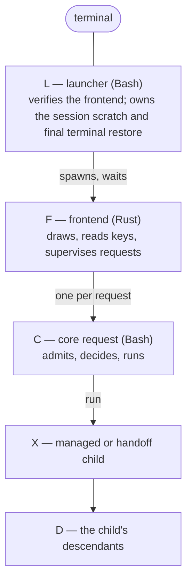

# Records and the core protocol

**Status: the implementation contract for M14 gate 1 (framing, admission,
processes) and gate 3 (actions and bases); not implemented.** Local
experiments that ground it are recorded in docs/UPSTREAM.md → *Experiments*.

Defined here once and used everywhere else: the **record format** every
file and message is written in, how bytes are **admitted** before anything
parses them, the **processes and descriptors** of a frontend session, and
the **actions** the core allows, each bound to what the person reviewed.

## 1. The record format

### Grammar

```text
document = header LF 1*( record LF ) [ seal LF ]
header   = name SP version                   "omb-profile 1"; name a-z and "-", at most 24
record   = type 1*( TAB field )              a record has at least one field
type     = a-z *( a-z / "-" )                at most 24 bytes
field    = key "=" value
key      = a-z *( a-z / 0-9 / "_" )          at most 32 bytes
value    = *( safe / "%" HEXU HEXU )         at most 4096 bytes as written
safe     = A-Z / a-z / 0-9 / "." / "_" / "~" / "/" / ":" / "@" / "+" / "," / "-"
HEXU     = 0-9 / A-F
seal     = "seal" TAB "sha256=" 64( 0-9 / a-f )
```

A document is bytes, and only these bytes: TAB (0x09), LF (0x0A) and
0x20–0x7E. Every other byte — NUL, CR, other controls, DEL, anything above
0x7E — is invalid wherever it appears.

### One canonical encoding per value

Every value has exactly one written form, so that equal meanings are equal
bytes (which the seals, bases and digests depend on):

- a byte in `safe` is written as itself, never escaped (`%41` is invalid);
- every other byte is written as `%` and two **upper-case** hex digits
  (`%2f` is invalid); `%00` is invalid;
- a record is its type, a TAB, and fields separated by exactly one TAB: no
  leading, trailing or doubled TAB; no blank line; the document ends with
  exactly one LF after its last line;
- **every non-list key the schema lists is present**, in the schema's
  order, once; a key the schema does not list, a record type it does not
  list, or a missing key makes the whole document invalid;
- an optional key (`?`) with no value is written `key=`, which means
  "none"; a key that is not optional never has an empty value;
- a **list** key (`*`, `+`) is the key repeated in order (`arg=-y	arg=pkg`),
  in its place in the schema's order; an empty list is the key absent; an
  element may be empty (`arg=`) only in a `bytes` or `text` list, where it
  is the empty string;
- record order and cardinality are the schema's (`1`, `?`, `*`, `+`); a
  duplicate of a record the schema says is unique (the same `id`, say) is
  invalid.

Schemas are written as `record: key:type key:type? key:type*` — `?` optional
(present, and empty for none), `*` a list, `+` a list of at least one — with
the record's cardinality in the document. Every stored and exchanged record family has
its schema table in the document that owns it; the protocol's own are in §4.

### Value types

| Type | Written form | Decoded meaning |
| --- | --- | --- |
| `uint` | `0` or `[1-9][0-9]{0,17}` | an integer below 10¹⁸, safe in Bash's 64-bit arithmetic |
| `bool` | `0` or `1` | — |
| `enum(a\|b)` | one listed word | — |
| `id` | `[a-z0-9][a-z0-9._:@+-]{0,127}` | an identifier; never contains `%` |
| `hex8`, `hex16`, `hex40`, `hex64` | exactly that many `[0-9a-f]` | display ids (8), short ids (16), Git commit ids (40), full SHA-256 digests (64) |
| `utc` | `YYYY-MM-DDTHH:MM:SSZ` | a time, shown, never compared across systems |
| `text` | percent-encoded | valid UTF-8 with no C0 or C1 control, no DEL, no ESC: safe to render |
| `bytes` | percent-encoded | any bytes except NUL: paths, file names, raw values. **Never rendered raw** |

**Display versus data.** `bytes` values (paths above all) are kept
byte-for-byte for every comparison, digest and file operation, and are shown
only through one display function that renders printable UTF-8 as itself
and every other byte as `\xNN`, then truncates. No value of any type is ever
written to the terminal unescaped: a terminal control sequence in a file
name, a log or an upstream message is data, never display.

### Sealed documents

A stored document ends with `seal`: the SHA-256 of every byte before the
seal line, computed with `shasum -a 256` (macOS) or `sha256sum` (Linux). A
seal detects **corruption** — a torn write, a truncated copy, a hand edit —
and nothing more: anyone who can write the file can recompute it. Approval
and origin are separate mechanisms wherever they matter
(docs/MIGRATION.md → *Integrity, approval, journey*). Protocol messages are
not sealed.

### Limits

| What | Limit |
| --- | --- |
| a record (one line, LF excluded) | 16 KiB |
| a value as written | 4 KiB |
| a protocol request | 64 KiB, 512 records |
| a protocol response (the event spool of one request) | 8 MiB, 65 536 records |
| a stored document | its schema's limit; at most 16 MiB (profile, manifest), 64 KiB (every other) |

## 2. Admission: bytes before parsing

Bash's `read` cannot be the first thing to see untrusted bytes: it silently
turns doubled, leading and trailing TABs into the canonical split and drops
or truncates at NUL (reproduced on `/bin/bash` 3.2.57 and Bash 5.3). So every
document the core reads — a request, a profile, a manifest, a journal step,
a qualification record, the lock, the registry — passes **admission** first,
using standard tools present on stock macOS and on the fresh Asahi image
(`head`, `wc`, `tr`, `tail`, `od`, `awk`; BSD `awk` on macOS, GNU `awk` in
Arch's `base`):

1. **Bounded copy.** A stream is copied with `head -c <limit+1>` into a
   private file in the per-run scratch directory; a stored file's size is
   read first (`wc -c`) and a file over its limit is refused unread. Nothing
   is ever read without a bound.
2. **Size.** More than the limit: refused (`too-large`).
3. **Byte class.** `LC_ALL=C tr -d '\011\012\040-\176' <file | wc -c` must be
   0: any NUL, CR, control, DEL or non-ASCII byte refuses the document before
   anything else looks at it.
4. **Termination.** The file is not empty and its last byte is LF (`tail -c
   1 | od -An -tx1`).
5. **Framing and canonical form.** One `LC_ALL=C awk` pass checks every
   line: length, no blank line, no leading, trailing or doubled TAB, type and
   key grammar, value grammar, upper-case escapes, no `%00`, no escaped safe
   byte, record count. Its input is now NUL-free ASCII, which both awks treat
   alike.
6. **Only then** Bash splits lines on TAB and fields at the first `=`, and
   validates each record against its schema (order, cardinality, types). At
   this point splitting can no longer normalise anything, because every
   input it would normalise was refused.

Each refusal carries one **reason code**, decided by the first check that
fails, in the order of the steps above; within step 5, lines are checked from
the first, and within a line in this order: `line` (too long), `blank`,
`tab`, `header` (the first line only), `key` (type or key grammar), `value`,
`nul-escape`, `non-canonical`, and `too-large` at the first record past the
document's record limit. Step 2 gives `too-large`, step 3 `byte`,
step 4 `eof`, step 6 `schema` or `type`, a seal check `seal`; a response
adds `after-result` (anything after the `result`) and `result` (none, or
two).

The frontend admits the core's responses with the same rules in Rust,
directly on bytes. The two implementations are held together by a
differential corpus (docs/TESTING.md → `proto-diff-*`): every case is
admitted or refused identically by both, with the same reason code.

## 3. Processes and descriptors

This section is the only description of the session's process model;
docs/FRONTEND.md refers to it.

### The processes



All of them share the shell job's process group: nobody calls `setpgid` or
`setsid` (a static check on F and C), so the terminal's signals reach them
together during a handoff. A descendant may make its own group (for
example `sudo` with `use_pty`); what that means for exclusion is in
*Operations and exclusion*.

### The session scratch

L creates a private directory, `mktemp -d "${TMPDIR:-/tmp}/omb-session.XXXXXX"`
(0700), writes `session.omb` (its own PID and start time) into it, and passes
its path as `OMB_SESSION_DIR`. For each request, F creates `req-<n>.events`
and `req-<n>.diag` there (exclusive create, 0600). C writes
`req-<n>.core` (its PID and start time) at start and removes it at exit.
L removes the directory when F has exited and no `req-*.core` names a live
process. The scratch is temporary, not persistent state: it holds nothing
secret and is never read by a later session except to remove it (below).

### Descriptors

| Descriptor | L | F | C | X, managed | X, handoff | D |
| --- | --- | --- | --- | --- | --- | --- |
| 0 | terminal | terminal | managed: `/dev/null`; handoff: terminal | `/dev/null` | terminal | as X |
| 1, 2 | terminal | terminal | managed: `req-<n>.diag`, append; handoff: terminal | the diag file | terminal | as X |
| 3 | — | the request pipe's write end, close-on-exec; closed as soon as the request is written | the request pipe's read end; read to EOF (bounded) and closed with `exec 3<&-` before anything else runs | never open | never open | never open |
| the event spool | — | a read-only handle on `req-<n>.events`, close-on-exec, in a reader thread | **no descriptor held**: each record is appended with `printf … >>"$OMB_EVENTS"`, which opens, writes and closes | never open | never open | never open |
| anything else | none | every descriptor Rust's standard library opens is close-on-exec; fd 3 is placed with `dup2` in the child just before `exec` | Bash's own script descriptor is close-on-exec | — | — | — |

There is no response pipe (no fd 4) and no child-status pipe: responses go
to the spool file, F learns that C has ended from `waitpid`, and C learns
the same of its children from `wait`.

Consequences, each tested (docs/TESTING.md → `sup-*`):

- no protocol descriptor exists in any child or descendant, so none can hold
  a pipe open, write into the protocol, or block on it;
- F opens descriptors and spawns only on its main thread (the reader thread
  only reads its already-open handle), so macOS, where the standard library
  sets close-on-exec on a new pipe in a second step, has no window in which
  another spawn could inherit it; C appends records only from its main
  shell, never inside a background job or a pipeline stage;
- the request pipe's EOF depends only on F closing its write end;
- the end of a response is **C's exit** (F waits for it) plus **exactly one
  `result` record as the last complete line of the spool**, never an EOF that
  a descendant could delay.

### A request's life

1. F creates the pipe, the spool and the diag file, then spawns C with the
   descriptors above and the environment of §4 → *Environment*.
2. C loads its libraries, copies fd 3 through admission step 1 (bounded) and
   closes it. An over-long request makes `head` stop reading; F's write then
   fails with EPIPE, which F treats as a refusal.
3. C appends `hello`, then its records, then one `result`, then exits.
4. F's reader thread follows the spool continuously — during a handoff too,
   because it never touches the terminal — and passes each complete, admitted
   line to the main thread through a bounded channel. When C has exited, the
   reader drains the rest and checks that the last line was a `result`.
5. F keeps the diag file's last 64 KiB for the session's log screen.

### Backpressure and bounds

- **C never waits on F.** Its output is a file, so however slowly F reads, C's
  writes complete; nothing on a mutation path depends on the frontend
  keeping up.
- C counts what it writes. Past 8 MiB less 64 KiB it writes no more
  `progress` or `message` records, one `overflow` record with the number
  suppressed, and then its `result`.
- F's channel holds 1 024 records; when it is full the reader thread waits,
  which slows only the reader. F keeps the latest `progress` per action and
  at most 500 `message` records per request.
- A spool larger than 8 MiB, a line over 16 KiB, or an unterminated last line
  when C has exited is a protocol error: the outcome is **unknown**.
- The diag file is not bounded by the core (a child writes it directly); it
  lives only in the session scratch and is removed with it. Diagnostics are
  never persisted and never enter a debug report or an agent's context
  (docs/RESCUE.md).

### The terminal result

Every response ends with exactly one `result`, after every other record.
Anything after it — a record, a partial line — is a protocol error. If C
exits without a `result`, or the spool fails admission, **the outcome is
unknown**: F shows "the core stopped without a complete answer", never
"failed" or "nothing happened", and asks for a fresh snapshot, which
re-derives the machine's state; for an act request, the scope's operation
record decides what must be reconciled (*Operations and exclusion*).

### When something dies

| Event | What happens |
| --- | --- |
| F dies (panic, kill) during a request | C continues to its end — its writes go to a file, so nothing fails — and exits. L sees F exit, then waits while any `req-*.core` names a live process (a handoff child may still own the terminal), then restores the terminal settings it saved, leaves the alternate screen, shows the cursor, and reports that the interface stopped and what to run to see the machine's state |
| C dies (crash, kill) | its children continue. F sees C exit without a `result`: outcome unknown. After a handoff request, F does not take the terminal back while any process other than L and F remains in its process group (it reads the process table directly — `/proc` on Linux, `libproc` on macOS — spawning nothing); then it re-enters and re-derives |
| L dies | F continues, restores its own terminal when it exits, and the session scratch is left behind; the next launcher removes a stale `omb-session.*` directory only when its `session.omb` names a dead launcher and no `req-*.core` in it names a live process |
| X dies | C sees the exit status, reads the machine afterwards, and reports what the machine shows (the baseline's rule) |
| EPIPE | only the request pipe exists: F writing an over-long request, or to a C that already exited, is a refusal. Rust ignores SIGPIPE by default and sees EPIPE as an error |
| F's reader thread dies | the main thread sees its channel close; when C exits, the outcome is unknown and the state is re-derived |
| a descendant outlives its parent | exclusion holds (next section) |
| a signal interrupts a read or wait | the call is retried; signals change behaviour only as the next table says |
| a descendant changes process group | it is outside the terminal's group signals; exclusion still finds it if it stays in the group, and the limit is stated below |

### Signals

| Signal | Idle, frontend drawing | During a handoff |
| --- | --- | --- |
| Ctrl-C | a key (raw mode): F quits when idle, clears a text field, or cancels a cancellable managed request | SIGINT to the process group: L and F **catch** it with a handler (never ignore it, so the child's disposition after `exec` is the default); C keeps the baseline's handling for a launched command; X and D act on it as their authors intended |
| Ctrl-Z | a key: F restores the terminal, stops the whole group (`kill(0, SIGTSTP)`), and on SIGCONT re-enters and re-derives; refused while a request runs | SIGTSTP to the group: everything stops and continues together |
| SIGTERM, SIGHUP to F | a flag: F cancels a cancellable request, waits for a non-cancellable one to end, restores the terminal and exits | the same, after the child ends |
| SIGQUIT | caught by L and F like SIGINT | as SIGINT |

L, F and C never set any of these to "ignore", never block them across a
`spawn`, and start every child with the default signal mask (a static
check, and PTY tests of the actual dispositions).

### Operations and exclusion

The baseline's run lock stays exactly as it is: one recording run at a time,
cleared when its owner process is gone. It is not enough on its own when a
mutating child can outlive the core that started it, so every **act**
action that changes the machine also keeps an **operation record**:

- `ops/<scope>.omb` in the state directory, written with the baseline's
  checked writer **before** the effect (a record that cannot be written stops
  the action, as `state_must_set` does): the action, its full basis digest,
  the session, C's PID and start time, the process group, the start time.
- It is removed only after the action's own result is recorded where its
  scope keeps results (the Shared creation record, the restore journal, the
  install classification, the qualification step).
- **A record that is still there is unresolved**, whatever became of the
  process that wrote it. A new act action in that scope first reconciles:
  while any live process that started after the record's start time remains
  in its process group, the action is refused as busy, naming those
  processes; when none remain, the scope's own reconciliation runs (the
  baseline's creation-record check, the journal's, a fresh classification),
  and only then is the record removed.
- A process that leaves the group (`setsid`, a daemon) cannot be found this
  way. This is **not a disk lock** and never was: the scope's own
  postconditions and records remain the authority for what happened, as the
  baseline's creation record is for Shared.

### The Shared critical interval

Between the accepted final topology validation and `sudo -n diskutil
addPartition`, nothing is added: no event record, no prompt, no progress
write, no wait on the frontend, no other I/O than the baseline already
performs. C emits its last record before the final read begins and its next
record after `addPartition` returns. The operation record is written before
the final read, not inside the interval. This is checked statically (the
code between the two points is the baseline's own, unchanged) and in the
fixture tests (`sup-shared-critical`).

## 4. Requests, responses and operations

### Environment

L sets, F passes unchanged, and C requires: `OMB_HOME`,
`OMB_SESSION_INTENT` (`read`, `plan`, `act`), `OMB_SESSION_SCOPES` (the
scopes below, comma-separated), `OMB_DRY_RUN` (`0` or `1`),
`OMB_SESSION_DIR`, `OMB_EVENTS` (set by F per request, inside the session
directory), colour and ASCII preferences, `OMB_STATE_DIR` if set, and the test
seams. C refuses every operation (`result status=error code=environment`)
when any of the first five is missing, malformed, or (for `OMB_EVENTS`) not
a plain file inside `OMB_SESSION_DIR`. The session variables are protected by
the frontend's pinned digest and by a static check that its source never
sets them; they are not a boundary against a program running as the person.

### Scopes

`journey`, `disk`, `plan`, `profile`, `resolve`, `asahi`, `network`,
`omarchy`, `shared`, `export`, `restore`, `rescue`, `qualify`, `debug`.
Each action belongs to exactly one. A session's scopes come from the command
that started it (SPEC.md → *Commands*).

### Operations

| Operation | Intent | Answers |
| --- | --- | --- |
| `hello` | read | negotiation only |
| `snapshot` | read | the stages, facts, warnings, blockers and actions available now for one scope, with a `generation` |
| `detail` | read | one page of large content (inventory rows, profile items, resolution rows, a diff, a downloaded script for inspection), with the `generation` it came from |
| `validate` | read | an action's parameters normalised, or one error per field; the planner's sizes come back as the full plan computed by `lib/storage.sh` |
| `execute` | the action's | one available action, with its progress |

Cancellation is a signal, not a request: for an action declared
cancellable, F sends SIGTERM to C, which finishes the unit in hand and
reports `status=cancelled` with what completed. A read request may be
cancelled at any time; a managed act is cancelled only at its declared safe
boundaries; a handoff child is never signalled by F.

### Protocol schemas

Request (`omb-req 1`): `req` 1, then the operation's records.

| Record | Cardinality | Schema |
| --- | --- | --- |
| `req` | 1 | `op:enum(hello\|snapshot\|detail\|validate\|execute) proto:uint frontend:id session:hex16` |
| `scope` | ? | `name:enum(<scopes>)` — snapshot |
| `page` | ? | `kind:id generation:hex64 offset:uint limit:uint` — detail; `limit` at most 500 |
| `exec` | ? | `action:id basis:hex64 confirm:id?` — execute |
| `arg` | * | `name:id value:bytes` — validate and execute; names as the action's `param` records declare, each at most once |

Response (`omb-res 1`): `hello` 1, then any of the others, then `result` 1
last.

| Record | Schema |
| --- | --- |
| `hello` | `core:id commit:hex40? source:hex64 proto:uint platform:enum(macos\|linux) arch:enum(arm64\|aarch64) user:enum(root\|user) ceiling:enum(read\|plan\|act) dry_run:bool fixture:bool` |
| `stage` | `name:enum(<stages>) state:enum(done\|current\|todo\|skipped\|blocked) basis:enum(machine\|recorded) by:enum(macos\|linux)? at:utc? detail:text?` |
| `fact` | `scope:enum(<scopes>) key:id label:text value:text state:enum(ok\|info\|warn\|fail\|unknown)` |
| `region` | `start:uint size:uint role:enum(apple\|macos\|stub\|efi\|linux\|shared\|free\|other) label:text?` |
| `answer` | `n:uint prompt:text value:text bytes:uint?` |
| `guide` | `id:id step:uint text:text` |
| `code` | `kind:enum(token\|ombdone\|ombshare\|ombbundle) value:id` |
| `warning`, `blocker` | `id:id text:text fix:text?` |
| `action` | `id:id scope:enum(<scopes>) label:text intent:enum(read\|plan\|act) gate:id? terminal:enum(managed\|handoff) cancel:bool basis:hex64 explain:text?` |
| `param` | `action:id name:id type:enum(uint\|bool\|id\|bytes\|text\|choice) required:bool choice:id*` |
| `row` | `kind:id key:bytes col:text*` — a detail page's rows; `generation` names their set |
| `generation` | `id:hex64 total:uint` |
| `progress` | `action:id done:uint total:uint unit:id? label:text?` |
| `message` | `level:enum(info\|ok\|warn\|fail) text:text` |
| `overflow` | `suppressed:uint` |
| `result` | `status:enum(done\|refused\|failed\|cancelled\|stopped\|error) code:id text:text? next:text?` |

Subsystem rows (`item`, `resolution`, `conflict`, `health`, `step`) are
delivered as `row` records whose `kind` and columns are defined with their
subsystems.

## 5. Actions, bases and execution

### The core says what is legal

The frontend shows only actions the core listed, asks only for the
parameters they declare, and sends back the `basis` it was shown. `gate` is
the typed word, or empty; `terminal` says whether the action needs the real
terminal; `cancel` whether cancelling is safe.

### The basis

An action's basis is the SHA-256 of a canonical `omb-basis 1` document the
core builds from everything the person reviewed and everything the action
depends on. Its full 64-digit digest is the internal identity; an 8-digit
prefix may be shown to people and is never compared. The core does not
trust a basis it is sent: it rebuilds the document from a fresh read and
compares.

The document, in the record format (§1), unsealed:

| Record | Cardinality | Schema |
| --- | --- | --- |
| `basis` | 1 | `action:id proto:uint actor_uid:uint home:bytes source:hex64` — `source` is the executed source's digest (docs/QUALIFICATION.md → *What ran: source and artifact identity*) |
| `input` | * | `name:id value:bytes` — every parameter the action declares, in the order of its `param` records, after normalisation |
| `seen` | * | `key:id state:enum(absent\|present\|file\|link\|dir\|value) value:bytes? sha256:hex64? mode:enum(0600\|0644\|0700\|0755)? link:bytes?` — one per key the family lists, in that order; an absence is `state=absent`, never a missing record |
| `version` | * | `key:id value:bytes` — the family's rule and schema versions, in the order listed |

Per family, the keys:

| Family | `input` | `seen` (machine, then destination) | `version` |
| --- | --- | --- | --- |
| `plan.save` | the Shared and Linux sizes, each choice, the installer answers | `geometry` (the SHA-256 of an `omb-geometry 1` document: one `part` record per partition in offset order, `guid offset size type content`, and one `container` record, `size free floor`), `plan_record` (absent, or its SHA-256) | `storage_contract`, `template` |
| `asahi.launch` | `script_url`, `script_sha256`, `answers` | `plan_record`, `geometry`, `asahi_state` (`none` or `resized-only`) | `installer` |
| `omarchy.start`, `omarchy.resume` | `user`, `host`, `keymap`, `encrypt`, `script_url`, `script_sha256`, `branch` | `arch`, `euid`, `route`, `marker`, `setup_conf`, `unit_state`, `script_flags` | `omarchy` |
| `shared.create` | `disk`, `start`, `size` | `part.<n>` for every partition in offset order (`guid:offset:size:type`), `internal_disk`, `plan_record`, `completion_code`, `power_class`, `region` (`start:size`), `creation_record` | — |
| `shared.activate` | `guid`, `name`, `size`, `fs`, `fstab_line` | `device` (`MAJ:MIN` and path), `fstab`, `fstab_shared` (absent, or the line), `mountpoint` (absent, or a `dir` that is empty and root-owned) | — |
| `profile.finish` | `draft` (the draft's SHA-256) | `host`, `profile` (absent, or the one being replaced) | `registry.<n>` |
| `resolve.decide` | `item`, `option.<n>` (the rule ids offered), `choice` | — | `registry.<n>`, `draft` |
| `export.write` | `profile`, `selection` (its SHA-256), `destination` | `destination` (Shared's GUID and mount point, or the folder's device, inode and path), `bundle_folder` | — |
| `bundle.approve` | `code` | `location`, `manifest` (its SHA-256, recomputed), `origin` (host id, model, time) | `manifest_schema` |
| `restore.item` | `item`, `choice`, `object` (the new object's SHA-256 and mode, or the link text) | `dest` (absent, `file` with SHA-256 and mode, `link` with its text, `dir` with the SHA-256 of its tree listing) | `manifest`, `rule` |
| `install.node` | `method`, `target`, `version` | `target_check` (the check's answer: repository, name, version, architecture; or the lock URL), `installed` (absent, or the version found) | `registry` |
| `ai.transform` | `source` (the source definition's SHA-256), `output` (the SHA-256 of what was shown) | `existing` (absent, or the SHA-256 of the tool's definition of that name) | `adapter` |
| `rescue.agent` | `tool`, `installer_sha256` | `euid`, `installed` | — |
| `rescue.ssh` | `key.<n>` (fingerprints), `mode` (`harden` or `open`) | `euid`, `sshd_installed`, `sshd_active`, `sshd_enabled`, `policy.<context>` (the effective values of docs/RESCUE.md), `listeners`, `dropins` (the SHA-256 of the drop-in listing), `authorized_keys` | — |
| `rescue.remove` | `removal` (the SHA-256 of the list shown) | `rescue_record`, `sshd_active`, `dropins` | — |
| `qualify.step` | `step`, `round` | `shared` (GUID and mount identity), `active`, `step_files` (the SHA-256 of the round folder's listing) | `schema`, `frontend` |

**Thresholds are not bases.** Free space, free memory and similar amounts
change continuously; they are checked when the core decides what is
available (step 5 below), never compared as part of a basis, so a basis
changes only when something the person reviewed changes.

### Executing

In this order, stopping at the first refusal:

1. **Admit and validate** the request and each argument's syntax.
2. **The session allows it**: intent within the ceiling, scope among the
   session's scopes, both from the environment.
3. **Take exclusion**: the run lock, then reconcile or create the scope's
   operation record.
4. **Re-read** the action's machine and destination observations.
5. **Available now**: the action is among those the fresh read allows,
   thresholds included (free space, free memory).
6. **Rebuild the basis** from the fresh read and the arguments; it must equal
   the request's (`refused`, `code=changed` otherwise).
7. **The typed word** equals the action's gate word exactly.
8. **Run the baseline's flow** with every check it already makes: the
   re-read before the Asahi launch, `state_must_set` before an irreversible
   step, `sudo -v` before the final read and `sudo -n` after it, the creation
   record, the classification afterwards. The baseline's own final
   revalidation stays mandatory and independent of the basis.

A restore repeats steps 4 and 6 for each item immediately before placing
it. The protocol adds checks in front of the baseline's and removes none; no
schema has a field that could assert a state (`safe=1`, a plan, a partition
id), and an unknown field is an error.

### Snapshot generations

A `snapshot` or `detail` answer carries the `generation` of the whole data
set it describes. A `detail` request names the generation it is paging; if
the core's fresh generation differs, it refuses with `code=changed`, so rows
from two different inventories are never shown as one.

### Versions and exit statuses

- **Protocol**: an integer; the core answers `proto` or refuses
  (`code=protocol`). Changing an existing record's meaning is a new version.
- **Frontend**: the core refuses a `frontend=` version other than the one the
  release lock names (`code=frontend`), except in fixture mode with the
  development override.
- **Exit status**: 0 when a `result` was written; 2 for an inadmissible
  request; 3 for a version refusal. No `result` means unknown.

### Managed and handoff requests

A managed request never reads the terminal: stdin is `/dev/null`, and every
`sudo` on a managed path is `sudo -n` (static check). An action that may ask
for a password, a passphrase, or anything an upstream program asks is
`handoff`: F restores the terminal first, C refuses the action unless `[ -t 0
] && [ -t 1 ]`, prints its own few lines through the baseline's `ui_*`
helpers (ASCII on the Linux console), runs the program in the foreground as
the text flow does, and reads the machine afterwards. Its records still go to
the spool, which F follows throughout.

### Why this format

- **JSON** would need a parser the core does not have on the fresh Asahi
  image, and a JSON parser written in Bash would be a large new trusted
  surface; the admission pass above is a few standard tools over bytes.
- **Property lists** have no reader on Linux.
- **NUL-separated streams** cannot be viewed or diffed, and NUL is exactly the
  byte Bash handles worst.

JSON remains an input only where upstream writes it (Homebrew receipts,
`installer_data.json`, agent configuration), read on macOS with `plutil` as
the baseline reads plists, or on Omarchy with `jq` for the adapters that
need it (docs/AI-TOOLS.md).
