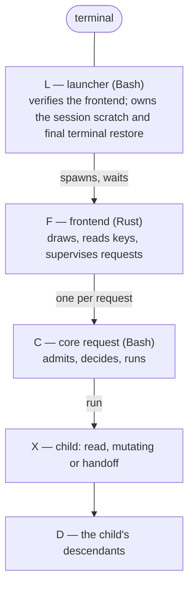

# Records and the core protocol

**Status: the implementation contract for M14 gate 1 (framing, admission,
processes, diagnostics) and gate 3 (actions and bases); not implemented.**
Local experiments that ground it are recorded in docs/UPSTREAM.md →
*Experiments*.

Defined here once and used everywhere else: the **record format** every
file and message is written in, how bytes are **admitted** before anything
parses them, the **processes and descriptors** of a frontend session, and
the **actions** the core allows, each bound to what the person reviewed.

## 1. The record format

### Grammar

```text
document = header LF 1*( record LF ) [ seal LF ]
header   = name SP version                   "omb-profile 1"; name a-z and "-", at most 24
record   = type 1*( TAB field )              a record has at least one field
type     = a-z *( a-z / "-" )                at most 24 bytes
field    = key "=" value
key      = a-z *( a-z / 0-9 / "_" )          at most 32 bytes
value    = *( safe / "%" HEXU HEXU )         at most 4096 bytes as written
safe     = A-Z / a-z / 0-9 / "." / "_" / "~" / "/" / ":" / "@" / "+" / "," / "-"
HEXU     = 0-9 / A-F
seal     = "seal" TAB "sha256=" 64( 0-9 / a-f )
```

A document is bytes, and only these bytes: TAB (0x09), LF (0x0A) and
0x20–0x7E. Every other byte — NUL, CR, other controls, DEL, anything above
0x7E — is invalid wherever it appears. **There are no comment lines**: a
document family that needs notes for people has a `note text:text` record
in its schema (the registry does, docs/RESOLVER.md → *The registry*), which
is admitted like any other record.

### One canonical encoding per value

Every value has exactly one written form, so that equal meanings are equal
bytes (which the seals, bases and digests depend on):

- a byte in `safe` is written as itself, never escaped (`%41` is invalid);
- every other byte is written as `%` and two **upper-case** hex digits
  (`%2f` is invalid); `%00` is invalid;
- a record is its type, a TAB, and fields separated by exactly one TAB: no
  leading, trailing or doubled TAB; no blank line; the document ends with
  exactly one LF after its last line;
- **every non-list key the schema lists is present**, in the schema's
  order, once; a key the schema does not list, a record type it does not
  list, or a missing key makes the whole document invalid;
- an optional key (`?`) with no value is written `key=`, which means
  "none"; a key that is not optional never has an empty value;
- a **list** key (`*`, `+`) is the key repeated in order (`arg=-y	arg=pkg`),
  in its place in the schema's order; an empty list is the key absent; an
  element may be empty (`arg=`) only in a `bytes` or `text` list, where it
  is the empty string;
- record order and cardinality are the schema's (`1`, `?`, `*`, `+`, `—`
  for forbidden); unless the schema states another order (the registry
  groups records by software), records of one type are consecutive, in the
  order the schema table lists the types; a duplicate of a record the
  schema says is unique (the same `id`, say) is invalid.

Schemas are written as `record: key:type key:type? key:type*` — `?` optional
(present, and empty for none), `*` a list, `+` a list of at least one — with
the record's cardinality in the document. Every stored and exchanged record
family has its schema table in the document that owns it; the protocol's
own are in §4.

### Value types

| Type | Written form | Decoded meaning |
| --- | --- | --- |
| `uint` | `0` or `[1-9][0-9]{0,17}` | an integer below 10¹⁸, safe in Bash's 64-bit arithmetic |
| `bool` | `0` or `1` | — |
| `enum(a\|b)` | one listed word | — |
| `id` | `[a-z0-9][a-z0-9._:@+-]{0,127}` | an identifier; never contains `%` |
| `hex8`, `hex16`, `hex40`, `hex64` | exactly that many `[0-9a-f]` | display ids (8), short ids (16), Git commit ids (40), full SHA-256 digests (64) |
| `utc` | `YYYY-MM-DDTHH:MM:SSZ` | a time, shown, never compared across systems |
| `text` | percent-encoded | valid UTF-8 with no C0 or C1 control, no DEL, no ESC: safe to render |
| `bytes` | percent-encoded | any bytes except NUL: paths, file names, raw values. **Never rendered raw** |
| `code` | percent-encoded | printable ASCII of at most 512 bytes that matches the grammar of its **kind** (below) |

**Codes.** A `code` value is always read together with its kind, from the
same record (`code kind=…`) or from the declaring `param`; the type never
widens `id`:

| Kind | Decoded grammar | Semantic check |
| --- | --- | --- |
| `token` | `omb2:` then `name=value` fields joined by `,`; names `[a-z]+`; values without `,` or `=` | the baseline's `token_decode`: every name on its whitelist (`enc user host kmap tz loc ssh gh linux shared dev plan`, and `prof`), each at most once, each value accepted by `cfg_field_ok` |
| `ombdone`, `ombshare` | `<kind>-` 8 hex `-` 12 hex `-` 4 hex, lower case | the baseline's `code_parse`: the last 4 digits are the first 4 hex digits of the SHA-256 of everything before the last `-` |
| `ombbundle` | `ombbundle-` 16 hex `-` 4 hex, lower case | the same check-digit rule (docs/MIGRATION.md → *The approval code*) |

A code the person types arrives as an `arg` of a `param` whose type is
`code`: the core normalises it as `code_parse` does (upper-case hex folded,
spaces removed) before the semantic check. A code the core writes is already
canonical.

**Display versus data.** `bytes` values (paths above all) are kept
byte-for-byte for every comparison, digest and file operation, and are shown
only through one display function that renders printable UTF-8 as itself
and every other byte as `\xNN`, then truncates. No value of any type is ever
written to the terminal unescaped: a terminal control sequence in a file
name, a log or an upstream message is data, never display.

### Sealed documents

A stored document ends with `seal`: the SHA-256 of every byte before the
seal line, computed with `shasum -a 256` (macOS) or `sha256sum` (Linux). A
seal detects **corruption** — a torn write, a truncated copy, a hand edit —
and nothing more: anyone who can write the file can recompute it. Approval
and origin are separate mechanisms wherever they matter
(docs/MIGRATION.md → *Integrity, approval, journey*). Protocol messages are
not sealed.

### Limits

| What | Limit |
| --- | --- |
| a record (one line, LF excluded) | 16 KiB |
| a value as written | 4 KiB |
| a protocol request | 64 KiB, 512 records |
| a protocol response (the event spool of one request) | 8 MiB, 65 536 records |
| a stored document | its schema's limit; at most 16 MiB (profile, manifest), 64 KiB (every other) |

## 2. Admission: bytes before parsing

Bash's `read` cannot be the first thing to see untrusted bytes: it silently
turns doubled, leading and trailing TABs into the canonical split and drops
or truncates at NUL (reproduced on `/bin/bash` 3.2.57 and Bash 5.3). So every
document the core reads — a request, a profile, a manifest, a journal step,
a qualification record, the lock, the registry — passes **admission** first,
using standard tools present on stock macOS and on the fresh Asahi image
(`head`, `wc`, `tr`, `tail`, `od`, `awk`; BSD `awk` on macOS, gawk in the
image and on Omarchy):

1. **Bounded copy.** A stream is copied with `head -c <limit+1>` into a
   private file in the per-run scratch directory; a stored file's size is
   read first (`wc -c`) and a file over its limit is refused unread. Nothing
   is ever read without a bound.
2. **Size.** More than the limit: refused (`too-large`).
3. **Byte class.** `LC_ALL=C tr -d '\011\012\040-\176' <file | wc -c` must be
   0: any NUL, CR, control, DEL or non-ASCII byte refuses the document before
   anything else looks at it.
4. **Termination.** The file is not empty and its last byte is LF (`tail -c
   1 | od -An -tx1`).
5. **Framing and canonical form.** One `LC_ALL=C awk` pass checks every
   line: length, no blank line, no leading, trailing or doubled TAB, type and
   key grammar, value grammar, upper-case escapes, no `%00`, no escaped safe
   byte, record count. Its input is now NUL-free ASCII, which both awks treat
   alike.
6. **Only then** Bash splits lines on TAB and fields at the first `=`, and
   validates each record against its schema (order, cardinality, types, and
   for a response, one `result` as the last record). At this point splitting
   can no longer normalise anything, because every input it would normalise
   was refused.

**Every tool's status counts.** Each step captures the exit status of every
stage of its pipeline in the first assignment after it (`PIPESTATUS`), and
any tool that fails refuses the document (`io`), so a failed read can never
look like an empty or valid document.

Each refusal carries one **reason code**, decided by the first check that
fails, in the order of the steps above; within step 5, lines are checked from
the first, and within a line in this order: `line` (too long), `blank`,
`tab`, `header` (the first line only), `key` (type or key grammar, including
a line with no TAB, such as a `#` line), `value`, `nul-escape`,
`non-canonical`, and `too-large` at the first record past the document's
record limit. Step 1 or any tool failure gives `io`, step 2 `too-large`,
step 3 `byte`, step 4 `eof`, step 6 `schema`, `type` (a value that breaks
its type or its code kind), `after-result` (a record after the `result`) or
`result` (none, or two); a seal check gives `seal`.

The frontend admits the core's responses with the same rules in Rust,
directly on bytes. The two implementations are held together by a
differential corpus (docs/TESTING.md → `proto-diff-*`): every case is
admitted or refused identically by both, with the same reason code.

## 3. Processes and descriptors

This section is the only description of the session's process model;
docs/FRONTEND.md refers to it.

### The processes



All of them share the shell job's process group: nobody calls `setpgid` or
`setsid` (a static check on F and C), so the terminal's signals reach them
together during a handoff. A descendant may make its own group (for
example `sudo` with `use_pty`); what that means for exclusion is in
*Operations and exclusion*.

**A process's identity** is its PID, its start time as `ps -o lstart=`
reports it (the baseline's `_proc_started`), and the machine's boot session
(`/proc/sys/kernel/random/boot_id` on Linux, `sysctl -n
kern.bootsessionuuid` on macOS). A recorded process is alive only if a
process with that PID exists now, with that start time, in that boot
session; a reused PID is never taken for the recorded process.

### The session scratch

L creates a private directory, `mktemp -d "${TMPDIR:-/tmp}/omb-session.XXXXXX"`
(0700), and passes its path as `OMB_SESSION_DIR`. In it, each written once
with exclusive creation (0600):

| File | Written by | Holds |
| --- | --- | --- |
| `launcher.omb` | L, first | L's identity |
| `frontend.omb` | L, right after spawning F | F's identity |
| `req-<n>.events` | F, before spawning C | the request's event spool |
| `req-<n>.diag` | C, when a read child's output is kept | retained diagnostics (*Diagnostics*) |
| `req-<n>.core` | C, at start; removed at exit | C's identity |

The scratch is **quiescent** only when the launcher, the frontend and every
core it names are no longer alive (identities as above), no live process's
arguments name the directory (L starts F as `omb-tui --session <dir>`, so
this covers the moment before `frontend.omb` exists; read with `ps -axo
pid=,args=`), and no unresolved operation record in the state directory
names this session. L removes its
own scratch when F has exited and the scratch is quiescent; if it is not
(a core still runs), L leaves it. A later launcher removes an old
`omb-session.*` directory only when it is quiescent — never merely because
its launcher is gone. The scratch is temporary, not persistent state, and is
never read by a later session except to decide whether to remove it.

### Descriptors

| Descriptor | L | F | C | X, read | X, mutating | X, handoff | D |
| --- | --- | --- | --- | --- | --- | --- | --- |
| 0 | terminal | terminal | managed: `/dev/null`; handoff: terminal | `/dev/null` | `/dev/null` | terminal | as X |
| 1, 2 | terminal | terminal | managed: `/dev/null` (in fixture mode, `req-<n>.core-err`, for tests); handoff: terminal | a pipe to C's drain (*Diagnostics*) | `/dev/null` | terminal | as X |
| 3 | — | the request pipe's write end, close-on-exec; closed as soon as the request is written | the request pipe's read end; read to EOF (bounded) and closed with `exec 3<&-` before anything else runs | never open | never open | never open | never open |
| the event spool | — | a read-only handle on `req-<n>.events`, close-on-exec, in a reader thread | **no descriptor held**: each record is appended with `printf … >>"$OMB_EVENTS"`, which opens, writes and closes | never open | never open | never open | never open |
| anything else | none | every descriptor Rust's standard library opens is close-on-exec; fd 3 is placed with `dup2` in the child just before `exec` | Bash's own script descriptor is close-on-exec | — | — | — | — |

There is no response pipe (no fd 4) and no child-status pipe: responses go
to the spool file, F learns that C has ended from `waitpid`, and C learns
the same of its children from `wait`. Everything C knows how to report
travels as a record; C writes nothing else.

Consequences, each tested (docs/TESTING.md → `sup-*`):

- no protocol descriptor exists in any child or descendant, so none can hold
  a pipe open, write into the protocol, or block on it;
- F opens descriptors and spawns only on its main thread (the reader thread
  only reads its already-open handle), so macOS, where the standard library
  sets close-on-exec on a new pipe in a second step, has no window in which
  another spawn could inherit it; C appends records only from its main
  shell, never inside a background job or a pipeline stage;
- the request pipe's EOF depends only on F closing its write end;
- the end of a response is **C's exit** (F waits for it) plus **exactly one
  `result` record as the last complete line of the spool**, never an EOF that
  a descendant could delay.

### A request's life

1. F creates the pipe and the spool, then spawns C with the descriptors
   above and the environment of §4 → *Environment*.
2. C writes `req-<n>.core`, loads its libraries, copies fd 3 through
   admission step 1 (bounded) and closes it. An over-long request makes
   `head` stop reading; F's write then fails with EPIPE, which F treats as a
   refusal.
3. C appends `hello`, then its records, then one `result`, removes
   `req-<n>.core`, and exits.
4. F's reader thread follows the spool continuously — during a handoff too,
   because it never touches the terminal — and passes each complete, admitted
   line to the main thread through a bounded channel. When C has exited, the
   reader drains the rest and checks that the last line was a `result`.
5. F shows `req-<n>.diag`, if any, on the session's log screen.

### Diagnostics, by child class

Every child C runs belongs to one class, fixed by the action table in the
core, never chosen at run time:

| Class | Which children | Output | Outcome judged by |
| --- | --- | --- | --- |
| **read** | every child of a read or plan request; children an act action declares read-only (target checks, digests, `--version` checks, live checks) | stdout and stderr through a pipe into `tail -c 65537`, which reads everything and keeps only the last 65 537 bytes in memory, writing them to a per-child file in the scratch when the child's output ends | its exit status, captured first from `PIPESTATUS`, and what the core read |
| **mutating** | every other child of an act action (installers, `git config`, the tools' own configuration commands, the qualification generator, `diskutil`) | stdout and stderr to `/dev/null`: no pipe, no file, nothing that can fill, block, or end the child | its exit status and the machine read afterwards (the postcondition); the command itself is shown so the person can run it by hand to see its output |
| **handoff** | children that need the terminal | the terminal, never captured | the machine read afterwards |

- **Bounds.** A read child's retained output is at most 65 537 bytes on disk,
  plus the pipe's buffer in memory. C appends it to `req-<n>.diag` after a
  header line naming the command, its exit status and whether earlier output
  was discarded (the 65 537th byte means it was), while that file is under
  256 KiB and the session's diagnostics are under 4 MiB (C sums
  `req-*.diag`); past either, C appends only the header, marked "not kept".
  Nothing grows without a bound, and nothing depends on F reading it.
- **Discarding.** `tail` keeps draining after its buffer is full, so a
  noisy read child never blocks and is never ended by its drain. If `tail`
  itself fails (killed, or the write at the end fails because the disk is
  full), the read child may receive SIGPIPE; a read can be repeated
  safely, and its outcome is judged as any failed read.
- **A capture failure changes no outcome.** Diagnostics that cannot be kept
  are shown as "not available"; they never turn a result into a failure,
  never authorise a retry, and never stand in for a postcondition.
- **Raw and temporary.** Diagnostics are raw output, potentially sensitive:
  they stay in the scratch, are shown only on the log screen, are removed
  with the scratch, and never enter a debug report or an agent's context
  (docs/RESCUE.md). The scratch is not a security boundary and removal is
  not secure erasure.

### Backpressure and bounds

- **C never waits on F.** Its output is a file, so however slowly F reads, C's
  writes complete; nothing on a mutation path depends on the frontend
  keeping up, and no mutating child has a pipe.
- C counts what it writes. Past 8 MiB less 64 KiB it writes no more
  `progress` or `message` records, one `overflow` record with the number
  suppressed, and then its `result`.
- F's channel holds 1 024 records; when it is full the reader thread waits,
  which slows only the reader. F keeps the latest `progress` per action and
  at most 500 `message` records per request.
- A spool larger than 8 MiB, a line over 16 KiB, or an unterminated last line
  when C has exited is a protocol error: the outcome is **unknown**.

### The terminal result

Every response ends with exactly one `result`, after every other record.
Anything after it — a record, a partial line — is a protocol error. If C
exits without a `result`, or the spool fails admission, **the outcome is
unknown**: F shows "the core stopped without a complete answer", never
"failed" or "nothing happened", and asks for a fresh snapshot, which
re-derives the machine's state; for an act request, the scope's operation
record decides what must be reconciled (*Operations and exclusion*).

### When something dies

| Event | What happens |
| --- | --- |
| F dies (panic, kill) during a request | C continues to its end — its writes go to a file, so nothing fails — and exits. L sees F exit, then waits while any `req-*.core` names a live core (a handoff child may still own the terminal), then restores the terminal settings it saved, leaves the alternate screen, shows the cursor, and reports that the interface stopped and what to run to see the machine's state |
| C dies (crash, kill) | its children continue. F sees C exit without a `result`: outcome unknown. For an act request, its operation becomes **unsupervised** (*Operations and exclusion*). After a handoff request, F does not take the terminal back while any process other than L and F remains in its process group (it reads the process table directly — `/proc` on Linux, `libproc` on macOS — spawning nothing); then it re-enters and re-derives |
| L dies | F continues and restores its own terminal when it exits; the scratch stays until it is quiescent, and a later launcher removes it only then |
| X dies | C sees the exit status, reads the machine afterwards, and reports what the machine shows (the baseline's rule) |
| EPIPE | only the request pipe and a read child's drain exist: F writing an over-long request, or to a C that already exited, is a refusal; Rust ignores SIGPIPE by default and sees EPIPE as an error. A mutating child has no pipe |
| F's reader thread dies | the main thread sees its channel close; when C exits, the outcome is unknown and the state is re-derived |
| a descendant outlives its parent, or leaves its process group | for a read request, nothing is held for it; for an act request, *Operations and exclusion* |
| a signal interrupts a read or wait | the call is retried; signals change behaviour only as the next table says |

### Signals

| Signal | Idle, frontend drawing | During a handoff |
| --- | --- | --- |
| Ctrl-C | a key (raw mode): F quits when idle, clears a text field, or cancels a cancellable managed request | SIGINT to the process group: L and F **catch** it with a handler (never ignore it, so the child's disposition after `exec` is the default); C keeps the baseline's handling for a launched command; X and D act on it as their authors intended |
| Ctrl-Z | a key: F restores the terminal, stops the whole group (`kill(0, SIGTSTP)`), and on SIGCONT re-enters and re-derives; refused while a request runs | SIGTSTP to the group: everything stops and continues together |
| SIGTERM, SIGHUP to F | a flag: F cancels a cancellable request, waits for a non-cancellable one to end, restores the terminal and exits | the same, after the child ends |
| SIGQUIT | caught by L and F like SIGINT | as SIGINT |

L, F and C never set any of these to "ignore", never block them across a
`spawn`, and start every child with the default signal mask (a static
check, and PTY tests of the actual dispositions).

### Operations and exclusion

The baseline's run lock stays exactly as it is: one recording run at a time,
cleared when its owner process is gone. It is not enough on its own when a
mutating child can outlive the core that started it, so every **act**
action that changes the machine also keeps an **operation record**,
`ops/<scope>.omb` in the state directory:

- **Written before the effect**, with the baseline's checked writer (a
  record that cannot be written stops the action, as `state_must_set`
  does): the action, its full basis digest, the session, C's identity (with
  the boot session), the child's process group, the start time.
- **Completed only by its supervisor.** The core that wrote it removes it —
  after the action's result is recorded where its scope keeps results (the
  Shared creation record, the restore journal, the install classification,
  the qualification step) — and only when it has itself waited for the
  child to exit, found no live process left in the child's process group,
  and checked the postcondition.
- **Unsupervised when its supervisor is gone.** A record whose core is no
  longer alive is **unsupervised**: the outcome is unknown and a mutating
  descendant may still be running, even one that left the process group
  (`setsid`, a daemon), which the process table cannot connect to the
  operation. An unsupervised record is a **barrier**: every act action in
  its scope is refused (`code=unsupervised`), naming the operation and the
  one way forward. An empty process group never clears it.
- **Cleared by a new boot.** Once the current boot session differs from the
  record's, no process of the old boot can still run. Then, and only then,
  the scope's own reconciliation runs (the baseline's creation-record check,
  the journal's judgement, a fresh classification), records what the
  machine shows, and removes the operation record. Read commands keep
  working throughout, and show the barrier and "restart this Mac (or this
  Linux system), then run the tool again".
- **Honoured by both interfaces.** The act entry of every command, in the
  frontend and in the text interface (`--no-tui`), checks the operation
  records of its scopes first; this check in the launcher is a baseline
  change reviewed on its own in M14 gate 3.
- **Read requests hold nothing.** A read child that outlives its core is a
  non-mutating orphan: it can write only its diagnostics into the scratch,
  and it never creates or holds a barrier.
- **Limit, stated.** While its supervisor is alive, completion needs the
  child's exit and an empty process group; a descendant that deliberately
  left the group before the child exited is not seen. The mutating children
  the core runs are an allowlisted set (`tests/test-safety.sh`) of programs
  that do not daemonise; adding one is a reviewed change. This is not a
  disk lock: the scope's own postconditions and records remain the
  authority for what happened, as the baseline's creation record is for
  Shared.

### The Shared critical interval

Between the accepted final topology validation and `sudo -n diskutil
addPartition`, nothing is added: no event record, no prompt, no progress
write, no wait on the frontend, no diagnostics capture (`diskutil` is a
mutating child), no other I/O than the baseline already performs. C emits
its last record before the final read begins and its next record after
`addPartition` returns. The operation record, with the boot session, is
written before the final read, not inside the interval. This is checked
statically (the code between the two points is the baseline's own,
unchanged) and in the fixture tests (`sup-shared-critical`).

## 4. Requests, responses and operations

### Environment

L sets, F passes unchanged, and C requires: `OMB_HOME`,
`OMB_SESSION_INTENT` (`read`, `plan`, `act`), `OMB_SESSION_SCOPES` (the
scopes below, comma-separated), `OMB_DRY_RUN` (`0` or `1`),
`OMB_SESSION_DIR`, `OMB_EVENTS` (set by F per request, inside the session
directory), colour and ASCII preferences, `OMB_STATE_DIR` if set, and the test
seams. C refuses every operation (`result status=error code=environment`)
when any of the first five is missing, malformed, or (for `OMB_EVENTS`) not
a plain file inside `OMB_SESSION_DIR`. The session variables are protected by
the frontend's pinned digest and by a static check that its source never
sets them; they are not a boundary against a program running as the person.

### Scopes

`journey`, `disk`, `plan`, `profile`, `resolve`, `asahi`, `network`,
`omarchy`, `shared`, `export`, `restore`, `rescue`, `qualify`, `debug`.
Each action belongs to exactly one. A session's scopes come from the command
that started it (SPEC.md → *Commands*).

### Operations

| Operation | Intent | Answers | Results |
| --- | --- | --- | --- |
| `hello` | read | negotiation only | `done`, `error` |
| `snapshot` | read | the stages, facts, warnings, blockers and actions available now for one scope, with a `generation` | `done`, `refused`, `error` |
| `detail` | read | one page of large content (inventory rows, profile items, resolution rows, a diff, a downloaded script for inspection), with the `generation` it came from | `done`, `refused` (`changed`), `error` |
| `validate` | read | for one named action: each parameter normalised or refused, and — when all are valid — the basis for exactly those parameters and what the action will do (for the plan, the full plan computed by `lib/storage.sh`) | `done` (with `review`), `refused` (`invalid`, with `invalid` records), `error` |
| `execute` | the action's | one available action, with its progress | `done`, `refused`, `failed`, `cancelled`, `stopped`, `error` |

`refused` means the core declined before any effect (a code says why:
`changed`, `busy`, `unsupervised`, `invalid`, `word`, `ceiling`, `scope`,
`unavailable`, `protocol`, `frontend`); `failed` means the action ran and
the machine does not show its postcondition; `stopped` means the action
ended at a safe boundary because the machine differed from what it
expected; `error` means the request could not be handled (admission,
environment). Exit statuses: 0 when a `result` was written; 2 for an
inadmissible request; 3 for a version refusal; no `result` means unknown.

Cancellation is not an operation: for an action declared cancellable, F
sends SIGTERM to C, which finishes the unit in hand and reports
`status=cancelled` with what completed. A read request may be cancelled at
any time; a managed act only at its declared safe boundaries; a handoff
child is never signalled by F.

### Request schemas

Request (`omb-req 1`). Cardinality per operation (`—` forbidden: its
presence refuses the request with `schema`):

| Record | Schema | `hello` | `snapshot` | `detail` | `validate` | `execute` |
| --- | --- | --- | --- | --- | --- | --- |
| `req` | `op:enum(hello\|snapshot\|detail\|validate\|execute) proto:uint frontend:id session:hex16` | 1 | 1 | 1 | 1 | 1 |
| `scope` | `name:enum(<scopes>)` | — | 1 | — | — | — |
| `page` | `scope:enum(<scopes>) kind:id generation:hex64 offset:uint limit:uint` — `limit` 1 to 500 | — | — | 1 | — | — |
| `select` | `action:id` — the action whose parameters are validated | — | — | — | 1 | — |
| `exec` | `action:id basis:hex64 confirm:id?` — `confirm` is the typed word, empty when the action has no gate | — | — | — | — | 1 |
| `arg` | `name:id value:bytes` — names as the action's `param` records declare, each at most once, at most 64 | — | — | — | * | * |

### Response schemas

Response (`omb-res 1`). Records appear in this table's order; cardinality
per operation:

| Record | Schema | `hello` | `snapshot` | `detail` | `validate` | `execute` |
| --- | --- | --- | --- | --- | --- | --- |
| `hello` | `core:id commit:hex40? source:hex64 proto:uint platform:enum(macos\|linux) arch:enum(arm64\|aarch64) user:enum(root\|user) ceiling:enum(read\|plan\|act) dry_run:bool fixture:bool` | 1 | 1 | 1 | 1 | 1 |
| `generation` | `id:hex64 total:uint` | — | 1 | 1 | — | — |
| `stage` | `name:enum(<stages>) state:enum(done\|current\|todo\|skipped\|blocked) basis:enum(machine\|recorded) by:enum(macos\|linux)? at:utc? detail:text?` | — | * | — | — | — |
| `fact` | `scope:enum(<scopes>) key:id label:text value:text state:enum(ok\|info\|warn\|fail\|unknown)` | — | * | — | — | — |
| `region` | `start:uint size:uint role:enum(apple\|macos\|stub\|efi\|linux\|shared\|free\|other) label:text?` | — | * | — | * | — |
| `answer` | `n:uint prompt:text value:text bytes:uint?` | — | * | — | * | — |
| `guide` | `id:id step:uint text:text` | — | * | — | — | * |
| `code` | `kind:enum(token\|ombdone\|ombshare\|ombbundle) value:code` | — | * | — | — | * |
| `warning` | `id:id text:text fix:text?` | — | * | — | * | * |
| `blocker` | `id:id text:text fix:text?` | — | * | — | — | — |
| `action` | `id:id scope:enum(<scopes>) label:text intent:enum(read\|plan\|act) gate:id? terminal:enum(managed\|handoff) cancel:bool basis:hex64? explain:text?` — `basis` empty for an action with parameters (validate gives it) | — | * | — | — | — |
| `param` | `action:id name:id type:enum(uint\|bool\|id\|bytes\|text\|choice\|code) kind:id? required:bool choice:id*` — `kind` names the code kind for type `code` | — | * | — | — | — |
| `normal` | `name:id value:bytes` — a parameter as the core normalised it | — | — | — | * | — |
| `invalid` | `name:id code:id text:text` — one per refused parameter | — | — | — | * | — |
| `review` | `action:id basis:hex64` — only when no parameter is invalid | — | — | — | ? | — |
| `row` | `kind:id key:bytes col:text*` — at most the page's `limit` | — | — | * | — | — |
| `progress` | `action:id done:uint total:uint unit:id? label:text?` | — | — | — | — | * |
| `message` | `level:enum(info\|ok\|warn\|fail) text:text` | — | * | * | * | * |
| `overflow` | `suppressed:uint` | — | ? | ? | ? | ? |
| `result` | `status:enum(done\|refused\|failed\|cancelled\|stopped\|error) code:id text:text? next:text?` — last | 1 | 1 | 1 | 1 | 1 |

Every response is bounded by the spool's limits (8 MiB, 65 536 records).
Subsystem rows (`item`, `resolution`, `conflict`, `health`, `step`) are
`row` records whose `kind` and columns are defined with their subsystems.

### Golden examples

Normative: the frontend's contract tests (docs/TESTING.md →
`proto-golden-*`) send and expect these bytes exactly. Fields are separated
by one TAB; every line ends with LF.

`hello`:

```text
omb-req 1
req	op=hello	proto=1	frontend=0.1.0	session=0123456789abcdef
```

```text
omb-res 1
hello	core=0.3.0	commit=2edb76a7de3f78ec90927ac93d5eec3a84636253	source=c0ffee00c0ffee00c0ffee00c0ffee00c0ffee00c0ffee00c0ffee00c0ffee00	proto=1	platform=macos	arch=arm64	user=user	ceiling=act	dry_run=0	fixture=0
result	status=done	code=ok	text=	next=
```

`snapshot` of the Shared scope, after Linux has finished (every code kind
appears in a response the same way):

```text
omb-req 1
req	op=snapshot	proto=1	frontend=0.1.0	session=0123456789abcdef
scope	name=shared
```

```text
omb-res 1
hello	core=0.3.0	commit=2edb76a7de3f78ec90927ac93d5eec3a84636253	source=c0ffee00c0ffee00c0ffee00c0ffee00c0ffee00c0ffee00c0ffee00c0ffee00	proto=1	platform=macos	arch=arm64	user=user	ceiling=act	dry_run=0	fixture=0
generation	id=9e3779b97f4a7c159e3779b97f4a7c159e3779b97f4a7c159e3779b97f4a7c15	total=0
stage	name=shared	state=current	basis=machine	by=	at=	detail=
fact	scope=shared	key=shared.state	label=Shared	value=planned,%20not%20created	state=info
code	kind=token	value=omb2:enc%3D1,user%3Dalex,host%3Dm1pro,kmap%3Dus,tz%3DAmerica/New_York,loc%3Den_US.UTF-8,ssh%3D0,gh%3Doctocat,linux%3D250,shared%3D150,dev%3D1,plan%3D1a2b3c4d,prof%3D3f09c2a1
action	id=shared.create	scope=shared	label=Create%20Shared	intent=act	gate=create	terminal=handoff	cancel=0	basis=5f2ec1a05f2ec1a05f2ec1a05f2ec1a05f2ec1a05f2ec1a05f2ec1a05f2ec1a0	explain=
result	status=done	code=ok	text=	next=
```

The token above decodes to `omb2:enc=1,user=alex,host=m1pro,kmap=us,tz=America/New_York,loc=en_US.UTF-8,ssh=0,gh=octocat,linux=250,shared=150,dev=1,plan=1a2b3c4d,prof=3f09c2a1`.
The other kinds, as they are written:

```text
code	kind=ombdone	value=ombdone-1a2b3c4d-8f2a41c0e9b7-f5f0
code	kind=ombshare	value=ombshare-1a2b3c4d-3c1f9e2d7a60-4149
code	kind=ombbundle	value=ombbundle-3f09c2a1b7d45e60-26d1
```

`detail`, one page of two rows:

```text
omb-req 1
req	op=detail	proto=1	frontend=0.1.0	session=0123456789abcdef
page	scope=profile	kind=inventory	generation=9e3779b97f4a7c159e3779b97f4a7c159e3779b97f4a7c159e3779b97f4a7c15	offset=0	limit=2
```

```text
omb-res 1
hello	core=0.3.0	commit=2edb76a7de3f78ec90927ac93d5eec3a84636253	source=c0ffee00c0ffee00c0ffee00c0ffee00c0ffee00c0ffee00c0ffee00c0ffee00	proto=1	platform=macos	arch=arm64	user=user	ceiling=act	dry_run=0	fixture=0
generation	id=9e3779b97f4a7c159e3779b97f4a7c159e3779b97f4a7c159e3779b97f4a7c15	total=212
row	kind=inventory	key=brew:ripgrep	col=ripgrep	col=brew	col=15.2.0	col=pacman%20ripgrep
row	kind=inventory	key=brew:node	col=node	col=brew	col=22.11.0	col=mise%20node@22
result	status=done	code=ok	text=	next=
```

`validate`, the plan's sizes:

```text
omb-req 1
req	op=validate	proto=1	frontend=0.1.0	session=0123456789abcdef
select	action=plan.save
arg	name=linux_size	value=250GB
arg	name=shared_size	value=150GB
```

```text
omb-res 1
hello	core=0.3.0	commit=2edb76a7de3f78ec90927ac93d5eec3a84636253	source=c0ffee00c0ffee00c0ffee00c0ffee00c0ffee00c0ffee00c0ffee00c0ffee00	proto=1	platform=macos	arch=arm64	user=user	ceiling=plan	dry_run=0	fixture=0
answer	n=1	prompt=New%20size%20for%20macOS	value=532543MiB	bytes=558411808768
answer	n=2	prompt=New%20OS%20size	value=244140MiB	bytes=255999344640
normal	name=linux_size	value=250000000000
normal	name=shared_size	value=150000000000
review	action=plan.save	basis=5f2ec1a05f2ec1a05f2ec1a05f2ec1a05f2ec1a05f2ec1a05f2ec1a05f2ec1a0
result	status=done	code=ok	text=	next=
```

`validate` refused:

```text
omb-res 1
hello	core=0.3.0	commit=2edb76a7de3f78ec90927ac93d5eec3a84636253	source=c0ffee00c0ffee00c0ffee00c0ffee00c0ffee00c0ffee00c0ffee00c0ffee00	proto=1	platform=macos	arch=arm64	user=user	ceiling=plan	dry_run=0	fixture=0
invalid	name=linux_size	code=leading-zero	text=Sizes%20cannot%20start%20with%200
result	status=refused	code=invalid	text=	next=
```

`execute`, an approval code typed on Linux (the action's parameter is
declared `param action=bundle.approve name=code type=code kind=ombbundle
required=1`, and it has no gate word):

```text
omb-req 1
req	op=execute	proto=1	frontend=0.1.0	session=0123456789abcdef
exec	action=bundle.approve	basis=5f2ec1a05f2ec1a05f2ec1a05f2ec1a05f2ec1a05f2ec1a05f2ec1a05f2ec1a0	confirm=
arg	name=code	value=ombbundle-3f09c2a1b7d45e60-26d1
```

`execute`, Shared's creation, with its result and the code it produces:

```text
omb-req 1
req	op=execute	proto=1	frontend=0.1.0	session=0123456789abcdef
exec	action=shared.create	basis=5f2ec1a05f2ec1a05f2ec1a05f2ec1a05f2ec1a05f2ec1a05f2ec1a05f2ec1a0	confirm=create
```

```text
omb-res 1
hello	core=0.3.0	commit=2edb76a7de3f78ec90927ac93d5eec3a84636253	source=c0ffee00c0ffee00c0ffee00c0ffee00c0ffee00c0ffee00c0ffee00c0ffee00	proto=1	platform=macos	arch=arm64	user=user	ceiling=act	dry_run=0	fixture=0
code	kind=ombshare	value=ombshare-1a2b3c4d-3c1f9e2d7a60-4149
message	level=ok	text=Shared%20created%20as%20disk0s7
result	status=done	code=ok	text=	next=Boot%20Linux%20and%20run%20shared%20activate
```

A cancelled request ends:

```text
result	status=cancelled	code=cancelled	text=2%20of%205%20items%20done	next=
```

Invalid examples, each refused with the reason shown:

| Case | Bytes (TAB shown as `⇥`) | Reason |
| --- | --- | --- |
| validate without an action | `req⇥op=validate⇥…` with no `select` record | `schema` |
| execute without a basis | `exec⇥action=shared.create⇥confirm=create` | `schema` |
| a code of the wrong kind | `code⇥kind=ombdone⇥value=omb2:enc%3D1` | `type` |
| a field the schema does not list | `scope⇥name=shared⇥extra=1` | `schema` |
| a duplicate field | `scope⇥name=shared⇥name=disk` | `schema` |
| a comment line | `# a note` | `key` |
| a record after the result | `result⇥…` then `message⇥level=info⇥text=x` | `after-result` |
| a byte after the result's LF | `result⇥…` LF then `x` | `eof` |

## 5. Actions, bases and execution

### The core says what is legal

The frontend shows only actions the core listed, asks only for the
parameters they declare, and sends back the `basis` it was shown — from the
`action` record for an action without parameters, from `validate`'s
`review` for one with them. `gate` is the typed word, or empty; `terminal`
says whether the action needs the real terminal; `cancel` whether
cancelling is safe.

### The basis

An action's basis is the SHA-256 of a canonical `omb-basis 1` document the
core builds from everything the person reviewed and everything the action
depends on. Its full 64-digit digest is the internal identity; an 8-digit
prefix may be shown to people and is never compared. The core does not
trust a basis it is sent: it rebuilds the document from a fresh read and
compares.

The document, in the record format (§1), unsealed:

| Record | Cardinality | Schema |
| --- | --- | --- |
| `basis` | 1 | `action:id proto:uint actor_uid:uint home:bytes source:hex64` — `source` is the executed source's digest (docs/QUALIFICATION.md → *What ran: source and artifact identity*) |
| `input` | * | `name:id value:bytes` — every parameter the action declares, in the order of its `param` records, after normalisation |
| `seen` | * | `key:id state:enum(absent\|present\|file\|link\|dir\|value) value:bytes? sha256:hex64? mode:enum(0600\|0644\|0700\|0755)? link:bytes?` — one per key the family lists, in that order; an absence is `state=absent`, never a missing record |
| `version` | * | `key:id value:bytes` — the family's rule and schema versions, in the order listed |

Per family, the keys:

| Family | `input` | `seen` (machine, then destination) | `version` |
| --- | --- | --- | --- |
| `plan.save` | the Shared and Linux sizes, each choice, the installer answers | `geometry` (the SHA-256 of an `omb-geometry 1` document: one `part` record per partition in offset order, `guid offset size type content`, and one `container` record, `size free floor`), `plan_record` (absent, or its SHA-256) | `storage_contract`, `template` |
| `asahi.launch` | `script_url`, `script_sha256`, `answers` | `plan_record`, `geometry`, `asahi_state` (`none` or `resized-only`) | `installer` |
| `omarchy.start`, `omarchy.resume` | `user`, `host`, `keymap`, `encrypt`, `script_url`, `script_sha256`, `branch` | `arch`, `euid`, `route`, `marker`, `setup_conf`, `unit_state`, `script_flags` | `omarchy` |
| `shared.create` | `disk`, `start`, `size` | `part.<n>` for every partition in offset order (`guid:offset:size:type`), `internal_disk`, `plan_record`, `completion_code`, `power_class`, `region` (`start:size`), `creation_record` | — |
| `shared.activate` | `guid`, `name`, `size`, `fs`, `fstab_line` | `device` (`MAJ:MIN` and path), `fstab`, `fstab_shared` (absent, or the line), `mountpoint` (absent, or a `dir` that is empty and root-owned) | — |
| `profile.finish` | `draft` (the draft's SHA-256) | `host`, `profile` (absent, or the one being replaced) | `registry.<n>` |
| `resolve.decide` | `item`, `option.<n>` (the rule ids offered), `choice` | — | `registry.<n>`, `draft` |
| `export.write` | `profile`, `selection` (its SHA-256), `destination` | `destination` (Shared's GUID and mount point, or the folder's device, inode and path), `bundle_folder` | — |
| `bundle.approve` | `code` | `location`, `manifest` (its SHA-256, recomputed), `origin` (host id, model, time) | `manifest_schema` |
| `restore.item` | `item`, `choice`, `object` (the new object's SHA-256 and mode, or the link text) | `dest` (absent, `file` with SHA-256 and mode, `link` with its text, `dir` with the SHA-256 of its tree listing) | `manifest`, `rule` |
| `install.node` | `method`, `target`, `version` | `target_check` (the check's answer: repository, name, version, architecture; or the lock URL), `installed` (absent, or the version found) | `registry` |
| `ai.transform` | `source` (the source definition's SHA-256), `output` (the SHA-256 of what was shown) | `existing` (absent, or the SHA-256 of the tool's definition of that name) | `adapter` |
| `rescue.agent` | `tool`, `installer_sha256` | `euid`, `installed` | — |
| `rescue.close` | — | `euid`, `system_sshd` (its state and classification, docs/RESCUE.md → *The system's SSH*) | — |
| `rescue.harden` | — | `euid`, `system_sshd`, `system_config` (the SHA-256 of `sshd_config` and every file it includes) | — |
| `rescue.open` | `key.<n>` (fingerprints), `address`, `port` | `euid`, `system_sshd`, `rescue_config` (the SHA-256 of the rescue instance's configuration), `listeners` | — |
| `rescue.remove` | `removal` (the SHA-256 of the list shown) | `rescue_record`, `rescue_unit` (the rescue instance's state), `system_sshd` | — |
| `qualify.step` | `step`, `round` | `shared` (GUID and mount identity), `active`, `step_files` (the SHA-256 of the round folder's listing) | `schema`, `frontend` |

**Thresholds are not bases.** Free space, free memory and similar amounts
change continuously; they are checked when the core decides what is
available (step 5 below), never compared as part of a basis, so a basis
changes only when something the person reviewed changes.

### Executing

In this order, stopping at the first refusal:

1. **Admit and validate** the request and each argument's syntax.
2. **The session allows it**: intent within the ceiling, scope among the
   session's scopes, both from the environment.
3. **Take exclusion**: the run lock; then the scope's operation records — an
   unsupervised one refuses (`unsupervised`), a supervised one of a live
   core refuses (`busy`) — then write this action's operation record.
4. **Re-read** the action's machine and destination observations.
5. **Available now**: the action is among those the fresh read allows,
   thresholds included (free space, free memory).
6. **Rebuild the basis** from the fresh read and the arguments; it must equal
   the request's (`refused`, `code=changed` otherwise).
7. **The typed word** equals the action's gate word exactly.
8. **Run the baseline's flow** with every check it already makes: the
   re-read before the Asahi launch, `state_must_set` before an irreversible
   step, `sudo -v` before the final read and `sudo -n` after it, the creation
   record, the classification afterwards. The baseline's own final
   revalidation stays mandatory and independent of the basis.

A restore repeats steps 4 and 6 for each item immediately before placing
it. The protocol adds checks in front of the baseline's and removes none; no
schema has a field that could assert a state (`safe=1`, a plan, a partition
id), and an unknown field is an error.

### Snapshot generations

A `snapshot` or `detail` answer carries the `generation` of the whole data
set it describes. A `detail` request names the generation it is paging; if
the core's fresh generation differs, it refuses with `code=changed`, so rows
from two different inventories are never shown as one.

### Versions

- **Protocol**: an integer; the core answers `proto` or refuses
  (`code=protocol`). Changing an existing record's meaning is a new version.
- **Frontend**: the core refuses a `frontend=` version other than the one the
  release lock names (`code=frontend`), except in fixture mode with the
  development override.

### Managed and handoff requests

A managed request never reads the terminal: stdin is `/dev/null`, and every
`sudo` on a managed path is `sudo -n` (static check). An action that may ask
for a password, a passphrase, or anything an upstream program asks is
`handoff`: F restores the terminal first, C refuses the action unless `[ -t 0
] && [ -t 1 ]`, prints its own few lines through the baseline's `ui_*`
helpers (ASCII on the Linux console), runs the program in the foreground as
the text flow does, and reads the machine afterwards. Its records still go to
the spool, which F follows throughout.

### Why this format

- **JSON** would need a parser the core does not have on the fresh Asahi
  image, and a JSON parser written in Bash would be a large new trusted
  surface; the admission pass above is a few standard tools over bytes.
- **Property lists** have no reader on Linux.
- **NUL-separated streams** cannot be viewed or diffed, and NUL is exactly the
  byte Bash handles worst.

JSON remains an input only where upstream writes it (Homebrew receipts,
`installer_data.json`, agent configuration), read on macOS with `plutil` as
the baseline reads plists, or on Omarchy with `jq` for the adapters that
need it (docs/AI-TOOLS.md).
