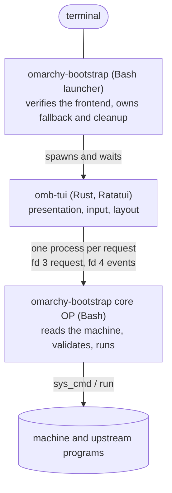

# Records and the core protocol

**Status: designed for M14 (the record format and protocol v1); not
implemented.**

Two things are defined here once and used everywhere else: the **record
format** every file and message this tool exchanges is written in, and the
**core protocol** through which the Ratatui frontend (docs/FRONTEND.md) asks
the Bash core what is true and what may be done.

## The record format

One format for the Migration Profile, the bundle manifest, qualification
steps, journey notes, stage records, the frontend lock, the registry and
every protocol message. Bash 3.2 reads and writes it with builtins and no
parser dependency on either system; the frontend parses it with a strict
reader of a few dozen lines; people can read it; `diff` works on it.

```text
file    = header LF *( record LF ) [ seal LF ]
header  = name SP version                 e.g. "omb-profile 1"
record  = type *( TAB field )
type    = 1*( a-z / "-" )                 at most 24
field   = key "=" value
key     = a-z *( a-z / 0-9 / "_" )        at most 32
value   = *( safe / "%" HEX HEX )         at most 4096 bytes as written
safe    = A-Z / a-z / 0-9 / "." / "_" / "~" / "/" / ":" / "@" / "+" / "," / "-"
HEX     = 0-9 / A-F                       upper case only
seal    = "seal" TAB "sha256=" 64( 0-9 / a-f )
```

- **ASCII only, LF only.** No CR, no blank line, no trailing tab. A byte
  outside the safe set is written as `%XX`; decoded values are bytes, `%00`
  is invalid, and a value whose schema type is text must decode to valid
  UTF-8. Paths therefore travel exactly, whatever they contain, and the Linux
  console never receives a byte it cannot show.
- **Typed by schema.** Each record type lists its keys in order, with a type
  for each: `enum`, `uint` (the baseline's `_uint`: digits, no leading zero,
  bounded), `hex`, `id`, `path`, `text`, `utc`, `bool`. Writers emit keys in
  schema order; readers require that order, reject a missing required key,
  an unknown key, an unknown record type, or a repeated key the schema does
  not mark as a list. Values are validated before they are used, and nothing
  read is ever sourced, evaluated, or placed in an arithmetic context
  unchecked (the baseline's `cfg_field_ok` rule).
- **Versioned by header.** A reader knows the versions it can read; a newer
  version is refused with "made by a newer omarchy-bootstrap", an older one
  is read only if the schema says so.
- **Sealed where it rests.** Files that are stored (profile, manifest,
  qualification and journey records, stage records) end in `seal`: the
  SHA-256 of every byte before the seal line, computed with `shasum -a 256`
  on macOS and `sha256sum` on Linux. The seal catches a torn write, a
  truncated copy and an edit by hand. It is not a signature: anyone who can
  write the file can recompute it, and the design never relies on it against
  someone who can (docs/SECURITY.md). Protocol messages are not sealed.
- **Comments only in repository data.** Files kept in this repository and
  reviewed in Git (the registry) may carry `#` lines; machine-written files
  never do.
- **Limits.** Line 16 KiB, profile and manifest 16 MiB, protocol request
  64 KiB. Anything larger is refused before parsing.

Parsing in Bash 3.2 is `IFS= read -r line`, then `IFS=$'\t' read -r -a`
over a here-string, splitting each field at its first `=`; decoding turns
each validated `%XX` into its byte. Nothing else is needed.

### Why not JSON, plists or NUL-separated streams

- **JSON** would need a parser the core does not have: stock macOS has
  `plutil` (read-only JSON access, already used for upstream manifests), the
  fresh Asahi image has no `jq`, and a JSON reader written in Bash is a large
  new parser in the safety core. The frontend could parse JSON easily; the
  core, which is the authority, could not.
- **Property lists** have the same problem on Linux.
- **NUL-separated streams** are unambiguous but not viewable, not diffable,
  and awkward in the test suite's recorded fixtures.

JSON remains an input format only where upstream writes it (Homebrew
receipts, `installer_data.json`, agent configuration), read on macOS through
`plutil` exactly as the baseline reads plists.

## The core protocol

### Processes



- The **launcher** is the baseline entrypoint. For an interactive session it
  verifies and starts the frontend (docs/FRONTEND.md) and waits for it.
- The **frontend** spawns exactly one kind of child: the core. It never runs
  another program, never reads or writes the state directory, never reads a
  user file, and never touches a disk. Everything it shows came from a core
  response.
- The **core** is `omarchy-bootstrap core <op>`, one short-lived process per
  request. It loads the same libraries, re-derives what it needs from the
  machine, answers, and exits. There is no long-lived server: every answer is
  a fresh read, a crash costs one request, and no in-memory state can drift
  from the machine. Recording requests take the baseline's run lock for their
  lifetime, as a CLI run does (*The run lock*, below).

### Channels

| Descriptor | Direction | Holds |
| --- | --- | --- |
| fd 3 | frontend → core | the request: one `omb-req 1` document, then EOF |
| fd 4 | core → frontend | the response: an `omb-res 1` stream of records, flushed per record, ending with exactly one `result` |
| fd 0, 1, 2 | — | **managed** requests: `/dev/null` in; out, a private diagnostics file (0600, state directory `logs/`) for a request that records (act intent, not a dry run), and otherwise a pipe the frontend keeps in memory for the session's log screen, so read, plan and dry-run requests write nothing. **Handoff** requests: the real terminal |

The launcher's environment reaches the core through the frontend unchanged:
`OMB_HOME`, the session's **intent ceiling** (`OMB_SESSION_INTENT`: `read`,
`plan` or `act`, from the command the person typed) and **scopes**
(`OMB_SESSION_SCOPES`, the action scopes that command may reach),
`OMB_DRY_RUN`, colour
and ASCII preferences, `OMB_STATE_DIR`, the test seams, and `OMB_SESSION`, a
random id that ties log lines to one session. The frontend never sets or
changes these (a static check on its source, docs/TESTING.md). They pass
through the frontend's process, so what protects them is that check and the
binary's pinned digest; the core refuses every operation when
`OMB_SESSION_INTENT`, `OMB_SESSION_SCOPES` or `OMB_DRY_RUN` is missing or
malformed (the launcher always sets all three), so a frontend that dropped
its child's environment could not turn a dry run into a real one.

### Scopes

One list, used by sessions, snapshots and actions: `journey` (read-only
stages), `disk`, `plan`, `profile`, `resolve`, `asahi`, `network`,
`omarchy`, `shared`, `export`, `restore`, `rescue`, `qualify`, `debug`.
Each action belongs to exactly one.

### The run lock

The launcher takes the baseline's run lock only for its
own recording (acquiring the frontend) and releases it before it starts the
frontend. Each recording core request then takes the lock for its own
lifetime and releases it on exit, so requests never wait on the launcher and
two recording requests never overlap.

### Requests and responses

A request is a header, one `req` record, then the operation's records:

```text
omb-req 1
req	op=execute	proto=1	frontend=0.1.0	session=5f3a9c1e
exec	action=shared.create	basis=7c1e4a90d2b3f6aa	confirm=create
```

A response begins with `hello`, streams records, and ends with `result`:

```text
omb-res 1
hello	core=0.3.0	commit=e33714195c76	proto=1	platform=macos	arch=arm64	user=user	ceiling=act	dry_run=0	fixture=0
message	level=info	text=Reading%20the%20disk%20again.
progress	action=shared.create	done=1	total=4	label=disk%20re-read
result	status=done	code=shared-created	text=Shared%20created%20as%20disk0s7.
```

| Operation | Intent | Answers |
| --- | --- | --- |
| `hello` | read | negotiation only |
| `snapshot scope=…` | read | stages, facts, warnings, blockers and the actions available now, for one scope (the list above) |
| `detail kind=… offset= limit=` | read | large or paged content: inventory rows, profile items, resolution rows, a diff, log lines, the debug report, a downloaded script for inspection |
| `validate action=…` | read | the action's parameters normalised, or an error per field. The planner's sizes come back as the full plan (regions, answers, invariants) computed by `lib/storage.sh`; the frontend never computes geometry. Nothing is written |
| `execute action=…` | the action's | runs one available action and streams its progress |

Cancellation is not a request: for an action declared cancellable, the
frontend sends SIGTERM to that core process; the core finishes the unit in
hand, stops, and reports `status=cancelled` with what completed.

### Response records

| Record | Carries |
| --- | --- |
| `hello` | core version and commit, protocol chosen, platform, architecture, `root` or `user`, the intent ceiling, dry run, fixture mode |
| `stage` | one journey stage: `name`, `state` (`done`, `current`, `todo`, `skipped`, `blocked`), `basis` (`machine` or `recorded`, with who recorded it and when), `detail` |
| `fact` | one surveyed fact: `scope`, `key`, `label`, `value`, `state` (`ok`, `info`, `warn`, `fail`, `unknown`) |
| `region` | one extent of the disk strip: start, size, role (`apple`, `macos`, `stub`, `efi`, `linux`, `shared`, `free`, `other`), label |
| `answer` | one installer answer: order, prompt, value as typed, bytes |
| `guide` | authoritative text the frontend shows verbatim: the boot procedure, recovery steps, what to type |
| `code` | a code or token to show or copy: `token`, `ombdone`, `ombshare` |
| `item`, `resolution`, `conflict`, `health`, `step` | subsystem rows, defined with their subsystems (docs/MIGRATION.md, docs/RESOLVER.md, docs/RESTORE.md, docs/QUALIFICATION.md) |
| `warning`, `blocker` | a reason, and what to do about it |
| `action` | something the person may do now (below) |
| `param` | one parameter of an action: name, type, required, default, choices |
| `progress` | done, total, unit, label |
| `message` | a line for the person: level and text |
| `result` | `status` (`done`, `refused`, `failed`, `cancelled`, `stopped`, `error`), a machine `code`, text, and the next step |

### Actions: the core says what is legal

The frontend shows only actions the core listed, and asks only for the
parameters and confirmation the action declares:

```text
action	id=shared.create	label=Create%20Shared	intent=act	gate=create	terminal=handoff	cancel=0	basis=7c1e4a90d2b3f6aa	explain=One%20exFAT%20partition%20...
param	action=shared.create	name=code	type=code	required=1
```

- `intent` is the action's own; the session's ceiling must allow it.
- `gate` is the typed word, or empty; `terminal` is `managed` or `handoff`
  (docs/FRONTEND.md → *Handing the terminal to a child*); `cancel` says
  whether cancelling is safe.
- `basis` is a digest the core computes over exactly the facts the action
  depends on: for the Asahi launch, the plan record and the layout it was
  checked against; for Shared's creation, the plan record, Linux's code and
  the free region; for a restore, the reviewed resolution and conflict
  choices. It is what the person reviewed.

### How the core judges an `execute`

In this order, stopping at the first failure:

1. **The session allows it.** The action's intent is within the ceiling and
   its scope is among the session's scopes, both from the environment the
   launcher set, never from a value in the request.
2. **It is available now.** The core recomputes the available actions for
   the action's scope from a fresh read; one that is not listed now is
   refused as stale.
3. **Nothing changed since review.** The basis recomputed now equals the
   request's; otherwise `refused`, `code=changed`, and the frontend shows the
   fresh state.
4. **The parameters are valid**, each through the validators the text flow
   uses.
5. **The confirmation matches**: exactly the action's gate word, compared by
   the core.
6. **The baseline flow runs** — the same functions, with every check they
   already make: the re-read before the Asahi launch, `state_must_set`
   before an irreversible step, `sudo -v` before the last read and `sudo -n`
   after it, the creation record, the classification afterwards.

The protocol adds checks in front of the baseline's; it removes none, and it
has no way to say "this is safe". A request that claims a state (`safe=1`, a
precomputed plan, a partition id) finds no key to carry it: the schemas have
no such fields, and an unknown key is a protocol error.

### Versions and compatibility

- **Protocol:** an integer. The frontend sends the version it speaks; the
  core answers with the same or refuses (`code=protocol`). A change that
  alters the meaning of an existing record or key is a new protocol version.
- **Frontend:** the core reads the frontend lock (docs/FRONTEND.md) and
  refuses a `frontend=` that is not the locked version (`code=frontend`),
  except in fixture mode with the development override. The launcher has
  already checked the binary's digest; this catches a frontend started some
  other way.
- **Exit status:** 0 when a `result` was written, 2 for a malformed request,
  3 for a version refusal. A core that exits without a `result` is reported
  by the frontend as "the core stopped without answering", with the
  diagnostics file and the offer of a debug report.

### Handoff requests

For an action with `terminal=handoff`, the frontend has already restored the
terminal before it spawns the core, and passes the real terminal as fds 0–2.
The core refuses a handoff action unless `[ -t 0 ] && [ -t 1 ]`; it prints
its own few lines for the step (through the baseline's `ui_*` helpers, ASCII
on the Linux console), runs the upstream program in the foreground exactly
as the text flow does, then reads the machine afterwards. Structured records
still go to fd 4, which the frontend reads when it takes the terminal back.

A managed action never asks for input: its stdin is `/dev/null`, and any
`sudo` in a managed path is `sudo -n` (a static check,
docs/TESTING.md). An action that may need a password, a passphrase or an
upstream prompt is declared `handoff`.
