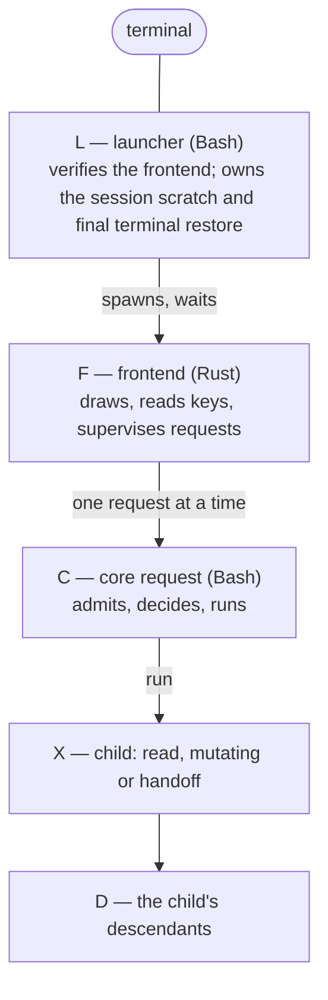

# Records and the core protocol

**Status: the implementation contract for M14 gate 1 (framing, admission,
processes, diagnostics; implemented and accepted), gate 2 (the read surface,
*The Gate 2 read surface*: its ordinary fixture-only producers are
independently accepted — journey snapshot and machine/status detail at
`f35be42e90bfb8fc29e61557f0a126a74cb6460b` (S1–S3), Logs at `a0ba61c`,
Health (Doctor) at `27f79d6` and Validate at
`b01610e69a2eef6e5a52f5ede18236210699704e`; the frontend's presentation of
them is implemented in the unreleased 0.2.0 candidate, and its integration
is accepted at `c855f6197be86e90f5fb833f7faec0d0f6372794`, which closes
gate 2) and gate 3 (actions and bases; not implemented; its prerequisite
contract, *An operation record that cannot be read*, is accepted at
`152c8f68854368025816b926494dbec0e94bc903`, documentation only, and the
interface of its diagnostic, *The operation-record diagnostic*, is a
candidate awaiting independent review).**
Local experiments that ground it are recorded in docs/UPSTREAM.md →
*Experiments*.

Defined here once and used everywhere else: the **record format** every
file and message is written in, how bytes are **admitted** before anything
parses them, the **processes and descriptors** of a frontend session, and
the **actions** the core allows, each bound to what the person reviewed.

## 1. The record format

### Grammar

```text
document = header LF 1*( record LF ) [ seal LF ]
header   = name SP version                   "omb-profile 1"; name a-z and "-", at most 24
record   = type 1*( TAB field )              a record has at least one field
type     = a-z *( a-z / "-" )                at most 24 bytes
field    = key "=" value
key      = a-z *( a-z / 0-9 / "_" )          at most 32 bytes
value    = *( safe / "%" HEXU HEXU )         at most 4096 bytes as written
safe     = A-Z / a-z / 0-9 / "." / "_" / "~" / "/" / ":" / "@" / "+" / "," / "-"
HEXU     = 0-9 / A-F
seal     = "seal" TAB "sha256=" 64( 0-9 / a-f )
```

A document is bytes, and only these bytes: TAB (0x09), LF (0x0A) and
0x20–0x7E. Every other byte — NUL, CR, other controls, DEL, anything above
0x7E — is invalid wherever it appears. **There are no comment lines**: a
document family that needs notes for people has a `note text:text` record
in its schema (the registry does, docs/RESOLVER.md → *The registry*), which
is admitted like any other record.

### One canonical encoding per value

Every value has exactly one written form, so that equal meanings are equal
bytes (which the seals, bases and digests depend on):

- a byte in `safe` is written as itself, never escaped (`%41` is invalid);
- every other byte is written as `%` and two **upper-case** hex digits
  (`%2f` is invalid); `%00` is invalid;
- a record is its type, a TAB, and fields separated by exactly one TAB: no
  leading, trailing or doubled TAB; no blank line; the document ends with
  exactly one LF after its last line;
- **every non-list key the schema lists is present**, in the schema's
  order, once; a key the schema does not list, a record type it does not
  list, or a missing key makes the whole document invalid;
- an optional key (`?`) with no value is written `key=`, which means
  "none"; a key that is not optional never has an empty value;
- a **list** key (`*`, `+`) is the key repeated in order (`arg=-y	arg=pkg`),
  in its place in the schema's order; an empty list is the key absent; an
  element may be empty (`arg=`) only in a `bytes` or `text` list, where it
  is the empty string;
- record order and cardinality are the schema's (`1`, `?`, `*`, `+`, `—`
  for forbidden); unless the schema states another order (the registry
  groups records by software), records of one type are consecutive, in the
  order the schema table lists the types; a duplicate of a record the
  schema says is unique (the same `id`, say) is invalid.

Schemas are written as `record: key:type key:type? key:type*` — `?` optional
(present, and empty for none), `*` a list, `+` a list of at least one — with
the record's cardinality in the document. Every stored and exchanged record
family has its schema table in the document that owns it; the protocol's
own are in §4.

### Value types

| Type | Written form | Decoded meaning |
| --- | --- | --- |
| `uint` | `0` or `[1-9][0-9]{0,17}` | an integer below 10¹⁸, safe in Bash's 64-bit arithmetic |
| `bool` | `0` or `1` | — |
| `enum(a\|b)` | one listed word | — |
| `id` | `[a-z0-9][a-z0-9._:@+-]{0,127}` | an identifier; never contains `%` |
| `hex8`, `hex16`, `hex40`, `hex64` | exactly that many `[0-9a-f]` | display ids (8), short ids (16), Git commit ids (40), full SHA-256 digests (64) |
| `utc` | `YYYY-MM-DDTHH:MM:SSZ` | a time, shown, never compared across systems |
| `text` | percent-encoded | valid UTF-8 with no C0 or C1 control, no DEL, no ESC: safe to render |
| `bytes` | percent-encoded | any bytes except NUL: paths, file names, raw values. **Never rendered raw** |
| `code` | percent-encoded | printable ASCII of at most 512 bytes that matches the grammar of its **kind** (below) |

**Codes.** A `code` value is always read together with its kind, from the
same record (`code kind=…`) or from the declaring `param`; the type never
widens `id`:

| Kind | Decoded grammar | Semantic check |
| --- | --- | --- |
| `token` | `omb2:` then `name=value` fields joined by `,`; names `[a-z]+`; values without `,` or `=` | the baseline's `token_decode`: every name on its whitelist (`enc user host kmap tz loc ssh gh linux shared dev plan`, and `prof`), each at most once, each value accepted by `cfg_field_ok` |
| `ombdone`, `ombshare` | `<kind>-` 8 hex `-` 12 hex `-` 4 hex, lower case | the baseline's `code_parse`: the last 4 digits are the first 4 hex digits of the SHA-256 of everything before the last `-` |
| `ombbundle` | `ombbundle-` 16 hex `-` 4 hex, lower case | the same check-digit rule (docs/MIGRATION.md → *The approval code*) |

A code the person types arrives as an `arg` of a `param` whose type is
`code`: the core normalises it as `code_parse` does (upper-case hex folded,
spaces removed) before the semantic check. A code the core writes is already
canonical.

**Display versus data.** `bytes` values (paths above all) are kept
byte-for-byte for every comparison, digest and file operation, and are shown
only through one display function that renders printable UTF-8 as itself
and every other byte as `\xNN`, then truncates. No value of any type is ever
written to the terminal unescaped: a terminal control sequence in a file
name, a log or an upstream message is data, never display.

### Sealed documents

A stored document ends with `seal`: the SHA-256 of every byte before the
seal line, computed with `shasum -a 256` (macOS) or `sha256sum` (Linux). A
seal detects **corruption** — a torn write, a truncated copy, a hand edit —
and nothing more: anyone who can write the file can recompute it. Approval
and origin are separate mechanisms wherever they matter
(docs/MIGRATION.md → *Integrity, approval, journey*). Protocol messages are
not sealed.

### Limits

| What | Limit |
| --- | --- |
| a record (one line, LF excluded) | 16 KiB |
| a value as written | 4 KiB |
| a protocol request | 64 KiB, 512 records |
| a protocol response (the event spool of one request) | 8 MiB, 65 536 records |
| a stored document | its schema's limit; at most 16 MiB (profile, manifest), 64 KiB (every other) |

## 2. Admission: bytes before parsing

Bash's `read` cannot be the first thing to see untrusted bytes: it silently
turns doubled, leading and trailing TABs into the canonical split and drops
or truncates at NUL (reproduced on `/bin/bash` 3.2.57 and Bash 5.3). So every
document the core reads — a request, a profile, a manifest, a journal step,
a qualification record, the lock, the registry — passes **admission** first,
using standard tools present on stock macOS and on the fresh Asahi image
(`head`, `wc`, `tr`, `tail`, `od`, `awk`; BSD `awk` on macOS, gawk in the
image and on Omarchy):

1. **Bounded copy.** A stream is copied with `head -c <limit+1>` into a
   private file in the per-run scratch directory; a stored file's size is
   read first (`wc -c`) and a file over its limit is refused unread. Nothing
   is ever read without a bound.
2. **Size.** More than the limit: refused (`too-large`).
3. **Byte class.** `LC_ALL=C tr -d '\011\012\040-\176' <file | wc -c` must be
   0: any NUL, CR, control, DEL or non-ASCII byte refuses the document before
   anything else looks at it.
4. **Termination.** The file is not empty and its last byte is LF (`tail -c
   1 | od -An -tx1`).
5. **Framing and canonical form.** One `LC_ALL=C awk` pass checks every
   line: length, no blank line, no leading, trailing or doubled TAB, type and
   key grammar, value grammar, upper-case escapes, no `%00`, no escaped safe
   byte, record count. Its input is now NUL-free ASCII, which both awks treat
   alike.
6. **Only then** Bash splits lines on TAB and fields at the first `=`, and
   validates each record against its schema (order, cardinality, types, and
   for a response, one `result` as the last record). At this point splitting
   can no longer normalise anything, because every input it would normalise
   was refused.

**Every tool's status counts.** Each step captures the exit status of every
stage of its pipeline in the first assignment after it (`PIPESTATUS`), and
any tool that fails refuses the document (`io`), so a failed read can never
look like an empty or valid document.

Each refusal carries one **reason code**, decided by the first check that
fails, in the order of the steps above; within step 5, lines are checked from
the first, and within a line in this order: `line` (too long), `blank`,
`tab`, `header` (the first line only), `key` (type or key grammar, including
a line with no TAB, such as a `#` line), `value`, `nul-escape`,
`non-canonical`, and `too-large` at the first record past the document's
record limit. Step 1 or any tool failure gives `io`, step 2 `too-large`,
step 3 `byte`, step 4 `eof`, step 6 `schema`, `type` (a value that breaks
its type or its code kind), `after-result` (a record after the `result`) or
`result` (none, or two); a seal check gives `seal`.

The frontend admits the core's responses with the same rules in Rust,
directly on bytes. The two implementations are held together by a
differential corpus (docs/TESTING.md → `proto-diff-*`): every case is
admitted or refused identically by both, with the same reason code.

## 3. Processes and descriptors

This section is the only description of the session's process model;
docs/FRONTEND.md refers to it.

### The processes


```mermaid
flowchart TD
    T([terminal]) --- L
    L["L — launcher (Bash)<br/>verifies the frontend; owns the session scratch and final terminal restore"] -->|spawns, waits| F
    F["F — frontend (Rust)<br/>draws, reads keys, supervises requests"] -->|one request at a time| C
    C["C — core request (Bash)<br/>admits, decides, runs"] -->|run| X[X — child: read, mutating or handoff]
    X --> D[D — the child's descendants]
```

Two kinds of process, never confused:

- **Controllers** — the launcher L, the frontend F, and the session's cores C.
  Each is recorded by its identity (below) and expected to stay alive while
  its work goes on.
- **Workers** — the child X that C starts for a request, and every process
  that descends from it. Workers do the work; controllers only start,
  supervise and judge it.

All of them share the shell job's process group: nobody calls `setpgid` or
`setsid` (a static check on F and C), so the terminal's signals reach them
together during a handoff. The group therefore never becomes empty while a
controller is alive, and emptiness is never a test for anything. What a
worker that makes its own group (`sudo` with `use_pty`, a daemon) means is in
*Operations and exclusion*. F runs one request at a time.

**A process's identity** is its PID, its start time, and the machine's boot
session:

| | Start time | Boot session |
| --- | --- | --- |
| Bash (L, C, a later launcher) | `ps -p <pid> -o lstart=` (the baseline's `_proc_started`), to the second, on both systems | `/proc/sys/kernel/random/boot_id` (Linux), `sysctl -n kern.bootsessionuuid` (macOS) |
| Rust (F) | `/proc/<pid>/stat`'s start time (Linux); `proc_pidinfo` with `PROC_PIDTBSDINFO` (macOS) | the same two sources |

Each identity is compared only with one recorded by the same method. A
recorded process is alive only if a process with that PID exists now, with
that start time, in that boot session; a reused PID is never taken for the
recorded process. **When an identity cannot be established** — `ps` fails,
the boot session cannot be read — the process counts as possibly alive:
nothing is deleted and no barrier is cleared on the strength of it.

**The group snapshot.** Immediately before starting a child, C records the
identities of every process then in the job's process group (the process
table read directly: `ps -axo pid=,pgid=,lstart=`). Its **workers still
present** are the processes in the group now that are not in that snapshot
and are not the reader's own direct children at that moment — the `ps` and
the pipeline stages taking the reading, which are not workers (the child
itself has already been waited for, and a worker it left behind is
reparented, never C's child). F keeps the same snapshot, from its own
reading, before it hands the terminal to a request; L uses the same rule,
with the moment it wrote `launcher.omb` as its snapshot, for its own
cleanup.

### The session scratch

L creates a private directory, `mktemp -d "${TMPDIR:-/tmp}/omb-session.XXXXXX"`
(0700), and passes its path as `OMB_SESSION_DIR`. In it, each written with
exclusive creation (0600):

| File | Written by | Holds |
| --- | --- | --- |
| `launcher.omb` | L, first | L's identity |
| `frontend.omb` | L, right after spawning F | F's identity |
| `session.diag-summary` | L, with the scratch | the session's diagnostics summary (*Diagnostics*) |
| `req-<n>.events` | F, before spawning C | the request's event spool |
| `req-<n>.core` | C, at start; removed at exit | C's identity |
| `req-<n>.worker-<k>` | C, as it starts each child | that child's identity |
| `req-<n>.diag`, `req-<n>.diag-summary` | C, when a read child's output is first kept | retained diagnostics (*Diagnostics*) |

L starts F as `omb-tui --session <dir>`, so a live frontend can be found by
its arguments even before `frontend.omb` exists.

**Owner cleanup.** When F has exited, L — alive, performing its own normal
exit, and exempt from its own check — removes the scratch only when all of
these hold; otherwise it leaves the scratch for a later launcher:

- F is gone (L waited for it);
- no `req-*.core` names a live core;
- no `req-*.worker-*` names a live worker, and no process that entered the
  job's group after L wrote `launcher.omb` remains, other than L itself and
  the reading's own processes;
- no unresolved operation record in the state directory names this session.

For the startup check, L also reads its own session's spools before it
removes them, to decide the check's outcome (docs/FRONTEND.md → *The
startup check*); it reads nothing else in the scratch for that.

**Stale reclaim.** A later launcher that finds an old `omb-session.*`
directory has no exemption. It removes the directory only when:

- the identity in `launcher.omb` is not alive;
- the identity in `frontend.omb` is not alive, and no live process's
  arguments name the directory (`ps -axo pid=,args=`), which covers a
  frontend that started before `frontend.omb` was written;
- no `req-*.core` and no `req-*.worker-*` names a live process;
- no unresolved operation record names the session;
- every one of these identities could be established; any that could not
  counts as alive.

A launcher PID that is gone is never enough. The scratch is temporary, not
persistent state, and is never read by a later session except to decide
whether it may be removed.

### Descriptors

| Descriptor | L | F | C | X, read | X, mutating | X, handoff | D |
| --- | --- | --- | --- | --- | --- | --- | --- |
| 0 | terminal | terminal | managed: `/dev/null`; handoff: terminal | `/dev/null` | `/dev/null` | terminal | as X |
| 1, 2 | terminal | terminal | managed: `/dev/null` (in fixture mode, `req-<n>.core-err`, for tests); handoff: terminal | as the child registry says (*Children*): functional output to its bounded destination, diagnostics to C's drain | `/dev/null`, or a functional destination the registry names | terminal | as X |
| 3 | — | the request pipe's write end, close-on-exec; closed as soon as the request is written | the request pipe's read end; read to EOF (bounded) and closed with `exec 3<&-` before anything else runs | never open | never open | never open | never open |
| the event spool | — | a read-only handle on `req-<n>.events`, close-on-exec, in a reader thread | **no descriptor held**: each record is appended with `printf … >>"$OMB_EVENTS"`, which opens, writes and closes | never open | never open | never open | never open |
| anything else | none | every descriptor F inherited beyond 0–2 made close-on-exec at its start — each one the kernel lists (`/proc/self/fd`, `libproc`'s descriptor list), with no numeric ceiling; one that cannot be sealed stops F before any core starts — and every descriptor Rust's standard library opens is close-on-exec; fd 3 is placed with `dup2` in the child just before `exec` | Bash's own script descriptor is close-on-exec | — | — | — | — |

There is no response pipe (no fd 4) and no child-status pipe: responses go
to the spool file, F learns that C has ended from `waitpid`, and C learns
the same of its children from `wait`. Everything C knows how to report
travels as a record; C writes nothing else.

Consequences, each tested (docs/TESTING.md → `sup-*`):

- no protocol descriptor exists in any child or descendant, so none can hold
  a pipe open, write into the protocol, or block on it;
- F opens descriptors and spawns only on its main thread (the reader thread
  only reads its already-open handle), so macOS, where the standard library
  sets close-on-exec on a new pipe in a second step, has no window in which
  another spawn could inherit it; C appends records only from its main
  shell, never inside a background job or a pipeline stage;
- the request pipe's EOF depends only on F closing its write end;
- the end of a response is **C's exit** (F waits for it) plus **exactly one
  `result` record as the last complete line of the spool**, never an EOF that
  a descendant could delay — and never a read of the spool that failed: that
  ends the reading with its error, and the outcome, once C has exited, is
  unknown, however whole the bytes before it looked.

### A request's life

1. F creates the pipe and the spool, then spawns C with the descriptors
   above and the environment of §4 → *Environment*.
2. C writes `req-<n>.core`, loads its libraries, copies fd 3 through
   admission step 1 (bounded) and closes it. An over-long request makes
   `head` stop reading; F's write then fails with EPIPE, which F treats as a
   refusal.
3. C appends `hello`, then its records, then one `result`, removes
   `req-<n>.core`, and exits.
4. F's reader thread follows the spool continuously — during a handoff too,
   because it never touches the terminal — and passes each complete, admitted
   line to the main thread through a bounded channel. When C has exited, the
   reader drains the rest and checks that the last line was a `result`.
5. F shows `req-<n>.diag`, if any, on the session's log screen.

### Children

Every program C runs has an entry in the core's reviewed **child registry**
(`data/children.omb`), keyed by the action and the command; a request never
chooses any of it:

| Field | Values |
| --- | --- |
| `class` | `read`, `mutating`, `handoff` |
| `stdout`, `stderr` | `functional` (the output is the work: read by the core with its own bound, or written to the artifact the action creates), `diagnostics` (read class only), `null` |
| `tty` | `none` (runs correctly with no terminal and no one reading its output) or `needs` (it prompts, asks, shows progress the person must see, or changes behaviour when `isatty` is false) |
| `detaches` | `no` (it never leaves anything running after it exits), or `owned` (it deliberately leaves a service behind, and the entry names the action-specific owner and completion check: the rescue server's systemd unit, its state and its listener) |

Rules, each a static check (docs/TESTING.md → `diag-class-static`,
`diag-mutator-tty-class`, `sup-mutating-daemon-classification`):

- `tty=needs` is always `class=handoff`; `class=mutating` requires `tty=none`;
- a mutating child's streams are `null` or `functional`, never
  `diagnostics`, so no pipe or growing diagnostic file sits inside a
  mutation;
- a child whose effect runs on after it exits is `detaches=owned` with its
  owner and check, or it is not run managed at all;
- functional output is never subject to the diagnostic budgets below, and
  diagnostics are never functional: the qualification data, an export's
  objects, and anything the core parses are functional, with their own
  bounds in the documents that own them.

### Diagnostics, by child class

| Class | Output | Outcome judged by |
| --- | --- | --- |
| **read** | stderr, and stdout when the registry says `diagnostics`, through a pipe into the drain below | its exit status, captured first from `PIPESTATUS`, and what the core read |
| **mutating** | `/dev/null`, or the functional destination the registry names: no pipe, nothing that can fill, block, or end the child | its exit status and the machine read afterwards (the postcondition); the command itself is shown so the person can run it by hand to see its output |
| **handoff** | the terminal, never captured | the machine read afterwards |

**Every retained byte counts.** The limits below are over everything kept —
headers, payload, markers and summaries — with no exception, and no file
ever exceeds its limit:

| Scope | Hard limit | Made of |
| --- | --- | --- |
| a child | 65 536 bytes | one header line of at most 256 bytes (the command's registry id, its exit status, the bytes kept, whether any were discarded), then at most 65 280 bytes of its output |
| a request | 262 144 bytes | `req-<n>.diag` (at most 262 016 bytes of child blocks) and `req-<n>.diag-summary` (exactly 128 bytes) |
| a session | 4 194 304 bytes | every request's two files and `session.diag-summary` (exactly 128 bytes) |

- **The drain is bounded while the child runs.** A read child's diagnostic
  output goes to `tail -c 65281`, which reads everything, holds at most the
  last 65 281 bytes in memory, and writes them to one temporary file only
  when the output ends: the temporary file never exceeds 65 281 bytes, and
  is removed once merged. F runs one request at a time and C runs its
  children one at a time, so at most one such file exists.
- **Reserve before append.** Before starting a read child, C computes the
  room left: the child's 65 536, the request's 262 016 less `req-<n>.diag`'s
  size, and the session's 4 194 304 less every diagnostic file's size and
  less the 128 bytes a new request's summary would need. When the child
  ends, C appends one block of at most that room: the header, then the
  **last** bytes of the output that fit. The 65 281st byte, or a cut to fit
  the room, marks the block as discarded. Nothing is appended and then
  trimmed.
- **Saturation.** When the room is less than a header and one byte, C does
  not start a drain that keeps anything: the child's output goes through
  `cat >/dev/null`, which consumes it so the child never blocks, and C
  records the child in the summary instead. A request whose file would need
  room the session lacks creates no file at all. A saturated request or
  session stays saturated: no header, marker or file is added for later
  children.
- **Summaries are fixed size.** Each summary is exactly 128 bytes: the words
  "diagnostics truncated", the children not kept and the bytes discarded as
  fixed-width ten-digit counters that stop at 9 999 999 999, rewritten whole
  (temporary file, then rename) as they change. They never grow.
- **Discarding keeps draining.** `tail` and `cat` read to the end, so a noisy
  read child is never blocked by its drain. If the drain itself fails
  (killed, or the final write finds the disk full), the read child may
  receive SIGPIPE; the diagnostics are "not available", and the read is
  judged by its own status and functional output, failing only if that is
  lost.
- **A capture failure changes no outcome.** Diagnostics that cannot be kept
  never turn a result into a failure, never authorise a retry, and never
  stand in for a postcondition; a mutating child has no diagnostics to lose.
- **Raw and temporary.** Diagnostics are raw output, potentially sensitive:
  they stay in the scratch, are shown only on the log screen, are removed
  with the scratch, and never enter a debug report or an agent's context
  (docs/RESCUE.md). The scratch is not a security boundary and removal is
  not secure erasure.

### Backpressure and bounds

- **C never waits on F.** Its output is a file, so however slowly F reads, C's
  writes complete; nothing on a mutation path depends on the frontend
  keeping up, and no mutating child has a diagnostic pipe.
- C counts what it writes. Past 8 MiB less 64 KiB it writes no more
  `progress` or `message` records, one `overflow` record with the number
  suppressed, and then its `result`.
- F's channel holds 1 024 records; when it is full the reader thread waits,
  which slows only the reader. F keeps the latest `progress` per action and
  at most 500 `message` records per request.
- A spool larger than 8 MiB, a line over 16 KiB, or an unterminated last line
  when C has exited is a protocol error: the outcome is **unknown**.

### The terminal result

Every response ends with exactly one `result`, after every other record.
What follows it decides the reason: a complete record after it is
`after-result`; bytes after its LF with no final LF are `eof`, because
termination (admission step 4) is checked before the order of records
(step 6). Either way it is a protocol error. If C exits without a `result`,
or the spool fails admission, **the outcome is unknown**: F shows "the core
stopped without a complete answer", never "failed" or "nothing happened",
and asks for a fresh snapshot, which re-derives the machine's state; for an
act request, the scope's operation record decides what must be reconciled
(*Operations and exclusion*).

### When something dies

| Event | What happens |
| --- | --- |
| F dies (panic, kill) during a request | C continues to its end — its writes go to a file, so nothing fails — and exits. L sees F exit (its own child, waited for whether or not `frontend.omb` was written), then waits while any recorded core or worker is alive (a handoff child may still own the terminal) and until nothing that joined the group since `launcher.omb` remains; only then does it restore the terminal settings it saved, leave the alternate screen, show the cursor, report that the interface stopped and what to run to see the machine's state, and clean up as the owner if it may. Still running at the wait's limit, or an identity or the process table that cannot be read: L leaves the terminal and the scratch as they are, says so and exits 1 |
| C dies (crash, kill) | its workers continue. F sees C exit without a `result`: outcome unknown. For an act request, its operation becomes **unsupervised** (*Operations and exclusion*). After a handoff request, F does not take the terminal back while any worker is still present — a process in the group that is not in F's snapshot from before the request (F reads the process table directly — `/proc` on Linux, `libproc` on macOS — spawning nothing; a process it cannot read counts as present, and one whose start it cannot read matches nothing); then it re-enters and re-derives. A table it cannot read at all leaves the terminal the child's: F exits, and L decides |
| F cannot read C's state (`waitpid` fails) | C may still be running and nothing will say when it ends: the request is lost, F starts no further request, and during a handoff it leaves the terminal as it is and exits; L decides |
| L dies | F continues and restores its own terminal when it exits; the scratch stays until a later launcher may reclaim it |
| X dies | C sees the exit status, reads the machine afterwards, and reports what the machine shows (the baseline's rule) |
| EPIPE | only the request pipe and a read child's drain exist: F writing an over-long request, or to a C that already exited, is a refusal; Rust ignores SIGPIPE by default and sees EPIPE as an error. A mutating child has no diagnostic pipe |
| F's reader thread dies, or a read of the spool fails | a panic stops at the thread's boundary and never restores the terminal (only the main thread owns it); the main thread sees the reader's verdict, or its channel close; nothing ends before C exits, and then the outcome is unknown and the state is re-derived |
| a worker outlives its parent, or leaves its process group | for a read request, nothing is held for it; for an act request, *Operations and exclusion* |
| a signal interrupts a read or wait | the call is retried; signals change behaviour only as the next table says |

### Signals

| Signal | Idle, frontend drawing | During a handoff |
| --- | --- | --- |
| Ctrl-C | a key (raw mode): F quits when idle, clears a text field, or cancels a cancellable managed request | SIGINT to the process group: L and F **catch** it with a handler (never ignore it, so the child's disposition after `exec` is the default); C keeps the baseline's handling for a launched command; X and D act on it as their authors intended |
| Ctrl-Z | a key: F restores the terminal, stops the whole group (`kill(0, SIGTSTP)`), and on SIGCONT re-enters and re-derives; refused while a request runs | SIGTSTP to the group: everything stops and continues together |
| SIGTERM, SIGHUP to F | a flag: F cancels a cancellable request, waits for a non-cancellable one to end, restores the terminal and exits | the same, after the child ends |
| SIGQUIT | caught by L and F like SIGINT | as SIGINT |

L, F and C never set any of these to "ignore", never block them across a
`spawn`, and start every child with the default signal mask (a static
check, and PTY tests of the actual dispositions).

### Operations and exclusion

The baseline's run lock stays exactly as it is: one recording run at a time,
cleared when its owner process is gone. It is not enough on its own when a
mutating worker can outlive the core that started it, so every **act**
action that changes the machine also keeps an **operation record**,
`ops/<scope>.omb` in the state directory:

- **Written before the effect**, with the baseline's checked writer (a
  record that cannot be written stops the action, as `state_must_set`
  does): the action, its full basis digest, the session, C's identity (with
  the boot session), the start time.
- **Normal supervised completion.** Only the core that wrote it removes it,
  and only when all of these hold, in this order:
  1. C started the child the registry names for the action, and has been
     alive and supervising throughout;
  2. the child exited (C waited for it);
  3. **worker quiescence**: no worker is still present — every process in
     the group is one C's snapshot held before the child started, which is
     where the controllers L, F and C are, and they are expected to remain;
  4. for a child the registry marks `detaches=owned`, its action-specific
     completion check holds (for the rescue server, its unit's state and its
     listener);
  5. the action's postcondition holds on a fresh read;
  6. the result is recorded where the scope keeps results (the Shared
     creation record, the restore journal, the install classification, the
     qualification step).
  If workers are still present when the action's time limit passes, or the
  process table cannot be read, C cannot establish quiescence: it marks the
  operation unsupervised (below) and reports the outcome unknown.
- **Why generic inspection is enough, and where it stops.** A worker that
  leaves the group (`setsid`, a double fork) is invisible to the snapshot.
  So the registry is the guarantee: a managed mutating child must be
  `detaches=no` — a program that leaves nothing running — or
  `detaches=owned` with its own owner and check; a program that may detach
  in a way no check can follow is run as a handoff, or not at all. Adding or
  changing an entry is a reviewed change, and a static check refuses a
  managed mutating entry the registry marks as detaching without an owner
  (docs/TESTING.md → `sup-mutating-daemon-classification`). Process-group
  inspection is never claimed to prove that an arbitrary daemon has stopped.
- **Kept as failed when the effect is not there.** When 1 to 4 hold — C
  supervised throughout, the child exited, no worker present, any owned
  check done — but the postcondition does not hold on the fresh read, the
  action ended and the machine does not show its effect. C does not remove
  the record: it rewrites it as `state=failed`, with what the read showed
  (`finding=absent`: no effect; `finding=unexpected`: something else), as a
  new file renamed over the old one, so a record that cannot be rewritten
  leaves the running one, which becomes unsupervised once C has exited —
  never none. Then it records the result where the scope keeps results and
  answers `failed`; a result that cannot be recorded leaves the failed
  record in place. A failed record is a **barrier**: every act action in its
  scope is refused (`code=unresolved`), saying that the operation ended but
  the machine does not show its expected effect — never that it may still
  be running — and naming the way forward; read commands keep working and
  show it. Nothing in this boot clears it, not a matching postcondition; it
  is reconciled after a new boot as an unsupervised record is (below).
- **Unsupervised when supervision is lost.** A record, other than a
  failed one, whose core is no longer alive, or one C itself marks
  unsupervised, means the outcome is unknown and a mutating worker may
  still be running, even one that left the group. An unsupervised record
  is a **barrier**: every act action in its
  scope is refused (`code=unsupervised`), naming the operation and the one
  way forward, for the rest of this boot. Nothing in this boot clears it:
  not an empty-looking group, not a matching postcondition.
- **Cleared only by a new boot, then reconciled.** Once the current boot
  session differs from the record's — an unsupervised or a failed one — no
  process of the old boot can still run. Then the scope's own reconciliation runs (the baseline's
  creation-record check, the journal's judgement, a fresh classification)
  and records one of three findings: **no effect**, **the expected effect,
  completed**, or **something unexpected**. The first two remove the record;
  the third keeps the scope blocked, shows what the machine holds, and
  needs the person. A reboot is never itself counted as success. Read
  commands keep working throughout, and show the barrier and "restart this
  Mac (or this Linux system), then run the tool again".
- **Unreadable: no boot clears it.** A record that exists but cannot be
  admitted gives none of the fields the judgements above start from, so it
  is a barrier for every act in its scope, in this boot and every later
  one, while read commands keep working. What may be concluded from it, how
  it is inspected and on what terms it may be cleared: *An operation record
  that cannot be read*.
- **Honoured by both interfaces.** The act entry of every command, in the
  frontend and in the text interface (`--no-tui`), checks the operation
  records of its scopes first; this check in the launcher is a baseline
  change reviewed on its own in M14 gate 3.
- **Read requests hold nothing.** A read worker that outlives its core is a
  non-mutating orphan: it can write only its bounded diagnostics into the
  scratch, and it never creates or holds a barrier.
- This is not a disk lock: the scope's own postconditions and records remain
  the authority for what happened, as the baseline's creation record is for
  Shared.

### An operation record that cannot be read

**Status: the recovery and diagnostic contract that MILESTONES.md → *Gate 3
— The action contract under fixtures* requires before any real mutating
action is exposed (D54). Documentation only, accepted at
`152c8f68854368025816b926494dbec0e94bc903` by its focused independent
re-review (MILESTONES.md → *Gate 3 — The action contract under fixtures*):
nothing below beyond *Today* is implemented or authorized. Of its open
questions (docs/DECISIONS.md → *Open review questions*), the review accepted
UR-Q2 and UR-Q9; UR-Q1 and UR-Q3 to UR-Q8 are not settled here. The
diagnostic's interface is proposed, as a candidate awaiting its own review,
in *The operation-record diagnostic* (§4).**

Every judgement in *Operations and exclusion* starts from the record's
fields: the core's identity decides `busy` or `unsupervised`, the boot
session decides whether a new boot has come, the action and its basis
decide what reconciliation looks for. A record whose bytes cannot be
admitted supplies none of them. One rule governs everything below:
**failing to read an operation record is never evidence that nothing is
running, that the operation ended, or that it left no effect.** The
uncertainty fails closed for every act in the record's scope; read commands
keep working.

**Today.** At the Gate 2 endpoint, read from the source:

- `core_op_read` (`lib/core.sh`) answers *none* when the path has no entry
  (neither `-e` nor `-L`), *a record* when the entry admits as `omb-op 1`,
  and *cannot be admitted* when the entry is not a plain file of this user
  or root that no one else may write (`_state_file_ok`), or when admission
  refuses it for any reason, `io` included. `core_barrier` maps the last to
  `corrupt` before it compares any boot session, so no reboot changes it.
- An act in that scope is refused at step 3 of *Executing*,
  `code=unsupervised`, with text saying that the record cannot be read,
  that what it recorded is unknown and that a restart does not change that,
  and no act action of the scope is listed. The foundation's journey
  snapshot shows the fact `operation` as unknown and unsupervised, and a
  `blocker` with `id=unsupervised` whose fix says to look at the record and
  remove it only once the operation it recorded is known to have ended.
  That removal is the person's, by hand: the refusal returns before step 3
  writes anything, so nothing in the core removes, rewrites or reconciles
  the record (`tests/test-core.sh` drives the refusal and the snapshot).
- The launcher's owner cleanup and stale reclaim count such a record as
  naming every session (`fe_ops_name` answers unknown), so no session
  scratch is removed while it is there.
- The ordinary Gate 2 reads and the startup check read no operation record.
  Only the foundation's fixture test actions write one; no baseline action
  does yet, and the text interface's act entries do not check them yet
  (*Operations and exclusion*, honoured by both interfaces).
- Two gaps, for the implementation to close, both confirmed by a probe under
  `/bin/bash` 3.2.57. A lookup that fails is taken for no entry: with `ops/`
  at mode 0000, `[ -e ]` is false and `core_op_read` answers *none*; with
  `ops/` unlistable (0100) or unsearchable, the launcher's `ops/*.omb`
  matches nothing. An act still stops, only because the record it must then
  write cannot be written (`refused unavailable`), while the foundation
  snapshot shows no barrier and a launcher may remove a scratch. And
  admission's reason code is discarded, so bytes that could not be read look
  like bytes that were read and refused.
- Admission's reason code is a label, not provenance, so keeping it would
  not close that gap. `rec_admit_copied` (`lib/records.sh`) answers `seal`
  whenever `_rec_seal_ok` is false, and that is false not only when the
  bytes fail their seal but when a step of the check cannot complete: the
  `awk` count of seal lines, `tail`, the bounded `head -c` copy, `shasum` or
  `sha256sum`, or a `read` of their output. A file whose bytes are valid can
  therefore be refused `seal`. The implementation keeps each step's own
  outcome and never classifies by switching on the code (*The states*, C
  and D).
- A running record whose core's liveness cannot be established —
  `core_alive` cannot read this process's start, or this boot cannot be
  identified — is answered `busy`, as one whose core is alive. Refusing is
  right; but the refusal's text, that the operation "is still running under
  a live core", and the journey snapshot's "running" claim a supervision
  that unknown liveness does not show (U2).

**The states.** A record is judged in two steps, each of which can fail on
its own: *looking* — whether the path has an entry, and whether that could
be established — and *reading* — whether a plain file's bytes admit as this
scope's `omb-op 1` record. The letters name states of this section; none is
a wire value (*Answers*, below). Each state rests on positive evidence of its
own: A on a lookup that could have seen an entry and found none, C on an
inspection whose every step ran to its end and found the entry
inadmissible. Whatever could not be established — a lookup, a status, a
read or a check that did not complete — is D, whatever label a step gave
it.

- **A. No record.** The lookup could have seen an entry, and there is none,
  not even a link, and no clear in the scope is unsettled (below). It could
  have seen one when the state directory and its `ops` folder are real
  directories (not links) of this user that this process can search, and
  read where it lists; an `ops` folder that does not exist, under such a
  state directory, is no record too. A says only that no
  operation in the scope is recorded as begun and not yet settled. It does
  not say that no act ran, that nothing changed, or that the machine matches
  a plan: the baseline's own actions write no operation record, and a record
  removed by hand, or by a clear, cannot be told from one never written.
  Nothing rests on A that the next act does not check again: steps 4 to 8 of
  *Executing* re-read the machine, rebuild the basis and run the baseline's
  own checks.
- **B. Readable.** The record admits, and *Operations and exclusion*
  applies unchanged: running with its core established alive, or with its
  core's liveness not established either way (`busy` for both, though only
  the first observes supervision: U2), `unsupervised`, `failed`, or from an
  earlier boot and reconciled. Worker evidence only ever keeps a barrier
  there: the record's own core identity decides `busy` against
  `unsupervised`, and no reading of the process table clears anything
  (D47).
- **C. Unreadable.** An entry exists, and an inspection whose every step
  completed established that it cannot be admitted as this scope's record:
  its status, read, shows that it is not a plain file (a link, dangling or
  not, a folder, a FIFO, a device), or that it is owned by a user other than
  this one or root, or writable by group or others; or admission, with its
  size read, its bounded copy made and each of its checks run to the end,
  found the bytes inadmissible (§2's reasons: `too-large`, `byte`, `eof`,
  `header`, `schema`, `seal` and the rest). A reason code alone is not that
  evidence: it says which check refused, not that the check ran (*Today*:
  `seal` can stand for a tool that failed). An entry that is not a plain
  file is never opened: a FIFO would block, and a device could be anything.
  C supports one conclusion — an operation record exists in this scope and
  nothing it says is known: not its action, session, core, boot or state,
  nor whether it ended. It is never A, a completed or stopped operation,
  safe, no worker or no effect.
- **D. Undetermined.** The tool could not look, read or check: the state
  directory or `ops` is a link, not a directory, or cannot be searched or
  listed; an entry's status cannot be read; a plain file cannot be read in
  full (admission's `io`: a tool that failed, the per-run copy not made); a
  check of the bytes could not run to its end, whatever code it then gave;
  or the evidence of a clear in the scope cannot be inspected (*The clear
  transaction*). Whether a record exists, and what it says, is unknown. D is
  never A, and never C, since no inspection established that the entry
  cannot be admitted; it may pass, and an inspection that later succeeds
  finds A, B or C. Every act in the scope is refused while it holds, as for
  C; only the next step differs. A link in place of `ops` is D because where
  records live cannot be trusted, as `core_op_write` already refuses one.
- **E. The record and worker evidence disagree.** With B, *Operations and
  exclusion* decides, as above. With C or D, nothing ties a process to the
  record: its session, core identity and boot session are among what cannot
  be read. A live recorded process anywhere is evidence that some operation
  may be running, possibly this one; it keeps the barrier and refuses a
  clear. No recorded process alive is no evidence that this one ended
  (*Workers*). No second owner model is introduced, in the core or in the
  frontend.
- **An unsettled clear** — one that began and is not verified complete
  (*The clear transaction*) — holds the scope as C does, whatever
  `ops/<scope>.omb` shows: whatever it took is moved, not cleared, and
  nothing it says is known. The path's absence is then not A.

**Workers.** Liveness stays where *The processes* puts it: an identity is
a PID, a start time and a boot session, read by one method and compared
only with one read by the same method (*The processes*); quiescence is
judged by the core that started the child, from its own group snapshot; a
new boot session is the one proof that no earlier process can still write
(D47). For an unreadable record:

| Evidence | May conclude | Never concludes |
| --- | --- | --- |
| a recorded core or worker established alive | a process the tool started is running; an operation may be in progress, possibly this record's | that it is this record's; anything about effects |
| every recorded identity found established not alive | no process the tool recorded is running now | that no worker exists, that the operation ended, or that nothing happened: a descendant that left the group (D47), a handoff program's among them, and a scratch the tool cannot reach are not seen |
| inspection incomplete: `ps` fails; the boot session, an identity or a scratch cannot be read | nothing: each unknown identity counts as alive (*The processes*) | that it is not running |
| a recorded PID that now has another start time, or an identity from another boot session | that process is not running: a reused PID is never the recorded process | anything about this boot's processes, or about which boot wrote the record |
| a new boot session since the tool last saw these exact bytes, unchanged | no process that could have written them is running: D47's proof, applied to the bytes | anything about effects |

The last row needs a way to know that the bytes predate this boot, and the
record's own boot session is what cannot be read. Which way is UR-Q4; until
it is settled, an unreadable record's worker question has no answer and no
clear is offered. Which recorded identities a diagnosis may read belongs to
the same question: a later session reads a session scratch today only to
decide whether it may be removed (*The session scratch*).

**Effects.** Worker and effect are separate questions, never merged into
one word:

| Worker | Meaning |
| --- | --- |
| active | a recorded identity established alive |
| not observed | every identity found established not alive; not proof |
| unknown | an identity could not be established, or nothing ties one to the record |
| ended for these bytes | the boot-change proof above |

| Effect | Meaning |
| --- | --- |
| observed | the scope's reconciliation found something that neither the old state nor any of the scope's expected effects explains, or an effect it cannot judge without the record's basis |
| no unexpected effect | the scope's reconciliation, run once the worker is *ended for these bytes*, found for every action of the scope either no effect or one its own records prove complete |
| unknown | no reconciliation run, possible or owned yet |

With an unreadable record the effect is unknown until that reconciliation
runs, and it cannot use the record: it does not know which action ran or
with what basis, so it judges every action the scope has. Who owns that
judgement in each scope, and what it can prove without a basis, are UR-Q3
and UR-Q5. *I cannot find a worker* is never *nothing happened*, and *the
machine restarted* is never *reconciled*.

**Reboots.** A reboot ends every process of the boot before it. It does not
make malformed bytes readable, does not decode the record, does not say
which boot wrote it (the record may have been written after the latest
restart), does not show what happened before it, runs no reconciliation, is
never consent (docs/QUALIFICATION.md → *Across reboots*), and never clears
the record. Two reboots, twenty, or any time passing change none of that:
no age, count or clock rule clears an operation record. This is what the
source does today — `core_barrier` answers `corrupt` before it compares boot
sessions — and what the refusal says. A reboot can contribute exactly one
thing, through a mechanism not yet settled (UR-Q4): the end of the processes
that could have written bytes the tool had already seen in an earlier boot.

**The diagnostic.** A future read under the record's scope, in both
interfaces. Read intent: it takes no run lock, records nothing, writes
nothing outside the per-run scratch, and leaves the record byte for byte.
What it reports comes from an existing mechanism, never from the record's
bytes:

| Item | From | Form |
| --- | --- | --- |
| the record's path | `core_op_path`, the tool's own construction | shortened with `~`, as the refusal shows it today |
| the state | *The states* | A, B, C or D |
| for D, the step that failed | looking, reading or checking | one of a fixed set |
| a clear in the scope not verified complete | the clear's own evidence (*The clear transaction*) | attempted or taken; for a taken entry, confirmed as the one inspected, shown not to be, or not confirmed (U31) |
| the entry's kind | its status, never followed | plain file, link, folder, other |
| its owner | its status | this user, root, another user |
| whether group or others may write it | its status | yes or no |
| its size | the read's one open of the identified file, plain files only | bytes |
| its fingerprint | the SHA-256 of its bytes, plain files within the stored-document limit only | 64 hex digits, as a basis |
| for C, why admission refused it | §2's reason code and line, from a check that ran to its end | one fixed code and a line number |
| worker evidence | *Workers* | active, not observed, unknown or ended for these bytes, with which inspection failed |
| effect | *Effects* | observed, no unexpected effect or unknown |
| what stays unknown | fixed text per state | — |
| the next safe step | fixed text per state, below | — |

It never shows a field of a record that did not admit — not its action,
session, time or state, not even marked as unverified: a torn write or a
hand edit can make any of them say anything, and a person would then decide
on bytes the tool cannot vouch for. It never echoes the bytes, whatever they
hold. This is the debug report's rule (D33): values from structured probes,
never content. A person who wants the bytes opens the file the path names,
with their own tools. The fingerprint lets two inspections, or an
inspection and a clear, be compared without reading content. A finding of D
is a delivered answer, not a failure of the diagnostic: a step of inspecting
the record — looking, reading, or checking its bytes, the tools a check runs
included — that cannot complete is the finding, and the answer names the
step, never a reason code that step left behind as a finding about the
bytes. The diagnostic itself fails only when its own machinery cannot
produce an answer — its per-run scratch, the hashing of the fingerprint it
reports, the building and admission of its answer — and then it answers
`error io` with nothing partial, never a finding (*Answers*). How it is
asked for, its exact answer, words and interfaces are proposed in *The
operation-record diagnostic* (§4).

The next safe step it names: for A, none; for B, the existing one (wait for
the live core, or restart, then run the tool again); for C, inspecting again
once the processes that could have written it are proven gone (UR-Q4),
never removal while one may run; for D, making the record inspectable — the
failed step says what: a link or a file in place of `ops`, a folder that
cannot be searched or listed, a file that cannot be read, a check that
could not run — then inspecting again; for an unsettled clear, none the tool
can take: how one is resolved, other than by its own verified completion, is
a recovery contract not yet written. The tool changes no permission and
moves nothing to get there.

**Clearing.** A clear is defined here as a contract; where a mechanism is
not settled, the question that owns it is named. A clear:

1. **Is explicit, never automatic.** Only an `execute` of a clear action the
   core listed, with its typed word, in an act session that is not a dry
   run, clears a record; a dry run says what it would do and changes
   nothing. No reboot, read, snapshot, reconciliation of any scope, owner
   cleanup, stale reclaim, startup check, time or count clears one.
2. **Is offered by the core alone, and only when it is available now**: it
   is listed only when every prerequisite below holds on the inspection that
   lists it, and never while any recorded process is alive or unknown. The
   frontend shows it as any other action and cannot make it appear.
3. **Is bound to what the person saw.** Its basis is built from the
   inspection shown, the fingerprint included. At execute the core inspects
   again (step 4), rebuilds the basis (step 6) and refuses `changed` on any
   difference: a record that became readable, changed, vanished or became
   undetermined is never cleared on an earlier look.
4. **Takes the run lock as every act does** (step 3), but never step 3's
   operation record: that pre-write is `ops/<scope>.omb`, the very entry the
   clear is for, and the unreadable entry is the evidence the clear is bound
   to. Nothing writes over it, renames it or replaces it before the
   inspection, the basis, the word and every prerequisite have been checked;
   after them, only the clear's own take (rule 6) moves it.
5. **Is recorded before it changes anything**, in a record of its own,
   distinct from the operation record it clears: the scope, the
   fingerprint, the size, admission's reason code, the evidence each
   prerequisite rested on, the boot session and the time, with the
   baseline's checked writer; a record that cannot be written stops the
   clear (`state_must_set`). That record is the clear's attempt (*The clear
   transaction*); its name, schema and place are not settled here.
6. **Acts on exactly the entry it names.** The entry is taken from its path
   by a rename and confirmed to be the inspected one before anything else,
   as the baseline clears an abandoned run lock (`lib/state.sh`). An entry
   not confirmed as the inspected one is neither destroyed nor accepted: it
   is kept as it was taken, the clear does not complete, and its answer says
   which holds (U31). It is a mismatch only when a comparison that ran to
   its end shows another fingerprint, as an entry swapped in between the
   inspection and the rename would; when the comparison cannot complete —
   the entry cannot be read, its fingerprint cannot be computed — its
   identity is unconfirmed, never taken for a mismatch. It changes nothing but
   that entry and the clear's own evidence (rule 5, *The clear
   transaction*): no other scope's record, no scratch, effect, partition or
   package. Whether the taken entry is then deleted or kept aside is UR-Q1.
7. **Proves nothing about the past**: not that no worker existed, that no
   effect occurred, that earlier work completed, or that the machine matches
   a plan. Its answer says so.
8. **Never stands in for reconciliation.** Where the scope's reconciliation
   is required, it is a prerequisite of the clear, never replaced by it.
9. **Resumes nothing.** It ends its request and no action follows in it. The
   next act is a new request through every step of *Executing*, whose fresh
   read and rebuilt basis make that act safe, never the record's absence:
   its own step 3 inspects the scope again and finds A only when that
   inspection establishes A. A completed clear leaves no fact about the
   scope for a later request to rely on. A basis shown before the record
   became unreadable matches afterwards only while the machine still
   matches it, which is what a basis means.
10. **Is complete only when verified complete.** An interrupted clear has
    an unknown outcome, as any request without its `result`, and until its
    completion is verified it is an unsettled clear, which keeps the scope
    barred (*The clear transaction*).

**The clear transaction.** Three things a clear leaves are kept apart,
whatever form they finally take; their names, schema, place, how long they
are kept and whether the taken entry is deleted or kept aside (UR-Q1) are
the implementation's, reviewed with it. The clear keeps what these three
need and nothing more, and nothing but the clear writes them:

- **The attempt**: the clear's own record (rule 5), showing that an
  explicit clear began on a named entry, with its fingerprint and the
  evidence it rested on. It never means that the clear completed.
- **The taken entry**: what the clear moved from `ops/<scope>.omb` (rule 6),
  kept identifiable and preserved, with what tells whether it is the
  inspected one, for as long as the clear is not verified complete. A
  mismatch, or an identity that cannot be confirmed, destroys nothing and
  accepts nothing.
- **The verified completion**: the clear confirmed that the entry it took is
  the inspected one, disposed of it as the accepted clear requires, and
  recorded its completion, with no mismatch or interruption left unsettled.
  Only this means the clear finished, and only after it does the clear
  answer `done`.

A clear with an attempt and no verified completion — interrupted before or
after its take, refused part-way, stopped by a mismatch or by an identity it
cannot confirm — is **unsettled**,
and it is a barrier with the same effect as the unreadable record: every act
in the scope is refused, no other clear in the scope is offered, and owner
cleanup and stale reclaim count it as naming every session. `ops/<scope>.omb`
absent beside an unsettled clear is never A, and a clear's evidence that
cannot be inspected is D. The barrier holds until the clear is verified
complete under its accepted rules, or is resolved by a recovery contract
accepted on its own, which this contract does not define.

A clear's prerequisites, each required by this contract, with the question
that owns its mechanism:

| | Prerequisite | Open |
| --- | --- | --- |
| P1 | the entry is in C on the inspection at execute: never A, B or D, and no clear in the scope is unsettled | — |
| P2 | its fingerprint equals the one the person was shown: a plain file within the limit | UR-Q2, for other entries |
| P3 | no recorded identity is established alive, and none is unknown | UR-Q4, for which identities |
| P4 | the processes that could have written the bytes are proven gone | UR-Q4 |
| P5 | the scope's reconciliation found no unexpected effect | UR-Q3, UR-Q5 |

When P1 to P5 hold and the basis and the word match, a clear is eligible:
that authorizes its attempt and nothing more. It never shows that the clear
completed; only the clear's verified completion does (U17).

Until P4's and P5's mechanisms are accepted, no clear can be offered. The
only way past an unreadable record is then the person's own removal of the
file: outside the tool's authority, after which the next inspection finds
what is there, A only when it establishes A, and nothing more.

**What the person sees.** The sequence the contract allows:

1. Before any request, the scope's snapshot shows the barrier and lists no
   act action of the scope.
2. An act request in the scope reaches step 3 of *Executing* and is refused
   there, before any re-read, basis, word, child or write; the record is
   unchanged.
3. The refusal says which: a record exists and cannot be read (C), or the
   record cannot be inspected (D) — two texts, even while they share a code
   (UR-Q6).
4. The person runs the diagnostic, a read.
5. It reports the state, the worker evidence, the effect's certainty, what
   stays unknown and the next safe step.
6. For D, that step is to make the record inspectable and look again; no
   clear is offered for D.
7. Only when P1 to P5 hold does the core list the clear action, with its
   basis and word: an offer is an action the core lists, never a choice the
   interface builds.
8. The person types the word.
9. The clear runs in *Executing*'s order, recorded before it changes
   anything, the entry taken as rule 6 says. It answers `done` only once
   verified complete; interrupted, mismatched or unable to confirm what it
   took, it leaves an unsettled clear and the scope barred.
10. Nothing resumes; the frontend returns to a fresh read, as after every
    act.
11. A later act is a new request, checked in full.

**Authority.** The core decides; the frontend presents (D3, D5).

- The core inspects, classifies A to D, reads identities, decides whether a
  clear is available, builds its basis, runs it, records it and answers. The
  launcher keeps its one reading of records — an unreadable one, or an
  unsettled clear, names every session, so no scratch goes — and gains no
  authority to clear.
- The frontend shows the core's facts, blockers, actions and results, and
  asks for a fresh snapshot after a clear as after every act. It never reads
  `ops/`: it reads no record in the state directory (docs/FRONTEND.md), the
  `op` schema in `record.rs` serves the differential admission corpus, and
  the frontend admits only responses. It never decides that a worker is dead
  (its own process-table reading serves only its handoff wait), never
  decides that effects are absent, never deletes or renames a record, never
  reconciles, never enables an action the core did not list, and never
  makes up a clear action, a basis or a word.
- The text interface answers from the same core (D3).

**Answers.** What exists, and what is review-gated:

| Situation | Answer | Status |
| --- | --- | --- |
| an act refused by C | `refused`, `code=unsupervised`, text naming the record | existing; a code and blocker id of its own are UR-Q6 |
| an act refused by D | `refused`, before any effect | the refusal is settled; its code is UR-Q6 (today D falls into A or C) |
| the snapshot's barrier for C | the fact `operation` and `blocker id=unsupervised` | existing, foundation fixture only; UR-Q6, UR-Q8 |
| the diagnostic's finding, D included | `done` | a negative finding delivered is a success, as for health (*Future health and logs producers*) |
| the diagnostic's own machinery fails (per-run scratch, hashing the fingerprint it reports, admission of its answer) | `error io`, nothing partial | the accepted read rule; its text is UR-Q6 |
| a required value, the path, that the record format cannot carry | `error representation`, nothing partial | follows `Gate2-read-representation-failure`; its text is UR-Q6 |
| a clear not available now | `refused unavailable` | existing (step 5) |
| a clear on an entry that changed | `refused changed` | existing (step 6) |
| a clear with the wrong word | `refused word` | existing (step 7) |
| a clear whose own record cannot be written | `refused unavailable`, nothing changed | existing, as for an operation record that cannot be written |
| a clear verified complete (*The clear transaction*) | `done`, saying what it does not prove | existing status; its text is UR-Q6 |
| a clear not verified complete: a mismatch, an identity it cannot confirm, or a stop after its record | never `done`; the answer says the clear did not complete and the scope stays barred | its code is UR-Q6 |
| a core that ends without its `result` | unknown outcome, then a fresh read | existing (*The terminal result*) |
| the clear's action id and typed word, the diagnostic's operation or detail kind | none yet | UR-Q6, UR-Q7 |

For the diagnostic's own rows above — its detail kind, its texts and its
answers — *The operation-record diagnostic* (§4) proposes candidate
answers, awaiting their review; until they are accepted, this table stands
as written. The act refusals' codes and the clear's vocabulary are not part
of that proposal.

**Acceptance cases.** What a future implementation must show, case by case.
None is a test yet; test ids are named with the implementation
(docs/TESTING.md). In every case the read commands, and the diagnostic once
it exists, keep working and change nothing; *refused* means refused at step
3, before any effect, with the record unchanged byte for byte.

| Case | Observable facts | May conclude | Must not conclude |
| --- | --- | --- | --- |
| U1 no record | the lookup could see an entry; none at `ops/<scope>.omb` | no operation in the scope is recorded as begun and not settled | that no act ever ran; that nothing changed; that the machine matches a plan |
| U2 readable, running | the record admits, `state=running`, and: (a) its core identity is established alive; (b) its core's liveness is established neither way — `ps` or a start time cannot be read, or this boot cannot be identified | (a) the recorded core is alive: supervision is observed now; (b) nothing about supervision: the unknown counts as alive (*The processes*), so the record excludes as a supervised one does | (a) and (b) that it ended; that it is unsupervised; (b) that a supervisor is known to exist now |
| U3 readable, failed or unsupervised | the record admits: `state=failed`; or its core is gone or it is marked `unsupervised`; or it is from another boot | as *Operations and exclusion* | that a reboot alone settled it; for `failed`, that it may still be running |
| U4 unreadable | a plain file of this user, read whole; admission ran every check to its end and refused it (U28) | a record exists in the scope; nothing it says is known | no record; done; stopped; safe; no worker; no effect; any field's value |
| U5 unreadable, live worker | C; a recorded core or worker of some session established alive | a process the tool started is running; an operation may be in progress, possibly this one | that the live process is this record's; anything about effects |
| U6 unreadable, no worker observed | C; every recorded identity found established not alive | no recorded process is running now | that no worker exists; that the operation ended; that nothing happened |
| U7 unreadable, inspection fails | C; `ps` fails, or the boot session, an identity or a scratch cannot be read | nothing about workers; each unknown counts as alive | that nothing is running |
| U8 unreadable, an effect remains or may | C; the scope's reconciliation finds something unexplained, or an effect it cannot judge without the basis | the scope holds something unexplained | that it is complete or harmless; that a clear resolves it |
| U9 unreadable, after a reboot | C; the current boot session is known, the record's is not | every process of an earlier boot has ended | that the record came from an earlier boot; that its worker question is settled; that it was reconciled |
| U10 unreadable, after many reboots | as U9, after any number of reboots or any time | as U9 | as U9; that a count, age or time proves anything |
| U11 unreadable, diagnosed | the person runs the diagnostic | what *The diagnostic* lists | any field value from the bytes; that inspection means safety |
| U12 act while unreadable | `execute` of an act action in the scope | — | that it may proceed; that it may write over, reconcile or remove the record |
| U13 an automatic clear | anything other than an explicit clear: a reboot, a read, a snapshot, another scope's reconciliation, owner cleanup, stale reclaim, the startup check, time, the frontend | — | that the record may be removed, renamed, rewritten or reconciled |
| U14 a clear asked for | `execute` of the listed clear action, its basis and word, in an act session | the person chose to clear what they were shown | that the operation ended or left no effect |
| U15 a clear, worker active | as U14; P3 fails: a recorded identity established alive | as U5 | that the clear may proceed |
| U16 a clear, worker unknown | as U14; P3 fails: an identity cannot be established | as U7 | that the clear may proceed |
| U17 a clear, prerequisites held | (a) at execute, before the clear changes anything: P1 to P5 hold, the basis and the word match; (b) afterwards: the clear's completion is verified (*The clear transaction*) | (a) the clear is eligible: the person authorized an attempt on that entry, on that evidence; (b) the clear completed: the inspected entry was taken, confirmed and disposed of, and no longer bars the scope | (a) that the clear completed, or will; that the entry was taken; (a) and (b) that no worker ever existed; that nothing happened; that earlier work completed; that the machine matches a plan |
| U18 resume after a clear | the clear's request has ended; something would start the refused action | — | that any action may start |
| U19 a new act after a clear | a new `execute` in the scope after a clear verified complete; its own step 3 inspects the scope afresh | what that inspection establishes, and only that: A only when it establishes A | that the earlier clear leaves no record in the scope; that its eligibility, inspection or basis carries over; that the unknown operation is resolved; that any step of *Executing* may be skipped |
| U20 the diagnostic cannot look | (a) the lookup, the read or a check of the record cannot complete; (b) the diagnostic's own machinery fails | (a) D; (b) nothing | (a) A or C; (b) any finding |
| U21 hostile or unrepresentable bytes | C; the bytes hold control or escape sequences, NUL, non-ASCII, TABs, text shaped like records or instructions, or exceed the limit | as U4 | anything the bytes say; that they may be shown or followed |
| U22 race: the record changes | one inspection finds A, B, C or D, and a later one differs: rewritten, removed, made readable or unreadable | each inspection describes its own moment | that an earlier inspection still holds |
| U23 race: workers change during a diagnosis | identities read at different moments disagree, or a process ends while it is read | a process seen alive was alive then; one gone when read is gone | that readings combine into *no worker*; that a disappearance is the operation's end |
| U24 a stale or reused identity | a recorded PID now has another start time, or an identity is from another boot | that recorded process is not running | that the process now holding the PID is the worker; that the record is resolved |
| U25 valid bytes, a check that fails | a plain file of this user, copied in full; a tool the seal check runs — `awk`, `tail`, the bounded copy, the hash — fails, and admission answers `seal` | D: whether the bytes admit is unknown | that the bytes are malformed; C; that the code names a check that ran |
| U26 the lookup fails | whether `ops/<scope>.omb` has an entry cannot be established: the state directory or `ops` cannot be searched or listed, or is not a directory | D | A; that no operation is recorded |
| U27 the read fails | an entry is found, or may exist; its status, or its bytes in full, cannot be read | D | C, because admission could not go on; A |
| U28 inadmissible, established | the status read; for a plain file, the size read, the bounded copy made and every check run to its end; the kind, owner or mode, or the size, byte class, ending, header, seal or schema, found inadmissible | C | as U4 |
| U29 a clear interrupted before its take | an explicit clear began and its attempt is recorded; `ops/<scope>.omb` still holds the entry; the clear stopped before taking it | the clear did not complete; the scope is held as C, by the entry and by the unsettled clear | that the clear completed; that its authorization carries to a later act or clear |
| U30 a clear interrupted after its take | the inspected entry was taken; `ops/<scope>.omb` has no entry; the clear stopped before its verified completion | an unsettled clear holds the scope as C; the taken entry is preserved for its resolution | A; that the clear completed; that the taken entry may be discarded |
| U31 a clear cannot confirm the entry it took | the entry taken, or one seen during the clear, is compared with the inspected one, and: (a) a comparison that ran to its end, such as a complete fingerprint of its bytes, shows that it differs; (b) the comparison cannot complete: the entry cannot be read after the take, its fingerprint cannot be computed, or what it is compared with is unavailable | (a) the entry taken or seen is not the inspected one; (b) its identity is unconfirmed: the inspected identity was not verified; in both, the clear did not complete and an unsettled clear holds the scope as C | in both: that the clear completed; A; that anything may be destroyed or accepted; that the entry found is the scope's record; that the clear's authorization carries over; (a) how it came to differ, or that two distinct entries exist, unless an observation shows both; (b) that the entry differs from the inspected one; that two entries exist; that the inspected entry was replaced |
| U32 a clear's evidence cannot be inspected | `ops/<scope>.omb` may have no entry; whether a clear in the scope completed cannot be established | D | that a clear completed; A |
| U33 a clear verified complete, inspected later | the clear's completion was verified and recorded; a later inspection reads it | that clear's entry no longer bars the scope; the scope's state is whatever that inspection finds | that an earlier action resumes; that a later act may rely on any earlier inspection, basis or eligibility |

| Case | Reads and diagnostic | Act in the scope | Clear offered | The person's next step | Vocabulary |
| --- | --- | --- | --- | --- | --- |
| U1 | work; the diagnostic reports A | proceeds to steps 4 to 8 | no: nothing to clear | none | existing |
| U2 | work; (a) the snapshot shows it running; (b) the snapshot shows the barrier, never that a live core supervises it | refused `busy`, (a) and (b) alike | no: B is settled by *Operations and exclusion* | (a) wait for it; (b) wait, then inspect again; if liveness stays unknown, restart (U3) | `busy`, existing, for both; (b)'s text must not claim a live core, as today's texts do (*Today*), and is not settled here |
| U3 | work; show the barrier | refused `unresolved` or `unsupervised` in this boot; after a new boot, reconciled, `unexpected` staying blocked | no | restart, then run the tool again | existing |
| U4 | work; the snapshot shows the barrier; the diagnostic reports C, size, fingerprint, reason code and line, worker and effect | refused | no, unless P1 to P5 | run the diagnostic | today `refused unsupervised` with its text; UR-Q6 |
| U5 | the diagnostic reports the worker active | refused | no (P3) | let it end, then inspect again | as U4 |
| U6 | the diagnostic reports the worker not observed, and why that is not proof | refused | not on this alone (P4, P5) | as UR-Q4 settles | as U4 |
| U7 | the diagnostic reports the worker unknown, and which inspection failed | refused | no (P3) | inspect again once the system can be read; restart if it cannot | as U4 |
| U8 | the scope's own reads show what the machine holds | refused | no (P5) | the person; no way out of *something unexpected* is defined, readable or not (UR-Q3) | `unexpected` is an existing finding; a wire value for it is UR-Q6 |
| U9 | as before the reboot: C | refused, unchanged | only if P4 is met by UR-Q4's mechanism and P1 to P3 and P5 hold | run the diagnostic | today's text says a restart does not change it |
| U10 | as U9 | as U9 | as U9 | as U9 | as U9 |
| U11 | `done` with the finding; no lock taken, nothing written, the record unchanged | refused | listed only when P1 to P5 hold | the step it names | `done`; the operation or kind is UR-Q7 |
| U12 | unaffected | refused after the run lock, before any re-read, basis, word or child | as U4 | run the diagnostic | as U4 |
| U13 | unaffected; nothing reads the record to change it | refused | no | none | no answer changes; the record byte for byte as before |
| U14 | — | the clear in *Executing*'s order: lock, inspection, available now (P1 to P5), basis (P2), word, then its record, then the entry | this is the clear | — | action id and word: UR-Q6 |
| U15 | — | the clear refused `unavailable`; the record unchanged | no | as U5 | existing |
| U16 | — | the clear refused `unavailable`; the record unchanged | no | as U7 | existing |
| U17 | (a) unchanged until the clear changes something; (b) the next snapshot shows the clear completed, and the scope's state as its own inspection finds it | (a) the clear begins: its own record first, then the entry taken by rename and confirmed; (b) `done`, only now | — | a fresh snapshot; any act is a new request (U19) | `done` for (b) alone, its text UR-Q6 |
| U18 | the frontend asks for a fresh snapshot, as after every act | nothing starts; no request is queued or replayed | — | choose again | existing |
| U19 | — | every step of *Executing* from its own inspection: on A, as U1 (lock, its own operation record, fresh read, availability, rebuilt basis, word, the baseline's checks); on B, C, D or an unsettled clear, as that state's case says | as the state found | as the state found | existing |
| U20 | (a) `done`, reporting D and the failed step; (b) `error io`, nothing partial | (a) refused; (b) as the record's state, which this answer does not establish | no | (a) make the record inspectable, inspect again; (b) run it again | `done`, `error io`; texts UR-Q6 |
| U21 | the diagnostic reports kind, owner, size, fingerprint and reason only; a file over the limit by its size alone; an entry that is not a plain file is never opened | refused | as U4; a file over the limit has no fingerprint, so no clear (UR-Q2) | run the diagnostic; the person may open the file with their own tools | a path the format cannot carry: `error representation` |
| U22 | each answer carries its own state and fingerprint | decided by execute's own step 3, under the run lock | refused `changed` when the fresh inspection differs from the one shown; a swap between inspection and rename is caught by rule 6 | inspect again | `refused changed`, existing |
| U23 | the evidence as read; any identity alive or unknown in any reading makes the worker active or unknown | refused | P3 is established again at execute, never taken from the diagnostic | inspect again | existing |
| U24 | the identity counts as not alive | refused (C) | P3 counts it not alive; P4 is still required | as U6 | the identity rule of *The processes* |
| U25 | the diagnostic reports D and the check that could not run, never its code as a finding about the bytes | refused | no: P1 fails | inspect again once the check can run; the person may look with their own tools | `done`; today this is C, refused `unsupervised` (*Today*); D's code is UR-Q6 |
| U26 | `done`, reporting D and the lookup that failed | refused; today it falls into A (*Today*) | no | make `ops` inspectable, inspect again | as U20 |
| U27 | `done`, reporting D and the read that failed | refused | no | make the record readable, inspect again | as U20 |
| U28 | as U4 | refused | as U4 | as U4 | as U4 |
| U29 | the diagnostic reports C and the unsettled clear, attempted | refused | no: a clear is unsettled (P1) | the person; how an unsettled clear is resolved is not yet defined | the clear's evidence is not settled here |
| U30 | the diagnostic reports the unsettled clear, taken, with the taken entry's fingerprint; never A | refused | no (P1) | as U29 | as U29 |
| U31 | the clear's answer and the diagnostic say (a) that the entry taken or seen does not match the one inspected, or (b) that its identity is not confirmed, naming the check that could not complete, never that it differs; in both, whatever was taken or seen is kept as it is | refused, (a) and (b) alike; the clear is never `done` | no (P1) | as U29 | the clear's answer: its code is UR-Q6 |
| U32 | `done`, reporting D and that the clear's evidence cannot be inspected | refused | no (P1) | make the evidence inspectable, inspect again | as U20 |
| U33 | the diagnostic reports the completed clear and the state it finds now | a new request decides from its own step 3, as U19 | as the state found | as U19 | existing |

### The Shared critical interval

Between the accepted final topology validation and `sudo -n diskutil
addPartition`, nothing is added: no event record, no prompt, no progress
write, no wait on the frontend, no diagnostics capture (`diskutil` is a
mutating child), no process-table snapshot, no other I/O than the baseline
already performs. C takes its group snapshot and emits its last record
before the final read begins, and its next record after `addPartition`
returns. The operation record, with the boot session, is written before the
final read, not inside the interval. This is checked statically (the code
between the two points is the baseline's own, unchanged) and in the fixture
tests (`sup-shared-critical`).

## 4. Requests, responses and operations

### Environment

L sets, F passes unchanged, and C requires: `OMB_HOME`,
`OMB_SESSION_INTENT` (`read`, `plan`, `act`), `OMB_SESSION_SCOPES` (the
scopes below, comma-separated), `OMB_DRY_RUN` (`0` or `1`),
`OMB_SESSION_DIR`, `OMB_EVENTS` (set by F per request, inside the session
directory), colour and ASCII preferences, `OMB_STATE_DIR` if set, and the test
seams. C refuses every operation (`result status=error code=environment`)
when any of the first five is missing, malformed, or (for `OMB_EVENTS`) not
a plain file inside `OMB_SESSION_DIR`. The session variables are protected by
the frontend's pinned digest and by a static check that its source never
sets them; they are not a boundary against a program running as the person.

**The session purpose.** `OMB_SESSION_PURPOSE` selects a reviewed session
contract. It is not a secret and authenticates nothing. L sets it for
`frontend-check` only, to exactly `frontend-check`, and removes it from the
environment of every other session it starts, whatever its own environment
held; F passes it unchanged, as it passes the other session values, and its
source never sets it. C reads it before any operation:

| `OMB_SESSION_PURPOSE` | C |
| --- | --- |
| unset | the ordinary contract of this section and §5, unchanged |
| `frontend-check` | *The startup-check session*, only when the session is exactly `OMB_SESSION_INTENT=read`, `OMB_SESSION_SCOPES=journey` and `OMB_DRY_RUN=0`, and the production seam rule finds nothing: `OMB_FIXTURE` and `OMB_FRONTEND_DEV` unset or empty, and no environment variable whose name begins exactly with `OMB_TEST_` holding a non-empty value — the same rule the launcher applies before any effect (docs/FRONTEND.md → *The flow*); otherwise every operation is refused `result status=error code=environment` |
| any other value, the empty string included | every operation refused `result status=error code=environment` |

The purpose is environment, not a record: no request, response or record
schema changes, so the protocol stays version 1.

### Scopes

`journey`, `disk`, `plan`, `profile`, `resolve`, `asahi`, `network`,
`omarchy`, `shared`, `export`, `restore`, `rescue`, `qualify`, `debug`,
`health`, `logs`.
Each action belongs to exactly one. A session's scopes come from the command
that started it (SPEC.md → *Commands*); a startup-check session has
`journey` alone.

**CP1 compatibility: PROTOCOL 1 REMAINS SUFFICIENT — REVIEWED ADDITIVE SCOPE
EXTENSION.** Exactly `health|logs` is appended, in that order, to both Bash
and candidate Rust admission. `doctor` and `log` are future detail kinds, not
scopes; unknown names remain rejected. Version 1, framing, cardinality and
all other schemas stay unchanged. Every exchange supported by the released
0.1.0 client remains in the old language: its product request builder sends
hello, journey snapshot and execute only. New values appear only when an
updated client explicitly requests them. An old core fails closed on those
requests; there is no fallback, retry under journey, alias or substitution.
The actual released parser rejects documents containing new scope values.
This ruling covers these two additions, not arbitrary future enum changes.

Admission is not availability. At the CP1 checkpoint (historical context)
no health/logs producer or product request/UI behavior existed, so with the
requested scope in an ordinary session their snapshot/detail were `refused
unavailable`, in and outside fixtures. Without the scope they are `refused
scope`, before any producer probe. The closed startup-check contract remains
journey-only and refuses either new scope with `refused scope`. No action,
record or persistence authority comes from the scope addition.

S4 later implemented the ordinary fixture-only Logs and Health producers
(*The Gate 2 read surface*), both accepted. In fixture mode they answer an
ordinary session that holds their scope; outside fixtures their
snapshot/detail remain `refused unavailable`, without the scope `refused
scope`. The launcher's ordinary (default-command) session carries every
scope, `health` and `logs` among them (SPEC.md → *Commands*); the startup
check is unchanged and keeps `journey` alone.

### Operations

| Operation | Intent | Answers | Results |
| --- | --- | --- | --- |
| `hello` | read | negotiation only | `done`, `error` |
| `snapshot` | read | the stages, facts, warnings, blockers and actions available now for one scope, with a `generation` | `done`, `refused`, `error` |
| `detail` | read | one page of large content (inventory rows, profile items, resolution rows, a diff, a downloaded script for inspection), with the `generation` it came from | `done`, `refused` (`changed`), `error` |
| `validate` | read | for one named action: each parameter normalised or refused, and — when all are valid — the basis for exactly those parameters and what the action will do (for the plan, the full plan computed by `lib/storage.sh`) | `done` (with `review`), `refused` (`invalid`, with `invalid` records), `error` |
| `execute` | the action's | one available action, with its progress | `done`, `refused`, `failed`, `cancelled`, `stopped`, `error` |

`refused` means the core declined before any effect (a code says why:
`changed`, `busy`, `unsupervised`, `unresolved`, `invalid`, `word`,
`ceiling`, `scope`, `unavailable`, `protocol`, `frontend`); `failed` means the action ran and
the machine does not show its postcondition; `stopped` means the action
ended at a safe boundary because the machine differed from what it
expected; `error` means the request could not be handled (admission,
environment). Exit statuses: 0 when a `result` was written; 2 for an
inadmissible request; 3 for a version refusal; no `result` means unknown.

Cancellation is not an operation: for an action declared cancellable, F
sends SIGTERM to C, which finishes the unit in hand and reports
`status=cancelled` with what completed. A read request may be cancelled at
any time; a managed act only at its declared safe boundaries; a handoff
child is never signalled by F.

### The startup-check session

A session whose purpose is `frontend-check` (*Environment*) answers:

| Operation | Result |
| --- | --- |
| `hello` | `done` |
| `snapshot`, `scope name=journey` | `done`, with the check's snapshot below, as often as it is asked |
| `snapshot` of any other scope | `refused`, `code=scope` |
| `detail` | `refused`, `code=unavailable` |
| `validate` | `refused`, `code=unavailable` |
| `execute`, whatever its action — the fixture's read-class `test.read` included — and whatever its basis, word or arguments | `refused`, `code=unavailable` |
| any operation added later | refused, until a reviewed change admits it to this purpose |

In order: the environment; admission; the request's operation; its
protocol; its frontend version, held to the lock's without exception (the
development exception needs fixture mode, which the purpose refuses); then
this table. An `execute` is refused there, before step 2 of *Executing*: no
action is looked up, no run lock is taken, no operation record is read or
written, nothing is re-read, no basis is built, no word compared, no child
started. Each refusal meets its operation's whole response schema — a
refused `snapshot` or `detail` holds the `generation` record that schema
requires, naming the empty data set, as every core's refusal does — and C
exits 0
with its `result`. The core is the enforcement; that the frontend shows no
action is not.

**The check's snapshot** is exactly these records, in this order, with
`<version>` and `<proto>` the request's own `frontend` and `proto` values,
which the core has already held to the lock and to itself:

```text
hello	core=…	commit=…	source=…	proto=<proto>	platform=…	arch=…	user=…	ceiling=read	dry_run=0	fixture=0
generation	id=<the SHA-256 of the records below, as for every snapshot>	total=0
fact	scope=journey	key=check	label=Check	value=frontend%20startup%20check%20%28frontend-check%29	state=info
fact	scope=journey	key=interface	label=Interface	value=frontend%20<version>%20as%20the%20lock%20pins,%20protocol%20<proto>	state=ok
fact	scope=journey	key=session	label=Session	value=read-only,%20journey%20scope%20only,%20not%20a%20dry%20run	state=info
fact	scope=journey	key=actions	label=Actions	value=none%20in%20this%20session	state=info
result	status=done	code=ok	text=	next=
```

- **What it says, and why each is true.** That this is the startup check;
  that the frontend's version is the one the lock pins and both sides speak
  one protocol (the request that asked for it was admitted and held to
  both); that the session is read-only, `journey` only and not a dry run
  (the environment the core has just validated); that it offers no action
  (this table).
- **What it never says.** No fixture and no fixture's text, no `stage`
  record (no journey stage is claimed; the released frontend's rail says
  the journey is not derived), no disk, storage, health, qualification,
  migration or installation result, no operation state, and no `action` or
  `param` record: zero actions.
- **What it reads.** Nothing beyond what every core reads to answer
  `hello` — the checkout's commit, the architecture, the boot session, its
  own identity and source. It reads no operation record, so it can neither
  show nor settle one: no reconciliation runs, and nothing it does removes,
  rewrites or clears a record, whatever barrier exists.
- **What stays the same.** With one executing checkout, its lock and the
  same session values, the records after `hello` — and so the generation —
  are byte-identical, on every refresh and every run. The `hello` record is
  not held to that across commits: it names the executing core, whose
  `commit` and `source` truthfully change in a later Bash-only commit while
  the lock and the artifact stay those of `54c3770` (docs/DECISIONS.md,
  D10).

### The Gate 2 read surface

M14 gate 2 fills the read half of the ordinary contract: `snapshot`,
`detail` and `validate`. The session purpose is unset. No new purpose
exists, and the startup-check session stays as *The startup-check session*
defines it, byte for byte (docs/DECISIONS.md → D50). What is written here is
what the source settles; what it does not settle is listed in
docs/DECISIONS.md → *Open review questions*, and nothing below assumes an
answer to them.

**Where it answers, and what it may do.** Gate 2's reads answer only in
fixture mode (D16); outside one, `snapshot`, `detail` and `validate` stay
`refused` `unavailable`, as they are now. Each runs with `OMB_INTENT=read`
and `OMB_PERSIST=0` whatever the session's ceiling is. It never reaches
`run`, `fetch_upstream`, `sudo`, a state directory, a log, a plan, a record
file or the installer, and it starts nothing but the read probes the
baseline's `status`, `doctor` and `logs` already make. The frontend never
reads a text output: it renders these records.

**Datasets and generations.** A generation names one data set: the reads one
scope's `snapshot` performs. The scope's `detail` kinds page projections of
that same read — rows the snapshot's own probes already produced — and share
its generation. A kind that needs a probe the snapshot does not make is a
different data set and belongs to a scope of its own; a test compares the
probes a scope's snapshot and each of its kinds record. The generation is
the SHA-256 of the data set's canonical encoding — every value its
projections need, in the producer's order, under the scope's own name, so
one scope's generation is never another's — computed by the core; the
frontend compares two ids for equality and nothing else.

- The request schema has no other way to learn a generation, so a detail is
  always opened from a `snapshot` of its scope: before page one, the
  frontend holds the generation of that scope's last snapshot and names it in
  `page`.
- Every `detail` request re-reads the scope's data set and computes its
  generation. If it differs from the one named, the answer is `refused`
  `changed`, carrying the fresh `generation` and no `row`. A well-formed
  generation the core does not hold — an old one, one that never existed, one
  of another scope — is refused the same way. Rows of two data sets are never
  mixed.
- `total` in a `detail` answer is the number of rows of that kind. In a
  `snapshot` it is 0.
- Rows come in the order the producer built them, never sorted by the shell.
  A traversal of every page from a valid generation returns each row once.
- `offset` equal to `total` is a `done` page with no `row`; greater than
  `total` is `refused` `invalid`. A `kind` the scope does not have is
  `refused` `unavailable`. A generation or `limit` that breaks the schema is
  refused at admission (exit status 2).
- Refreshing a scope while one of its details is open takes a new snapshot.
  If the generation differs, the detail is stale: it is shown as *changed
  since you looked* until it is reopened from the new snapshot. The frontend
  never adopts a new generation for an open detail.

| Scope | Snapshot data set | `detail` kinds sharing its generation |
| --- | --- | --- |
| `journey` | the reads `status` makes | `machine`, `status` |
| `health` (S4 ordinary fixture producer; accepted at `27f79d6`) | one authoritative `cmd_doctor` invocation | `doctor` |
| `logs` (S4 ordinary fixture producer; accepted at `a0ba61c`) | baseline context, selected-file identity and exact last-40-line window | `log` |

Q2 and Q3a are resolved. Journey is implemented and accepted. S4's ordinary
fixture-only Logs producer is accepted at
`a0ba61c5b560bbbffd02dbb92cec7b4fdec34dc9`, and its ordinary fixture-only
Health (Doctor) producer at `27f79d6b03a6639eab9205723e9fe5c43377c8bf`. The
ordinary fixture-only Validate producer (*Future plan validation contract*)
is accepted at `b01610e69a2eef6e5a52f5ede18236210699704e`. CP1 itself
implemented only the health/logs admission prerequisite. The frontend's
presentation of these reads — the journey with its machine and status
details, Health, Logs and the plan check — is implemented in the unreleased
0.2.0 candidate; its integration is accepted at `c855f61`, closing gate 2.

**Required journey representation (Gate2-read-representation-failure).**
Ordinary journey `snapshot` and `detail kind=machine|status` use one authoritative
capture for validation, generation, projection, staging and publication. After
normal environment/request/version/scope/fixture/kind checks, the whole capture
must be representable: snapshot-required facts, guide, token, blockers and
messages, plus every machine and status row, including off-page rows. Every
legal contiguous page with limit 1..500 must fit the response envelope; all
pageable rows need not fit one response. Only then is the normal generation
computed and changed/current/offset behavior resolved.

If required content cannot be represented, the complete answer is the header,
the exact truthful existing hello, `generation` with SHA-256(empty bytes) and
`total=0`, then `result status=error code=representation`, fixed text
`The required journey response cannot be represented in Protocol 1.`, and empty
`next`. No candidate fact, row, code, guide, blocker, message, warning, action,
param or overflow is published, and no offending value or parser excerpt is
echoed. The empty generation means this response supplies no dataset, not that
the current journey is empty. This precedes `changed` and offset handling even
for an old generation, an empty requested page or an unaffected projection.

Before successful dataset publication, stage and canonically admit the complete
exact response: header, the already-written hello, intended generation, exact
selected records and final result. The live spool contains only header/hello
until admission succeeds, then receives the exact admitted suffix bytes without
rereading, re-encoding, filtering, truncation or suppression. Inability to
retain the private copy canonical admission actually validated is an I/O
failure; publication uses that retained copy. Inability to
create/write/read staging, execute admission or compute the hash remains
`error io`; representation means established invalidity, not an unavailable
proof. Baseline value owners, validators, configuration loading, canonical
`token_encode` and raw nonempty saved `cfg_user` token presence remain unchanged.
Representable response bodies and generations retain their existing semantics.
Protocol 1 is preserved. The startup-check bypasses this entire path; the
separate deferred log rule `CP0-Q3b-overflow` is unchanged.

**Row kinds.** A `row` is `kind key col*`; its columns are positional.

| Kind | `key` | `col` |
| --- | --- | --- |
| `machine` | the fact's key | `label value` |
| `status` | the row's position | `section label value note`: the lines `status` prints, in its order, grouped by the section it prints them under |
| `doctor` | one-based position | `pass\|warn\|fail\|info`, baseline label, baseline detail |
| `log` | one-based position in the window | `time level source message`: the line's `now_utc`, its level, its `[PHASE]` and the rest; a line of another shape has an empty `time`, `level` and `source` and the whole line as `message` |

The S4 `log` window is what `cmd_logs` selects: the last 40 lines of the
last sorted matching `omarchy-bootstrap-*.log` path, in file order, not
mtime-newest. Its exact capture and `CP0-Q3b-overflow` precedence are defined
under *Future health and logs producers*. The resume token `status` prints
is a `code` of kind `token`, not a row.

**The snapshot's content.** `hello`, `generation`, `fact`, `guide`, `code`,
`blocker` and `message` records, in the existing response-schema order, and
no `action` or `param`: no execution authority is exposed. The ordinary
`journey` snapshot must include `code kind=token` with the existing
`token_encode` value exactly when baseline `mac_status` exposes it:
`state_get cfg_user` is nonempty. Otherwise no token code is emitted.
The token is never a row or command-text row in `detail kind=status`;
neither machine nor status detail emits it. Its presence, absence and
canonical encoded value belong to the authoritative journey dataset and
its generation. Both detail kinds re-read that same whole dataset, so a
token-only change invalidates an older detail generation even when its
rows are unchanged. When present, `code` follows `guide` and precedes the
later response families. This is read data only: it makes no `resume`
action available and changes no execute authority, session intent,
persistence, scope or Protocol-1 schema. The separate `frontend-check`
snapshot remains byte-frozen and token-free.

A blocker is one line of `mac_blockers`;
the next step, `guide id=next step=1`, is the text the baseline prints under
*Next*. A `fact` key is an `id` namespaced by its owner (`machine.*` for the
machine's identity); a fact read from a record has the prefix `recorded.`,
and the frontend uses a prefix to place and style a fact and never to decide
what it means. The exact keys are written with each producer's golden.
Gate 2 emits no `stage` record, by the review's ruling (docs/DECISIONS.md →
*Open review questions*, Q1); the frontend draws each of the ten stations as
*later* (docs/UX.md → *The rail*), and no stage completion, progress or
provenance is inferred before the milestone that owns its derivation.

**Plan validation.** Q4 is resolved by *Future plan validation contract*,
which the ordinary fixture-only Validate producer implements (accepted at
`b01610e69a2eef6e5a52f5ede18236210699704e`). The frontend presents it
read-only (D52): it collects the two sizes, `linux_size` and `shared_size`,
sends `validate select action=plan.save`, and shows the core's normalized
values, installer answers, warnings, refusals and review basis. It never
saves, never executes and exposes no action authority. This presentation is
implemented in the unreleased candidate; its integration is accepted at
`c855f61`.

### Future health and logs producers

This historical CP1 contract heading is retained for existing references.
S4 implements both ordinary fixture-only producers: Logs is accepted at
`a0ba61c`; Health (Doctor) is accepted at `27f79d6`.
CP1 itself did not implement either producer. Each follows the same-capture,
whole-dataset preflight and exact admitted-byte publication requirements of
journey, under its own scope.

**Health.** One authoritative invocation of `cmd_doctor`, dispatching to
`mac_doctor` or `lx_doctor`, supplies counts and ordered rows. Its snapshot
has `generation total=0`, exactly three `fact scope=health` records, then
`result done ok`:

| Key | Label | Value | State |
| --- | --- | --- | --- |
| `doctor.pass` | Passed | pass count | `info` |
| `doctor.warn` | Warnings | warning count | `info` |
| `doctor.fail` | Failures | failure count | `info` |

Detail kind `doctor` uses one-based row positions with columns: baseline
`pass|warn|fail|info`, label, detail. There is no action, token, stage or
repair encoded as an action. Completed failed health checks are still a
successful READ delivery.

`Gate2-health-representation-failure`: required unrepresentable health
content returns truthful hello, SHA256(empty bytes) generation with total
0, `error representation`, fixed text
`The required health response cannot be represented in Protocol 1.`, and
empty next, with no candidate counts/rows. Infrastructure, capture,
admission or hash failure is `error io`.

The S4 implementation runs `cmd_doctor` once per request, in a subshell
with ASCII presentation (`OMB_ASCII=1`, no colour) and counters starting at
zero. Only the presentation sink `ui_tag` is replaced: it receives each
finding's exact status, label and detail in owner order, while `doc` still
decides, counts and calls `log_event` (which keeps nothing at zero
persistence); painted output is discarded, never parsed. A completed owner
ends with `doc_summary`'s status, 0 exactly when no check failed and 1
otherwise, and both are a completed report. Any other status, a status
outside the four, a finding count that disagrees with the rows captured, or
`pass`/`warn`/`fail` rows that disagree with `DOC_PASS`/`DOC_WARN`/`DOC_FAIL`
means no dataset was established: `error io`. `info` rows count toward no
fact. Every row and the three facts are canonically admitted before the
generation, the SHA-256 of `scope name=health`, the facts and every ordered
row, is computed. The chosen fixed I/O-error text is
`The health response could not be prepared.`, with empty next and
SHA256(empty bytes) generation with total 0. Publication, the safe-response
preflight and an incomplete transport follow Logs exactly. The Doctor
owner's own shell diagnostics, if any, stay on the core's diagnostics
stream; they are never part of a response.

**Logs.** `cmd_logs` selects the last sorted matching path. The authoritative
dataset includes baseline state/location context, selected-file presence,
selected-file identity, exact captured last-40-line window and file order.
Snapshot facts use scope `logs`: `logs.state_dir` and `logs.directory` are
always present, as is `logs.lines` (selected-window line count). Only
`logs.source` (selected basename) is conditional on a selected file.
Without a selected log, `logs.lines=0` and it supplies
`message level=info text=No log yet.`. A selected empty file has
`logs.source` and `logs.lines=0`, without that message; it differs from no
file and must have a different generation. The full selected path binds
identity even when only its basename is displayed.

Preserve blank lines, trailing blank lines and an unterminated final line.
Do not first capture the raw window through shell command substitution or
silently remove NUL. Generation binds location/source identity and exact
window bytes/order; changes outside the window do not change it unless
selection or another dataset value changes. A successful no-log dataset
uses its normal scope-bound generation, not SHA256(empty bytes).

`CP0-Q3b-overflow` remains distinct from journey representation failure.
Selected lines means the complete selected 40-line window. If any selected
line violates the canonical encoded value/record contract, both snapshot
and detail return truthful hello, empty generation total 0,
`refused overflow`, fixed text
`The selected log window cannot be represented in Protocol 1.`, and empty
next, before changed or offset handling. No partial metadata/rows,
truncation or enlarged window. Unrepresentable required location metadata
instead returns `error representation`; operational discovery/read/capture
failure returns `error io`.
An absent Logs path is ordinary no-log success only when its nearest existing
ancestor is a searchable directory; an inaccessible ancestor is discovery
failure (`error io`), rather than evidence that no log exists.

The S4 implementation uses fact labels `State`, `Logs`, `Source`, `Lines`,
all with state `info`. Its matching row syntax is the complete UTC-shaped
timestamp, bracketed phase, lower-case level and exact `log_event` display
padding (`%-6s` followed by one separator); the remaining message bytes are
preserved. It performs one selected-file `tail -n 40` read, retaining at most
655401 raw bytes (one beyond the maximum legal forty-row window), with NUL
checked before Bash line parsing. A bounded excess proves overflow; it is
never a truncated successful capture. Other line invalidity is established
by canonical response admission. One-way drain and separate owner statuses
preserve operational failure without relying on pipeline exit status alone.

The chosen fixed metadata-error text is
`The required logs metadata cannot be represented in Protocol 1.`;
the fixed I/O-error text is `The logs response could not be prepared.`.
Both have empty next and SHA256(empty bytes) generation with total 0.
Safe responses are privately admitted when machinery remains available;
if that machinery itself fails, fixed emergency records use the same safe
shape without candidate data or a hash-tool dependency. Publication failure
after an append begins leaves an incomplete transport, without a second result.
S4 implemented only ordinary fixture-mode Logs and Health. Validate is
implemented separately (*Future plan validation contract*). The frontend's
Logs, Health and plan-check requests, navigation and screens are
implemented in the unreleased candidate; their integration is accepted at
`c855f61`.

### Future plan validation contract

Q4 is resolved. CP1 recorded this contract and
`Q4-plan-validation-basis-v1` as documentation only; the ordinary
fixture-only Validate producer (`lib/validate.sh`) implements them
(accepted at `b01610e69a2eef6e5a52f5ede18236210699704e`; its implementation
is described below). `validate select action=plan.save` belongs to
scope `plan`, with arguments `linux_size` and `shared_size`. It answers only
in ordinary macOS fixtures. Wrong platform/family/non-fixture is
`refused unavailable`; a session without plan scope is `refused scope`.
No action is advertised, state saved, installer/sudo run, run lock taken
or operation record made. Execute stays unavailable; review is not execute
authority.

**Order and normalization.** Apply environment/admission/version/family/
platform/fixture/scope checks, unknown argument names, fresh machine planning
context, Shared, Linux, then construct/verify the plan. Choose the first
unknown name in byte order. Return only the deterministic first parameter
error. If Shared fails, Linux is not evaluated; if Linux fails after Shared
passes, retain Shared normal plus Linux invalid. Successful full-output
normal order remains Linux then Shared, despite Shared-first computation.

Only surrounding-whitespace-trimmed Shared `0` is the family-specific None
sentinel, normalizing to 0 bytes. `0GB` is ordinary numeric zero and invalid;
Linux has no None sentinel. Positive parsed sizes round down to whole
decimal GB before applicable minimum/capacity decisions. Return effective
bytes actually planned, retaining baseline informational rounding notices.
Linux max is evaluated only after Shared succeeds; Shared max is unavailable.

Attribute positive Shared below minimum to `shared_size / below-minimum`;
Shared above its established maximum that permits minimum Linux to
`shared_size / above-maximum`. With Shared valid, attribute Linux below
minimum or above the established remaining maximum to Linux alone. Linux
at least minimum but below recommendation gives a warning only.

**Finite invalid vocabulary.** Each parameter invalidity returns
`result status=refused code=invalid next=`, with no review. The offending
admitted name owns an unknown-parameter record; all other names are the
parameter being evaluated. Fixed texts and meanings:

| Code | Meaning | Text |
| --- | --- | --- |
| `unknown-parameter` | name outside linux_size/shared_size | This parameter is not accepted by plan validation. |
| `required` | argument absent when its turn is reached | This size parameter is required. |
| `empty` | admitted nonempty value trims to empty | Enter a size such as 250GB or 30%. |
| `syntax` | size grammar fails | Use a number with GB, TB, or %. |
| `leading-zero` | ambiguous leading zero | Sizes cannot have a leading zero. |
| `too-large` | unit-specific magnitude bound | The numeric size is too large. |
| `precision` | too many decimals | Use at most three decimals for GB/TB or one for %. |
| `percentage-range` | percentage above 100 | A percentage cannot exceed 100%. |
| `zero` | ordinary numeric zero, except Shared None | The numeric size must be greater than zero. |
| `whole-disk` | size at least the whole disk | The size must be smaller than the whole internal disk. |
| `max-unavailable` | max without a family maximum | max is not available for this parameter. |
| `below-minimum` | effective allocation below applicable minimum | The size is below the minimum for this parameter. |
| `above-maximum` | effective allocation above established maximum | The size exceeds the current maximum for this parameter. |

**Unplannable and internal failures.** Valid parameters with machine/topology
unable to establish a trustworthy plan return `message level=warn` with the
safe owner-established explanation, then `refused unplannable`, fixed text
`A trustworthy plan cannot be computed for this machine state.`, empty
next, and no normal, answer, invalid or review. Unknown resize limits do not
prohibit a plan fitting an existing verified gap, but prohibit relying on
a resize whose applicable limit is unknown; do not blame a user maximum.

| Failure | Status/code | Fixed safe text |
| --- | --- | --- |
| operational capture/read/staging/admission/hash | `error io` | The validation response could not be prepared. |
| unexpected planner postcondition / plan_verify invariant | `error invariant` | The planner's internal checks did not hold. |
| required output unrepresentable | `error representation` | The required validation response cannot be represented in Protocol 1. |

Validate never carries a generation, including errors. Valid output carries
the exact installer `answer` records, effective `normal` records, warnings
and `review action=plan.save basis=<basis>`, then `done ok`. The warning
`linux-below-recommended` has the existing `plan_validate` reason and empty
fix; it does not block review. Rounding notices are informational messages.

**Q4-plan-validation-basis-v1.** Retain the existing basis envelope: action
plan.save, protocol, actor UID, home and executed-source digest. Input
identity has effective normalized Shared then Linux in fixed family order.
Seen geometry is the canonical digest of the complete consumed geometry:
disk/block/usable bounds; ordered partition GUIDs/extents/content/roles;
selected macOS store identity; APFS size/free space; resize-limit
knownness/value; derived planning floor/availability. Seen plan is the
canonical digest of resulting mode, selected region, allocation/reservation
extents and exact ordered installer-answer records. Version records bind
storage contract, template and this validation-family rule version.
The same capture/computation owns response and basis. Relevant geometry,
effective input and answer changes invalidate it; spellings normalizing to
identical effective sizes do not. Bind no future undeclared choices,
fabricate no plan_record and grant no execute authority. Gate 3 separately
reviews any expanded save basis.

**The Validate implementation.** `core_read_op` answers `validate` in this
order: a `select` naming anything but `plan.save`, a platform other than
macOS, or a session outside fixture mode is `refused unavailable` (`Plan
validation answers only plan.save, in macOS fixtures.`); then a session
without `plan` is `refused scope` (`This session does not include the plan
scope.`). The `select` value is kept apart from `execute`'s action. No action
lookup, run lock, operation record or execute path is reached, and no
snapshot lists `plan.save`. The startup-check session and the foundation
harness keep their own refusals.

`lib/validate.sh` adapts the planning owners and changes none:
`lib/storage.sh`, which the Shared creation calls, stays byte-identical to the
accepted baseline. `lib/macos.sh` is pinned to that BASE with only the bounded
PLIST-M01 `plist_get` helper/comment correction: failed extraction publishes no
stdout and retains its nonzero status. Every other byte remains pinned; this
changes no wire, schema, session, authority or validation policy. One `mac_detect` capture is the
fresh planning context, under `OMB_INTENT=read` and `OMB_PERSIST=0`, with no
reachability probe, saved choice, state or log. The machine is plannable
exactly where the baseline asks its storage questions (`mac_main`):
`mac_blockers` prints nothing, and no Asahi stub, EFI or Linux partition is
on the disk. Otherwise the answer is `refused unplannable` with one
`message level=warn` per blocker line, or with `asahi_classify`'s reason for
the install already there (the baseline starts no second one), and no
parameter is judged. Past that gate, an allocation beyond the established
maximum while diskutil did not report the resize limits is the machine's:
`refused unplannable` with `plan_layout`'s own `PLAN_ERR` (for Shared, laid
out beside the least Linux), never `above-maximum`. With the limits known,
the maximum is trustworthy, also when macOS has nothing to give up.

`parse_size` runs in the C locale. For every ASCII value that is the
baseline's reading. A non-ASCII byte is `syntax`, where the multibyte
locale's `tr` cuts the value at an invalid byte (`25<FF>0GB` read as 25 GB)
and the trim takes non-ASCII blanks; this is a named delta from the text
flow, bound to this review. The code comes from `parse_size`'s own fixed
refusals, matched once exactly the echoed value is removed, so the value's
bytes never select a code; any other refusal is `error invariant`. Shared's
notice (`Shared sizes are whole GB: using N GB.`) follows its range checks
and Linux's (`Linux sizes are whole GB: using N GB.`) precedes
`plan_validate`, as in the baseline; both are `message level=info`. A
`plan_layout` that fails after every refusal was settled is `error
invariant`: on `mac-m1-free-space`, Linux 250 to 259 GB beside 50 GB of
Shared, and 300 to 309 GB without Shared, lie within `plan_validate`'s range,
but the baseline's own `plan_verify` refuses the resize just past the gap
(`the resize would free too little for the installer to accept`).

The answers are `New size for macOS` with `PLAN_ANSWER_RESIZE` for a resize,
then `New OS size` with `PLAN_ANSWER_OS`; `bytes` is a MiB answer's exact
value and empty for `max`. The review basis is the SHA-256 of these unsealed
records, built with `rec_line` and never sent (fields separated by one TAB):

```text
omb-basis 1
basis	action=plan.save	proto=<proto>	actor_uid=<uid>	home=<OMB_HOME>	source=<executed source>
input	name=shared_size	value=<effective bytes>
input	name=linux_size	value=<effective bytes>
seen	key=geometry	state=value	value=	sha256=<geometry digest>	mode=	link=
seen	key=plan	state=value	value=	sha256=<plan digest>	mode=	link=
version	key=storage_contract	value=<STORAGE_CONTRACT>
version	key=template	value=<ASAHI_ALARM_OS_CHOICE>
version	key=rule	value=Q4-plan-validation-basis-v1
```

The geometry digest is the SHA-256 of `omb-validate-geometry 1`, then `disk
size block start end` (the usable bounds), one `part guid offset size content
role` per partition in offset order, `store guid`, `container size free
floor`, `limits known value`, `resize available end`, and one `gap start
size` per free region the installer lists. The plan digest is the SHA-256 of
`omb-validate-plan 1`, then `mode value`, `region start end pred succ`,
`macos size`, `linux start end root`, `shared start end` and the exact
`answer` records. Device identifiers are not bound: macOS may renumber them.
An error response is the truthful hello and the fixed result alone. Staging,
canonical admission of the whole response, retained-copy publication and an
incomplete transport follow Health.

### The operation-record diagnostic

**Status: the interface contract accepted at
`2840fe2efc0b240ccb9343f6013912d6fc941a6f`, with UR-Q7, the part of UR-Q6
the diagnostic needs and the part of UR-Q8 that carries it (D55;
docs/DECISIONS.md → *Open review questions*). Its core and text
implementation (`lib/operation.sh`; docs/TESTING.md → *Gate 3
operation-record diagnostic tests*) awaits its focused independent
implementation review (MILESTONES.md → *Gate 3 — The action contract under
fixtures*); no frontend presents it yet. The rest of UR-Q6 and UR-Q8, and
UR-Q1, UR-Q3, UR-Q4 and UR-Q5, stay open, so no clear exists and the
`clear` rows are written by no core.**

This is the diagnostic of *An operation record that cannot be read* (§3),
made exact: how it is asked for, what it answers, with which words, and
which interfaces carry it. It is a read under the record's own scope. It
takes no run lock, records no operation, writes nothing outside the per-run
scratch, clears, reconciles and resumes nothing, and leaves the record byte
for byte. The core inspects and decides every value; the frontend and the
text interface render the same answer and decide nothing (D3, D5). The
letters A to D name §3's states; on the wire each has a word of its own.

**Transport.** UR-Q7's recommendation (a), made precise:

1. **The record's scope owns it.** `S` is the scope whose act actions keep
   `ops/<S>.omb`. There is no new scope, operation, session purpose or
   protocol version.
2. **The snapshot carries the barrier.** `S`'s `snapshot` carries one
   `fact key=operation` and the `blocker` records the tables below give its
   state, none for a running record, as today. It carries no path,
   fingerprint or row, so a
   value the record format cannot carry never hides the barrier, and no act
   action of `S` is listed while it holds.
3. **The detail carries the finding.** `detail` with `page kind=operation`
   returns the whole finding as `row kind=operation` records. Only an
   explicit request receives it.
4. **One inspection, one generation.** A detail kind pages a projection of
   its snapshot's own data set (*The Gate 2 read surface*), so `S`'s
   snapshot performs the whole inspection below, the fingerprint included,
   and its data set holds every `operation` row, off-page rows included;
   `S`'s generation covers them. Each `detail kind=operation` inspects again,
   recomputes the generation and answers `refused changed` on any
   difference: a record rewritten, a core that died or a clear that moved
   between the snapshot and the detail is never shown as one finding (U22,
   U23).
5. **Where it exists.** A scope answers `kind=operation` exactly when its act
   actions keep operation records: first the foundation fixture's `journey`,
   whose test actions write `ops/journey.omb`; then each Gate 3 scope, with
   the producer of its first act action. No act action of a scope is listed
   before that scope's snapshot carries the fact and the blocker and
   answers the detail. The ordinary Gate 2 `journey`, `health` and `logs`
   answers are unchanged: those scopes keep no operation record, and their
   kinds stay as accepted.

**The request.** A snapshot of `S`, then the detail from its generation:

```text
omb-req 1
req	op=snapshot	proto=1	frontend=0.1.0	session=0123456789abcdef
scope	name=shared
```

```text
omb-req 1
req	op=detail	proto=1	frontend=0.1.0	session=0123456789abcdef
page	scope=shared	kind=operation	generation=9e3779b97f4a7c159e3779b97f4a7c159e3779b97f4a7c159e3779b97f4a7c15	offset=0	limit=20
```

`frontend` is the requesting client's own version, written here as the
golden examples write it; the released 0.1.0 never sends this request
(*Compatibility*, below).

| Item | Rule |
| --- | --- |
| operation | `detail`, after a `snapshot` of `S`, which supplies the generation: the request schema gives no other way to learn one |
| scope | `S`, in `page`'s `scope`; the session's scopes must include it, or the answer is `refused scope` |
| required records | `req` and `page`, one each, as for every `detail` |
| forbidden records | `scope`, `select`, `exec`, `arg`: any of them makes the request inadmissible (`schema`, exit status 2), as the request table below already says for `detail` |
| optional fields | none |
| `kind` | exactly `operation` |
| paging | ordinary `detail` paging: `offset` from 0, `limit` 1 to 500; `offset` equal to `total` is `done` with no row, greater is `refused invalid`. A finding has at most 20 rows, so `offset=0` with `limit` 20 or more returns it whole. A client presents a finding only from rows 0 to `total` − 1 of one generation, never from part of them |
| generation | the generation of `S`'s last snapshot; a well-formed one the core does not hold is `refused changed`, with the fresh generation and no row |
| bounds | the request within §1's limits; the answer at most 20 rows, each within §1's record limit |
| an invalid request | refused at admission with its reason code, exit status 2, before any inspection |
| where it answers | in fixture mode, as every ordinary read (D16), until a release opens ordinary reads beyond fixtures, and `refused unavailable` outside one; `refused unavailable` in the startup-check session, as *The startup-check session* already says for `detail`; `refused unavailable`, with that producer's existing text, in a scope that keeps no operation record |

The request schema, the response schema and every enum in §4 stay as they
are: `page`'s `kind` is an `id`, `row`'s `kind` an `id`, its `key` `bytes`
and its columns `text`.

**The answer.** Records in the response schema's order, and nothing else: no
`message`, `warning` or `overflow` record.

| Situation | Records | `result` |
| --- | --- | --- |
| a finding, whatever its state: `none`, `readable`, `unreadable`, `undetermined` or `unsettled-clear` | `hello`; `generation`, `S`'s, with `total` the finding's row count; the requested page of `row kind=operation` | `status=done code=ok text= next=` |
| the diagnostic's own machinery fails (below) | `hello`; `generation` with the SHA-256 of the empty string and `total=0`; no row | `status=error code=io`, fixed text `The operation record response could not be prepared.`, empty `next` |
| a required value the record format cannot carry: the path | the same records | `status=error code=representation`, fixed text `The required operation record response cannot be represented in Protocol 1.`, empty `next` |
| `changed`, `invalid`, `scope`, `unavailable` (*The request*) | as every refused `detail`: `hello`, the `generation` the schema requires, no row | `refused` with that code and the scope producer's text for it |

A delivered D is a finding, `done`. The machinery's failure is `error io`,
an unrepresentable path `error representation`, and none of the three ever
stands in for another or is partial. The empty generation of an error says
that this answer supplies no data set, not that the scope is empty.
Publication follows `Gate2-read-representation-failure`: the complete
response is staged and canonically admitted before any of it is published,
and the admitted copy is what is published. Established invalidity of a
required value is `representation`; inability to create, write or read the
staging, to run admission, to keep the admitted copy or to compute a hash
is `io`; when the safe-response machinery itself fails, the fixed emergency
records of *Future health and logs producers* apply.

The diagnostic's own machinery is its per-run scratch, the hashing of the
fingerprint it reports, the computation of the generation, and the
staging, admission and publication of its answer. Every other step looks
at the record, and a step of those that cannot complete is the finding, D,
whatever tool failed in it.

**The rows.** Each row is `row kind=operation key=<field> col=<label>
col=<value> col=<text>`, three columns always. `label` and `text` are fixed
ASCII from the tables below, so they render the same on the Linux console;
`value` is a fixed word, a decimal number, 64 hex digits, an admitted
record's action id, or the path. Rows come in this table's order. A row
whose field does not apply to the state is absent; a field that applies and
could not be established is present with the value `unknown`. Absence never
stands for a value: a client never reads a missing row as `none`, `no`,
`not running` or no effect. A key prefixed `recorded.` holds a field of a
record that admitted, as fact keys from records are prefixed (*The Gate 2
read surface*).

| Key | Label | Values | Present | From | Certainty |
| --- | --- | --- | --- | --- | --- |
| `scope` | `Scope` | `S` | always | the request | inferred: the scope asked for |
| `path` | `Record` | `ops/<S>.omb` under the state directory, shortened with `~` as the refusal shows it | always | `core_op_path`, the tool's own construction | inferred, never read from the machine; a path `text` cannot carry is `error representation` |
| `state` | `State` | `none`, `readable`, `unreadable`, `undetermined`, `unsettled-clear` | always | the inspection, in its order below | inferred from the steps' own outcomes |
| `stage` | `Failed step` | `lookup`, `status`, `read`, `check`, `clear` | `undetermined` only | the step that could not complete | observed: that step's outcome, never a reason code it left behind |
| `kind` | `Entry` | `file`, `link`, `folder`, `other` | `unreadable`; `undetermined` at `read` or `check` | the entry's own status, never followed | observed |
| `owner` | `Owner` | `this-user`, `root`, `other-user` | with `kind` | the entry's status | observed |
| `writable` | `Writable by others` | `yes`, `no` | with `kind`, except a `link`, whose own mode means nothing | the entry's status | observed |
| `size` | `Size` | bytes, in decimal | with `kind=file`, once its size was read | the read's one open of the identified file, every tool's status counted | observed |
| `fingerprint` | `Fingerprint` | 64 lower-case hex digits; `none`; `unknown` | `unreadable` with `kind=file` | *The fingerprint*, below | observed; `none`: not eligible; `unknown`: eligible, and its bytes could not be read in full |
| `reason` | `Refused by` | `kind`, `owner`, `writable`, `too-large`, `byte`, `eof`, `line`, `blank`, `tab`, `header`, `key`, `value`, `nul-escape`, `non-canonical`, `schema`, `type`, `seal`, `other-scope`, `other-action` | `unreadable` only | the first check that refused, having run to its end: the status, then §2's admission, then UR-Q9's | observed: which completed check refused; never provenance, and never `io` |
| `line` | `At line` | a line number, in decimal | with `reason`, when that check names a line | admission's line | observed |
| `recorded.action` | `Recorded action` | the record's `action` | `readable` | the admitted record | recorded |
| `recorded.state` | `Recorded state` | `running`, `unsupervised`, `failed` | `readable` | the admitted record | recorded |
| `recorded.finding` | `Recorded finding` | `absent`, `unexpected` | `readable` with `recorded.state` `failed` | the admitted record | recorded: what a fresh read showed when the operation ended, not what the machine holds now |
| `boot` | `Recorded boot` | `this`, `earlier`, `unknown` | `readable` | the record's boot session against this boot's | inferred; `unknown` when this boot cannot be identified |
| `worker` | `Workers` | `active`, `unknown`, `ended` | every state but `none` | §3's *Workers*, by the tables below | `active` observed; `ended` recorded or inferred; `unknown` when nothing establishes either |
| `effect` | `Effect` | `unknown` | every state but `none` | — | the diagnostic runs no reconciliation and reads no result of one |
| `clear` | `Clear` | `none`, `attempted`, `taken` | in a core that implements the accepted clear, in every state but `undetermined` at `clear` | the clear's own evidence (§3, *The clear transaction*) | observed, by the mechanism defined with the clear |
| `clear.entry` | `Taken entry` | `confirmed`, `mismatch`, `unconfirmed` | with `clear=taken` | the clear's comparison (U31) | observed: `mismatch` only from a comparison that ran to its end |
| `clear.fingerprint` | `Taken fingerprint` | 64 lower-case hex digits; `unknown` | with `clear=taken` | the clear's own evidence | observed |
| `unknown` | `Still unknown` | empty | always | fixed text per state | — |
| `next` | `Next` | empty | always | fixed text per state | — |

`owner` is `this-user` when the entry belongs to the user the tool runs as,
root included, and `root` only when root owns it and the tool runs as
another user. At most 17 of these apply at once, within the bound of 20.
In this contract `worker` is only `unknown` for every state but
`readable`, and `effect` only
`unknown` for every state. The values the accepted *Workers* and *Effects*
tables also name for an unreadable record — workers not observed or ended
for these bytes, an effect observed or no unexpected effect — are not part
of it: each arrives, by review, with the mechanism that can establish it
(UR-Q4; UR-Q3 and UR-Q5). The `clear` rows appear only once the clear is
accepted and implemented; their source and storage are the clear's (UR-Q1)
and are not defined here.

**The inspection.** In this order. Each step keeps its own outcome: a
helper's boolean or reason code that cannot tell a tool that failed from a
finding is never the evidence — `_state_file_ok`, whose `find` discards its
own failure, and `rec_admit_copied`'s `seal` (§3, *Today*) among them.

0. **Machinery.** The per-run scratch is created and shown writable before
   the record is looked at. If it cannot be: `error io`.
1. **Lookup.** The state directory, then `ops`, each by its own status,
   never followed: each must be a folder (not a link) of this user that this
   process can search, and `ops` one it can list, as the launcher lists it.
   A state directory that does not exist is no record when its nearest
   existing ancestor is a folder this process can search, as for Logs
   (*Future health and logs producers*); an `ops` that does not exist under a
   good state directory is no record. Then whether `ops/<S>.omb` has an
   entry, `-e` or `-L`. Whatever of this cannot be established:
   `undetermined` at `lookup`. No entry: `none`, unless step 5 finds a clear
   unsettled.
2. **Status.** The entry's own status, never followed: its kind, a plain
   file's identity (device and inode) first, its owner and mode. Cannot be
   read: `undetermined` at `status`. Not a plain file:
   `unreadable`, reason `kind`, and it is never opened. Another user's:
   `unreadable`, `owner`. Writable by group or others: `unreadable`,
   `writable`.
3. **Read**, for a plain file. One open of the entry that follows no link
   and waits on no FIFO, and reads nothing until what it opened is shown to
   be the plain file the status identified; anything else there now is a
   read that could not complete. Its size, from that open. Over 65536 bytes,
   the stored-document limit of an `op` record: `unreadable`, `too-large`,
   fingerprint `none`, nothing read. Otherwise the bounded copy, at most
   65537 bytes, into the per-run scratch, whose length must equal the size
   read. A size that cannot be read, a copy not made, or a copy of another
   length: for a file its status admitted, `undetermined` at `read`; for a file
   already `unreadable` by its status, fingerprint `unknown`, and the state
   stands.
4. **Check**, for a file its status admitted. §2's admission on the copy,
   then UR-Q9's: the record's `scope` is `S`, and its `action` is one `S`
   owns, whether or not it is available now, since a scope's own action
   that is merely unavailable is not corruption. A check that refuses,
   having run to its end: `unreadable`, with its
   reason and, if it names one, its line (`other-scope`: it names another
   scope; `other-action`: it names an action `S` does not have). A check
   that could not run to its end: `undetermined` at `check`, whatever code
   it then left. Every check passes: `readable`.
5. **Clear**, in a core that implements the accepted clear only: its
   evidence. Cannot be inspected: `undetermined` at `clear`, whatever the
   path showed. A clear not verified complete: with no entry at the path,
   `unsettled-clear`; beside an entry, the entry's state stands and the
   `clear` rows say what the clear left. The barrier holds either way.
6. **Fingerprint**, for `unreadable` with `kind=file` within the limit, from
   step 3's copy. The hash cannot be computed: `error io`.
7. **Workers**, by the tables below.

A core that implements no clear writes no clear's evidence and has none to
inspect, so it omits the `clear` rows, and its `none` rests on the lookup
alone. That stays sound only while no core that writes such evidence has
run against this state directory. The clear's own contract must keep it so
across a change to an older checkout: whatever evidence a clear leaves must
not let a core that cannot read it establish `none`. How is the clear's
(UR-Q1); this contract requires it and defines no storage.

**The states on the wire.**

| `state` | §3 | Rests on |
| --- | --- | --- |
| `none` | A | a lookup that could have seen an entry and found none; in a core that implements the clear, no clear unsettled |
| `readable` | B | every check of step 4 passed |
| `unreadable` | C | a status read to its end, or a check run to its end, that refused |
| `undetermined` | D | a step of looking, reading or checking, or the clear's evidence, that could not complete |
| `unsettled-clear` | the scope held as C does, by a clear (§3, *The clear transaction*) | no entry at the path, and a clear not verified complete |

For `readable`, the sub-case is the one `core_barrier` decides today, and
each has its fixed rows, fact and next step:

| Recorded state | This boot | The recorded core | `boot` | `worker` | Fact value | Fact state | Blocker |
| --- | --- | --- | --- | --- | --- | --- | --- |
| `running` | the record's | established alive | `this` | `active` | `<action> running` | `info` | — |
| `running` | the record's, or not identified | liveness established neither way | `this` or `unknown` | `unknown` | `<action> recorded as running; whether its core runs is unknown` | `warn` | — |
| `running` | the record's | established not alive | `this` | `unknown` | `<action> unsupervised` | `fail` | `unsupervised`, as today |
| `unsupervised` | the record's, or not identified | — | `this` or `unknown` | `unknown` | `<action> unsupervised` | `fail` | `unsupervised`, as today |
| `failed` | the record's, or not identified | — | `this` or `unknown` | `ended` | `<action> ended without its expected effect` | `fail` | `unresolved`, as today |
| any | another boot's | — | `earlier` | `ended` | `<action> from an earlier boot, to reconcile` | `warn` | — |

`<action>` is the admitted record's action id. `ended` for `failed` is
recorded: the core that wrote `failed` had established that no worker was
present (*Operations and exclusion*). `ended` for an earlier boot is
inferred: no process of an earlier boot still runs (D47). Neither says
anything about effects.

For the other states:

| `state` | Fact value | Fact state | Blocker `id` | Blocker `text` | Blocker `fix` |
| --- | --- | --- | --- | --- | --- |
| `none` | `none recorded` | `ok` | — | — | — |
| `unreadable` | `a record that cannot be read` | `fail` | `unreadable` | `The operation record of this scope exists and cannot be read, so what it recorded is unknown; a restart does not change that.` | `Nothing in this scope runs while it is there. Its operation record check shows what can be established.` |
| `undetermined` | `cannot be inspected` | `unknown` | `undetermined` | `The operation record of this scope could not be inspected, so whether one exists is unknown.` | `Nothing in this scope runs until it can be inspected. Its operation record check names the step that failed.` |
| `unsettled-clear` | `a clear that did not finish` | `fail` | `unsettled-clear` | `A clear in this scope began and is not verified complete.` | `Nothing in this scope runs meanwhile. Its operation record check shows what the clear left.` |

Beside an entry, an unsettled clear adds its own blocker after the
entry's. Every fact has `scope=S`, `key=operation` and `label=Operation`.
The `none` fact is `ok` because no record bars the scope, which is all it
says.

**Fixed texts.** Every `text` column, by row and value:

| Row | Value | Text |
| --- | --- | --- |
| `state` | `none` | `No operation in this scope is recorded as begun and not settled.` |
| `state` | `readable` | `The operation record of this scope can be read.` |
| `state` | `unreadable` | `A record exists in this scope and cannot be read, so nothing it says is known.` |
| `state` | `undetermined` | `Whether a record exists in this scope, or what it says, could not be established.` |
| `state` | `unsettled-clear` | `A clear in this scope began and is not verified complete; what it took is held, not cleared.` |
| `stage` | `lookup` | `Whether the record exists could not be established: the state directory or its ops folder is a link, is not a folder of yours, or cannot be searched or listed.` |
| `stage` | `status` | `The record's status could not be read.` |
| `stage` | `read` | `The record's bytes could not be read in full.` |
| `stage` | `check` | `A check of the record's bytes could not run to its end.` |
| `stage` | `clear` | `The evidence of a clear in this scope could not be inspected.` |
| `kind` | `file`, `link`, `folder`, `other` | `a plain file`; `a symbolic link, never followed`; `a folder, never opened`; `not a plain file, never opened` |
| `owner` | `this-user`, `root`, `other-user` | `you`; `root`; `another user` |
| `writable` | `yes`, `no` | `group or others may write it`; `only its owner may write it` |
| `fingerprint` | 64 hex digits | `SHA-256 of all its bytes, for comparing inspections only` |
| `fingerprint` | `none` | `none: it is larger than 65536 bytes, so it is not read in full` |
| `fingerprint` | `unknown` | `unknown: its bytes could not be read in full` |
| `reason` | `kind`, `owner`, `writable` | `it is not a plain file`; `it belongs to another user`; `group or others may write it` |
| `reason` | `too-large`, `byte`, `eof`, `seal` | `it is larger than 65536 bytes`; `it holds a byte no record may hold`; `it does not end with a line end`; `its seal does not match its bytes` |
| `reason` | `line`, `blank`, `tab`, `header`, `key`, `value`, `nul-escape`, `non-canonical` | `it breaks the record format` |
| `reason` | `schema`, `type` | `its records are not an operation record's`; `a value breaks its type` |
| `reason` | `other-scope`, `other-action` | `it names another scope`; `it names an action this scope does not have` |
| `recorded.state` | `running`, `unsupervised`, `failed` | `recorded as running`; `recorded as unsupervised`; `recorded as ended without its expected effect` |
| `recorded.finding` | `absent` | `When it ended, the machine still showed its old state.` |
| `recorded.finding` | `unexpected` | `When it ended, the machine showed something other than its old state or its effect.` |
| `boot` | `this`, `earlier`, `unknown` | `this boot`; `an earlier boot`; `this boot could not be identified` |
| `worker` | `active` | `The core that recorded it is running now.` |
| `worker` | `unknown`, `readable`, liveness established neither way | `Whether the core that recorded it is running could not be established; it counts as running.` |
| `worker` | `unknown`, `readable`, unsupervised | `Its core no longer supervises it; a process it started may still be running.` |
| `worker` | `ended`, `failed` | `It ended under its core's supervision, with no worker left, as recorded.` |
| `worker` | `ended`, an earlier boot | `It was recorded in an earlier boot; no process of that boot still runs.` |
| `worker` | `unknown`, `unreadable` or `unsettled-clear` | `Nothing ties a running process to this record, so whether one it started still runs is unknown.` |
| `worker` | `unknown`, `undetermined` | `Unknown while the record cannot be inspected.` |
| `effect` | `unknown`, `readable` | `Not judged: this check reconciles nothing.` |
| `effect` | `unknown`, `unreadable` or `unsettled-clear` | `Unknown: what the operation changed cannot be judged without the record.` |
| `effect` | `unknown`, `undetermined` | `Unknown while the record cannot be inspected.` |
| `clear` | `none`, `attempted`, `taken` | `no clear in this scope is unsettled`; `a clear began and did not take the entry`; `a clear took the entry and is not verified complete` |
| `clear.entry` | `confirmed`, `mismatch`, `unconfirmed` | `the entry taken is the one inspected`; `a completed comparison shows the entry is not the one inspected`; `whether the entry is the one inspected could not be established` |
| `clear.fingerprint` | 64 hex digits; `unknown` | `SHA-256 of all the taken entry's bytes`; `unknown: the taken entry could not be read in full` |
| `unknown` | `none` | `Whether any action ran here before, and what it changed: a settled or removed record leaves nothing behind.` |
| `unknown` | `readable` | `What the machine holds now: this check reconciles nothing.` |
| `unknown` | `unreadable` | `Everything the record says: its action, session, process, boot and state, whether it ended, and what it changed.` |
| `unknown` | `undetermined` | `Whether a record exists here, and anything it says.` |
| `unknown` | `unsettled-clear` | `Whether the clear finished, and everything the record it took said.` |

`scope`, `path`, `size`, `line` and `recorded.action` have an empty `text`.

**The next safe step.** The `next` row's text, fixed per state. None tells
the person to delete, move or edit the record, to clear it after a restart,
to assume that workers ended or that no effect remains, or to resume the
refused action; the tool changes no permission and moves nothing to get
there.

| State | `next` |
| --- | --- |
| `none` | `None for this record. This alone allows nothing: every action still makes its own fresh checks.` |
| `readable`, running, its core alive | `Wait for it to finish, then check again.` |
| `readable`, running, liveness unknown | `Wait, then check again. If whether its core runs stays unknown, restart this Mac (or this Linux system), then run the tool again.` |
| `readable`, unsupervised or failed, this boot | `Restart this Mac (or this Linux system), then run the tool again.` |
| `readable`, an earlier boot | `Run the tool again, not as a dry run: it reconciles this scope from what the machine holds before any action in it.` |
| `unreadable` | `Nothing in this scope can run while this record is there, and a restart does not change that. This tool offers no way to clear it yet. You may look at the file with your own tools; this tool never shows its bytes.` |
| `undetermined`, `lookup` | `Make the state directory and its ops folder real folders of yours that you can open and list, then check again. This tool changes no permission and moves nothing.` |
| `undetermined`, `status` | `Make the record's status readable, then check again. This tool changes no permission and moves nothing.` |
| `undetermined`, `read` | `Make the record readable in full, then check again. This tool changes no permission and moves nothing.` |
| `undetermined`, `check` | `Make sure the standard tools a check runs can run, then check again.` |
| `undetermined`, `clear` | `Make the evidence of the clear inspectable, then check again. This tool changes no permission and moves nothing.` |
| `unsettled-clear` | `None this tool can take yet: how an unfinished clear is resolved is not defined. Nothing in this scope runs meanwhile.` |

For `unreadable` the next step is what the open questions leave: no clear
can be offered until P4's and P5's mechanisms are accepted (§3,
*Clearing*), so the text names none, and says nothing that would make one
look near.

**The fingerprint.** The SHA-256 of the complete contents of the plain file
at `ops/<S>.omb`, as this inspection copied them (step 3), written as 64
lower-case hex digits:

- **What is hashed:** exactly the bytes of the bounded copy, from the
  file's first byte to its end, when the size read is at most 65536 and the
  copy's length equals it. Not the seal, which covers the bytes before the
  seal line; not a prefix; not an encoded or escaped form; not the bytes of
  an entry that is not a plain file, which is never opened.
- **What is not part of it:** the path, the kind, the owner, the mode,
  times and the inode. The status facts are reported in rows of their own;
  the rest is not reported.
- **When there is none:** over the limit, `none`, by size alone, since a
  prefix is not the file (UR-Q2); bytes that could not be read in full,
  `unknown`. In `none`, `readable`, `undetermined` and `unsettled-clear` the
  `fingerprint` row is absent: no clear is bound to them, and a D finding
  never depends on the hash tool that may be what failed.
- **Its representation:** 64 hex digits always fit a `text` value. A hash
  that cannot be computed is the diagnostic's own failure, `error io`.
- **What it means:** two equal fingerprints say that two copies held the
  same bytes. It is identity for comparison — between two inspections, and,
  once a clear exists, between an inspection and the clear's basis (P2). It
  is not evidence that workers ended or that an effect is or is not there,
  nor of who wrote the bytes, in which boot, or whether anything was
  reconciled. An equal fingerprint after a restart is not P4.

**Nothing from the bytes.** No row, fact, blocker, message or text carries
a byte of a record that did not admit, or a value parsed from one: not its
action, session, basis, boot, state, time or process identity, not even
marked unverified. A malformed or hand-edited record can say anything. The
`reason` and `line` rows say which completed check refused and where, which
the checker computed; the fingerprint is a hash. For a record that admitted,
only `recorded.action`, `recorded.state` and `recorded.finding` are shown,
each an `id` or an enum value its schema admitted.

**Workers and effects.** The order of evidence stays §3's: no worker
observed is less than the relevant workers proven ended, which is less than
no unexpected effect remaining. This contract produces only what existing
mechanisms establish: a readable record's core identity, by `core_alive`'s
method from one `ps` reading that also lists the core itself (a query that
fails is unknown, never an ended core); a readable record's own `failed`;
and a boot that differs from the
record's. For `unreadable`, `undetermined` and `unsettled-clear`, workers
and effect are `unknown`, and the texts say why. No recorded identity is
read for an unreadable record, no scratch is read for it, no sighting is
written, and nothing is reconciled.

**The frontend.** It presents and decides nothing. When it gains this
presentation, in a reviewed frontend change: it opens `kind=operation` only
from the generation of `S`'s last snapshot, asking `offset=0` and a `limit`
of at least 20; it shows the rows in order, each label, value and text; it
takes a fresh snapshot after `refused changed`, as for every detail; after
`refused unavailable` it shows that answer's text and that the check is not
available there, and nothing else; after `error io` or `error
representation` it shows the fixed text and no finding. It never reads
`none` from a missing `operation` fact, a missing row, an empty value or a
refusal, never derives a state from the blocker's id, never offers an action
from the finding — actions come only from `action` records — and never
reads `ops/`.

**The text interface.** One read command: `omarchy-bootstrap operation
SCOPE`, with exactly one argument, a scope name from *Scopes* (`operation
shared`). SPEC.md → *Commands* lists it with the intent `read`.

- **Arguments.** Exactly one, one of the scope names, checked with the
  other per-command argument checks, before intent is decided or the state
  directory is resolved. None, more than one, or a name that is not a scope:
  `omarchy-bootstrap: operation takes one scope: journey, disk, plan,
  profile, resolve, asahi, network, omarchy, shared, export, restore,
  rescue, qualify, debug, health, logs (see --help)` on stderr, exit status
  2. No path is built from an argument that has not passed that check.
- **Intent.** `read`, persistence 0: no state directory created, no state,
  log, lock or operation record written; the per-run scratch goes at exit.
  `--dry-run` changes nothing in it.
- **Scope.** Every scope name answers, in production as in fixtures: the
  record's path is defined for every scope, and the launcher already counts
  `ops/*.omb` of every name (§3, *Today*), so a person can inspect any
  record the launcher counts. The protocol answers only where a scope's
  snapshot carries the inspection, and only in fixture mode (D16). That is
  availability, not a different finding: where both answer, the rows are
  the same.
- **Output.** The same function's finding the protocol publishes, whole: a
  heading, then one line per row, in the core's order — its label, its
  value, and ` - ` and its text when both are present. Nothing is added,
  dropped, reordered or reworded, and every line goes through the
  baseline's `ui_*` helpers. Exit status 0 for every finding, `none` to
  `unsettled-clear` alike: a delivered finding is the command succeeding.
- **Failures.** `error io`: its fixed text through `ui_fail`, no row, exit
  status 1. `error representation`: its fixed text, no row, exit status 1,
  and no escaped or shortened path in its place, so the two interfaces give
  one answer.
- **An older checkout.** Run against one that predates this command,
  `operation SCOPE` stops at that checkout's argument check, before its
  intent, state directory, lock or log: `omarchy-bootstrap: unexpected
  argument: SCOPE (see --help)` on stderr, exit status 2, nothing written —
  observed at `152c8f6` under `/bin/bash` 3.2.57 with `OMB_STATE_DIR` naming
  a folder that did not exist and still did not afterwards. Without its
  argument, the same checkout takes the word for an act command: it takes
  the run lock and writes a log before it answers `Unknown command:
  operation` (observed: the state folder and a log were created). The
  argument is required for that reason; no fallback to another command
  exists in either checkout.

An unreadable record, as the text interface shows it with `--ascii` (the
state directory is the default; the fingerprint is an example):

```text
 | Operation record
   Scope               shared
   Record              ~/.local/state/omarchy-mac-bootstrap/ops/shared.omb
   State               unreadable - A record exists in this scope and cannot be read, so nothing it says is known.
   Entry               file - a plain file
   Owner               this-user - you
   Writable by others  no - only its owner may write it
   Size                812
   Fingerprint         9e3779b97f4a7c159e3779b97f4a7c159e3779b97f4a7c159e3779b97f4a7c15 - SHA-256 of all its bytes, for comparing inspections only
   Refused by          seal - its seal does not match its bytes
   Workers             unknown - Nothing ties a running process to this record, so whether one it started still runs is unknown.
   Effect              unknown - Unknown: what the operation changed cannot be judged without the record.
   Still unknown       Everything the record says: its action, session, process, boot and state, whether it ended, and what it changed.
   Next                Nothing in this scope can run while this record is there, and a restart does not change that. This tool offers no way to clear it yet. You may look at the file with your own tools; this tool never shows its bytes.
```

The same finding cannot be looked up:

```text
 | Operation record
   Scope               shared
   Record              ~/.local/state/omarchy-mac-bootstrap/ops/shared.omb
   State               undetermined - Whether a record exists in this scope, or what it says, could not be established.
   Failed step         lookup - Whether the record exists could not be established: the state directory or its ops folder is a link, is not a folder of yours, or cannot be searched or listed.
   Workers             unknown - Unknown while the record cannot be inspected.
   Effect              unknown - Unknown while the record cannot be inspected.
   Still unknown       Whether a record exists here, and anything it says.
   Next                Make the state directory and its ops folder real folders of yours that you can open and list, then check again. This tool changes no permission and moves nothing.
```

The first page of the unreadable finding on the wire, illustrative rather
than a golden (TAB shown as `⇥`; values as written):

```text
omb-res 1
hello⇥core=0.3.0⇥commit=…⇥source=…⇥proto=1⇥platform=macos⇥arch=arm64⇥user=user⇥ceiling=act⇥dry_run=0⇥fixture=1
generation⇥id=…⇥total=13
row⇥kind=operation⇥key=scope⇥col=Scope⇥col=shared⇥col=
row⇥kind=operation⇥key=path⇥col=Record⇥col=~/.local/state/omarchy-mac-bootstrap/ops/shared.omb⇥col=
row⇥kind=operation⇥key=state⇥col=State⇥col=unreadable⇥col=A%20record%20exists%20in%20this%20scope%20and%20cannot%20be%20read,%20so%20nothing%20it%20says%20is%20known.
…
result⇥status=done⇥code=ok⇥text=⇥next=
```

**Compatibility.** Every addition is a value of a field whose type already
admits it: `page`'s and `row`'s `kind` (`id`), `row`'s `key` (`bytes`) and
columns (`text`), `blocker`'s `id` (`id`), and the `operation` fact's
`value` (`text`). No enum gains a word — not the scopes, operations,
result statuses, fact states or message levels — and no record type, key or
cardinality changes. §1 makes a key, a record type or an enum word a
schema does not list invalidate the whole document; none is introduced.
The answers this contract uses are existing statuses and codes: `done ok`,
`error io`, `error representation`, `refused changed`, `invalid`, `scope`
and `unavailable`.

- **The released client, 0.1.0, against an updated core.** Its request
  builder sends `hello`, `snapshot scope name=journey` and `execute` only
  (`frontend/src/app.rs` and `frontend/src/core.rs` at `frontend-v0.1.0`),
  so it never asks for `kind=operation` and never receives a `row` of it or
  the diagnostic's error texts. In production its one route is the
  startup check, whose snapshot stays byte for byte and reads no operation
  record. In fixture mode, a foundation journey snapshot can bring it the
  `operation` fact's new values and the blocker ids `unreadable`,
  `undetermined` and `unsettled-clear`: its parser admits them, since
  `fact`'s `key` and `blocker`'s `id` are `id` fields in its own schema
  (`frontend/src/record.rs` there), and it keeps a blocker's `text` and
  `fix` only, never its `id` (`snapshot_of`). It shows them as words; no new
  id can make it treat a barrier as safe, because what it may do comes only
  from `action` records, which the core withholds while the barrier holds,
  and an `execute` it sends anyway is refused at step 3. It substitutes no
  code for another, because it reads none of these ids.
- **The unreleased candidate, 0.2.0, against an updated core.** The same
  holds for its journey snapshot. Its other requests are the `health` and
  `logs` snapshots, the `machine`, `status`, `doctor` and `log` details, the
  plan check and fixture executes; its detail kinds are a closed set, and it
  keeps only rows of the kind it asked for (`frontend/src/read.rs`). It
  presents no diagnostic until a reviewed frontend change adds one; none is
  made here.
- **An updated client against an older core.** Every older core answers an
  explicit `kind=operation` request truthfully and boundedly, with
  `refused unavailable` and no row, exit status 0: a scope with no read
  producer, `This read dataset is not available.` (`core_read_op`); the
  ordinary journey, `This journey detail kind is not available.`; `logs` and
  `health`, their own texts; the foundation fixture, `Nothing in this gate
  pages details or validates parameters.`; the startup check, its closed
  table. Most often there is no generation to page from at all, since the
  snapshot of an act scope is itself `refused unavailable`. Unless fixture
  mode and the development override are both set, a frontend version other
  than the lock's is `refused frontend` before anything. The client then
  shows the refusal and that the check is not available from this core, and
  stops: it
  never falls back to another kind or scope, to the snapshot's `operation`
  fact, to the text interface or to a retry under `journey`, never reads
  the refusal as `none`, and changes nothing. The text interface's case is
  *The text interface*, above.
- **Protocol version.** Protocol 1 holds. *Versions* (§5) calls for a new
  version when an existing record's meaning changes, and none does: the
  `operation` fact still states the scope's operation state, and
  `unsupervised` keeps its documented meaning, now used only for it. This
  rests on the existing admission rules, not on a ruling for new enum words
  as CP1's did: CP1 is precedent for request-selected additions, and this
  contract adds less than it did.

**Surfaces.** UR-Q8, for the diagnostic only:

| Surface | This contract | Why |
| --- | --- | --- |
| the snapshot of an act scope `S` | changed: the `operation` fact and blocker, and the inspection in its data set | it must show the barrier and withhold actions anyway, and the detail must share its generation |
| the foundation fixture's journey snapshot | changed, as the snapshot of its test actions' scope: the `operation` fact's values and the blocker ids for C, D and an unsettled clear replace `unsupervised` for C and today's removal advice | it is the one scope with operation records today |
| `detail kind=operation` | changed: the finding | the explicit request |
| the text interface | changed: the read command `operation SCOPE` | D3: the text interface asks for and shows the same finding |
| the ordinary Gate 2 journey snapshot and its details | unchanged | the journey keeps no operation record outside the foundation fixture; D52 holds it to the baseline |
| `status` | unchanged | held to the baseline (D52); it gains no operation-record inspection |
| Doctor (`doctor`, `health`) | unchanged | the same |
| Logs (`logs`) | unchanged | the same |
| the debug report | unchanged | its allowlist (docs/RESCUE.md → *Safe fields*) gains nothing; an operation-state field stays a separate review |
| the startup check | unchanged | it reads no operation record, and `detail` stays `refused unavailable` there |
| the launcher | changed for the new command's routing and argument check only | its reading of `ops/*.omb` for owner cleanup and stale reclaim is unchanged, and it gains no authority to clear |
| the frontend | presentation only, for a reviewed frontend change; not implemented | it presents the facts, blockers and rows (*The frontend*, above) and never reads `ops/` |
| the act refusals for C and D | unchanged here | the act path's vocabulary stays open (UR-Q6) |

**Acceptance cases.** Each is a case of `tests/test-operation.sh`
(docs/TESTING.md → *Gate 3 operation-record diagnostic tests*) but the
clear's, DIA-10(b), DIA-11(b) and DIA-12, which wait for an accepted clear
(UR-Q1). In every case the inspection takes no lock and writes nothing
outside the per-run scratch, and the record is unchanged byte for byte.

| Case | Observations | Answer | May conclude | Must not conclude |
| --- | --- | --- | --- | --- |
| DIA-01 none | the state directory and `ops` are folders of this user that can be searched and listed; `ops/<S>.omb` has no entry, not even a link; in a core that implements the clear, no clear is unsettled | `done`: `scope`, `path`, `state=none`, `unknown`, `next` (and `clear=none`); the fact `none recorded`, no blocker | no operation in the scope is recorded as begun and not settled | that an earlier operation completed or none ran; that nothing changed; that an act may skip any step of *Executing*; `none` from a lookup that failed |
| DIA-02 readable, supervised | the record admits; `recorded.state=running`; its boot is this boot; its core is established alive | `done`: `state=readable`, `recorded.action`, `recorded.state=running`, `boot=this`, `worker=active`, `effect=unknown`; the fact `<action> running` | the recorded core is alive now: supervision is observed | that it will end, or how; anything about effects |
| DIA-03 readable, liveness unknown | the record admits, `running`; `ps` or a start time cannot be read, or this boot cannot be identified | `done`: `worker=unknown` with its liveness text, `boot=this` or `unknown`; the fact `<action> recorded as running; whether its core runs is unknown`, state `warn` | nothing about supervision; the unknown counts as alive, so acts stay refused | that supervision is observed; that it is unsupervised; that it ended |
| DIA-04 unreadable, established | a plain file of this user, not writable by others, at most 65536 bytes; size read, copy made, every check run to its end, one refused | `done`: `state=unreadable`, `kind=file`, `owner`, `writable=no`, `size`, `fingerprint`, `reason`, `line` where named, `worker=unknown`, `effect=unknown`; blocker `unreadable` | a record exists in the scope, and nothing it says is known | any field's value; that it ended, is stopped or is safe; that no worker or no effect remains; that a restart changes it; that it may be removed |
| DIA-05 undetermined, lookup | `ops` or the state directory is a link, not a folder, another user's, or cannot be searched or listed; or the state directory is absent and its nearest ancestor cannot be searched | `done`: `state=undetermined`, `stage=lookup`, `worker` and `effect` `unknown`; blocker `undetermined` | whether a record exists is unknown | `none`; that no operation is recorded; `unreadable` |
| DIA-06 undetermined, read or check | (a) the entry's status cannot be read; (b) its size or its copy fails, or the copy's length differs from the size; (c) a check's tool fails before the check ends | `done`: `state=undetermined`, `stage` `status`, `read` or `check`; the entry rows of the steps that completed; no `fingerprint` and no `reason` | whether the entry admits is unknown | `unreadable`; that the bytes are malformed; `none`; that the diagnostic failed (that is DIA-08) |
| DIA-07 a lossy `seal` | (a) the seal check's `awk`, `tail`, bounded copy, hash or `read` fails, and today's helper answers `seal`; (b) `_state_owned_safe`'s `find` fails, and today's helper answers false | (a) `done`, `undetermined` at `check`, no `reason`; (b) `done`, `undetermined` at `status`; if the hash tool fails again when the generation is computed, `error io` (DIA-08) | that a check, or the status, could not complete | `unreadable`; `reason=seal`; `owner` or `writable`; any finding about the bytes from the label |
| DIA-08 the machinery fails | the per-run scratch cannot be made or written; the fingerprint, or the generation, cannot be hashed; the answer cannot be staged, admitted or kept | `error io`, its fixed text, the empty generation, `total=0`, no row | nothing about the record | any state, `none` to `unsettled-clear`; that the record changed |
| DIA-09 a value cannot be represented | the path, from the state directory, holds a byte a `text` value cannot carry | `error representation`, its fixed text, the empty generation, no row; the snapshot still shows the fact and the blocker, which carry no path | nothing about the record from this answer; the snapshot's barrier stands | any state; an escaped, shortened or partial path or finding |
| DIA-10 a confirmed mismatch | (a) a readable `running` record's PID is alive with another start time, read to its end; (b) once the clear exists, its comparison ran to its end and found another fingerprint | (a) `done`: the core established not alive, `worker=unknown`, the fact `<action> unsupervised`, blocker `unsupervised`; (b) `done`: `clear.entry=mismatch` | (a) the process holding that PID is not the recorded core; (b) the entry taken or seen is not the one inspected | (a) that the operation ended or no worker remains; (b) how it came to differ; that two entries exist; that the clear completed |
| DIA-11 an identity unconfirmed | (a) a readable `running` record's start time, or `ps`, cannot be read; (b) once the clear exists, its comparison could not complete | (a) as DIA-03; (b) `done`: `clear.entry=unconfirmed` | (a) nothing about the core; (b) its identity is not confirmed | a mismatch; that the core is not alive; that the entry differs |
| DIA-12 an unsettled clear, the path empty | once the clear exists: no entry at `ops/<S>.omb`; the clear's evidence shows it attempted or taken and not verified complete | `done`: `state=unsettled-clear`, `clear`, `clear.entry` and `clear.fingerprint` for a taken entry, `worker` and `effect` `unknown`; blocker `unsettled-clear`; acts refused | an unsettled clear holds the scope as C does | `none`; that the clear completed; that the taken entry may be discarded; anything about how it is resolved |
| DIA-13 a new client, an old core | a `kind=operation` detail, or `operation SCOPE` in the text interface, against a core or checkout that predates this contract | `refused unavailable` with that core's existing text, no row; the text interface's `unexpected argument`, exit status 2, nothing written | the check is not available there | `none`; any finding; a fallback to another kind, scope, fact, command or a retry under `journey`; any change to the machine |
| DIA-14 an old client, a new core | 0.1.0, or the unreleased 0.2.0, against a core with this contract: the startup check; in fixture mode, a foundation journey snapshot with the new fact values and blocker ids | admitted; blockers shown by their `text` and `fix`; no action listed while the barrier holds; no `kind=operation` request is ever sent | what the core's words say | that a barrier is safe; that an unknown id names a familiar state; any action the core did not list |
| DIA-15 hostile bytes | an unreadable record whose bytes hold control or escape sequences, NUL, non-ASCII, TABs, lines shaped like records — `op` with `state=done`, an action, a boot — or instructions | as DIA-04: only the fixed words, numbers, hex digits, the tool's own path and fixed texts | as DIA-04 | anything the bytes say; that a claimed action, state or boot is known; that the bytes may be shown or followed |

### Request schemas

Request (`omb-req 1`). Cardinality per operation (`—` forbidden: its
presence refuses the request with `schema`):

| Record | Schema | `hello` | `snapshot` | `detail` | `validate` | `execute` |
| --- | --- | --- | --- | --- | --- | --- |
| `req` | `op:enum(hello\|snapshot\|detail\|validate\|execute) proto:uint frontend:id session:hex16` | 1 | 1 | 1 | 1 | 1 |
| `scope` | `name:enum(<scopes>)` | — | 1 | — | — | — |
| `page` | `scope:enum(<scopes>) kind:id generation:hex64 offset:uint limit:uint` — `limit` 1 to 500 | — | — | 1 | — | — |
| `select` | `action:id` — the action whose parameters are validated | — | — | — | 1 | — |
| `exec` | `action:id basis:hex64 confirm:id?` — `confirm` is the typed word, empty when the action has no gate | — | — | — | — | 1 |
| `arg` | `name:id value:bytes` — names as the action's `param` records declare, each at most once, at most 64 | — | — | — | * | * |

### Response schemas

Response (`omb-res 1`). Records appear in this table's order; cardinality
per operation:

| Record | Schema | `hello` | `snapshot` | `detail` | `validate` | `execute` |
| --- | --- | --- | --- | --- | --- | --- |
| `hello` | `core:id commit:hex40? source:hex64 proto:uint platform:enum(macos\|linux) arch:enum(arm64\|aarch64) user:enum(root\|user) ceiling:enum(read\|plan\|act) dry_run:bool fixture:bool` | 1 | 1 | 1 | 1 | 1 |
| `generation` | `id:hex64 total:uint` | — | 1 | 1 | — | — |
| `stage` | `name:enum(<stages>) state:enum(done\|current\|todo\|skipped\|blocked) basis:enum(machine\|recorded) by:enum(macos\|linux)? at:utc? detail:text?` | — | * | — | — | — |
| `fact` | `scope:enum(<scopes>) key:id label:text value:text state:enum(ok\|info\|warn\|fail\|unknown)` | — | * | — | — | — |
| `region` | `start:uint size:uint role:enum(apple\|macos\|stub\|efi\|linux\|shared\|free\|other) label:text?` | — | * | — | * | — |
| `answer` | `n:uint prompt:text value:text bytes:uint?` | — | * | — | * | — |
| `guide` | `id:id step:uint text:text` | — | * | — | — | * |
| `code` | `kind:enum(token\|ombdone\|ombshare\|ombbundle) value:code` | — | * | — | — | * |
| `warning` | `id:id text:text fix:text?` | — | * | — | * | * |
| `blocker` | `id:id text:text fix:text?` | — | * | — | — | — |
| `action` | `id:id scope:enum(<scopes>) label:text intent:enum(read\|plan\|act) gate:id? terminal:enum(managed\|handoff) cancel:bool basis:hex64? explain:text?` — `basis` empty for an action with parameters (validate gives it) | — | * | — | — | — |
| `param` | `action:id name:id type:enum(uint\|bool\|id\|bytes\|text\|choice\|code) kind:id? required:bool choice:id*` — `kind` names the code kind for type `code` | — | * | — | — | — |
| `normal` | `name:id value:bytes` — a parameter as the core normalised it | — | — | — | * | — |
| `invalid` | `name:id code:id text:text` — one per refused parameter | — | — | — | * | — |
| `review` | `action:id basis:hex64` — only when no parameter is invalid | — | — | — | ? | — |
| `row` | `kind:id key:bytes col:text*` — at most the page's `limit` | — | — | * | — | — |
| `progress` | `action:id done:uint total:uint unit:id? label:text?` | — | — | — | — | * |
| `message` | `level:enum(info\|ok\|warn\|fail) text:text` | — | * | * | * | * |
| `overflow` | `suppressed:uint` | — | ? | ? | ? | ? |
| `result` | `status:enum(done\|refused\|failed\|cancelled\|stopped\|error) code:id text:text? next:text?` — last | 1 | 1 | 1 | 1 | 1 |

Every response is bounded by the spool's limits (8 MiB, 65 536 records).
Subsystem rows (`item`, `resolution`, `conflict`, `health`, `step`) are
`row` records whose `kind` and columns are defined with their subsystems.

### Golden examples

Normative: the frontend's contract tests (docs/TESTING.md →
`proto-golden-*`) send and expect these bytes exactly. Fields are separated
by one TAB; every line ends with LF.

`hello`:

```text
omb-req 1
req	op=hello	proto=1	frontend=0.1.0	session=0123456789abcdef
```

```text
omb-res 1
hello	core=0.3.0	commit=2edb76a7de3f78ec90927ac93d5eec3a84636253	source=c0ffee00c0ffee00c0ffee00c0ffee00c0ffee00c0ffee00c0ffee00c0ffee00	proto=1	platform=macos	arch=arm64	user=user	ceiling=act	dry_run=0	fixture=0
result	status=done	code=ok	text=	next=
```

`snapshot` of the Shared scope, after Linux has finished (every code kind
appears in a response the same way):

```text
omb-req 1
req	op=snapshot	proto=1	frontend=0.1.0	session=0123456789abcdef
scope	name=shared
```

```text
omb-res 1
hello	core=0.3.0	commit=2edb76a7de3f78ec90927ac93d5eec3a84636253	source=c0ffee00c0ffee00c0ffee00c0ffee00c0ffee00c0ffee00c0ffee00c0ffee00	proto=1	platform=macos	arch=arm64	user=user	ceiling=act	dry_run=0	fixture=0
generation	id=9e3779b97f4a7c159e3779b97f4a7c159e3779b97f4a7c159e3779b97f4a7c15	total=0
stage	name=shared	state=current	basis=machine	by=	at=	detail=
fact	scope=shared	key=shared.state	label=Shared	value=planned,%20not%20created	state=info
code	kind=token	value=omb2:enc%3D1,user%3Dalex,host%3Dm1pro,kmap%3Dus,tz%3DAmerica/New_York,loc%3Den_US.UTF-8,ssh%3D0,gh%3Doctocat,linux%3D250,shared%3D150,dev%3D1,plan%3D1a2b3c4d,prof%3D3f09c2a1
action	id=shared.create	scope=shared	label=Create%20Shared	intent=act	gate=create	terminal=handoff	cancel=0	basis=5f2ec1a05f2ec1a05f2ec1a05f2ec1a05f2ec1a05f2ec1a05f2ec1a05f2ec1a0	explain=
result	status=done	code=ok	text=	next=
```

The token above decodes to `omb2:enc=1,user=alex,host=m1pro,kmap=us,tz=America/New_York,loc=en_US.UTF-8,ssh=0,gh=octocat,linux=250,shared=150,dev=1,plan=1a2b3c4d,prof=3f09c2a1`.
The other kinds, as they are written:

```text
code	kind=ombdone	value=ombdone-1a2b3c4d-8f2a41c0e9b7-f5f0
code	kind=ombshare	value=ombshare-1a2b3c4d-3c1f9e2d7a60-4149
code	kind=ombbundle	value=ombbundle-3f09c2a1b7d45e60-26d1
```

`detail`, one page of two rows:

```text
omb-req 1
req	op=detail	proto=1	frontend=0.1.0	session=0123456789abcdef
page	scope=profile	kind=inventory	generation=9e3779b97f4a7c159e3779b97f4a7c159e3779b97f4a7c159e3779b97f4a7c15	offset=0	limit=2
```

```text
omb-res 1
hello	core=0.3.0	commit=2edb76a7de3f78ec90927ac93d5eec3a84636253	source=c0ffee00c0ffee00c0ffee00c0ffee00c0ffee00c0ffee00c0ffee00c0ffee00	proto=1	platform=macos	arch=arm64	user=user	ceiling=act	dry_run=0	fixture=0
generation	id=9e3779b97f4a7c159e3779b97f4a7c159e3779b97f4a7c159e3779b97f4a7c15	total=212
row	kind=inventory	key=brew:ripgrep	col=ripgrep	col=brew	col=15.2.0	col=pacman%20ripgrep
row	kind=inventory	key=brew:node	col=node	col=brew	col=22.11.0	col=mise%20node@22
result	status=done	code=ok	text=	next=
```

`validate`, the plan's sizes:

```text
omb-req 1
req	op=validate	proto=1	frontend=0.1.0	session=0123456789abcdef
select	action=plan.save
arg	name=linux_size	value=250GB
arg	name=shared_size	value=150GB
```

```text
omb-res 1
hello	core=0.3.0	commit=2edb76a7de3f78ec90927ac93d5eec3a84636253	source=c0ffee00c0ffee00c0ffee00c0ffee00c0ffee00c0ffee00c0ffee00c0ffee00	proto=1	platform=macos	arch=arm64	user=user	ceiling=plan	dry_run=0	fixture=0
answer	n=1	prompt=New%20size%20for%20macOS	value=532543MiB	bytes=558411808768
answer	n=2	prompt=New%20OS%20size	value=244140MiB	bytes=255999344640
normal	name=linux_size	value=250000000000
normal	name=shared_size	value=150000000000
review	action=plan.save	basis=5f2ec1a05f2ec1a05f2ec1a05f2ec1a05f2ec1a05f2ec1a05f2ec1a05f2ec1a0
result	status=done	code=ok	text=	next=
```

`validate` refused:

```text
omb-res 1
hello	core=0.3.0	commit=2edb76a7de3f78ec90927ac93d5eec3a84636253	source=c0ffee00c0ffee00c0ffee00c0ffee00c0ffee00c0ffee00c0ffee00c0ffee00	proto=1	platform=macos	arch=arm64	user=user	ceiling=plan	dry_run=0	fixture=0
invalid	name=linux_size	code=leading-zero	text=Sizes%20cannot%20start%20with%200
result	status=refused	code=invalid	text=	next=
```

`execute`, an approval code typed on Linux (the action's parameter is
declared `param action=bundle.approve name=code type=code kind=ombbundle
required=1`, and it has no gate word):

```text
omb-req 1
req	op=execute	proto=1	frontend=0.1.0	session=0123456789abcdef
exec	action=bundle.approve	basis=5f2ec1a05f2ec1a05f2ec1a05f2ec1a05f2ec1a05f2ec1a05f2ec1a05f2ec1a0	confirm=
arg	name=code	value=ombbundle-3f09c2a1b7d45e60-26d1
```

`execute`, Shared's creation, with its result and the code it produces:

```text
omb-req 1
req	op=execute	proto=1	frontend=0.1.0	session=0123456789abcdef
exec	action=shared.create	basis=5f2ec1a05f2ec1a05f2ec1a05f2ec1a05f2ec1a05f2ec1a05f2ec1a05f2ec1a0	confirm=create
```

```text
omb-res 1
hello	core=0.3.0	commit=2edb76a7de3f78ec90927ac93d5eec3a84636253	source=c0ffee00c0ffee00c0ffee00c0ffee00c0ffee00c0ffee00c0ffee00c0ffee00	proto=1	platform=macos	arch=arm64	user=user	ceiling=act	dry_run=0	fixture=0
code	kind=ombshare	value=ombshare-1a2b3c4d-3c1f9e2d7a60-4149
message	level=ok	text=Shared%20created%20as%20disk0s7
result	status=done	code=ok	text=	next=Boot%20Linux%20and%20run%20shared%20activate
```

A cancelled request ends:

```text
result	status=cancelled	code=cancelled	text=2%20of%205%20items%20done	next=
```

Invalid examples, each refused with the reason shown:

| Case | Bytes (TAB shown as `⇥`) | Reason |
| --- | --- | --- |
| validate without an action | `req⇥op=validate⇥…` with no `select` record | `schema` |
| execute without a basis | `exec⇥action=shared.create⇥confirm=create` | `schema` |
| a code of the wrong kind | `code⇥kind=ombdone⇥value=omb2:enc%3D1` | `type` |
| a field the schema does not list | `scope⇥name=shared⇥extra=1` | `schema` |
| a duplicate field | `scope⇥name=shared⇥name=disk` | `schema` |
| a comment line | `# a note` | `key` |
| a record after the result | `result⇥…` then `message⇥level=info⇥text=x` | `after-result` |
| a byte after the result's LF | `result⇥…` LF then `x` | `eof` |

## 5. Actions, bases and execution

### The core says what is legal

The frontend shows only actions the core listed, asks only for the
parameters they declare, and sends back the `basis` it was shown — from the
`action` record for an action without parameters, from `validate`'s
`review` for one with them. `gate` is the typed word, or empty; `terminal`
says whether the action needs the real terminal; `cancel` whether
cancelling is safe.

### The basis

An action's basis is the SHA-256 of a canonical `omb-basis 1` document the
core builds from everything the person reviewed and everything the action
depends on. Its full 64-digit digest is the internal identity; an 8-digit
prefix may be shown to people and is never compared. The core does not
trust a basis it is sent: it rebuilds the document from a fresh read and
compares.

The document, in the record format (§1), unsealed:

| Record | Cardinality | Schema |
| --- | --- | --- |
| `basis` | 1 | `action:id proto:uint actor_uid:uint home:bytes source:hex64` — `source` is the executed source's digest (docs/QUALIFICATION.md → *What ran: source and artifact identity*) |
| `input` | * | `name:id value:bytes` — every parameter the action declares, in the order of its `param` records, after normalisation |
| `seen` | * | `key:id state:enum(absent\|present\|file\|link\|dir\|value) value:bytes? sha256:hex64? mode:enum(0600\|0644\|0700\|0755)? link:bytes?` — one per key the family lists, in that order; an absence is `state=absent`, never a missing record |
| `version` | * | `key:id value:bytes` — the family's rule and schema versions, in the order listed |

Per family, the keys:

| Family | `input` | `seen` (machine, then destination) | `version` |
| --- | --- | --- | --- |
| `plan.save` (future Gate 3 execution basis) | the Shared and Linux sizes, each choice, the installer answers | `geometry` (the SHA-256 of an `omb-geometry 1` document: one `part` record per partition in offset order, `guid offset size type content`, and one `container` record, `size free floor`), `plan_record` (absent, or its SHA-256) | `storage_contract`, `template` |
| `asahi.launch` | `script_url`, `script_sha256`, `answers` | `plan_record`, `geometry`, `asahi_state` (`none` or `resized-only`) | `installer` |
| `omarchy.start`, `omarchy.resume` | `user`, `host`, `keymap`, `encrypt`, `script_url`, `script_sha256`, `branch` | `arch`, `euid`, `route`, `marker`, `setup_conf`, `unit_state`, `script_flags` | `omarchy` |
| `shared.create` | `disk`, `start`, `size` | `part.<n>` for every partition in offset order (`guid:offset:size:type`), `internal_disk`, `plan_record`, `completion_code`, `power_class`, `region` (`start:size`), `creation_record` | — |
| `shared.activate` | `guid`, `name`, `size`, `fs`, `fstab_line` | `device` (`MAJ:MIN` and path), `fstab`, `fstab_shared` (absent, or the line), `mountpoint` (absent, or a `dir` that is empty and root-owned) | — |
| `profile.finish` | `draft` (the draft's SHA-256) | `host`, `profile` (absent, or the one being replaced) | `registry.<n>` |
| `resolve.decide` | `item`, `option.<n>` (the rule ids offered), `choice` | — | `registry.<n>`, `draft` |
| `export.write` | `profile`, `selection` (its SHA-256), `destination` | `destination` (Shared's GUID and mount point, or the folder's device, inode and path), `bundle_folder` | — |
| `bundle.approve` | `code` | `location`, `manifest` (its SHA-256, recomputed), `origin` (host id, model, time) | `manifest_schema` |
| `restore.item` | `item`, `choice`, `object` (the new object's SHA-256 and mode, or the link text) | `dest` (absent, `file` with SHA-256 and mode, `link` with its text, `dir` with the SHA-256 of its tree listing) | `manifest`, `rule` |
| `install.node` | `method`, `target`, `version` | `target_check` (the check's answer: repository, name, version, architecture; or the lock URL), `installed` (absent, or the version found) | `registry` |
| `ai.transform` | `source` (the source definition's SHA-256), `output` (the SHA-256 of what was shown) | `existing` (absent, or the SHA-256 of the tool's definition of that name) | `adapter` |
| `rescue.agent` | `tool`, `installer_sha256` | `euid`, `installed` | — |
| `rescue.close` | — | `euid`, `system_sshd` (its state and classification, docs/RESCUE.md → *The system's SSH*) | — |
| `rescue.harden` | — | `euid`, `system_sshd`, `system_config` (the SHA-256 of `sshd_config` and every file it includes) | — |
| `rescue.open` | `key.<n>` (fingerprints), `address`, `port` | `euid`, `system_sshd`, `rescue_config` (the SHA-256 of the rescue instance's configuration), `listeners` | — |
| `rescue.remove` | `removal` (the SHA-256 of the list shown) | `rescue_record`, `rescue_unit` (the rescue instance's state), `system_sshd` | — |
| `qualify.step` | `step`, `round` | `shared` (GUID and mount identity), `active`, `step_files` (the SHA-256 of the round folder's listing) | `schema`, `frontend` |

The Gate 2 read-only plan validation basis is instead
`Q4-plan-validation-basis-v1` above: effective normalized `shared_size` and
`linux_size`, consumed geometry, APFS size/free space, resize-limit
knownness/value, derived planning floor/availability, resulting
mode/region/extents, exact installer answers and relevant version records.
It fabricates no `plan_record`, undeclared future choices or future
destination state. Gate 3 separately reviews the expanded plan-save
execution basis; this distinction changes no implemented foundation/action
basis.

**Unrelated availability thresholds are not generally basis inputs.**
Continuously changing free memory and unrelated availability thresholds are
checked when the core decides what is available (step 5 below).
APFS free space and resize-limit information consumed by Q4's actual
planning computation are explicit validation-basis inputs, as
`Q4-plan-validation-basis-v1` requires.

### Executing

In this order, stopping at the first refusal:

1. **Admit and validate** the request and each argument's syntax.
2. **The session allows it**: intent within the ceiling, scope among the
   session's scopes, both from the environment.
3. **Take exclusion**: the run lock; then the scope's operation records — an
   unsupervised one refuses (`unsupervised`), a failed one refuses
   (`unresolved`), a running one whose core is alive, or not established
   dead, refuses (`busy`), one
   that cannot be read refuses (`unsupervised`; *An operation record that
   cannot be read*) — then write this action's operation record.
4. **Re-read** the action's machine and destination observations.
5. **Available now**: the action is among those the fresh read allows,
   thresholds included (free space, free memory).
6. **Rebuild the basis** from the fresh read and the arguments; it must equal
   the request's (`refused`, `code=changed` otherwise).
7. **The typed word** equals the action's gate word exactly.
8. **Run the baseline's flow** with every check it already makes: the
   re-read before the Asahi launch, `state_must_set` before an irreversible
   step, `sudo -v` before the final read and `sudo -n` after it, the creation
   record, the classification afterwards. The baseline's own final
   revalidation stays mandatory and independent of the basis.

A restore repeats steps 4 and 6 for each item immediately before placing
it. The protocol adds checks in front of the baseline's and removes none; no
schema has a field that could assert a state (`safe=1`, a plan, a partition
id), and an unknown field is an error.

### Snapshot generations

A `snapshot` or `detail` answer carries the `generation` of the whole data
set it describes. A `detail` request names the generation it is paging; if
the core's fresh generation differs, it refuses with `code=changed`, so rows
from two different inventories are never shown as one.

### Versions

- **Protocol**: an integer; the core answers `proto` or refuses
  (`code=protocol`). Changing an existing record's meaning is a new version.
- **Frontend**: the core refuses a `frontend=` version other than the one the
  release lock names (`code=frontend`), except in fixture mode with the
  development override.

### Managed and handoff requests

A managed request never reads the terminal: stdin is `/dev/null`, and every
`sudo` on a managed path is `sudo -n` (static check). An action that may ask
for a password, a passphrase, or anything an upstream program asks is
`handoff`: F restores the terminal first, C refuses the action unless `[ -t 0
] && [ -t 1 ]`, prints its own few lines through the baseline's `ui_*`
helpers (ASCII on the Linux console), runs the program in the foreground as
the text flow does, and reads the machine afterwards. Its records still go to
the spool, which F follows throughout.

### Why this format

- **JSON** would need a parser the core does not have on the fresh Asahi
  image, and a JSON parser written in Bash would be a large new trusted
  surface; the admission pass above is a few standard tools over bytes.
- **Property lists** have no reader on Linux.
- **NUL-separated streams** cannot be viewed or diffed, and NUL is exactly the
  byte Bash handles worst.

JSON remains an input only where upstream writes it (Homebrew receipts,
`installer_data.json`, agent configuration), read on macOS with `plutil` as
the baseline reads plists, or on Omarchy with `jq` for the adapters that
need it (docs/AI-TOOLS.md).
