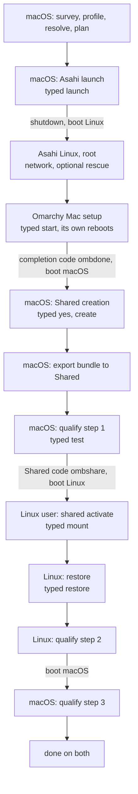

# Journey and qualification

**Status: designed for M16 (journey, qualification) and used by M17/M18; not
implemented.** Baseline behaviour referred to here is the accepted baseline
in `MILESTONES.md`; the screens are in docs/UX.md.

The install crosses at least five reboots and two operating systems that
never run at the same time. This document covers how the tool keeps one
coherent journey across them, the automated cross-OS qualification, and
what turns a real install into a hardware-validated release. What may cross
between the systems before and after Shared exists is in docs/MIGRATION.md
→ *Moving between the systems*.

## The journey

Ten stations, the same on both systems, drawn by the frontend as the
journey rail (docs/UX.md → *The rail*); `status` prints them one per line:

```text
survey · profile · resolve · plan · asahi · omarchy · shared · restore · verify · done
```

| Stage | Runs on | Done when (read from the machine) | Skippable |
| --- | --- | --- | --- |
| survey | macOS | the survey read this Mac this run | no |
| profile | macOS | a Migration Profile for this Mac with every choice made (docs/MIGRATION.md) | yes: "no migration" |
| resolve | macOS | every included item `resolved` or `unsupported` and the profile finished; the aarch64 availability check run or declined (docs/RESOLVER.md) | with profile |
| plan | macOS | a saved plan whose invariants hold on a fresh read of the disk | no |
| asahi | macOS, then Linux | the Asahi install classified `installed` (macOS) or Asahi Linux booted (Linux) | no |
| omarchy | Linux | Omarchy Mac finished: the baseline's marker, conf and encryption signals | no |
| shared | macOS, then Linux | Shared `created` (macOS) / `ready` (Linux) | yes: not planned |
| restore | macOS, then Linux | a bundle exported to a verified destination (macOS); the restore `complete` (Linux; docs/RESTORE.md → *States*) | with profile |
| verify | both | qualification passed, restore verification passed, doctor has no FAIL | no |
| done | both | every stage above done or skipped | — |

The profile comes before the plan because what is coming to Linux tells the
planner how much room Linux needs: the plan screen shows the selection's
estimated size beside the Linux presets. A skipped stage shows as skipped,
never as done. `profile`, `resolve` and `plan` may be redone before the
Asahi launch; after it, a new plan is refused by the baseline (the disk no
longer matches), while a new profile can still be sealed and exported (it is
then a different profile; see *Import* in docs/MIGRATION.md).

### What each system can see

Each system reads only its own machine. macOS cannot read the encrypted
Linux root; Linux has no APFS access. What one side knows about the other
comes through three channels, each input only:

| Channel | Direction | When | Carries |
| --- | --- | --- | --- |
| resume token (typed) | macOS → Linux | before Asahi | choices, plan id, profile id (docs/MIGRATION.md) |
| completion and Shared codes (typed) | both | baseline | Linux finished; Shared created |
| journey notes on Shared | both | after Shared is ready | each side's last derived stage states |

A journey note is `omarchy-mac-bootstrap/journey/<plan8>/<os>.omb` on Shared,
written by each side at the end of any act run (never by read, plan or dry
runs), only onto Shared
verified by the baseline's identity checks (macOS: the mount point diskutil
reports for Shared's GUID; Linux: the device number traced through `lsblk`
to Shared's PARTUUID). It holds the tool's commit, the time, and the stage
states that side derived. The other side shows it as *recorded by Linux at
…*, never as a stage's state, and never as the reason to allow anything.

### Across reboots

- Every run re-derives every stage from the machine; records only fill in
  what this system cannot see, marked as recorded.
- Before any reboot the tool prints what to do after it: which system to
  boot, how (Startup Options), what to run, and what will be asked. The
  Asahi installer ends in a shutdown, so that text is shown before the
  launch (baseline).
- Nothing starts by itself after a reboot. The tool installs no login item,
  unit or profile hook; the next run is always the person typing
  `./omarchy-bootstrap`. A default run offers the next step and waits for
  its typed word; a reboot never counts as consent.
- Every stage's screen answers five questions: where we are, what is done,
  what comes next, what is blocked and why, what you do now.



Without Shared, the `shared` stage is skipped, the bundle travels on
removable media, and the cross-OS round trip is not run (verify then covers
restore and doctor only; see *Without Shared*).


## Qualification

### What it proves

That the two systems agree about the one partition they share, on this
Mac: macOS writes a file over 4 GiB and Linux reads it back bit for bit,
Linux writes one and macOS reads it back, file names survive both
directions, and each side vouches only for the partition the baseline
identified as Shared. No hash is copied by hand.

### Files

```text
on Shared:  omarchy-mac-bootstrap/qualify/<plan8>/<round>/
              round.omb        step 1, macOS
              data.bin         generated by macOS
              names/           names written by macOS
              linux.omb        step 2, Linux
              data.linux.bin   generated by Linux
              names-linux/     names written by Linux
              result.omb       step 3, macOS
            omarchy-mac-bootstrap/qualify/<plan8>/stages/   stage records mirrored for the report
locally:    qualify/active.omb     (macOS and Linux state directories) the round this system is part of
            qualify/rounds/<round>/created.omb    (macOS) written before the round's folder on Shared
            qualify/rounds/<round>/finished.omb   (macOS) written with result.omb
            qualify/rounds/<round>/cleaned.omb    (macOS) written by qualify clean
            qualify/stages/*.omb   this system's stage records
```

Every record is written to a temporary name with exclusive creation,
flushed and renamed into place; exFAT has no journal, and the seal catches a
record torn by a crash. The flush is `sync FILE` on Linux; macOS's `sync`
takes no file argument, so there it is a whole-system `sync`.

| Record | Written by | Schema |
| --- | --- | --- |
| `round` (`round.omb`) | macOS, step 1 | `schema:uint round:hex16 plan:hex64 shared_guid:bytes created:utc os:enum(macos) tool:id commit:hex40? source:hex64 frontend:hex64? bytes:uint generator:id sha256:hex64 name:bytes*` |
| `linux` (`linux.omb`) | Linux, step 2 | `schema:uint round:hex16 previous:hex64 partuuid:bytes majmin:id os:enum(linux) tool:id commit:hex40? source:hex64 frontend:hex64? read_sha256:hex64 bytes:uint generator:id sha256:hex64 name_seen:bytes* name_written:bytes* name_collision:bytes* kernel:id dirty:bool` |
| `result` (`result.omb`) | macOS, step 3 | `schema:uint round:hex16 previous:hex64 os:enum(macos) data_ok:bool return_ok:bool names_ok:bool verdict:enum(passed\|failed) reason:id?` |
| `active` (`active.omb`, local) | each side | `schema:uint round:hex16 plan:hex64 shared_guid:bytes step:uint started:utc` |
| `created`, `finished`, `cleaned` (`rounds/<round>/<state>.omb`, local) | macOS | `schema:uint round:hex16 plan:hex64 shared_guid:bytes at:utc` — one immutable file per state, never rewritten |

`previous` is the SHA-256 of the step file before it, so each step names the
exact file it continued from.

**A round's local state** is read from which of its three files exist, each
written once with exclusive creation, so no state is ever rewritten into
another:

| Files present | State | Allowed next |
| --- | --- | --- |
| `created` | active or waiting | `finished` (step 3), `cleaned` (`qualify clean`) |
| `created`, `finished` | finished | `cleaned` |
| `created`, `cleaned`, with or without `finished` | cleaned (it wins) | none |
| `finished` or `cleaned` without `created`; any file that fails admission | invalid: the round is treated as cleaned and reported | none |

### Binding and freshness

Each side checks, in this order, and stops at the first failure before
reading or writing anything else on the partition:

1. **The partition is Shared**: the baseline's identity checks, unchanged
   (macOS: the mount point diskutil reports for Shared's GUID on this Mac's
   internal disk; Linux: the mount's `MAJ:MIN` traced through `lsblk` to
   Shared's PARTUUID on root's disk). A manifest on any other volume is never
   opened, because this runs first.
2. **The records are admissible and whole**: docs/PROTOCOL.md → §2, and their
   seals.
3. **They belong to this install**: `plan` equals the local plan record's
   digest (macOS) or begins with the token's plan id (Linux); `shared_guid`
   equals the partition just verified; `schema` is this tool's.
4. **The round's freshness, as each side can know it.**
   - **macOS is the authority.** A round is current on macOS only if its
     `active.omb` names it and its local state is active (`created`, no
     `finished`, no `cleaned`). macOS writes `rounds/<round>/created.omb`
     and `active.omb` **before** it creates the round's folder, refuses to
     start a round while any round it created is neither finished nor
     cleaned, and never names a finished or cleaned round in `active.omb`
     again; round ids are 64 random bits, so a new round never equals an old
     one.
   - **Linux can only accept a candidate.** Linux has no record of what
     macOS created or cleaned. It accepts step 1 as a **provisional
     candidate** after checks 1–3 and when exactly one round folder under
     the plan's folder has a `round.omb` and no `linux.omb` (with more than
     one it is `blocked` and names them), writes its own `active.omb`, and
     runs step 2. Its screen and records say *provisional until macOS reads
     it back*, never "current" or "qualified".
   - **Only macOS can pass a round.** Step 3 runs only for the round macOS's
     own `active.omb` names. So a stale or cleaned round restored to Shared
     can make Linux do its step on it — provisional work — but can **never**
     produce a passing qualification: macOS reports the folder as not its
     active round, and it stays unpassed.
5. **The steps follow each other**: step 2 requires a `round.omb` and no
   `linux.omb` yet; step 3 requires a `linux.omb` whose `previous` is the
   digest of this round's `round.omb`, and no `result.omb` yet.

Clocks are never compared: the two systems may disagree about the time.

### The stream

Both data files are generated by one normative construction:

| Part | Definition |
| --- | --- |
| size | **4 296 015 889 bytes**: 4 GiB + 1 MiB + 17, past FAT32's limit and not aligned to any block |
| round id | 16 lowercase hex digits from 8 random bytes, chosen by macOS |
| key | SHA-256 over the ASCII bytes `omb-qualify-v1:<round>:<side>`, with `<side>` `macos` or `linux`, no newline; used as the 32-byte AES-256 key |
| cipher | AES-256 in counter mode over zero plaintext: the file *is* the key stream |
| counter | the 128-bit counter block, big-endian, equals the byte offset divided by 16; 0 at offset 0 |
| production | `head -c <len> /dev/zero \| openssl enc -aes-256-ctr -nosalt -K <key hex> -iv <counter hex>` written straight to the file; chunks, if used, start at multiples of 16 bytes with the counter for their offset, and do not change a byte |
| checks | both commands' exit statuses are 0 — captured from `PIPESTATUS` in the first assignment after the pipeline, before any other command can replace it — and the file's size is exactly the size asked; otherwise the step fails. Nothing reads the stream through `head` after `openssl`, so no expected SIGPIPE can hide a real failure |
| digest | SHA-256 of the written file, read back from the filesystem |
| memory | streamed; nothing holds more than a pipe buffer |

Reference vectors (LibreSSL 3.3.6, stock macOS, 2026-09-26; the same values
are asserted against OpenSSL on Linux in CI, docs/TESTING.md →
`qual-vector-*`):

| Round, side | Value |
| --- | --- |
| `0000000000000000`, `macos` key | `c0dc808737ba8490fcd794c33d2e95fa324567ab8cdd8006a7f9ee9d00352d4b` |
| first 17 bytes | `8e62fa68f4e718c5e8cf1db12b4d1bc350` |
| SHA-256 of the first MiB | `fb5d3aaff4e28f83b5a847755f308458c4f14727747c6bcbabe5a58c13d1a770` |
| SHA-256 of the MiB at offset 2³² (counter `…10000000`) | `c4d6457668abe8c8811bc92c4d29d9d0c15a17ff7cae6cf8d348e9858680f022` — equal whether generated from that counter or cut from the full stream |
| SHA-256 of all 4 296 015 889 bytes | `710284a00a44b05ec822046b1b0701d25738306bd54c398c925d7a199b5d6b77` |
| `0000000000000000`, `linux` key | `3f6bd3f9c25b9e09b746752b6e455d0d1e992f31f03954102b49290aac345af5` |
| its first 32 bytes | `93abcec869429ef94c9c32f71d028cd4e481840cd318137c4bdd22adeb937fd6` |

Either side can compute the other side's expected digest itself, so a
damaged record and damaged data are told apart.

### Space

Before writing, each side requires free space on Shared of at least:
macOS, twice the stream (its file and Linux's return file) + 1 MiB for
records and names + a reserve of the larger of 1 GiB and 2 % of Shared;
Linux, one stream + 1 MiB + the same reserve. Files kept from a failed round
are already counted in what is used. Too little space is `blocked`, with the
numbers.

### Names

Fixed names (ASCII; a precomposed and a decomposed `é`; two names differing
only in case; a 255-byte name; a name with a space) are written into the
round's own folder, **each with exclusive creation**: a name that already
exists (on case-insensitive exFAT, the second of the case pair) is recorded
as a collision and never overwritten. Each side records what it wrote, what
it sees, and each collision, byte for byte.

### The round trip

```mermaid
sequenceDiagram
    participant M as macOS
    participant S as Shared (exFAT)
    participant L as Linux (everyday user)
    M->>M: identity, space; active.omb (new round)
    M->>S: data.bin, names/, round.omb
    Note over M,L: clean shutdown, boot Linux
    L->>L: identity; admit and bind round.omb; active.omb
    L->>S: SHA-256 of data.bin = expected?
    L->>S: data.linux.bin, names-linux/, linux.omb
    Note over M,L: clean shutdown, boot macOS
    M->>M: identity; admit, bind, active round, previous
    M->>S: SHA-256 of data.linux.bin = expected? names?
    M->>S: result.omb
    M->>S: passed: remove the round's data files and names
```

- **Nothing is written before the checks.** A side that cannot verify the
  identity or the binding writes nothing on Shared, not even a failure
  record; it reports on screen and in its own log.
- **A step that stops part-way** (the producer or the writer failed, the
  size is short, the digest does not match) fails the round: the files stay
  for inspection, and the expected digest is never rewritten.
- **Removal is by record.** After a pass, macOS removes the data files and
  name folders that the round's own records list. `qualify clean` (typed
  `clean`, macOS) removes only round folders whose round has a local
  `rounds/<round>/created.omb`, writes that round's `cleaned.omb` (and
  clears `active.omb` if it named the round), and in those folders removes
  only the names this schema fixes (the three step
  files, the two data files, the fixed test names and their folders), after
  showing them; anything else found there is reported and left, as is
  anything it could not remove. Linux removes
  nothing on Shared. Stage records are never removed by either.
- **Clean shutdowns**: each step ends by saying to shut down fully, not to
  sleep (docs/SHARED.md); an exFAT dirty flag seen by Linux is recorded
  (`dirty`) and shown in the verdict.

### States

Derived on every run from the verified Shared partition and the local
records:

| State | Meaning |
| --- | --- |
| `not-started` | no active round on this system |
| `waiting-for-linux` | the active round has `round.omb`, no `linux.omb` |
| `waiting-for-macos` | the active round has `linux.omb`, no `result.omb`; on Linux, the round is a provisional candidate until macOS reads it back |
| `in-progress` | this side's step began and did not finish; it starts again from its first check |
| `passed` | `result.omb` records a pass for the active round |
| `failed` | `result.omb` records a mismatch, or a step stopped part-way; the files stay |
| `blocked` | identity, admission, binding, active round, step order or space failed; the reason is shown |

`qualify` runs whichever step is due on this system and refuses the other
side's step. `qualify status` is read-only.

### Without Shared

The round trip qualifies Shared, so without Shared it is not run and the
verify stage says so; restore verification and doctor still gate `verify`.

## What ran: source and artifact identity

A commit string is a claim; evidence needs to know what actually ran.

- **Executed source.** At the start of every act run the core computes
  `source`: the SHA-256 of a canonical listing `omb-source 1` followed by one
  line per file of the tool itself — the entrypoint, `lib/`, `data/`,
  `release/frontend.lock` — `<path> TAB <sha256>`, in byte order of the path.
  (`frontend/` has its own identity; `tests/`, `docs/` and `.omb-commit` are
  not part of what runs.)
- **Claimed commit.** From Git when the tool runs from a checkout, otherwise
  from `.omb-commit`, which the Phase 1 guide's fetch command writes; `unknown`
  if neither.
- **The frontend.** The SHA-256 of the binary the launcher verified and ran.

Every stage record carries all three. Checking a report recomputes the
listing from the claimed commit (`git archive`); only an equal `source`
proves the run was that commit, unmodified. A stage whose `source` does not
match its commit, or whose commit is unknown, cannot count towards M18.

## Real-hardware qualification (M17)

M17 is the first real install, run with the finished tool, on the target
Mac (2021 16-inch MacBook Pro, M1 Pro, 16 GB, 1 TB). It is not a separate
procedure: the journey records what M17 needs as it goes.

### Stage records

Each act run that completes a stage writes `qualify/stages/<stage>.omb`
locally: the three identities above, the time, and what the machine showed —
check results, never command output, nothing secret. Once Shared is
verified, each act run also copies its stage records to Shared, so `report`
on either system reads both systems' records (checked like any
qualification record). Without Shared, each system's report covers its own
stages, and M18 commits both.

### What the tool checks and what only the person can

| Check | How |
| --- | --- |
| a current backup | the typed `yes` gate (baseline); the tool cannot check it |
| the survey matches the disk | automatic: the survey's geometry is stored in the stage record, beside `diskutil list` read in the same run |
| Asahi installed with the planned answers; planned and actual extents match | automatic: the re-read after the installer, compared extent by extent with the plan record, stored |
| macOS and Linux boot | automatic: a run on each system after the install is the record |
| Recovery boots | attested: the person confirms it (yes/no), recorded as confirmed, not checked |
| encryption finished (as root, header before the code) | automatic: the baseline's encryption state, stored |
| `shared` shows `awaiting-macos-creation` back on macOS | automatic |
| no other disk tool running during creation | attested |
| `sudo -n` ran the creation without asking again after `sudo -v` | automatic: the creation record's result and the recorded exit status |
| the partition matches the size and start shown | automatic: the creation record's check (baseline) |
| written from macOS; mounted on Linux, PARTUUID matched through `MAJ:MIN` | automatic: `qualify` steps 1 and 2 |
| a file over 4 GB both ways | automatic: `qualify` |
| clean reboots; the mount persists | automatic: step 2 runs after a reboot with the automount in place; a dirty flag is recorded |
| restore healthy | automatic: `restore status`, and the live checks of `restore verify` |
| a rerun changes nothing | automatic: after `done`, the default run on each system offers no action, and `restore` finds every item already in place |
| the frontend works here | automatic: it was acquired and verified on both systems, ran on the Linux console (`TERM=linux`, ASCII, sixteen colours) and on 16 KiB pages, and after every handoff the core's log shows the same session asking for a fresh snapshot; the person confirms the console showed no leftover frame or broken terminal (attested) |
| the rescue path works here | automatic, when used: which agent started under the 16 KiB-page kernel; the SSH final state; `rescue remove` left nothing behind |
| the hardware-only facts | each fact in docs/UPSTREAM.md → *Not verified yet* marked hardware-only is observed and recorded |

The person's part is exactly: confirm the backup, choose, authenticate where
upstream or `sudo` asks, use Startup Options when told, type the disk
passphrase, boot the system the tool names, confirm the three attested
steps, and stop when the tool says the machine differs from what it
expected.

### The report

`report` (read-only, either system) prints the hardware report from the
stage records and a fresh read: the Mac (model identifier, chip, memory,
disk size), macOS version, each stage's three identities, planned and actual
extents, every check with pass, fail or attested, the round trip's digests,
the restore summary, doctor's warnings, and anything unexplained. It is the
document M18 commits.

## Hardware-validated release (M18)

A commit is **hardware validated for one Mac model and chip** when a report
from M17 shows every check passing (attested steps confirmed), every warning
explained, every stage's executed source matching its commit, and all
evidence still valid for that commit under the rule below.

### Evidence is scoped by behaviour

What was **measured** stays a fact about the machine: the disk's actual
extents, the partition GUIDs, the time a file took. What a later change can
invalidate is the evidence that the changed code **behaves** as recorded.
Evidence is grouped by the behaviour it proves; a change invalidates only the
groups whose files it touches (`git diff --name-only` between the commit that
produced the evidence and the candidate), at file granularity, so the rule is
conservative:

| Evidence | Produced by | Invalidated by a change to |
| --- | --- | --- |
| the action path: gates, bases, exclusion, supervision | every act stage | `omarchy-bootstrap`, `lib/common.sh`, `lib/state.sh`, `lib/records.sh`, `lib/core.sh` |
| geometry and planning | survey, plan | `lib/storage.sh`, `lib/macos.sh`, `lib/sources.sh` |
| the Asahi handoff and classification | asahi | `lib/macos.sh`, `lib/asahi.sh`, `lib/sources.sh` |
| the Omarchy handoff and encryption classification | omarchy | `lib/linux.sh`, `lib/sources.sh` |
| Shared creation | shared, macOS | `lib/shared.sh`, `lib/macos.sh` |
| Shared mount identity | shared, Linux | `lib/shared.sh`, `lib/linux.sh` |
| the round trip | verify | `lib/qualify.sh` |
| restore outcomes | restore | the migration modules, the AI providers, `data/registry.omb` |
| the terminal and the frontend on this Mac | every stage run through the frontend | the frontend's source inputs (`inputs_digest`), `release/frontend.lock`, `lib/frontend.sh`, `lib/core.sh` |

A change to the frontend's handoff invalidates the terminal evidence and
must be run again on the Mac; it does not invalidate the measured partition
layout or the Shared creation evidence. Invalidated evidence is either run
again on the new commit, or the release stays validated only at the earlier
commit.

- **Scope.** Validation names the model identifier and chip it ran on
  (`MacBookPro18,2`, M1 Pro, for the target) and nothing else. Other M1 and
  M2 machines remain "supported upstream, not validated by this tool".
- **Record.** The report is committed as `docs/hardware/<model>-<date>.md`,
  the README's tested-on table gains one row (model, chip, macOS, commit,
  date), and one annotated tag `hw-<model>-<date>` marks the validated
  commit. With the frontend's `frontend-v<version>` release tags
  (docs/FRONTEND.md), these are the only tags this repository uses.
