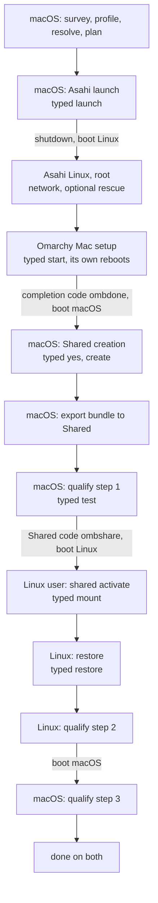

# Journey and qualification

**Status: designed for M16 (journey, qualification) and used by M17/M18; not
implemented.** Baseline behaviour referred to here is the accepted baseline
in `MILESTONES.md`; the screens are in docs/UX.md.

The install crosses at least five reboots and two operating systems that
never run at the same time. This document covers how the tool keeps one
coherent journey across them, the automated cross-OS qualification, and
what turns a real install into a hardware-validated release. What may cross
between the systems before and after Shared exists is in docs/MIGRATION.md
→ *Moving between the systems*.

## The journey

Ten stations, the same on both systems, drawn by the frontend as the
journey rail (docs/UX.md → *The rail*); `status` prints them one per line:

```text
survey · profile · resolve · plan · asahi · omarchy · shared · restore · verify · done
```

| Stage | Runs on | Done when (read from the machine) | Skippable |
| --- | --- | --- | --- |
| survey | macOS | the survey read this Mac this run | no |
| profile | macOS | a Migration Profile for this Mac with every choice made (docs/MIGRATION.md) | yes: "no migration" |
| resolve | macOS | every included item `resolved` or `unsupported` and the profile finished; the aarch64 availability check run or declined (docs/RESOLVER.md) | with profile |
| plan | macOS | a saved plan whose invariants hold on a fresh read of the disk | no |
| asahi | macOS, then Linux | the Asahi install classified `installed` (macOS) or Asahi Linux booted (Linux) | no |
| omarchy | Linux | Omarchy Mac finished: the baseline's marker, conf and encryption signals | no |
| shared | macOS, then Linux | Shared `created` (macOS) / `ready` (Linux) | yes: not planned |
| restore | macOS, then Linux | a bundle exported to a verified destination (macOS); the restore `complete` (Linux; docs/RESTORE.md → *States*) | with profile |
| verify | both | qualification passed, restore verification passed, doctor has no FAIL | no |
| done | both | every stage above done or skipped | — |

The profile comes before the plan because what is coming to Linux tells the
planner how much room Linux needs: the plan screen shows the selection's
estimated size beside the Linux presets. A skipped stage shows as skipped,
never as done. `profile`, `resolve` and `plan` may be redone before the
Asahi launch; after it, a new plan is refused by the baseline (the disk no
longer matches), while a new profile can still be sealed and exported (it is
then a different profile; see *Import* in docs/MIGRATION.md).

### What each system can see

Each system reads only its own machine. macOS cannot read the encrypted
Linux root; Linux has no APFS access. What one side knows about the other
comes through three channels, each input only:

| Channel | Direction | When | Carries |
| --- | --- | --- | --- |
| resume token (typed) | macOS → Linux | before Asahi | choices, plan id, profile id (docs/MIGRATION.md) |
| completion and Shared codes (typed) | both | baseline | Linux finished; Shared created |
| journey notes on Shared | both | after Shared is ready | each side's last derived stage states |

A journey note is `omarchy-mac-bootstrap/journey/<plan8>/<os>.omb` on Shared,
written by each side at the end of any act run (never by read, plan or dry
runs), only onto Shared
verified by the baseline's identity checks (macOS: the mount point diskutil
reports for Shared's GUID; Linux: the device number traced through `lsblk`
to Shared's PARTUUID). It holds the tool's commit, the time, and the stage
states that side derived. The other side shows it as *recorded by Linux at
…*, never as a stage's state, and never as the reason to allow anything.

### Across reboots

- Every run re-derives every stage from the machine; records only fill in
  what this system cannot see, marked as recorded.
- Before any reboot the tool prints what to do after it: which system to
  boot, how (Startup Options), what to run, and what will be asked. The
  Asahi installer ends in a shutdown, so that text is shown before the
  launch (baseline).
- Nothing starts by itself after a reboot. The tool installs no login item,
  unit or profile hook; the next run is always the person typing
  `./omarchy-bootstrap`. A default run offers the next step and waits for
  its typed word; a reboot never counts as consent.
- Every stage's screen answers five questions: where we are, what is done,
  what comes next, what is blocked and why, what you do now.



Without Shared, the `shared` stage is skipped, the bundle travels on
removable media, and the cross-OS round trip is not run (verify then covers
restore and doctor only; see *Without Shared*).

## Qualification

### What it proves

That the two systems agree about the one partition they share, on this
Mac: macOS writes a file over 4 GiB and Linux reads it back bit for bit,
Linux writes one and macOS reads it back, file names survive both
directions, and each side vouches only for the partition the baseline
identified as Shared. No hash is copied by hand.

### Files on Shared

```text
omarchy-mac-bootstrap/qualify/<plan8>/<round>/
  round.omb        step 1, macOS: the round, its binding, the expected digests
  data.bin         4 GiB + 1 MiB + 17 B, generated by macOS
  names/           small files with names that test normalisation and case
  linux.omb        step 2, Linux: what it read, what it wrote
  data.linux.bin   generated by Linux
  names-linux/     names Linux wrote
  result.omb       step 3, macOS: the verdict
```

`<plan8>` is the plan id from the resume token; `<round>` is 16 random hex
digits chosen by macOS when a round starts. The `.omb` files use the record
format of docs/PROTOCOL.md (ASCII, tab-separated, percent-encoded values,
ending in a `seal` line with the SHA-256 of everything above it). exFAT has
no journal; the seal catches a record torn by a crash, and each record is
written to a temporary name and renamed into place.

`round.omb` holds: schema, the tool's version and commit, the full plan
digest, the Shared partition's full GPT GUID, the round id, the data file's
name, size, generator and SHA-256, the names written, the time, `os=macos`.
`linux.omb` adds the round id, the PARTUUID and `MAJ:MIN` Linux verified,
the digest it computed for `data.bin`, its own file's generator, size and
digest, the names it read and wrote, the kernel version, and any exFAT
warning from the kernel log for this mount (a volume not cleanly
unmounted). `result.omb` holds the round id, each comparison and the
verdict.

### Binding and freshness

Each side runs its checks in this order and stops at the first failure,
before reading or writing anything else on the partition:

1. **The partition is Shared.** The baseline's identity checks, unchanged:
   the filesystem at the mount point is the chosen Shared partition on this
   Mac's internal disk (macOS) or on root's disk (Linux). A valid-looking
   manifest on any other volume is never read, because this check runs
   first.
2. **The records are whole.** Every `.omb` parses and its seal matches.
3. **The records belong here.** `round.omb`'s plan digest equals the local
   plan record's digest (macOS) or begins with the token's plan id (Linux);
   its Shared GUID equals the GUID of the partition just verified. A round
   copied from another install, or from another disk carrying the same
   files, fails here.
4. **The round is one round.** Every step file names the same round id; a
   step file from an earlier round is ignored. More than one unfinished
   round for this plan blocks, naming both, until `qualify clean`.

Clocks are not used to judge anything: macOS and Linux may disagree about
the time. Timestamps are shown, never compared.

### The round trip

```mermaid
sequenceDiagram
    participant M as macOS
    participant S as Shared (exFAT)
    participant L as Linux (everyday user)
    M->>M: verify Shared identity, free space >= 2 x size + 1 GiB
    M->>S: data.bin (generated), names/
    M->>S: round.omb (digests, binding), sealed
    Note over M,L: clean shutdown, boot Linux
    L->>L: verify Shared identity (MAJ:MIN -> lsblk -> PARTUUID)
    L->>S: read round.omb, check seal and binding
    L->>S: hash data.bin = expected?
    L->>S: data.linux.bin (generated), names-linux/
    L->>S: linux.omb, sealed
    Note over M,L: clean shutdown, boot macOS
    M->>M: verify Shared identity
    M->>S: read linux.omb, check seal, binding, round
    M->>S: hash data.linux.bin = expected? names read back?
    M->>S: result.omb (pass or fail), sealed
    M->>S: pass: remove data files and names; keep the three records
```

- **The data files are deterministic.** Each is the AES-256-CTR keystream of
  `openssl enc -aes-256-ctr -nosalt` with the key `SHA-256(round id +
  side)` and a zero IV, cut to size with `head -c`. Stock macOS ships
  LibreSSL (3.3.6 read on 2026-09-26) and Omarchy ships OpenSSL; both
  compute the same stream, which the test suite asserts on both CI jobs
  against a pinned digest (docs/TESTING.md). Either side can therefore
  compute the expected digest of the other side's file itself: a corrupted
  record and corrupted data are told apart, and nothing depends on a digest
  having been carried correctly.
- **The size crosses 4 GiB deliberately:** 4 GiB + 1 MiB + 17 bytes, past
  FAT32's limit and not aligned to any block or cluster size.
- **Names:** ASCII, a precomposed and a decomposed `é`, a name differing only
  in case from another (exFAT is case-insensitive: the second write must
  report a collision, not a second file), a long name, and a name with a
  space. Each side reports what it finds, byte for byte.
- **Nothing is written before the checks.** A side that cannot verify the
  identity or the binding writes nothing, not even a failure record: it
  reports on screen and in its own log.
- **Automatic cleanup only after a pass.** macOS removes the data files and
  name directories by itself only after `result.omb` records a pass; on a
  failure they stay for inspection, and only `qualify clean` (typed `clean`)
  removes this plan's round folders, after showing them. The stage records
  under `stages/` are never removed by either.
- **Clean shutdowns.** Each step ends by saying to shut down fully, not to
  sleep (docs/SHARED.md); an exFAT dirty flag seen by Linux is recorded as
  a warning in `linux.omb` and shown in the verdict.

### States

Derived on every run from the verified Shared partition and the local
records:

| State | Meaning |
| --- | --- |
| `not-started` | no round for this plan on Shared |
| `waiting-for-linux` | `round.omb` sealed, no `linux.omb` |
| `waiting-for-macos` | `linux.omb` sealed, no `result.omb` |
| `in-progress` | this side's own step is under way (a run was interrupted: the step starts again from its first check) |
| `passed` | `result.omb` records a pass for the current round |
| `failed` | `result.omb` records a mismatch; the files stay |
| `blocked` | identity, seal, binding or round check failed, or not enough space; the reason is shown |

`qualify` runs whichever step is due on this system and refuses the other
side's step with where to go instead. `qualify status` is read-only.

### Without Shared

The round trip exists to qualify Shared, so without Shared it is not run and
the verify stage says so. Restore verification and doctor still gate
`verify`.

## Real-hardware qualification (M17)

M17 is the first real install, run with the finished tool, on the target
Mac (2021 16-inch MacBook Pro, M1 Pro, 16 GB, 1 TB). It is not a separate
procedure: the journey records what M17 needs as it goes.

### Stage records

Each act run that completes a stage writes one stage record in the state
directory, `qualify/stages/<stage>.omb`: the tool's version and commit, the
time, and what the machine showed — the check results, never command
output, and nothing secret. The commit comes from Git when the tool runs
from a checkout, otherwise from `.omb-commit`, which the Phase 1 guide's
fetch command writes beside the code; with neither, the commit is recorded
as `unknown`, and a stage with an unknown commit cannot count towards M18.

Stage records are split between systems and users (macOS; root and the
everyday user on Linux). Once Shared is verified, each act run also copies
its stage records to Shared, `omarchy-mac-bootstrap/qualify/<plan8>/stages/`,
so `report` on either system reads both systems' records (those on Shared
checked like any qualification record). Without Shared, each system's
report covers its own stages, and M18 commits both. Records are history;
the report re-derives what it can.

### What the tool checks and what only the person can

| Check | How |
| --- | --- |
| a current backup | the typed `yes` gate (baseline); the tool cannot check it |
| the survey matches the disk | automatic: the survey's geometry is stored in the stage record, beside `diskutil list` read in the same run |
| Asahi installed with the planned answers; planned and actual extents match | automatic: the re-read after the installer, compared extent by extent with the plan record, stored |
| macOS and Linux boot | automatic: a run on each system after the install is the record |
| Recovery boots | attested: the person confirms it (yes/no), recorded as confirmed, not checked |
| encryption finished (as root, header before the code) | automatic: the baseline's encryption state, stored |
| `shared` shows `awaiting-macos-creation` back on macOS | automatic |
| no other disk tool running during creation | attested |
| `sudo -n` ran the creation without asking again | automatic: the creation record's result and the recorded exit status |
| the partition matches the size and start shown | automatic: the creation record's check (baseline) |
| written from macOS; mounted on Linux, PARTUUID matched through `MAJ:MIN` | automatic: `qualify` steps 1 and 2 |
| a file over 4 GB both ways | automatic: `qualify` |
| clean reboots; the mount persists | automatic: step 2 runs after a reboot with the automount in place; a dirty flag is recorded |
| restore healthy | automatic: `restore status`, and the live checks of `restore verify` |
| a rerun changes nothing | automatic: after `done`, the default run on each system offers no action, and `restore` finds every item already in place |
| the frontend works here | automatic: it was acquired and verified on both systems, ran on the Linux console (`TERM=linux`, ASCII, sixteen colours), and after every handoff the core's log shows the same session asking for a fresh snapshot; the person confirms the console showed no leftover frame or broken terminal (attested) |
| the rescue path works here | automatic, when used: which agent started under the 16 KiB-page kernel, and `rescue remove` left nothing behind |

The person's part is exactly: confirm the backup, choose, authenticate where
upstream or `sudo` asks, use Startup Options when told, type the disk
passphrase, boot the system the tool names, confirm the three attested
steps, and stop when the tool says the machine differs from what it
expected.

### The report

`report` (read-only, either system) prints a plain-text hardware report from
the stage records and a fresh read: the Mac (model identifier, chip,
memory, disk size), macOS version, the commit each stage ran, planned and
actual extents, every check with pass/fail/attested, the round-trip digests,
the restore summary, doctor's warnings, and anything unexplained. It is the
document M18 commits.

## Hardware-validated release (M18)

A commit is **hardware validated for one Mac model and chip** when a report
from M17 shows every check passing (attested steps confirmed), every
warning explained, and for each stage the commit that ran it satisfies the
stage rule:

- **The stage rule.** A stage's record names the commit that ran it. A later
  commit keeps that stage's validation only if `git diff --name-only` between
  the two touches none of the stage's files (the table below). Otherwise the
  stage must run again on the new commit, or the release is validated only
  at the earlier commit. A fix to restore after the install therefore does
  not invalidate the install stages; a fix to the planner does.

| Stage | Files whose change invalidates it |
| --- | --- |
| every stage | `omarchy-bootstrap`, `lib/common.sh`, `lib/state.sh`, `lib/records.sh`, `lib/core.sh`, `lib/journey.sh`, `lib/frontend.sh` (the launcher and the path every action takes) |
| survey, plan, asahi | `lib/sources.sh`, `lib/storage.sh`, `lib/macos.sh`, `lib/asahi.sh` |
| omarchy | `lib/sources.sh`, `lib/linux.sh` |
| shared | the survey, plan, asahi and omarchy files, and `lib/shared.sh` |
| profile, resolve, restore | the migration modules, the AI tool providers and the registry (docs/ARCHITECTURE.md) |
| verify | `lib/qualify.sh`, `lib/doctor.sh` |
| the frontend on this Mac (console rendering, handoffs) | `frontend/`, `frontend/frontend.lock`, `lib/core.sh` |

A stage's files are its own row plus the *every stage* row. A change to
`frontend/` alone never invalidates a disk stage: the frontend decides
nothing the core does not check again (docs/PROTOCOL.md).

- **Scope.** Validation names the model identifier and chip it ran on
  (`MacBookPro18,2`, M1 Pro, for the target) and nothing else. Other M1 and
  M2 machines remain "supported upstream, not validated by this tool".
- **Record.** The report is committed as
  `docs/hardware/<model>-<date>.md`, the README's tested-on table gains one
  row (model, chip, macOS, commit, date), and one annotated tag
  `hw-<model>-<date>` marks the validated commit. With the frontend's
  `frontend-v<version>` release tags (docs/FRONTEND.md), these are the only
  tags this repository uses.
