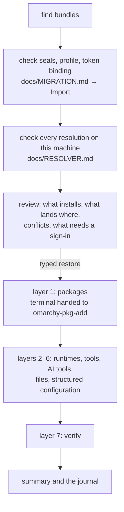

# Restore

**Status: designed for M15; not implemented.**

`restore [DIR]` (act, Linux) brings a bundle (docs/MIGRATION.md) onto
Omarchy: it installs what the resolution chose (docs/RESOLVER.md), places
the selected files, re-creates the structured configuration through its
owners' interfaces, and verifies all of it on the machine. The AI tools'
part is in docs/AI-TOOLS.md.

## Who, where and when

- **As the everyday user, never as root.** `restore` refuses `EUID` 0. It
  writes only inside that user's home, with that user's ownership. It never
  writes under `/etc`, `/usr` or `/opt`; system changes happen only through
  Omarchy's own helpers and `pacman` (via `omarchy-pkg-add`), which ask for
  `sudo` themselves in the terminal.
- **After Omarchy has finished**, the baseline's Linux signals (marker, no
  setup conf or unit, encryption finished). Before that, `restore` says what
  it is waiting for.
- **From a verified place**: Shared, identified by the baseline's checks, or
  a directory the person gives.

## The flow



The review is the decision point: nothing is written before `restore` is
typed, and the typed word covers exactly what the review showed (its basis,
docs/PROTOCOL.md). Conflicts are decided in the review, one by one or with a
choice for the rest; the default for every conflict is **Keep**.

## The restore journal

`restore/journal.omb` in the state directory: an append-only record file,
one line per step, written **before** the step starts and again when it
ends. It is history and input; the machine is judged afresh every run.

```text
omb-restore 1
run	id=6e1f0a2c	bundle=3f09c2a1b7d45e60-20261009T182000Z	started=2026-10-10T09:14:02Z	tool=0.3.0
step	run=6e1f0a2c	item=brew:formula:ripgrep	action=install	state=begin	method=pacman	target=ripgrep
step	run=6e1f0a2c	item=brew:formula:ripgrep	action=install	state=done	check=pacman-q	found=15.2.0-1
step	run=6e1f0a2c	item=path:config:starship	action=place	state=begin	dest=.config/starship.toml	sha256=…	backup=restore/backups/6e1f0a2c/.config/starship.toml	old=…
step	run=6e1f0a2c	item=path:config:starship	action=place	state=done
```

Each step records what it intends (the digest it will write, the old
digest, the backup path, the old value of a setting) so that an interrupted
step can be judged and an undo can be exact.

## Placing a file

For a destination `D` under the home:

1. **The way there is plain.** Every folder from the home down to `D`'s
   parent is a real directory owned by the user; a link on the way stops the
   file ("a folder on the way is a link") rather than following it out of
   the home. Missing folders are created 0700 (0755 for the known public
   configuration folders such as `.config/<tool>`).
2. **What is there now.** Nothing: place it. The same bytes: nothing to do.
   Different bytes, or a file where a folder should be: a conflict, decided
   in review.
3. **Write beside, then rename.** The object is checked against its digest,
   written to `D.omb-new-<random>` in the same folder with a private umask,
   checked again, given its mode, and renamed over `D` after `D` has been
   moved to the backup. A folder unit is built whole beside its target and
   swapped in the same way.
4. **Modes are a ceiling, not a copy.** No setuid, setgid or sticky bit,
   nothing group- or world-writable; `PRIVATE_CONFIG`, `SENSITIVE` and the
   one carried key are 0600 (folders 0700). Ownership is the running user;
   `chown` is never used.
5. **Links** are re-created from the manifest's relative link text, only
   when they resolve inside the item's own destination root.

## Conflicts

Every conflict is shown with both sides and offers, from the frontend's
conflict screen (docs/UX.md):

| Choice | Does |
| --- | --- |
| **Keep** (default) | leaves what is there; the item is recorded as kept |
| **Replace** | moves what is there to the backup, places the migrated version |
| **Merge** | only where the adapter defines a merge for that format (below) |
| **View diff** | shows the difference, then asks again |
| **Skip** | leaves what is there and records the item as skipped |

- **The unit is the adapter's.** Neovim's folder, Ghostty's configuration,
  a skill folder: a unit is kept or replaced whole. Files inside a unit are
  not mixed.
- **Merge exists only where it is exact:** a line set (a global Git ignore
  file: existing lines first, new ones after, no duplicates), Git settings
  (key by key, through `git config`), MCP servers (servers not present are
  added; one with the same name is its own decision), and JSON settings
  whose adapter names the keys it adds (with `jq`, which Omarchy installs,
  using constant filters and values passed as arguments).
- **Omarchy's seeded files.** Omarchy copies its defaults into `~/.config`
  (Starship, tmux, Ghostty, OpenCode, Git and others) and treats them as the
  user's from then on; its own defaults live under `/usr/share/omarchy`,
  which the restore never touches. A conflict with a file Omarchy seeded is
  labelled "Omarchy's default", and the review says what the person's file
  would change (for a terminal configuration that sets a theme, for example,
  that Omarchy's theme switching will no longer recolour it).
- **Never touched:** `/usr/share/omarchy`, `~/.local/state/omarchy`,
  Omarchy's skill links in the AI tools' skill folders, and the lazy agent
  stubs Omarchy writes into `~/.local/bin`.

## Packages

Layer 1 (docs/RESOLVER.md → *The dependency graph*) is one `omarchy-pkg-add`
call with every pacman target the review approved, run as a **handoff**: the
frontend gives the terminal to it, so `sudo` asks for the password and
pacman shows its own output (docs/FRONTEND.md). Afterwards each package is
checked with `pacman -Q`; one the helper skipped ("not available in the
repos on this system") is `failed` with that reason, whatever the exit
status was. Everything that needed it is then `blocked`.

Layers 2–4 run managed: mise, uv, cargo-binstall, go, npm and Flathub as
their own non-root commands, each checked afterwards (`mise ls --json`,
the command on `PATH`, its version). A layer that needs `sudo` is a handoff;
nothing managed ever prompts.

## Interrupted, and run again

- **Interrupted** — a power cut, Ctrl-C in the terminal during the package
  step, a crash: the journal holds steps that began and did not end. The
  next run reconciles each one against the machine before anything else:
  a file whose digest is the one the step intended is done; a file that is
  still the old digest was not changed; anything else is a conflict to
  decide. A package is present or not (`pacman -Q`). Nothing is assumed from
  the journal alone.
- **Rerun** — every step checks first: the same bytes already in place, the
  package already installed, the server already defined identically, the
  Bash line already present — nothing to do. A rerun after success changes
  nothing and says so; a rerun after a partial restore continues where it
  stopped.
- **Another bundle** — a newer export of the same profile is restored as its
  own run; files that did not change are already in place.

## Undo

`restore undo` (typed `undo`) reverses the last run, or one item:

- a placed file goes back to its backup, or is removed if there was none —
  only when it still holds exactly what the restore wrote; a file changed
  since is left alone and named;
- Git settings return to their recorded old values;
- the Bash line and the tool's own shell file are removed;
- MCP servers the restore added are removed through the tool's own command,
  when their definition is still the one added;
- **packages are not removed.** Removing packages can take dependencies
  others need; the summary lists what the restore installed and the command
  to remove it by hand.

Backups stay in `restore/backups/<run>/` (0700) until the person removes
them; `restore status` shows their size.

## Verification and health

Nothing is "migrated" because a copy finished. After the layers, every
item is checked on the machine:

| Kind | Checked by |
| --- | --- |
| package | `pacman -Q`, then the command's version where the registry names one |
| runtime | `mise ls --json` (`installed: true`), then `mise exec -- <tool> --version` |
| ecosystem tool, Flathub app | the command on `PATH` and its version; `flatpak info` and, with consent, a launch |
| file, folder, link | the digest, mode and link text against the manifest |
| structured setting | read back through its owner (`git config --get`, the tool's own listing) |
| AI tool | docs/AI-TOOLS.md → *Health* |
| 16 KiB pages | `readelf -lW` alignment of installed binaries, when binutils is present |

**Static** checks run in `restore status` and `doctor` and **never execute
anything**: `pacman -Q`, `mise ls --json`, `flatpak info`, digests, modes,
settings read back, and whether a command on `PATH` is one of Omarchy's lazy
stubs (which would install the tool if run). Running a program's version,
starting an MCP server or launching an application happens only inside the
restore's own act run (layer 7, for what it just installed) and in `restore
verify`, after the person agrees, one at a time, with a time limit.

## States

| Restore state | Means |
| --- | --- |
| `not-started` | no journal for the bundle in use |
| `partial` | some items verified; others pending, failed or blocked |
| `blocked` | something stops every remaining step: no valid bundle, a foreign bundle not confirmed, running as root, Omarchy not finished, the package step failed for everything that follows |
| `complete` | every selected item is `verified`, `kept`, `skipped` or `unsupported`, or has been **accepted** by the person as it is |

Per item: `planned`, `ready`, `applied`, `verified`, `kept`, `skipped`,
`unsupported`, `failed` (with the reason), `blocked` (with the chain),
`needs-sign-in`, `needs-secret` (with the variable names), `accepted`.

- **`needs-sign-in` resolves itself**: when the tool's sign-in file appears
  (its presence is checked, its contents never read), the item is verified.
  The restore offers each sign-in as a handoff.
- **Accepting** is the person's word that an item may stay as it is — a
  failed package they will install by hand, a sign-in for later, a secret
  they will provide: `restore accept NAME` (yes/no), or `a` on the health
  screen. It is recorded in the journal with the item's state at that time,
  and shown as accepted, never as verified.
- The journey's `restore` stage is done exactly when the restore is
  `complete`.

## Decisions in a file

Without the frontend, `restore --plan FILE` reads an `omb-restore-plan 1`
record file: `conflict dest=… choice=keep|replace|merge|skip`, `optin
id=…`, `accept id=…` and `default choice=keep|skip` records, each checked
against this restore's review exactly as the frontend's requests are; an
unknown destination refuses the whole file. `restore --plan-out`
(read-only) prints the review's conflicts in the same format, to be saved
and edited.
The typed word `restore` is then asked for as in any text flow.
