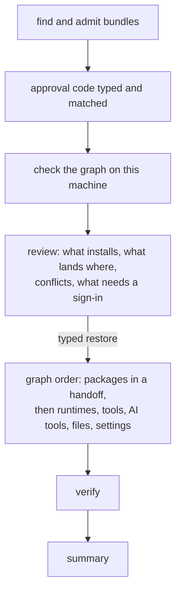

# Restore

**Status: the implementation contract for M15-A (journal, placement,
undo) and M15-B (packages and AI tools); not implemented.**

`restore [DIR]` (act, Linux) brings an approved bundle (docs/MIGRATION.md)
onto Omarchy: it installs what the checked graph chose (docs/RESOLVER.md),
places the selected files, re-creates structured configuration through its
owners' interfaces, and verifies it on the machine. The AI tools' part is in
docs/AI-TOOLS.md.

A restore is **journaled, resumable and conditionally reversible**. It is not
a transaction: packages, sign-ins and files are separate kinds of effect, and
no single rollback spans them.

## Who, where and when

- **As the everyday user, never as root** (`EUID` 0 is refused). Its own
  writes are only inside that user's home, with that user's ownership. System
  changes happen only through Omarchy's helpers and `omarchy-pkg-add`, which
  ask for `sudo` themselves during a handoff.
- **After Omarchy has finished** (the baseline's signals); before that it
  says what it is waiting for.
- **From an approved bundle**: on Shared identified by the baseline's
  checks, or in a folder the person gives, admitted, and approved with its
  code (docs/MIGRATION.md → *Import on Linux*).

## The flow



Nothing is written before `restore` is typed. The typed word covers exactly
what the review showed, and each item is checked again just before it is
applied (*Each item's basis*). Conflicts are decided in the review, one by
one or with a choice for the rest; the default for every conflict is
**Keep**.

## The journal

```text
~/.local/state/omarchy-mac-bootstrap/restore/
  runs/<run>/run.omb                 the run: bundle, manifest digest, approval
  runs/<run>/steps/000001-intent.omb
  runs/<run>/steps/000001-staged.omb
  runs/<run>/steps/000001-placed.omb
  runs/<run>/steps/000001-verified.omb
  …
  backups/<run>/<dest>               what a replacement moved aside
```

- **One immutable record per step and phase.** Each is a sealed `omb-step 1`
  document, written to `<name>.tmp-<random>` with exclusive creation, flushed
  with `sync FILE` (GNU coreutils, present on the image and on Omarchy),
  renamed to its final name only if that name does not exist yet, and
  followed by `sync` of the directory. A committed record is never
  rewritten; a damaged record fails admission and is treated as absent.
- **Exclusive creation** means: nothing exists at the name (`[ ! -e ]` and
  `[ ! -L ]`), then the file is opened with Bash's `noclobber` (`set -C`),
  which creates a new regular file with `O_EXCL` and refuses one that
  appeared meanwhile, a link included. It does not refuse a FIFO or device
  that another program creates at that name in between; only a program
  running as the person could, and such a program could change the home
  directly.
- **Written before the step it announces.** The `intent` record exists before
  anything it describes happens; the outcome record after.

| Record | Schema |
| --- | --- |
| `run` (in `run.omb`) | `id:hex16 bundle:bytes manifest:hex64 profile:hex16 approved:utc code:id started:utc tool:id source:hex64 user_uid:uint home:bytes` |
| `step` | `run:hex16 n:uint phase:enum(intent\|staged\|backed-up\|placed\|applied\|verified\|failed\|accepted\|undo-intent\|undone\|undo-refused) node:id item:bytes kind:enum(file\|dir\|link\|package\|runtime\|tool\|agent\|setting\|mcp\|shell-line) at:utc` |
| `dest` (file kinds) | `path:bytes old:enum(absent\|file\|link\|dir) old_sha:hex64? old_mode:enum(0600\|0644\|0700\|0755)? old_link:bytes? old_tree:hex64? new_sha:hex64? new_mode:enum(0600\|0644\|0700\|0755)? new_link:bytes? stage:bytes? backup:bytes?` |
| `setting` (structured kinds) | `owner:enum(git\|claude) key:bytes old:bytes? old_absent:bool new:bytes` |
| `package` (install kinds) | `method:id target:bytes version:bytes? found:bytes?` |
| `reason` | `code:id text:text` — with `failed`, `undo-refused` |

## Placing a file

For a destination `D` under the home, with the item's approved choice:

1. **Re-check** (the item's basis): the way to `D` is plain — every folder
   from the home down to `D`'s parent is a real directory owned by the user;
   a link on the way stops the item. The state of `D` is read again: absent,
   a file (SHA-256, mode), a link (its text), a folder (its tree digest). If
   it is not what the review showed, the item stops as a conflict and nothing
   is written.
2. **`intent`**: old state, new object digest and mode, the stage path
   (`D.omb-new-<run>-<n>`) and, for a replacement, the backup path.
3. **Stage**: the object is checked against its digest, written to the stage
   path with exclusive creation and a private umask, given its mode, read
   back, and flushed. **`staged`**.
4. **Back up** a replacement by renaming `D` into `backups/<run>/`, then
   comparing what was moved with the reviewed old state. The rename moves
   whatever is at `D` at that instant, whole; if it is not what the review
   showed — `D` changed since the re-check — it is renamed back and the
   item stops as a conflict, so nothing unreviewed is replaced. The backups
   live under the home, on its filesystem; if `D` is on another device, the
   rename is refused and so is the item (Keep or Skip), because a copy
   followed by an overwrite could not keep this promise. **`backed-up`**.
5. **Place, never over something new**, with a primitive that fails if any
   name — a file, a folder, a link — has appeared at `D`: a file by `ln`
   from the stage to `D` (`link(2)`), then the stage name removed; a link by
   `ln -s` at `D` (`symlink(2)`); a folder by `mv -T --update=none-fail`
   (GNU coreutils 9.5 and later: `renameat2` with `RENAME_NOREPLACE`,
   failing if `D` exists). A folder is placed this way only when the home's
   filesystem is one whose kernel support for `RENAME_NOREPLACE` is known
   (btrfs, ext4, xfs, tmpfs; read with `stat -f -c %T`); elsewhere a folder
   unit is refused rather than placed with a weaker rename. If placing
   fails because something appeared, the item stops as a conflict, the
   newcomer is left alone, and the old state stays in the backup, named.
   **`placed`**.
6. **Verify**: `D` is read back (digest, mode, or link text). **`verified`**.

A folder unit is built whole beside its target and placed by the same steps.
Generated and merged configuration (the Codex and OpenCode files, the
shell file and `~/.bashrc` with its one marked line) is written as a whole
new file and placed by the same steps. Modes are a ceiling: no setuid,
setgid or sticky bit, nothing group- or world-writable, private classes
0600/0700; ownership is the running user; `chown` is never used.

**What this prevents, and what it does not.** Nothing the review did not
show is replaced: a change before the re-check stops the item; a change
between the re-check and the backup rename is caught by comparing what was
moved; something that appears before placing makes the placing primitive
fail. The one residual race is **a program that keeps the old file open
and writes to it after it was moved aside**: its writes land in the backup,
not in `D`, and are not detected. This tool's lock cannot stop another
program writing.

**Structured settings** that only their owner's command writes — a Git
setting (`git config`), a Claude Code MCP server (`claude mcp add-json`), a
plugin (`claude plugin install`) — use that command as it is: it has no
compare-and-set. The setting is re-read under this tool's lock immediately
before the command, the write goes ahead only if it still has the reviewed
value, and it is read back afterwards to verify the intended value. A write
by another program between that re-read and the command is **overwritten
and not detected**; the read-back proves only that the intended value is
there now. A change made before the re-read stops the item as a conflict.

### After a crash

The next run first judges every step that began and did not end, from its
records and the filesystem, before anything new happens:

| Last committed record | What the filesystem shows | Conclusion | The next run |
| --- | --- | --- | --- |
| none | a file with this run's stage name | a stage file with no `intent` cannot exist (intent comes first); it is foreign | reported, never deleted |
| `intent` | `D` unchanged; the stage file absent or not matching its digest | died while staging | removes that stage file (named by the intent), starts the item again |
| `intent` | `D` unchanged; the stage file complete | died before `staged` | writes `staged`, continues |
| `staged` | `D` unchanged; no backup | died before backing up | continues from the backup |
| `staged` | `D` absent; the backup equals the old state | died after the backup rename | writes `backed-up`, continues |
| `staged` | `D` absent; the backup is not the old state | `D` changed just before the backup | renames the backup back to `D`; stops the item as a conflict |
| `backed-up`, or `staged` with nothing to back up | `D` absent; the stage file present | died before placing | continues from placing |
| `backed-up`, or `staged` with nothing to back up | `D` present and not the new object; the stage file present | something appeared at `D` before placing | stops the item as a conflict; the newcomer left alone, the old state in the backup |
| `backed-up` or `staged` | `D` equals the new object; the stage name absent, or a second name of the same file | died after placing | removes the stage name, writes `placed`, verifies |
| `placed` | `D` equals the new object | died before verifying | verifies |
| `undo-intent` | `D` is still what the restore wrote | died before undoing | undoes, after the same comparison |
| `undo-intent` | `D` is the state before the restore (the backup back, or nothing) | died after undoing | writes `undone` |
| `undo-intent` | anything else | changed since | writes `undo-refused` with what is there |
| any | `D` is neither the old state nor the new object | something else changed it | stops this item as a conflict; nothing overwritten |

For the other kinds the machine decides the same way: a package is present
or not (`pacman -Q`); a runtime is installed or not (its version folder
under `~/.local/share/mise/installs/`); a Git
setting or a Claude Code MCP definition reads back as the old value, the new
value, or something else (a conflict).

### What survives what

- **A process crash** (the core, the frontend, a kill): every case above is
  recoverable, because each record is committed before the step it
  announces.
- **Power loss**: records and staged files are flushed before they are
  renamed, and directories after, so a committed record and the file it
  describes survive together on btrfs. The last step before the power went
  may not have been committed; the next run then judges it from the
  filesystem as above. What is **not** promised: that a step shown as done in
  the final moments before power loss is recorded, and anything about
  pacman's, mise's or any other program's own files, which keep their own
  guarantees.
- **A full disk**: a failed stage or record write stops that item as
  `failed`; its partial stage file is removed (it is named by the intent). If
  even the `failed` record cannot be written, nothing more is written, and
  the next run finds an `intent` with no outcome and judges it from the
  filesystem.
- **Stale temporary files**: a stage temporary is removed only when a
  committed `intent` in this home's journal names it; a record temporary
  (`*.tmp-*`) only inside a run's own `steps/` folder, where nothing else
  writes. Anything else with a similar name is reported and left. A removal
  that fails is reported, and the next run tries again.

## Each item's basis

Before each item, not only before the run, the core re-reads that item's
destination and requires it to match what the review showed
(docs/PROTOCOL.md → `restore.item`): an explicit `absent`, a file's digest
and mode, a link's text, a folder's tree digest. A destination that changed
between the review and its turn stops that item as a conflict; the rest go
on.

## Conflicts

| Choice | Does |
| --- | --- |
| **Keep** (default) | leaves what is there; the item is recorded as kept |
| **Replace** | moves what is there to the backup, places the migrated version |
| **Merge** | only where the adapter defines a merge (below) |
| **View diff** | shows both sides, then asks again |
| **Skip** | leaves what is there and records the item as skipped |

- **The unit is the adapter's**: Neovim's folder, Ghostty's configuration, a
  skill folder is kept or replaced whole.
- **Merge exists only where it is exact**: a line set (a global Git ignore
  file: existing lines first, new ones after, no duplicates); Git settings,
  key by key, through `git config`; MCP servers (new ones added, a
  same-named one its own decision); JSON settings whose adapter names the
  keys it adds, with `jq` (installed by Omarchy), constant filters and values
  passed as arguments.
- **Omarchy's seeded files** (`starship.toml`, tmux, Ghostty, OpenCode, Git
  and others in `~/.config`) are the user's after install; a conflict with
  one is labelled "Omarchy's default", and the review says what the person's
  version would change.
- **Never touched**: `/usr/share/omarchy`, `~/.local/state/omarchy`,
  Omarchy's skill links in the AI tools' skill folders, Omarchy's lazy
  agent wrappers in `~/.local/bin`, and Omarchy's default-agent choice
  (`~/.config/omarchy/defaults/agent`; docs/AI-TOOLS.md → *Omarchy's coding
  agent*).

## Packages

Layer 1 is one `omarchy-pkg-add` call with every pacman target the review
approved, as a **handoff**: `sudo` asks when its policy requires, and pacman
shows its own output. Each package has an `intent` before and an `applied`
or `failed` after, judged by `pacman -Q`, never by the exit status; one the
helper skipped ("not available in the repos on this system") is `failed`
with that reason, and what requires it is `blocked`. Layers 2–4 run managed
(mise, uv, cargo-binstall, go, npm, Flathub), each judged by its own check
afterwards; nothing managed ever prompts.

## Undo

`restore undo` (typed `undo`) reverses the last run, or one item. **Undo is
never unconditional**: for each write the journal records what this tool
wrote and what was there before, and undo re-reads the destination first.

| Kind | Undo does, when the destination is exactly what the restore wrote | Otherwise |
| --- | --- | --- |
| a placed file, folder or link | puts the backup back, or removes the new one if nothing was there before | refused: "changed since the restore", with what is there now |
| a generated or merged configuration file (Codex, OpenCode, `~/.bashrc` with its marked line, `shell.bash`) | the same | refused |
| a Git setting | sets the old value back, or unsets it if it was absent | refused if its current value is not the one written |
| a Claude Code MCP definition | removes it through the tool's own command, or restores the previous definition | refused if the definition changed |
| a folder the restore created | removed only if empty, or if everything in it is the restore's own and unchanged | refused |

Each undo writes `undo-intent`, then `undone` or `undo-refused` with its
reason. **Not reversible, and never claimed to be**: package installations
(removing packages can take dependencies others need; the summary lists what
was installed and the command to remove it by hand), sign-ins, anything a
remote service did, and whatever an external installer changed.

Backups stay in `backups/<run>/` (0700) until the person removes them;
`restore status` shows their size.

## Verification and health

Nothing is "migrated" because a copy finished. After the graph runs, each
node's `verify` checks the machine:

| Kind | Checked by |
| --- | --- |
| package | `pacman -Q`; then, in this act run only, the command's version where the registry names one |
| runtime | its version folder under `~/.local/share/mise/installs/`; then, in this act run, the installed executable run by its full path with `--version` |
| ecosystem tool, Flathub app | installed per its manager; the version in this act run; for an app, a launch only with consent |
| file, folder, link | digest, mode or link text against the manifest |
| structured setting | read back through its owner (`git config --get`, the tool's configuration file) |
| AI tool | docs/AI-TOOLS.md → *What is observed* |
| 16 KiB pages | `readelf -lW` alignment of installed binaries, when binutils is present |

**Static** checks (`restore status`, `doctor`) **start no program they
check**: they read pacman's local database (`pacman -Q`, a read-only query),
mise's install folders and configuration files, and files and settings
directly, and they recognise Omarchy's lazy wrappers without invoking them,
because invoking one installs or reselects its tool (docs/AI-TOOLS.md →
*What is observed*). They never run an agent, its wrapper, a mise shim or
mise. Running a program's version happens only in the act run that
installed it and in `restore verify`, by the installed executable's full
path; starting an MCP server or an application only in `restore verify`,
after the person agrees, one at a time, with a time limit.

## States

| Restore state | Means |
| --- | --- |
| `not-started` | no run for the bundle in use |
| `partial` | some items verified; others pending, failed or blocked |
| `blocked` | nothing more can proceed: no approved bundle, a foreign bundle not confirmed, running as root, Omarchy not finished, or the package step failed for everything that follows |
| `complete` | every selected item is `verified`, `kept`, `skipped` or `unsupported`, or has been **accepted** as it is |

Per item: `planned`, `ready`, `applied`, `verified`, `kept`, `skipped`,
`unsupported`, `failed` (with the reason), `blocked` (with the chain),
`degraded`, `needs-sign-in`, `needs-secret` (with the variable names),
`accepted`.

- **`needs-sign-in` resolves by itself** when the tool's sign-in file
  appears (presence only, never read; docs/AI-TOOLS.md → *What is observed*).
- **Accepting** is the person's word that an item may stay as it is:
  `restore accept NAME` (yes/no) or `a` on the health screen, recorded as an
  `accepted` step with the item's state at that moment, and shown as
  accepted, never as verified.
- The journey's `restore` stage is done exactly when the restore is
  `complete`.

## Decisions in a file

Without the frontend, `restore --plan FILE` reads an `omb-restore-plan 1`
document — `conflict dest:bytes choice:enum(keep|replace|merge|skip)`,
`optin id:bytes`, `accept id:bytes`, `default choice:enum(keep|skip)` —
admitted like any document and checked against this restore's review; an
unknown destination refuses the file. `restore --plan-out` (read-only)
prints the review's conflicts in that format. The approval code and the
word `restore` are then asked for as in any text flow.
