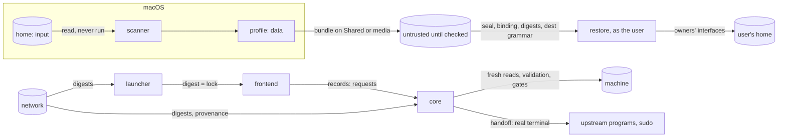

# Security

**Status: the threat model for the product expansion (M14–M16), a delta on
the accepted baseline's security boundaries (SPEC.md → *Security
boundaries*). Not implemented.** Test families named here are defined in
docs/TESTING.md.

## Who and what

This is one person's tool on their own Mac. It is built against mistakes,
stale state, hostile *data* and hostile networks, not against someone who
already runs code as that person: such a person could do everything the
tool can, without the tool.

| Principal | Trusted to | Not trusted to |
| --- | --- | --- |
| the person | decide, type the words, sign in to their tools | remember every detail: the tool reads the machine instead |
| this repository at a reviewed commit | define behaviour, the registry, the frontend lock | — |
| upstream projects (Asahi, Omarchy Mac, Omarchy, the AI tools, package repositories) | be the authority for what they own | report success truthfully: results are read from the machine |
| the frontend binary | draw and collect input, once its digest matches the lock | assert any state, choose any action, or run anything |
| files on Shared or removable media | — | anything: they are input, checked before use |
| the network | carry bytes | deliver the right bytes: digests decide |
| an agent the person starts | propose commands, which the person approves | run disk, boot or encryption commands (the brief and its rules) |

**Assets:** the disk and every partition on it; macOS's data; secrets (keys,
tokens, passphrases); the everyday user's configuration on both systems;
the integrity of what gets installed; privacy of what lands on Shared,
which is not encrypted.

## Trust boundaries

1. **Home → scanner.** Everything in the home is text to read, never
   something to run.
2. **Profile and bundle → Linux.** Data that names things; the registry and
   adapters decide what that means on the target.
3. **Frontend → core.** Requests from a program the core treats as input.
4. **Core → machine.** The only place anything changes, through `run` and
   the baseline's gates.
5. **Network → anything.** Through a pinned digest (the frontend, pinned
   rescue releases); or fingerprinted and shown before use (upstream
   scripts, SSH public keys, plugin marketplaces); or used only as advice
   (the aarch64 package databases).
6. **Root → the everyday user.** Nothing crosses from root's home.

## Threats and protections

| # | Threat | Protection | Tests |
| --- | --- | --- | --- |
| 1 | a tampered or hand-made Migration Profile | the profile holds names and choices, never commands; every field is typed and validated; resolution is recomputed from the reviewed registry and checked on the target; the review shows everything before `restore`; a profile from another Mac or not named by the token needs `import` | `bundle-*`, `profile-*` |
| 2 | path traversal in a selected path or a manifest `dest` | `dest` grammar (relative, no `.`/`..`/empty components, no control characters, bounded), confinement to the item's own root, placement only under the user's home | `bundle-traversal` |
| 3 | symlink attacks at capture | the walk never follows links; a link is recorded as text and carried only if it stays inside its item's root | `mac-home-links` |
| 4 | symlink attacks at restore | every folder on the way to a destination must be a real, user-owned directory; writes go beside the target and are renamed; nothing follows a link out of the home | `linux-restore-symlinked-parent` |
| 5 | overwriting the person's or Omarchy's files | every difference is a conflict decided in review, default Keep; Replace moves the old file to a backup; undo restores it | `linux-restore-conflicts` |
| 6 | unsafe ownership and modes | modes are a ceiling (no setuid/setgid/sticky, nothing group- or world-writable, private classes 0600/0700); ownership is the running user; `restore` refuses root | `linux-restore-root`, `bundle-modes` |
| 7 | secrets leaving the Mac | class rules, adapter knowledge and a content scan move anything secret-shaped to `SECRET`, which never travels (one opt-in: passphrase-encrypted SSH keys, typed `carry`); the Keychain is never read; tools' sign-in files are excluded by rule | `mac-home-secrets` |
| 8 | secrets in the debug report, logs or state | the report is built from an allowlist of probes that never open a credential store or a home file, then scrubbed; `state_set` still refuses secret-shaped keys; the frontend never logs to the screen | `debug-secrets` |
| 9 | configuration that executes code during a scan | the scanner reads files only and runs no tool at all (not `brew`, `go`, `npm`, nor any tool whose listing would start servers or load plugins), never sources a shell file, and recognises Crush's files by name only; the availability check runs mise only with the person's configuration unreachable | `mac-home-typical` (probe allowlist), `avail-mise-lock` |
| 10 | configuration that executes code after restore | hooks, workflows, plugins and tools are marked "runs code" and carried item by item after being shown; live health checks that start MCP servers run only with consent | `mcp-*`, `linux-restore-*` |
| 11 | command injection through MCP or package definitions | values are data end to end: argument arrays, never command strings; MCP definitions are re-created through the tools' own interfaces or written as structured files; `jq` filters are constants with values as arguments; names are checked against each method's grammar | `mcp-metachar`, `registry-malformed` |
| 12 | shell metacharacters, newlines or odd bytes in paths | percent-encoded in every record; decoded to bytes and passed as single arguments; never evaluated | `mac-home-hostile-names` |
| 13 | hostile archive contents, unsafe extraction | there is no archive: bundles are content-addressed folders placed only by the manifest. The one extraction, of package databases on macOS, goes into a private scratch folder with libarchive's defaults refusing absolute and `..` member names, and is removed | `bundle-*`, `avail-hostile-db` |
| 14 | Homebrew tap provenance | a third-party tap is shown with its remote in review; taps are inventory only and never installed on Linux; Linuxbrew is not a target | `registry-*` |
| 15 | package-name ambiguity and substitution | software ids map names explicitly; unknown names are never merged; a target is resolved by the registry, not by name similarity; availability is checked on the target with `pacman -Sp` (which shows the repository), and the repository is shown in review — including that Omarchy Mac configures `[omarchy-aarch64]` without signature checking | `registry-*`, `avail-*` |
| 16 | a tampered bundle on Shared | Shared is not encrypted and anyone with the Mac can write it: seals catch corruption; objects are checked against their digests before use; the profile id must match the token's or be imported deliberately; everything is reviewed; nothing in a bundle can place a file outside its item or run anything | `bundle-*` |
| 17 | a stale or copied qualification manifest | identity first (the baseline's checks on what is mounted), then seals, plan binding, Shared GUID and round id, before anything is read or written; clocks are never trusted | `qual-*` |
| 18 | a wrong partition holding a valid-looking manifest | never read: the mount's identity check fails before the manifest is opened | `qual-wrong-partition` |
| 19 | the root and user boundary | rescue lives in `/root` and nothing is copied from it; `restore` refuses root; `rescue remove` deletes exactly what rescue recorded | `rescue-*`, `linux-restore-root` |
| 20 | an agent run as root doing damage | optional; the brief says what never to do; each tool's workspace rules deny disk, boot and encryption commands and ask for the rest; the person approves each command; remote rescue keeps the agent on another computer | `rescue-*` |
| 21 | remote rescue exposing the machine | key-only SSH, from keys the person sees first; password logins off for its duration; recorded and removed exactly; `doctor` reports password SSH and default accounts that are present anyway | `rescue-sshd-password` |
| 22 | records restored from another Mac (Time Machine) | the plan record is bound to its disk (baseline); the profile to its host id; both are shown as history on another Mac | `mac-home-restored-from-other` |
| 23 | spoofed package databases (Arch Linux ARM serves them over HTTP, unsigned) | the macOS availability check is advisory and labelled so; the target check uses pacman's own databases and pacman verifies package signatures where the repository requires them | `avail-*` |
| 24 | a language model's suggestion becoming an install | nothing calls a model; suggestions enter only as entries in the person's local registry, reviewed like any other | `registry-local-override` |

### The frontend

| # | Threat | Protection | Tests |
| --- | --- | --- | --- |
| 25 | a replaced release artifact, a tampered cache, a partial download | the lock in the reviewed commit pins size and SHA-256 per target; the digest is checked on download and on every launch; a mismatch is never run | `frontend-digest` |
| 26 | a frontend built from other source than the checkout's | CI fails when the lock's source tree is not the checkout's `frontend/` tree | `frontend-lock` |
| 27 | a downgrade | only a checkout of an older reviewed commit selects an older frontend; nothing fetches versions by itself | `frontend-lock` |
| 28 | an unreleased frontend on a real machine | the development override works only in fixture mode, and never as root | `frontend-dev` |
| 29 | a compromised or buggy frontend asserting state or skipping gates | the core re-derives state, recomputes available actions, checks the basis, validates parameters and the typed word; the ceiling, scopes and dry run are set by the launcher and pass through the frontend, and the core refuses when any is missing; schemas carry no verdicts. The Asahi launch and Shared's creation also pass prompts the frontend never sees (the installer's own questions; `sudo -k` then `sudo -v`). Where no such prompt exists (Omarchy Mac without encryption, Shared's activation), the typed word the frontend collects is the only human step, defended by the pinned binary and tests that only the gate field produces a confirmation (docs/DECISIONS.md → O2) | `proto-*`, frontend layer A |
| 30 | malformed or oversized protocol messages | strict grammar, schema order, size limits, unknown keys refused; nothing evaluated | `proto-invalid` |
| 31 | a change between review and action | the basis digest; the baseline's own re-reads before the Asahi launch and Shared's creation | `proto-stale` |
| 32 | a broken terminal after a crash | the frontend's hook restores; the launcher restores the settings it saved and leaves the alternate screen | PTY tests |
| 33 | input stolen from a child program | one thread reads the terminal, and it does not while a child runs | PTY tests |

## Deliberately not built

Each of these was weighed against a concrete moment in this Mac's use and
not found one:

- **Signatures or keys** for profiles, bundles or records. The seal catches
  corruption; anyone able to forge a record could also change the machine
  directly.
- **An encrypted secrets bundle.** Tokens are cheaper to renew by signing
  in once; the one encrypted secret that travels (an SSH key) is encrypted
  by its own format.
- **Tamper-evident logs**, audit trails, review chains. (The restore
  journal is append-only so that an interruption can be judged, not as
  evidence of anything.)
- **A daemon, an updater, telemetry, any cloud service.**
- **A sandbox for rescue agents.** Their own approval prompts, the rules in
  the workspace and the person reading each command are proportionate; a
  sandbox that allows repair would allow harm.
