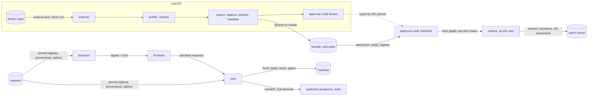

# Security

**Status: the threat model for the product expansion (M14–M16), a delta on
the accepted baseline's security boundaries (SPEC.md → *Security
boundaries*); not implemented.** Every claim below names the mechanism that
establishes it, what it does not cover, and the tests in docs/TESTING.md
that would fail if it did not hold. A planned test is not evidence; a claim
is proved when its tests exist and pass.

## Who and what

This is one person's tool on their own Mac. It is built against mistakes,
stale state, hostile *data* and hostile networks, not against someone who
already runs code as that person: such a program could do everything the
tool can, without the tool.

| Principal | Trusted to | Not trusted to |
| --- | --- | --- |
| the person | decide, type the words and the approval code, sign in to their tools | remember every detail: the tool reads the machine instead |
| this repository at a reviewed commit | define behaviour, the registry, the frontend lock | — |
| upstream projects (Asahi, Omarchy Mac, Omarchy, the AI tools, package repositories) | be the authority for what they own | report success truthfully: results are read from the machine |
| the frontend binary | draw and collect input, once its digest matches the lock | assert any state, choose any action, or run anything |
| files on Shared or removable media | — | anything: input, admitted and checked before use; a bundle's content needs the approval code |
| the network | carry bytes | deliver the right bytes: digests decide |
| an agent the person starts | propose commands, which the person approves | run disk, boot or encryption commands |

**Assets:** the disk and every partition on it; macOS's data; secrets (keys,
tokens, passphrases); the everyday user's configuration on both systems;
the integrity of what gets installed; the privacy of what lands on Shared,
which is not encrypted; whether SSH can be reached with a password.

## Words

Used with exactly these meanings in every document:

| Word | Means | Established by |
| --- | --- | --- |
| **integrity** | bytes are the bytes that were written | seals and digests |
| **sealing** | a document ends with the SHA-256 of its bytes: it detects corruption, not who wrote it | docs/PROTOCOL.md → *Sealed documents* |
| **approval** | the person said this exact content may be used | a typed gate word; for a bundle, the approval code |
| **origin** | which machine and export produced something | the approval code (for a bundle); nothing else claims it |
| **journey matching** | which records belong to this install | the token's plan and profile ids; never approval |
| **authentication** | proving who someone is to a program | upstream programs and `sudo`, under their own policies |
| **authorisation** | being allowed to act: privilege | `sudo`, and the session's ceiling and scopes |
| **intent** | the person's choice of an action | the command and its typed word, validated by the core |
| **machine authority** | the machine's current state as read now | fresh reads; records are input |
| **verification** | a postcondition checked on the machine after an action | the checks each action defines |

"Trusted" is never used for "hash-consistent".

## Trust boundaries

1. **Home → scanner.** Text to read, never something to run.
2. **Bundle → Linux.** Integrity by seals and digests; approval by the code;
   meaning by the registry and adapters; placement by the destination graph.
3. **Frontend → core.** Requests from a program the core treats as input,
   admitted byte by byte before anything parses them.
4. **Core → machine.** The only place anything changes, through `run` and
   the gates.
5. **Network → anything.** Through a pinned digest (the frontend, pinned
   rescue releases); fingerprinted and shown before use (upstream scripts,
   SSH public keys, plugin marketplaces); or used only as advice (the aarch64
   package databases).
6. **Root → the everyday user.** Nothing crosses from root's home.

## Claims

### The core, the protocol and the frontend

| # | Threat | Mechanism | Not covered | Tests |
| --- | --- | --- | --- | --- |
| 1 | malformed bytes normalised into a valid request | admission before any split: a bound, the byte class, termination, framing and canonical form, then schemas (docs/PROTOCOL.md → §2), the same in Bash and Rust | — | `proto-diff-*`, `proto-diff-chunks` |
| 2 | a frontend asserting state or skipping gates | the core re-derives, lists what is available, rebuilds the basis, checks the ceiling, scopes and the typed word; schemas carry no verdicts; the session values come from the launcher | a malicious program running as the person, which needs no frontend | `proto-env`, `proto-ceiling`, `proto-scope`, `proto-unavailable`, `proto-word`, `proto-arg` |
| 3 | a stale review executed | a canonical basis per action family, rebuilt from a fresh read after exclusion is taken; per item for restore; placement that never overwrites what appeared after the re-check; the baseline's own final revalidation stays | a structured setting changed in the instant before its owner's write is caught by the read-back, not prevented | `stale-*` |
| 4 | a protocol descriptor reaching a child, holding EOF open, or blocking a mutation | fd 3 closed after the bounded read; the spool is a file C opens per record, only from its main shell; every other descriptor close-on-exec; one spawning thread in F | — | `sup-fd-child`, `sup-fd-grandchild`, `sup-fd3-closed`, `sup-spool-handoff`, `sup-slow-frontend`, `sup-overflow`, `sup-epipe`, `sup-one-spawner` |
| 5 | a death read as success or failure; a surviving mutator raced | no `result` means unknown and a fresh read; operation records, never reclaimed because a PID vanished | a process that leaves the group (`setsid`) is not found; the scope's own records stay the authority | `sup-frontend-death`, `sup-core-death`, `sup-launcher-death`, `sup-mutator-survives`, `sup-no-reclaim-pid`, `sup-reclaim-empty`, `sup-reader-death` |
| 6 | a new wait inside Shared's critical interval | nothing added between the final topology read and `sudo -n diskutil addPartition`; the code between them is the baseline's | — | `sup-shared-critical` |
| 7 | a broken terminal; input taken from a child | saved settings restored around every handoff; one thread reads the terminal and not during a child; signal dispositions left default | recovery after every process is killed at once: the person is told what to run | `pty-*` |
| 8 | a replaced release asset, a tampered cache, a partial download | the reviewed lock pins size and SHA-256 per target; checked on download and every launch | — | `frontend-digest` |
| 9 | a frontend built from other inputs than the checkout's | CI compares the checkout's `inputs_digest` with the lock's; the lock is outside the inputs; attestations link artifact and commit | the artifact digest says which bytes, not how they were built; the attestation is evidence, not a run-time check | `frontend-lock-not-input`, `frontend-inputs-changed`, `frontend-inputs-link`, `frontend-inputs-order` |
| 10 | an unreleased frontend on a real machine | the development override works only in fixture mode, never as root | — | `frontend-dev` |
| 11 | a frontend that cannot run on the target | the artifact checks (loader, libraries, glibc symbols, alignment, minimum macOS) | 16 KiB pages are proven only on the Mac, in M17 | `frontend-compat-linux`, `frontend-compat-macos` |
| 12 | a read command or dry run persisting through the frontend | the intent table (docs/FRONTEND.md → *Intent and persistence*) | — | `frontend-intent-read`, `frontend-intent-plan`, `frontend-intent-dry-run`, `frontend-intent-no-tui`, `frontend-intent-act` |
| 13 | the protocol path changing a baseline action | three-way equality with the accepted baseline `2edb76a` over its fixtures | behaviour the fixtures do not reach | `equiv-*` |
| 14 | a response field executed | action ids map to reviewed code with argument arrays; no value reaches `eval`, `source`, unchecked arithmetic or a command string | — | `proto-no-shell-text`, `mcp-metachar` |

### Migration

| # | Threat | Mechanism | Not covered | Tests |
| --- | --- | --- | --- | --- |
| 15 | configuration that executes during a scan | fixed read-only utilities only; no inventoried tool, no sourcing, no plugin loading; the availability check's mise sees none of the person's configuration | — | `scan-no-tool`, `avail-mise-lock` |
| 16 | an inventory reported with false certainty | versioned adapter contracts; every item `observed`, `inferred` or `unknown`; `partial` and `denied` | — | `scan-requested-unknown`, `scan-contradiction`, `scan-service-configured`, `scan-partial`, `scan-denied`, `scan-contract-unknown` |
| 17 | Zsh code imported as data | a lexical tracker; two literal forms only; functions carried as reviewed code | the person's approval of a function's behaviour | `zsh-*` |
| 18 | secrets leaving through a supported adapter | allowlisted fields, dropped credential fields, regenerated configuration; the whole-length credential scan rejects; classification of the captured bytes | a credential under an allowlisted field in an unrecognised form; **files carried whole** (instructions, skills, a Neovim tree), which only the scan covers; the scan's miss proves nothing | `secret-unknown-key`, `secret-whole-file`, `secret-url`, `secret-git-remote`, `secret-args`, `secret-env`, `secret-deep`, `secret-toctou`, `secret-keychain`, `secret-provenance`, `toml-mcp-env`, `toml-secret-fields` |
| 19 | secrets inside a custom path | `OPAQUE`: excluded by default, typed `opaque` per path, the warning that Shared is not encrypted, known credential files refused inside | **opaque content has no secret guarantee** | `secret-opaque-default`, `secret-opaque-hard` |
| 20 | an SSH private key | refused unless its parsed `openssh-key-v1` envelope shows a supported cipher and bcrypt ≥ 16 rounds, and `carry` is typed | the passphrase's strength; erasure from Shared | `secret-ssh-encrypted`, `secret-ssh-refused` |
| 21 | Codex's configuration misread | the strict subset reader refuses the whole file on anything outside it | settings in a refused file do not travel | `toml-*` |
| 22 | a bundle changed after export, hashes recomputed | the approval code: 64 bits of SHA-256 over the full manifest digest, profile, plan and host, typed on Linux before any restore | a second preimage of 64 bits (about 2⁶⁴ work); approval does not make the source's own files benign | `bundle-recomputed`, `bundle-active-config`, `bundle-code-typo`, `bundle-code-other`, `bundle-code-required`, `bundle-approval-rerun` |
| 23 | a corrupted or incomplete bundle | seals, object digests checked immediately before use | — | `bundle-object-mismatch`, `bundle-seal-bad`, `bundle-incomplete` |
| 24 | hostile filesystem objects | plain regular hash-named objects with one link; nothing else is an object | — | `bundle-object-link`, `bundle-object-special`, `bundle-object-hardlink`, `bundle-object-name` |
| 25 | traversal, collisions, escaping links | the `dest` grammar; one destination graph for the whole bundle; links resolved lexically inside their own item | — | `bundle-traversal`, `bundle-cross-item`, `bundle-link-escape`, `bundle-link-chain`, `bundle-case-distinct`, `bundle-unicode-distinct` |
| 26 | a recursive delete driven by a marker | removal only through this Mac's export record and the manifest digest; Linux deletes nothing in a bundle | — | `bundle-forged-cleanup` |
| 27 | a bundle from another Mac or journey | the profile id against the token (journey matching); typed `import`; its own approval code | — | `bundle-foreign`, `bundle-token-mismatch` |
| 28 | a tampered profile or registry | typed fields, admission, seals; resolution recomputed and checked on the target | — | `profile-invalid`, `profile-stale`, `registry-malformed` |
| 29 | package substitution | explicit registry mappings; `pacman -Sp` shows the repository; the macOS check is advisory and says so | Arch Linux ARM's unsigned HTTP databases on macOS | `registry-*`, `avail-*` |
| 30 | dependencies run out of order or versions collapsed | a bounded DAG of needs, capabilities and versioned instances; conflicts become decisions | — | `dag-*` |
| 31 | a language model deciding an install | nothing calls a model; suggestions enter only as the person's local registry | — | `registry-local-override` |

### Restore

| # | Threat | Mechanism | Not covered | Tests |
| --- | --- | --- | --- | --- |
| 32 | writes outside the home, through links, or as root | plain parent folders owned by the user; stage beside and rename; `EUID` 0 refused; exclusive creation | a FIFO created by another program between the check and the open | `restore-root`, `restore-link-parent`, `persist-fifo` |
| 33 | overwriting the person's or Omarchy's files | conflicts default to Keep; backups on Replace; Omarchy's own files never touched | — | `restore-conflict-keep`, `restore-replace`, `restore-seeded`, `restore-untouched` |
| 34 | unsafe modes | a mode ceiling | — | `restore-modes`, `bundle-modes` |
| 35 | a crash losing the recovery record | one sealed record per step, committed (flush, rename, directory flush) before the step it announces; judged from records and the filesystem | not atomic; the last step before a power loss may be unrecorded and is judged from the filesystem | `persist-death-*`, `persist-full-*`, `persist-full-real`, `persist-torn-record`, `persist-name-taken`, `persist-cleanup-fails`, `persist-foreign-temp` |
| 36 | undo destroying later edits | undo re-reads and acts only on exactly what the restore wrote | packages, sign-ins, remote effects: never reversed | `persist-undo-changed`, `persist-undo-git`, `persist-undo-mcp`, `persist-undo-shell`, `persist-undo-folder` |
| 37 | a lazy wrapper run by a probe | six observed states read from files; nothing static runs a wrapper, shim, mise or agent | — | `omarchy-lazy-probe`, `omarchy-pin-kept`, `omarchy-wrapper-only`, `omarchy-artifact-only` |
| 38 | a second copy of a tool, or a wrapper overwritten | the provider installs as the wrapper would and never writes `~/.local/bin`; `dev` uses the same provider | — | `omarchy-foreign-binary`, `omarchy-duplicate`, `omarchy-install-cmd`, `omarchy-dev-shared` |
| 39 | an upstream helper's false success | every install judged by the machine afterwards | — | `omarchy-helper-lies` |
| 40 | a surprise source build | build strategies disabled per method; a build only when the reviewed method is one | — | `omarchy-no-implicit-build`, `omarchy-explicit-build` |
| 41 | configuration that executes after restore | "runs code" items one at a time after review; live checks only with consent | what the person approves | `restore-consent`, `mcp-oauth` |
| 42 | Omarchy's default agent changed behind the person's back | never run, never written; launch modes shown | — | `omarchy-default-agent` |

### Rescue and debugging

| # | Threat | Mechanism | Not covered | Tests |
| --- | --- | --- | --- | --- |
| 43 | remote rescue exposing the machine | observed state first; a key-only drop-in; `sshd -t`; `sshd -T -C` in every observed context; the listener; a real key login and a refused password attempt on loopback; any failure undoes rescue's changes | firewalls are neither assumed nor changed; a private address is not a firewall | `ssh-fresh-image`, `ssh-earlier-setting`, `ssh-match`, `ssh-no-include`, `ssh-case`, `ssh-invalid`, `ssh-reload-fails`, `ssh-key-test-fails`, `ssh-password-offered`, `ssh-starts-stopped` |
| 44 | cleanup reopening password SSH | stop before removing; the policy without rescue's drop-in predicted before a running service reloads; the drop-in put straight back if the real check disagrees; one of the defined safe final states, verified before success is reported | the moment between a reload and the check that reverts it | `ssh-cleanup-started`, `ssh-cleanup-exposed`, `ssh-cleanup-verify-fails`, `ssh-cleanup-predict`, `ssh-cleanup-putback`, `ssh-cleanup-stop-first` |
| 45 | the root and user boundary | rescue lives in `/root`; nothing copied from it; `rescue remove` by record | — | `rescue-remove-exact`, `rescue-leftovers`, `restore-root` |
| 46 | an agent run as root doing damage | optional; the brief and each tool's rules deny disk, boot and encryption commands; the person approves each command | **the rules are guidance, not a sandbox** | `rescue-workspace`, `rescue-installer-cwd` |
| 47 | secrets in the debug report | field-allowlisted: no line of any log, journal, output or file; raw diagnostics are a separate command, marked potentially sensitive | `debug raw` has no guarantee | `debug-fields-only`, `debug-planted`, `debug-raw`, `debug-intent` |
| 48 | observed text steering an agent; a false root claim | fixed instructions separate from a data block; "root" only when EUID 0 was observed | an agent that follows instructions found in data anyway | `debug-brief-split`, `debug-root` |

### Qualification

| # | Threat | Mechanism | Not covered | Tests |
| --- | --- | --- | --- | --- |
| 49 | a stale or replayed round accepted | identity first, then admission, plan, GUID and schema, then the local active round, one round awaiting Linux at a time, step order | — | `qual-stale-round`, `qual-two-rounds`, `qual-new-round-refused`, `qual-interrupted-source`, `qual-replay-cleaned` |
| 50 | the wrong partition | the baseline's identity checks run before any manifest is opened | — | `qual-wrong-partition`, `qual-wrong-guid`, `qual-other-plan`, `qual-bad-seal` |
| 51 | a generator failure hidden | every pipeline status, the exact size, the digest read back; reference vectors | — | `qual-producer-fails`, `qual-writer-fails`, `qual-short`, `qual-vector-*`, `qual-counter-wide` |
| 52 | a test overwriting its own files | exclusive creation | — | `qual-names` |
| 53 | cleanup removing what it does not own | only rounds this Mac recorded, only names the schema fixes | — | `qual-clean-foreign`, `qual-cleanup-fails` |
| 54 | evidence from modified code, or evidence kept past a change | the executed-source digest per stage; behaviour-scoped invalidation | — | `qual-source-mismatch`, `qual-evidence-scope` |

## Deliberately not built

Each of these was weighed against a concrete moment in this Mac's use and
not found one:

- **Signatures or keys** for profiles, bundles or records. Seals catch
  corruption; the approval code carries the person's word across the
  reboot; anyone able to forge a record on this Mac could change the
  machine directly.
- **An encrypted secrets bundle.** Tokens are cheaper to renew by signing
  in once; the one secret that may travel (an SSH key) is encrypted by its
  own format.
- **Tamper-evident logs**, audit trails, review chains. The restore journal
  exists so that an interruption can be judged, not as evidence of anything.
- **A daemon, an updater, telemetry, any cloud service.**
- **A sandbox or global policy for rescue agents** (no managed settings,
  nothing under `/etc`). Their own approval prompts, the workspace rules and
  the person reading each command are proportionate; a sandbox that allows
  repair would allow harm.
- **Firewall changes.** Remote rescue verifies SSH itself and says who can
  reach it.
- **A forced second password prompt** before Shared's creation: the typed
  words are the intent, `sudo` is privilege (docs/DECISIONS.md →
  *Rejected*).
